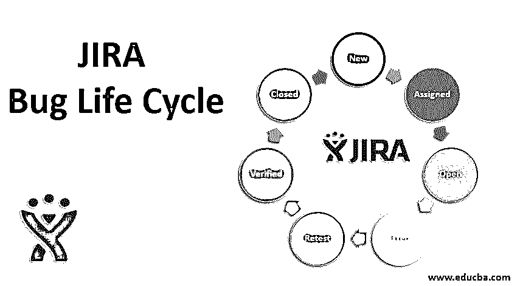
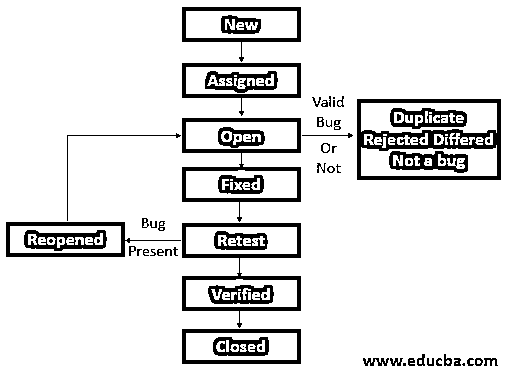

# JIRA 臭虫的生命周期

> 原文：<https://www.educba.com/jira-bug-life-cycle/>

## JIRA Bug 生命周期简介

JIRA bug 生命周期或缺陷生命周期是一个循环的过程，它描述了一个缺陷或 bug 如何从识别阶段到修复阶段经历不同的阶段，即当测试人员发现或记录一个 Bug 时开始，当 Bug 被修复时结束。整个过程是通过 JIRA 工具完成的，这是一个由 Atlassian 开发的商业问题或缺陷跟踪工具，通常用于缺陷跟踪、问题跟踪和项目管理。它的过程是报告、解决 bug 并跟踪它的状态。

### JIRA 臭虫的生命周期

bug 生命周期由不同的阶段组成，通过这些阶段，Bug 被解决，测试 Bug，并遵循该过程直到 Bug 存在。

<small>网页开发、编程语言、软件测试&其他</small>

JIRA Bug 生命周期的各个阶段如下所示:

*   新的
*   分配
*   打开
*   固定的
*   重新检测
*   已证实的
*   再开
*   关闭的

**JIRA Bug 生命周期框图**

**1。NEW:** 当测试人员在测试阶段发现应用程序中的 bug 或缺陷时，它会通过 bug 管理工具 JIRA 报告给开发团队。在这里，测试人员通过描述 bug 的问题类型、概要、描述、优先级等，在 JIRA 创建一个问题。

**2。一旦测试人员提出了一个新的状态 bug，那么技术/QA 领导就会对其进行验证，并将该 bug 分配给开发团队中的特定开发人员来处理。然后，bug 的状态被标记为“已分配”，即 bug 被开发人员批准，他们将对其进行处理以修复 bug。这确实是一个问题，但是当开发者接受它时，它就变成了 Bug。**

**3。OPEN:** 在这个阶段，一旦测试人员将 bug 或缺陷分配给开发人员，他们就会调查并解决它。bug 或缺陷的状态显示为“打开”。Bug 修复在这个阶段开始。

错误或缺陷可以通过四个阶段:

**4。重复** **:** 如果测试人员之前已经记录了这个 bug 或者类似于之前的 bug，那么开发人员会将这个 bug 的状态称为“重复”。

**5。被拒绝** **:** 如果分配给开发人员的 bug 不是真实的，那么开发人员会以适当的理由将该 bug 的状态称为“被拒绝”。

**6。延期** **:** 如果有一个 bug 不需要在这个 sprint/release 中修复，或者它不在项目范围内，可以移到下一个版本中修复，那么开发人员会将这个 bug 的状态称为“延期”。这是一种延期状态。

**7。**不是 bug**:**如果 bug 不影响应用程序的功能，那么 Bug 的状态指定为“不是 Bug”。

**8。修正** **:** 当开发者在编码上采取必要的行动来修正缺陷时，它会将一个 bug 的状态改为“已修正”，即缺陷会从应用程序中移除。

**9。重新测试** **:** 一旦开发人员修复了 bug，就分配给测试团队来检查这个 bug 是否已经被开发人员修复，并且状态为“重新测试”。

10。验证过的 **:** 开发人员修复了错误，然后测试人员重新测试应用程序，如果没有错误，那么它会改变分配为“验证”的状态。

**11。重新打开** **:** 在开发人员修复 bug 后，测试人员将对应用程序进行重新测试，在此期间，如果有 bug(无论是新的 bug 还是未修复的旧 bug)，测试人员将状态指定为“重新打开”，即再次经历 bug 生命周期。

**12。CLOSED** **:** 如果在重新测试之后，应用程序中不再有 bug 或问题，那么测试人员会将状态指定为“CLOSED”。

**注:**

*   在 JIRA 的生命周期中，bug 或问题在各个阶段的工作流或移动主要有三种状态。比如:

1.  创建/打开/待完成
2.  正在进行的工作
3.  完成/关闭/完成

*   JIRA 是管理项目、管理 sprint、管理 bug 和管理测试用例的最佳商业工具之一。
*   这是一个商业工具，意味着不是免费的，也就是说，我们支付了该工具。
*   在 JIRA bug 生命周期中，一旦 bug 被推迟，测试人员就要检查这个 bug 是否与应用范围有关。
*   实际值和期望值之间的任何偏差都称为问题或错误，如果被开发人员接受，则称为“BUG”。
*   JIRA bug 生命周期中有多个参与者，像 bug finder(通常是可以找到 Bug 的测试人员)、Bug 管理工具(JIRA 或 Bugzilla)、Bug 状态组(测试人员、开发人员、项目经理、QA 经理、产品负责人)、Bug 所有者(拥有 Bug 并在限定时间内修复它的人)。

### 结论

在本文中，我们讨论了 JIRA Bug 生命周期，在这个周期中，Bug 或问题可以从初始阶段处理到修复阶段。JIRA 是为了跟踪和管理软件开发中的错误而建立的，但它已经扩展到帮助团队计划、冲刺计划和跟踪软件开发周期的所有方面。JIRA 和 Bugzilla 是 IT 组织管理项目和跟踪软件状态的首选。它提供了更灵活的工作流程，并对任务进行了优先级排序。

### 推荐文章

这是一个 JIRA 臭虫生活周期的指南。这里我们分别用框图讨论 JIRA Bug 生命周期及其阶段的概述。您也可以浏览我们推荐的文章，了解更多信息——

1.  [JIRA 的替代方案](https://www.educba.com/jira-alternatives/)
2.  [JIRA 面试问题](https://www.educba.com/jira-interview-questions/)
3.  [吉拉版本](https://www.educba.com/jira-versions/)
4.  [吉拉史诗](https://www.educba.com/jira-epic/)

