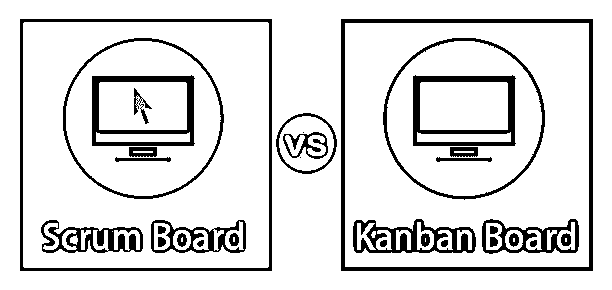
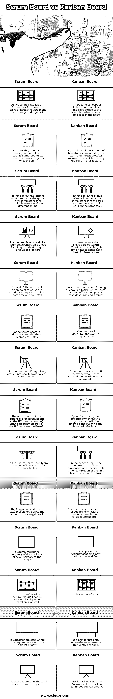

# Scrum 板与看板板

> 原文：<https://www.educba.com/scrum-board-vs-kanban-board/>

## Scrum 板和看板板的区别

Scrum Board 是由 Scrum framework 创建的，它提供了一个图形化的表示来跟踪 sprint 中团队成员之间的任务。它是一个表格形式，以不同的状态级别表示给定 sprint 中每个任务的状态，如待办事项、进行中、测试中和完成。看板也类似于 scrum 板，用于可视化和跟踪项目中的工作流程，限制工作进展状态，及时开发和持续改进。

### Scrum 板和看板板的直接比较(信息图)

以下是 Scrum 板和看板板的 14 大区别:

<small>Hadoop、数据科学、统计学&其他</small>

### Scrum 板和看板板的主要区别

Scrum 板和看板板的主要区别如下:

*   在 Scrum 项目管理框架中，Scrum 板将显示有时间限制的工作流的状态，短期交付是调用方冲刺。
*   在看板项目框架中，看板将项目工作流的状态与长期开发中的连续过程可视化。
*   当 Scrum 板专注于产品 backlog，而看板板专注于 Dashboard 时。
*   scrum 板是由 Scrum 团队管理的，而在看板中每个团队成员都作为领导者来管理它。
*   在 scrum 板中，如果团队成员离开团队，项目计划永远不会受到干扰。但是在看板中，它阻碍了项目计划。
*   Scrum 板帮助组织节省金钱和时间，而看板板有助于持续改进、生产力和效率。
*   Scrum 板是优先级变化的项目的理想方法，而看板板是优先级稳定的最佳方法。
*   团队的工作承诺对于 scrum 板来说是非常重要的，而工作承诺对于看板来说是次要的。
*   对于 scrum 板来说，每个 sprint 都有一个特定的持续时间，但是在看板中不是基于持续时间的。
*   项目评估和计划在 scrum 板中非常重要，但是在看板中，它不是项目评估的强制要求。
*   每日会议计划对 scrum 板管理非常重要，但在看板中并不是强制性的。
*   在 scrum 板中，sprint backlog 只属于一个团队，而多个团队都参与了看板。
*   在 scrum 板中，在连续冲刺中添加新任务非常困难，而在看板板中，新任务很容易添加到项目工作流中。

### Scrum 板与看板板对比表

让我们讨论一下 Scrum 板和看板板之间的主要对比:

| **Scrum 板** | **看板板** |
| Scrum board 中提供了 Active sprint，它显示了团队当前正在处理的任务或问题。 | 没有主动冲刺的概念，任何默认添加到板上的任务都显示在板的 backlogs 中。 |
| 它显示了在一定时间内要完成的工作量，即每个 sprint 的工作进度。 | 它将团队要完成的所有任务的数量可视化，并且进度将测量以检查有多少任务处于完成状态。 |
| 在这个面板中，工作流的状态显示了多个团队在不同的 sprint 上工作时 sprint 级别的完整性。 | 在此板中，工作流的状态显示了任务的完整性，因为整个团队将处理同一项任务。 |
| 它显示多种报告，如 Burndown 图表、Epic 图表、Sprint 报告、版本报告和速度报告。 | 它显示了一个称为控制图的重要图表，即提供问题或任务的周期时间(完成任务的时间)。 |
| 它需要完全控制和规划任务，因此配置过程需要更多的时间和复杂。 | 与 scrum board 相比，它需要更少的控制和计划，所以配置过程花费的时间更少，也更简单。 |
| 在 scrum 板中，它不限制工作进行中的状态。 | 在看板中，它确实限制了工作进展状态。 |
| 这是由被称为 Scrum 团队的自组织、跨职能团队完成的。 | 它不是由任何特定的团队完成的；整个团队根据工作流程创建了董事会。 |
| scrum 团队将负责 scrum 板，因此 PO(产品负责人)不能编辑 scrum 板，即 PO 可以查看板。 | 在看板中，产品所有者有权编辑看板，即 PO 既可以查看也可以编辑看板。 |
| 在 Scrum 板中，每个团队成员都会被分配到一个特定的任务。 | 在看板中，整个团队将专注于一项特定的任务。完成第一个任务后选择另一个任务。 |
| 团队不能在冲刺阶段向 scrum 板添加新的任务或用户故事。 | 添加新任务没有这样的标准，即更新公告板没有时间限制。 |
| It 很少面临向活跃的 sprint 添加新用户故事的紧急情况。 | 它可以支持向工作流添加新任务的紧迫性。 |
| 在 scrum 董事会中，scrum 角色(PO、scrum master、开发团队)都参与其中。 | 它没有角色集。 |
| 它最适用于项目，因为项目中的需求具有最高的优先级。 | 它最适合于需求经常变化的项目。 |
| 这块板子代表了 sprint 的全部工作。 | 该板显示了大规模持续开发方面的全部工作。 |

### 结论

在本文中，我们描述了 Scrum 板和看板在项目管理过程中的区别。它描述了项目管理框架中工作流状态的可视化。根据项目要求，我们使用所需的电路板选择具有适当工作流程的适当框架。

### 推荐文章

这是 Scrum 板和看板板之间最大区别的指南。在这里，我们还将讨论信息图和比较表的主要区别。您也可以看看以下文章，了解更多信息–

1.  [String vs StringBuffer |主要差异](https://www.educba.com/string-vs-stringbuffer/)
2.  [ZeroMQ vs RabbitMQ |了解对比](https://www.educba.com/zeromq-vs-rabbitmq/)
3.  [Terraform vs Ansible |哪个更好？](https://www.educba.com/terraform-vs-ansible/)
4.  [关于 Ripple 与 Litecoin 差异的教程](https://www.educba.com/ripple-vs-litecoin/)

