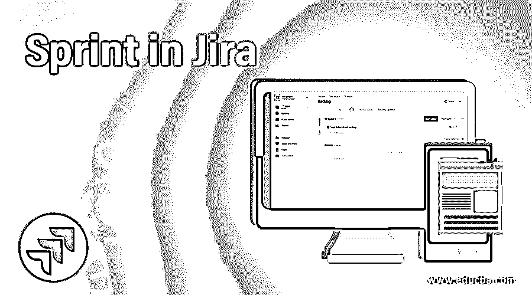
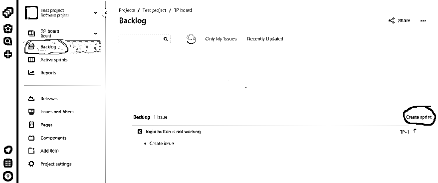
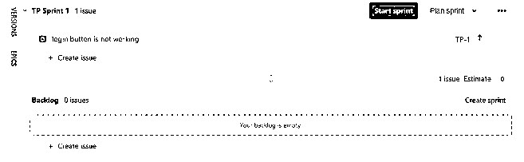
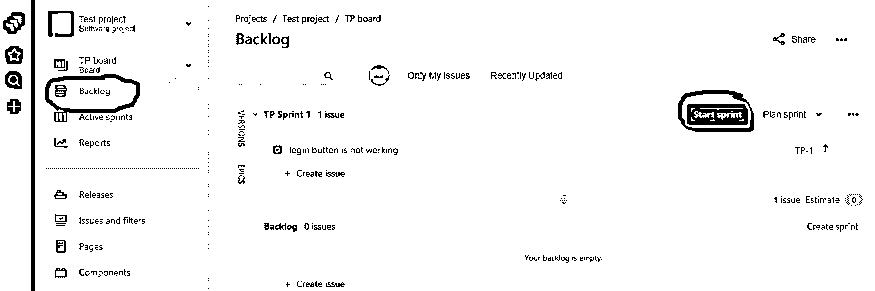
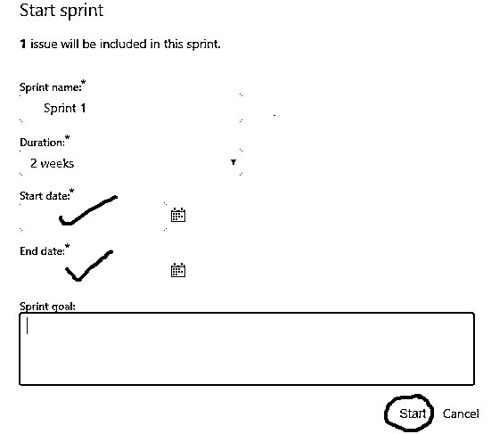
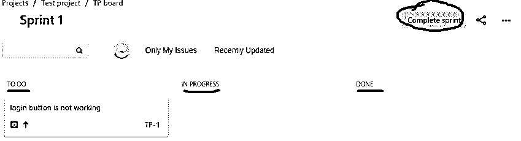
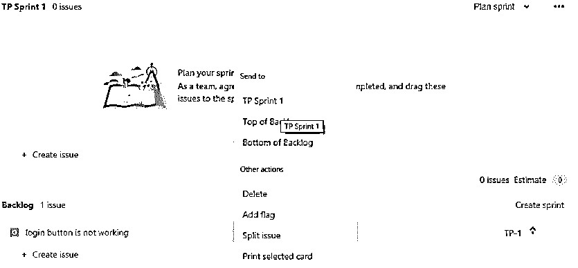
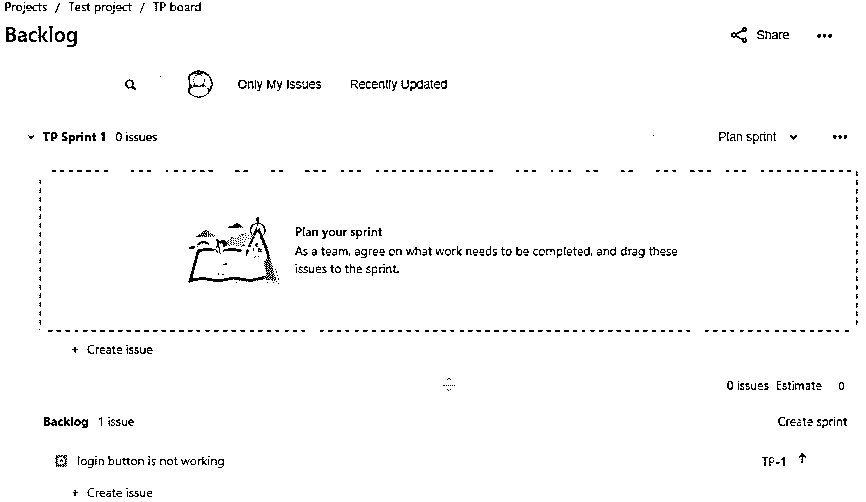

# 吉拉冲刺

> 原文：<https://www.educba.com/sprint-in-jira/>

## 吉拉对短跑的定义

在 JIRA，Sprint 只不过是软件应用程序的任务或问题的集合，团队应该在特定的时间内完成工作。sprint 中来自项目或产品 backlog 的任务或问题，根据需求/问题/任务的大小以及团队和产品所有者(PO)决定的 sprint 持续时间，每个 sprint 的持续时间通常为一周、两周或四周。随着 sprint 的完成，构建的版本也将准备好，我们开始下一个 sprint。

### 如何在吉拉创建 Sprint？

在 JIRA 创建一个 sprint 有以下几个步骤，因此根据这些步骤，团队将在 sprint 持续时间内完成 sprint。这些是:

<small>网页开发、编程语言、软件测试&其他</small>

**第 1 步:**点击显示在您项目的 JIRA 仪表板中的“Backlog”选项。

**第二步:**点击“创建 sprint”按钮，创建一个 Sprint。

**步骤 3:** 通过从待办事项列表中导航或者通过使用&将问题或任务从待办事项列表中拖放到你的 sprint 中，将问题或任务或故事添加到你的 sprint 中。

**步骤 4:** 然后，将在 JIRA 为软件应用程序创建 sprint。

### 如何在吉拉开始冲刺？

以下步骤涉及在 JIRA 工具中启动一个 sprint 来完成关于软件开发的任务或问题。这些是:

**第 1 步:**点击显示在您项目的 JIRA 仪表板中的“Backlog”选项。

**第二步:**找到需要开始的冲刺，点击“开始冲刺”按钮。

**步骤 3:** 用适当的数据更新相应的字段，如 sprint 的名称、sprint 的持续时间、开始日期、结束日期和给定 sprint 的 sprint 目标。

**第四步:**点击“开始”按钮。

**步骤 5:** 然后冲刺就成功开始了，我们还会跟踪团队在冲刺阶段的进展。

### 如何在吉拉结束冲刺？

在 JIRA 工具中有一些以下步骤来结束 sprint，以确保活动 Sprint 的完整性或开发软件应用程序的初始版本。这些是:

**步骤 1:** 转到 JIRA 积压仪表板。

**步骤 2:** 点击“活动 sprints”选项卡，显示与软件应用相关的所有 Sprints。

**步骤 3:** 选择想要完成或结束冲刺的特定冲刺。

**步骤 4:** 点击“完成冲刺”按钮，结束冲刺，因为所有已完成的关于冲刺的问题或任务都已删除。初始阶段将是，然后进行中，最后在完成阶段。

**步骤 5:** 如果任务或问题处于完成阶段，冲刺将结束。

**步骤 6:** 对于给定的 sprint，如果有任何未完成的任务或问题，那么，你将把未完成的任务移回 backlog 或任何进一步的 sprint 或为它创建一个新的 sprint。

### 如何在 Sprint 中添加问题？

将问题或任务添加到特定 sprint 的步骤如下:

**步骤 1:** 导航至 JIRA 仪表板上的“Backlog”选项卡。

**步骤 2:** To do 拖拽&对想要从 backlog 添加到 sprint 的问题进行拖放操作，或者以第二种方式右键单击 backlog 中的问题，并选择我们想要添加它的适当 sprint。

**步骤 3:** 然后特定的任务或问题将被添加到各自的 sprint 中。

### 如何删除 Sprint 中的问题？

按照以下步骤从 sprint 中删除问题或任务，包括:

**步骤 1:** 导航至 JIRA 仪表板上的“Backlog”选项卡。

**第二步:**对要从 sprint 中删除到 backlog 中的问题进行拖放操作&。

**步骤 3:** 然后问题或任务从 sprint 转移到 backlog 列表。

### 在吉拉使用 Sprint 的优势

*   它使软件项目更易于管理。
*   它允许团队更快地工作并生产出高质量的软件产品。
*   它提供了更多的灵活性来迎接变化。
*   它提供了产品目标。
*   它管理软件项目的增长。
*   它还根据增长和团队来跟踪软件应用。
*   它提供持续的学习和改进。
*   它用于创建、添加、启动、添加、删除和编辑软件应用程序的积压工作。
*   它生成应用程序的初始版本。
*   它有助于使用不同的 sprints 处理多个项目。

### 结论

在上面这篇文章中，我们简要讨论了 JIRA 工具中的 sprint。它还描述了如何创建 sprint，如何开始和结束 sprint，以及在 JIRA 工具中向 sprint 添加或删除问题。通过在 JIRA 使用 Sprint，我们还可以编辑问题和删除问题。最后，JIRA 工具中的 sprint 是通过考虑应用程序的积压来开发软件应用程序的基本方法。

### 推荐文章

这是吉拉短跑指南。在这里，我们讨论了介绍以及如何在吉拉创建，开始，结束和删除 sprint 以及优势。您也可以看看以下文章，了解更多信息–

1.  [JIRA Bug 生命周期](https://www.educba.com/jira-bug-life-cycle/)
2.  [吉拉史诗](https://www.educba.com/jira-epic/)
3.  [吉拉 Scrum 板](https://www.educba.com/jira-scrum-board/)
4.  [吉拉测试工具](https://www.educba.com/jira-testing-tool/)

