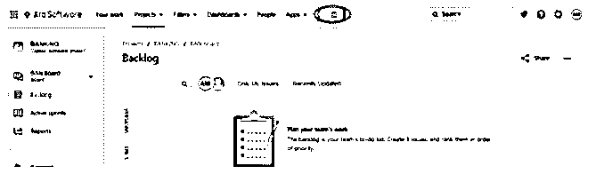
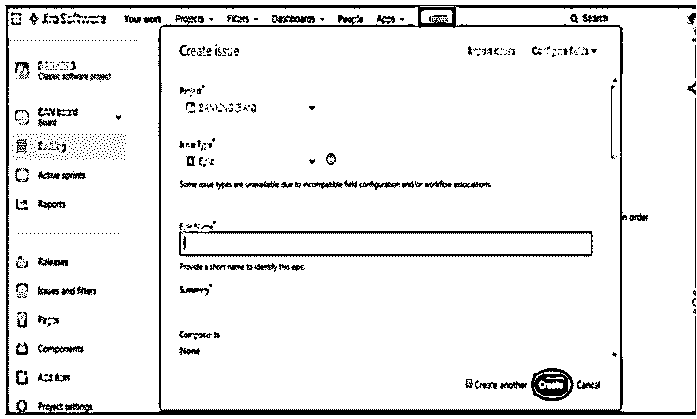
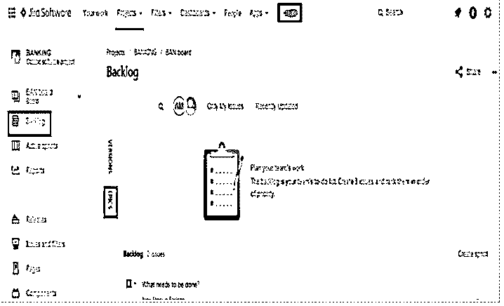
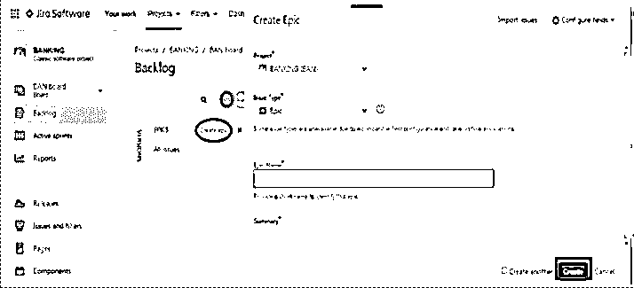
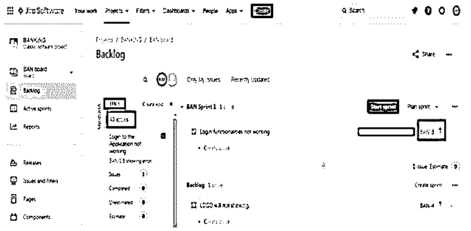
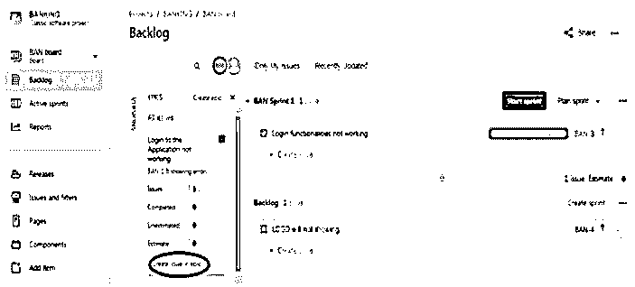
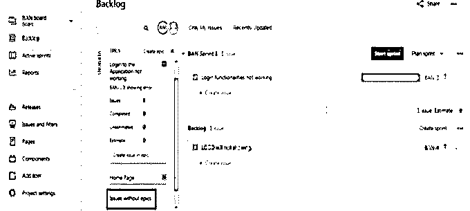

# 吉拉史诗

> 原文：<https://www.educba.com/jira-epic/>

## 吉拉史诗简介

吉拉 Epic 只不过是一个大的用户故事或任务或问题或软件应用程序的要求，可以根据吉拉的客户需求分成多个子任务或较小的用户故事。epic 包含故事、bug 和任务，作为一个小的/单个的工作，epic 表示一组工作。它也是一个高层次的工作层次，包括多个团队和多个 sprints，并组织软件应用程序开发中的工作流。

### 吉拉史诗是如何运作的？

该软件应用具有多个史诗，其中每个史诗组合多个故事来完成任务，并且类似地，每个故事包含多个子任务来完成它。首先，我们创建 epic，并在其中添加用户故事。创建 epic 后，我们查看 epic 的整个故事，并根据客户需求编辑故事，最后，开发团队将在完成状态的时限内完成它。

<small>网页开发、编程语言、软件测试&其他</small>

吉拉史诗的工作原理包括以下几个阶段。

*   史诗的创造
*   给史诗添加故事
*   从史诗中删除故事
*   查看您所有的史诗
*   结束或完成你的史诗

### 如何用各种方法在吉拉创作史诗？

在吉拉工具中创建史诗主要有两种方法。

*   从新问题选项卡创建 Epic
*   从史诗面板链接创建史诗

#### 1.从新问题选项卡创建 Epic

从新问题选项卡(即“创建”图标)创建 epic 涉及以下步骤。

**步骤 1:** 点击吉拉仪表盘上的“创建”图标。

**第二步:**填写项目名称，问题类型为 Epic，Epic 名称，Epic 摘要。

**第三步:**点击“创建”按钮，创建一个新的吉拉史诗。

#### 2.从史诗面板链接创建史诗

从仪表板上的 Epics 面板链接创建 Epics 涉及以下步骤。

**步骤 1:** 点击吉拉仪表板上的“Backlog”选项卡。

**步骤 2:** 点击 epics 面板上的“EPICS”链接。

**第三步:**点击“创建史诗”按钮，提供史诗名称、史诗摘要和史诗类型。然后我们点击“创建”按钮。

### 如何看待吉拉的史诗？

我们可以通过以下方式查看吉拉的所有史诗或相关问题:

*   **在 epics 面板链接:**首先，我们转到吉拉仪表板中的“Backlog”选项卡，单击 Epics 链接以查看和管理所有 Epics。
*   **Epics 列表:**Epics 链接提供/显示与您的软件应用开发相关的所有 Epics。
*   **在 epic 中查看问题:**通过点击一个 epic，它显示与特定 Epic 相关的所有任务或问题，以及整个 sprint 的状态。

### 在吉拉各种史诗般的行动

有一些额外的史诗操作涉及到吉拉工具。

**1。在 epic 中添加和删除问题的操作:**我们可以使用“新建问题”选项卡将问题添加到 epic 中，方法是选择问题类型不是 epic，然后我们将问题添加到 epic 中。我们还使用 EPICS link 向特定的 EPICS 添加问题。为此，我们转到 EPICS 链接，点击“在 epic 中创建问题”选项卡。

要从 epic 中删除问题，我们转到“Backlog”选项卡，将所选问题拖放到“issues without epics”选项卡。

**2。查看 epic 的摘要:**在这里，我们可以查看关于特定 Epic 的详细信息，包括项目名称、sprint 名称、开始日期、结束日期以及与其相关的任何子任务。子任务的完成是完成史诗所必须的。

**3。监控 Epic 的状态:**它有助于通过跟踪团队未完成的任务和工作流程来监控工作的进展。

**4。完成您的史诗:**当史诗的所有相关任务都将完成时，我们会将该特定史诗的状态更改为“完成”状态。它预示着史诗将完成或结束。对于您希望完成的操作史诗，将状态设置为“完成”。然后史诗就完成了。

### 结论

在上面这篇文章中，我们简要讨论了吉拉工具中的 Epics，以及它如何帮助我们的软件应用程序开发。它还描述了我们如何通过吉拉工具中的各种程序创建、操作、查看和结束 epic。史诗有多个故事，根据客户需求有多个冲刺阶段，有不同的开始和结束时期。这是开发软件应用程序的一个重要参数，吉拉工具可以正确处理它。

### 推荐文章

这是一本吉拉史诗指南。这里我们讨论一下入门，jira 史诗是如何运作的？如何使用各种方法在 jira 中创建 epic？如何在 jira 中查看一部史诗？以及在吉拉各种史诗般的行动。您也可以看看以下文章，了解更多信息–

1.  [什么是吉拉软件？](https://www.educba.com/what-is-jira-software/)
2.  [吉拉版本](https://www.educba.com/jira-versions/)
3.  [吉拉 Scrum 板](https://www.educba.com/jira-scrum-board/)
4.  [JIRA 的替代方案](https://www.educba.com/jira-alternatives/)

