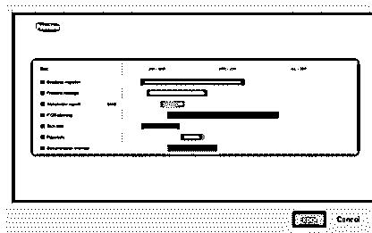
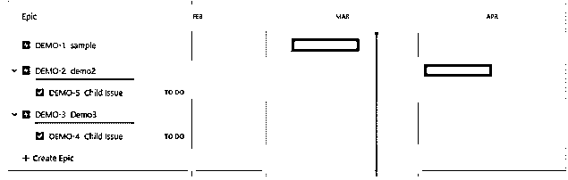
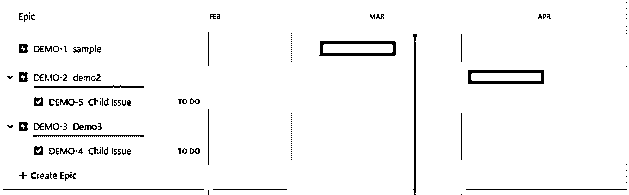
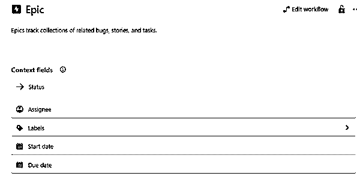

# 吉拉路线图

> 原文：<https://www.educba.com/jira-roadmap/>

## 吉拉路线图的定义

基本上，我们知道吉拉用于管理项目的整个过程，路线图是吉拉的一个应用程序，用于在团队级别管理项目的整个过程，例如在 epic 级别前一个月规划大型工作，这样我们可以轻松地估计时间和交付日期。在这里，路线图还提供了处理依赖性管理的特性，这有助于我们可视化工作，并以更高的效率一起工作。吉拉路线图的主要优势是，如果我们想要跟踪跨组织的多个团队，那么我们可以实现吉拉路线图。

### 什么是吉拉路线图？

任务指南是数据框架安排、目标、需求和长期进展的非凡源泉。这是一个图形化的、重要级别的活动计划，围绕您的目标调整您的团队和不同的合作伙伴，并指导完成这些目标的重要阶段。

<small>网页开发、编程语言、软件测试&其他</small>

与任务计划完全不同，在任务计划中，微妙之处通常会胜出，指南保持简单明了，只关注基础。这实际上使得指南对于监督假设、传达计划以及为不同的团队规划资产变得如此重要。现在让我们来看看路线图中的一些重要概念，如下所示。

*   史诗:史诗意味着大项目，我们把它分成小部分，我们称之为模块到单个任务。这个任务也称为特定史诗的子问题。
*   子问题:通常我们可以通过在 epic 的嵌套结构中使用路线图来创建子问题。在路线图中，有一些常见的问题，如故事、bug 和任务。
*   开始和截止日期:在路线图中，我们可以设置史诗的开始和截止日期。借助这一关键点，我们可以制定与不同团队的沟通计划，还可以提供可见性。另一个优点是它提供了依赖关系的映射。
*   视图设置和过滤器:默认情况下，吉拉路线图有一个过滤器特性，可以根据我们的要求轻松管理工作细节的视图。
*   依赖性:对棋盘的依赖性是团队的基本要求。当条件被描绘出来并被计划好的时候，一个团队可以调整并预测选择的方式。在吉拉软件中，你可以毫不费力地从指南中直接规划条件来展示传奇之间的联系。

### 如何制定吉拉路线图？

现在，让我们看看如何建立吉拉路线图，如下所示。

《吉拉指南》是脆弱群体的重要工具，应该概述这个群体在削弱什么，以及削弱的原因。吉拉的向导使你能够将任务与更广泛的物品技术相结合，并根据客户的输入安排差事和需求——这两者对协调系统至关重要。

这意味着该组可以快速、基本地访问全部数据。同时，项目业主无疑可以代表和合法化的过程调整。

首先，我们需要启用路线图的功能，因此我们需要选择项目设置，在设置中我们有一个功能->我们可以根据需要启用或禁用路线图功能。

单击启用路线图后，我们会看到不同的选项，需要根据我们的要求自定义该选项。

我们可以利用视图设置，在全部、完整或不完整之间进行选择，选择所需的史诗显示在路线图上。选中不完整的图例通常可以在指南上看到。我们可以通过在视图设置面板中选择合适的框来决定记住指南的条件和进度。利用渠道，您可以决定以明确的状态类别或明确的问题类型显示问题和故事。

**我们可以分享我们的路线图:**我们有几个选项可以根据股东的要求与他们分享，例如谁将看到该计划。我们可以制作只读链接和 HTML 页面，也可以导入图片等，如下图所示。

以及将电子表格导出为 CSV 文件；我们还可以将我们的路线图嵌入到云页面上。

### 如何使用板条箱路线图？

现在让我们看看如何使用下面的路线图。

启用路线图功能后，我们首先需要创建如下截图所示的 epics。

之后，我们还可以根据我们的要求在特定的 epics 中创建子问题，如下图所示。

在路线图中，我们可以根据计划设置开始和截止日期，如下图所示。

如果我们需要在路线图中添加依赖关系，那么我们也可以添加一个依赖关系。

### 吉拉路线图工作

基本上，路线图帮助敏捷团队描述他们的大量工作以及何时完成。与团队、客户和其他风险投资伙伴交谈是一件罕见的事情。有了向导，活泼的同事们有了一种在接下来的 3-6 年甚至一年中旅行的感觉。通过了解这种旅行，团队可以更容易地获得他们项目的进展。让我们假设我们是产品所有者，这样我们可以如下定义路线图。

1.需要明确公司的目标。

2.需要展示由客户需求组成的套件和敏捷。

最后，我们可以说路线图提供了一个更好的机会来提醒工人不同的图片。

### 吉拉路线图类型

现在让我们看看不同类型的路线图，如下所示。

*   发展团队:可以通过多种方式建立，取决于团队如何适应运作。它们通常通过运行来协调，这些运行显示了事件过程中的明确任务和问题。
*   外展小组:包含更多与客户交流的能力。
*   管理人员:按月或季度筛选数据很简单，包含的关于改进周期和任务的信息较少。
*   外部客户指南:主要目的是向客户展示该产品的下一步动向。

### 结论

借助上述文章，我们试图了解 JIRA 路线图。从这篇文章中，我们了解了 JIRA 路线图的基本内容，我们还看到了 JIRA 路线图的整合以及我们如何在 JIRA 路线图中使用它。

### 推荐文章

这是一份吉拉路线图指南。这里我们讨论定义，什么是吉拉路线图，如何建立吉拉路线图，代码实现的例子。您也可以看看以下文章，了解更多信息–

1.  [吉拉 Scrum 板](https://www.educba.com/jira-scrum-board/)
2.  [吉拉版本](https://www.educba.com/jira-versions/)
3.  [JIRA Bug 生命周期](https://www.educba.com/jira-bug-life-cycle/)
4.  [吉拉仪表盘](https://www.educba.com/jira-dashboard/)

