# 吉拉多个受托人

> 原文：<https://www.educba.com/jira-multiple-assignees/>

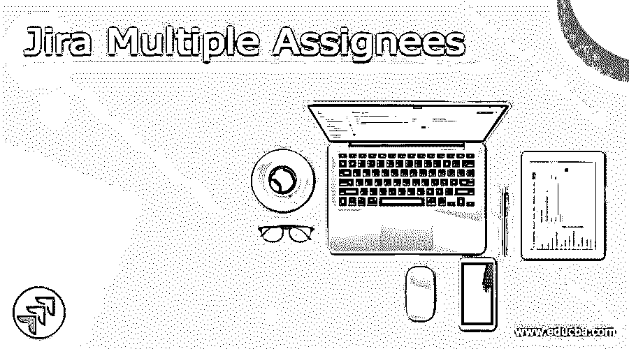

## 吉拉多重受托人的定义

有时候我们需要一起工作来实现一个共同的目标。那时，我们需要将一个问题分配给多个团队成员。但重要的一点是，根据吉拉原则，我们不能将一个问题分配给多个团队成员。这违背了吉拉行动的原则。当我们试图将一个问题分配给一个以上的人时，我们就无法确定问题的责任，或者我们可以说不清楚。但直到我们被要求，然后我们需要做一些额外的配置，如邮件组，由一组团队成员组成。

### 什么是吉拉多重受托人？

很多时候，团队需要在类似的任务上合作。例如，一个产品组制造另一个组件，设计师、开发人员和 QA 应该被归入类似的任务。吉拉不支持不同的委托人，所以客户习惯性地问如何将一个问题分配给众多的客户？

<small>网页开发、编程语言、软件测试&其他</small>

在很大程度上，个人进行分包，以显示类似任务的不同选择。因此，吉拉变得挤满了大量的差事，本质上是类似的东西，鉴于这样一个事实，你可以有 3 个类似的元素，这是基本的复制任务与各种任务。由于大量的跑腿和分包，吉拉变得非常迟钝，客户在这种情况下会偏离轨道，因为很难理解谁在做什么。

为了显示那些正在削减任务的个人，你可以制作一个额外的字段“多客户挑选者”,然后在那里展示你额外挑选的人。

在吉拉的任务是用来在一个小组中传递各种差事。你向代表(被任命者)作出承诺。

但是，偶尔将问题分配给不同的受托人可能会有所帮助。

例如，假设一个差事由不同的工人处理，因为它需要更多的信息和资产。

因此，将这项任务分配给每个有意识的员工是有帮助的，因为他们分担同等的义务，所以他们可以更有效地设计他们的行程，而不需要制作单独的票。

我们显示了哪些前景和变通办法存在，将在吉拉的差事交给不同的受托人。

### 如何添加多个受托人？

现在，让我们看看如何在吉拉添加多个受托人，如下所示。

1.  首先，我们需要打开吉拉设置更多的细节，你可以看到如下截图。

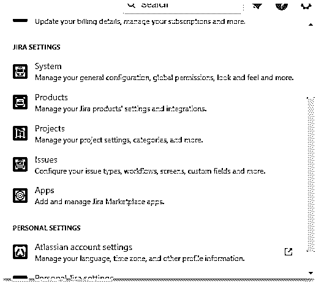

1.  现在选择问题的选项，点击后我们得到一个新的屏幕，作为参考找到下面的截图如下。

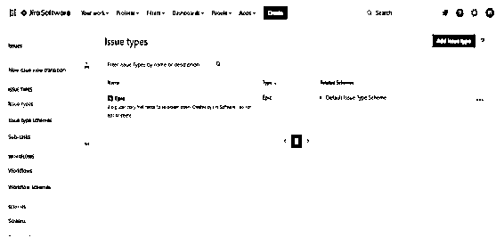

1.  在这里，我们需要搜索自定义字段，并根据我们的参考要求创建新的自定义字段，找到下面的截图如下。

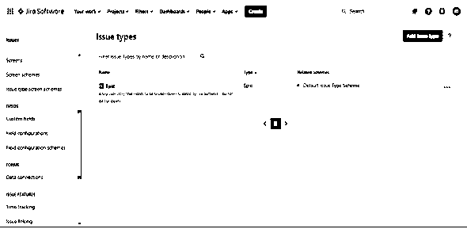

1.  点击自定义字段后，我们得到如下。

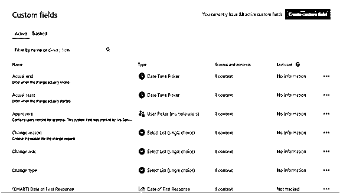

1.  这里我们创建了一个自定义字段选项，如上面的屏幕截图所示。现在点击它，我们得到如下选择字段类型屏幕。

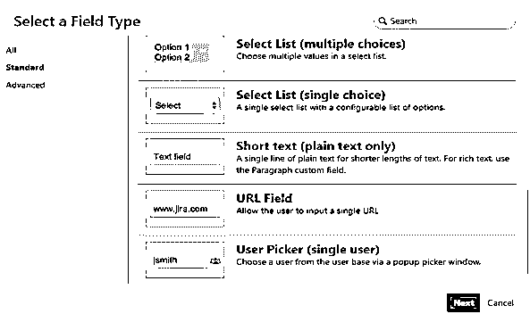

1.  选择一个高级选项并搜索多用户选择器，如下图所示。

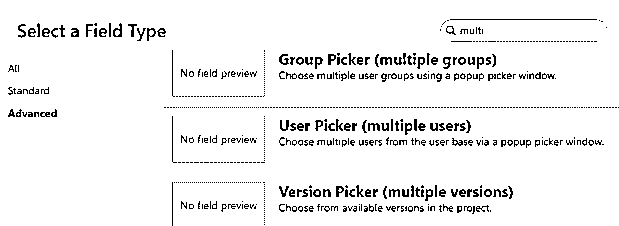

1.  选择“多用户”选项卡，然后单击“下一步”按钮，我们会看到一个新的屏幕，显示为已配置的用户选取器，如下图所示。

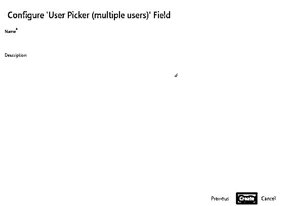

1.  在这里，我们需要根据我们的要求分配用户选取器的名称和描述，并单击 create 按钮。

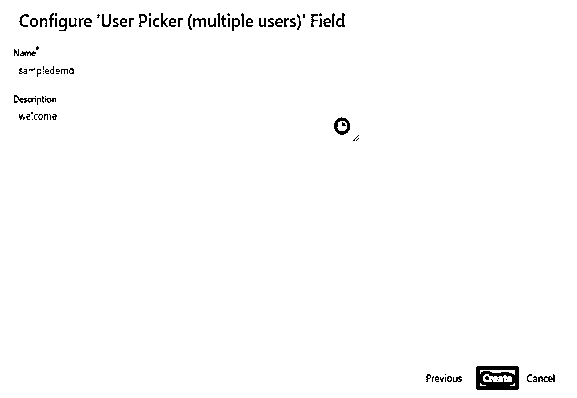

1.  这里，我们需要按照我们的要求更新屏幕，如下图所示。

因此，我们可以获得自定义字段，如下图所示。

10.  在这里搜索新创建的字段，如下图所示。
11.  现在打开创建的问题和受分配人多用户，如下图所示。

### 吉拉多重受让人问题

现在让我们看看如何在吉拉分配多个问题，如下所示。

这个选择在一定程度上推进了正在发生的事情，但并不完全。该领域的个人不会看到任务被指派给他们，很难准确跟踪在该问题上花费的时间，也很难看到每个部分的努力。

要获得合理的描述，您可以利用 ActivityTimeline 应用程序，它将帮助您获得描述，因为该应用程序支持多客户端选择器，并允许在时间线上的客户端之间划分任务。只需选择一项任务，将它分配给几个客户，为每个客户设定积极的标准，分歧的问题就会出现在时间线上。

在这里，我们需要遵循上述相同的步骤，并单击 assignee 选项，如下图所示。

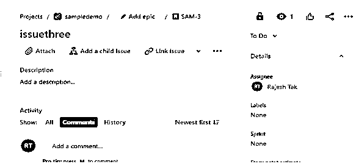

我们也能够按照下面截图中显示的要求，向小组分配单个问题。

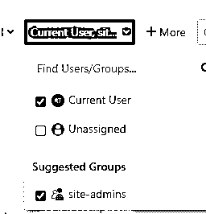

### 吉拉多个受分配人点击

现在让我们看看如何在吉拉添加多个作业。

1.  首先，我们需要打开 ClickUp 并单击
2.  这里我们需要选择空间的选项。
3.  之后，我们可以获得需要在我们的空间中启用的标签图标。
4.  现在回到我们的工作区，找到我们想要的标签。
5.  点击标签图标进入下一个描述。

现在让我们看看 ClickUp 中的层次结构如下。

ClickUp 层次结构是舞台的核心。这种构造从一开始可能看起来势不可挡，但是，它让高管们的工作和工作过程变得简单多了！这种层级结构提供了一种协调的方法，可以将工作分解成对整个团队来说容易监督的值得注意的事情。

现在让我们看看如何设置点击的优先级，如下所示。

ClickUp 中的需求是任意的，并且在工作区级别执行。要在工作区内设置优先级，请继续设置，然后单击应用程序并设置优先级。

### 结论

借助上述文章，我们试图了解吉拉多重受托人。从这篇文章中，我们已经了解了基本的东西，我们也看到了集成，以及我们如何在吉拉多受托人使用它们。

### 推荐文章

这是吉拉多重受托人指南。在这里，我们讨论定义，什么是吉拉多受托人，如何添加多个受托人，以及代码实现和输出的例子。您也可以看看以下文章，了解更多信息–

1.  [吉拉积压](https://www.educba.com/backlog-in-jira/)
2.  [吉拉史诗](https://www.educba.com/jira-epic/)
3.  [冲刺吉拉](https://www.educba.com/sprint-in-jira/)
4.  [吉拉版本](https://www.educba.com/jira-versions/)

