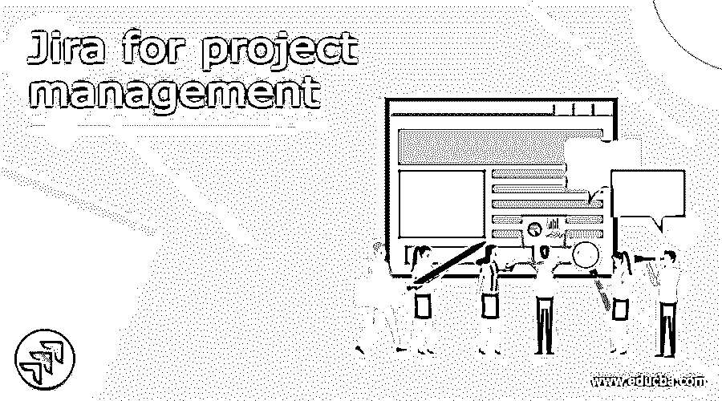
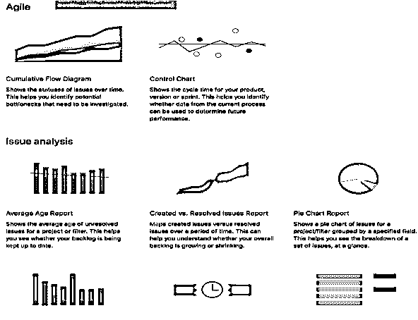
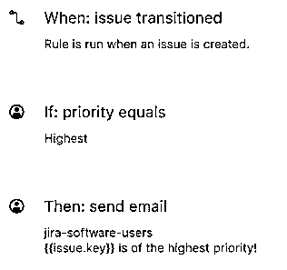
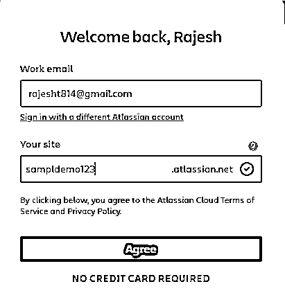
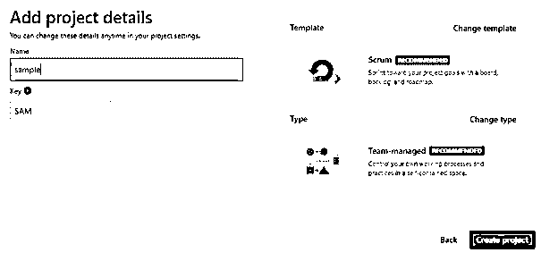
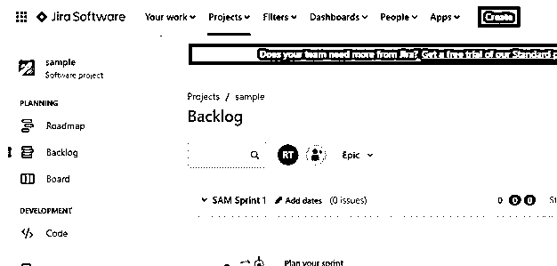
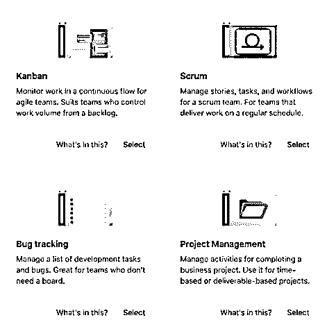
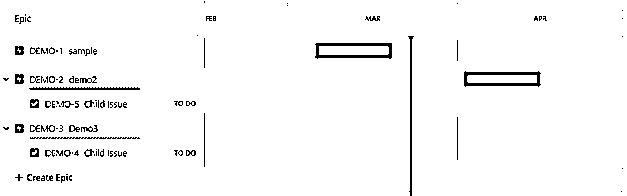

# 项目管理吉拉

> 原文：<https://www.educba.com/jira-for-project-management/>

## 项目管理的吉拉定义

我们知道，基本上吉拉是用来管理整个项目的开发过程，以及它提供了不同种类的功能，以用户管理整个项目的工作流程。换句话说，我们可以说吉拉是基于敏捷方法的，比如 scrum、看板，或者我们可以根据自己的需求创建任何其他独特的看板。agile board 为用户提供了不同类型的功能，例如积压工作和路线图，我们还可以生成报告，有时我们需要集成其他工具或应用程序，跟踪项目问题等。

### 项目管理吉拉概述

问吉拉是什么很正常？它最初是一个 It 设备，但是现在它有许多用途，从传统的电路板任务到 IT 标签框架。它涵盖了风险投资和董事会的基本原则，提供了一个完整的设备套件，例如，项目安排，任务创建，执行人员和细节。

<small>网页开发、编程语言、软件测试&其他</small>

吉拉阶段补充了高管们排练的协调项目。使用与灵巧功能相关的吉拉来利用设备。

当我们在安排行程和其他轻松的场合见面时，我经常把我们小组的吉拉任务列表投射到屏幕上，这非常有效地让小组达成了一致，同时也让这些聚会变得更加顺利。

特别是在程序改进方面，执行者的常规任务已经被新的策略加强了，例如，敏捷，它以不断地向客户传递工作项目为中心。今天，敏捷管理是一个总括术语，并且出现了一些从属技术。两个最引人注目的子技术是 Scrum，它强调短期内安排好的工作，以及 Kanban，它强调一点工作流，这些工作流会导致与期望不一致的结果。

持续的交付(通过反复的工作运行变得可能)为客户提供了工作项目的连续传送。因此，这些连续的项目交付——以及客户审计——允许团队在改进周期之前发现与先决条件的偏差和不同的问题，这可以帮助避免成本或资产入侵。

### 为什么使用吉拉进行项目管理？

现在让我们看看为什么我们使用吉拉进行项目管理，如下所示。

吉拉有许多能力，假设它感觉失去了你真正想要的元素，可以通过访问 Atlassian Marketplace 来添加它，这是一个基于互联网的商店，在那里你可以找到局外人的编程来增强吉拉的中锋能力。

董事会模式中的一个企业是特雷罗-吉拉公司。这个组件允许团队使用他们喜欢的设备来执行项目，并且信息可以在各个阶段之间自然地调整。让我们来看看吉拉的不同特色。

**工作流程:**

基本上，吉拉工作流在项目管理中发挥着重要作用，它是吉拉的重要功能之一，因为它用于显示组织的整个流程，提供对任务的控制，并跟踪问题。在开发阶段，单个任务会经历不同的阶段，如待定阶段、进行中阶段和工作完成时的完成阶段。因此，吉拉工具允许我们按照组织的要求管理整个工作流程。如果组织想要审查阶段，那么我们可以添加审查阶段。

**报告:**

这是吉拉工具非常重要的功能之一，通常所有项目都需要报告来跟踪项目的整个进展。借助吉拉报告，我们可以跟踪团队成员的工作，也可以发现项目瓶颈。吉拉提供不同类型的报告，如下图所示。

**自动化:**

吉拉有能力识别重复性的任务和进度，也有助于计算团队的时间和精力。吉拉允许我们按照自己的要求定制自动化规则，如任务完成后的电子邮件触发等，如下图所示。

### 创建新的项目管理

现在让我们看看如何在吉拉创建一个新项目，如下所示。

在这里，我们使用吉拉免费云，所以首先，我们需要输入我们的工作电子邮件和我们想要的网站名称，并点击同意按钮，如下图所示。

这一步我们第一次需要遵循。之后，我们得到一个新的屏幕来添加项目细节，如名称，并点击创建项目按钮，如下图所示。

之后，如果我们想添加一个团队成员，那么我们可以按照我们的要求添加。创建项目屏幕后，我们可以在仪表板上看到一个创建的项目，如下图所示。

### 如何使用吉拉进行项目管理？

现在让我们看看如何使用吉拉进行项目管理，如下所示。

首先，我们需要**配置项目**按照我们的要求，吉拉提供了不同的模板来配置项目，如看板项目管理模板，或者我们可以使用构建的模板，如 scrum、bug 跟踪、项目管理和任务跟踪等，来管理项目的工作流程，如下图所示。

第二步，我们需要做**项目计划**。吉拉提供了根据项目的时间表或者说路线图来管理项目计划的功能。为了创建一个项目计划，我们需要应用分解结构来确定整个进度和时间表。在吉拉，我们还能够管理问题和跟踪任务，基本上，在项目计划中，路线图用于管理团队的时间表，如屏幕截图所示。

第三步，我们可以**建立团队**启动项目执行，基本上，我们不能向每个团队成员提供整个吉拉的访问权限，根据他们的要求，我们可以提供访问权限、许可或任何其他相关信息。

**跟踪**吉拉提供不同的工具来跟踪项目进度，吉拉提供的默认功能不符合我们的需求，我们需要根据我们的要求集成一些第三方工具。

最后，在项目完成后，我们有**项目完成**步骤，一旦我们达到目标，我们就结束项目，这意味着从仪表板归档项目。

### 结论

借助上述文章，我们试图了解吉拉的项目管理。从这篇文章中，我们了解了吉拉项目管理的基本情况，我们还看到了吉拉项目管理的集成，以及我们如何在吉拉项目管理中使用它。

### 推荐文章

这是吉拉项目管理指南。在这里，我们讨论定义、概述、为什么使用吉拉进行项目管理、如何在吉拉创建新项目以及输出。您也可以看看以下文章，了解更多信息–

1.  [吉拉积压](https://www.educba.com/backlog-in-jira/)
2.  [吉拉史诗](https://www.educba.com/jira-epic/)
3.  [冲刺吉拉](https://www.educba.com/sprint-in-jira/)
4.  [吉拉版本](https://www.educba.com/jira-versions/)

