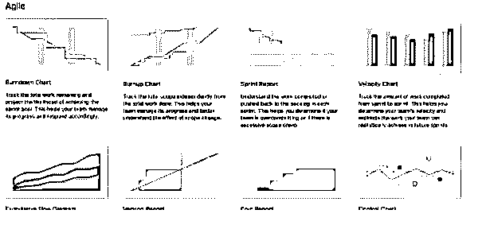
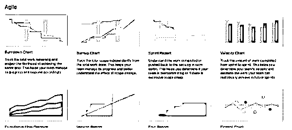
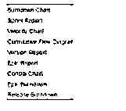
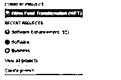

# 吉拉报道

> 原文：<https://www.educba.com/jira-reports/>

## 吉拉报告简介

吉拉用于管理项目的整个生命周期，它还提供不同种类的功能，报告是吉拉提供的功能之一。我们可以跟踪项目的所有活动。换句话说，我们可以说吉拉报告帮助我们分析项目的进展，跟踪问题和不同时间表的性能特征。吉拉在指定项目中提供不同类型的报告。使用吉拉报告，我们可以跟踪问题、缺陷和冲刺目标。

### 吉拉报告概述

吉拉的报告帮助团队分解一个项目的进展，跟踪问题，处理时间，预见未来的执行。它们为 Scrum、看板和其他轻量级系统提供了基本的、持续的体验，目标是可以做出信息驱动的选择(绝对最好的选择)。

<small>网页开发、编程语言、软件测试&其他</small>

**吉拉报表的值:**

吉拉报告说，我们帮助你保持专注于运行目标，深入问题，监督责任，识别瓶颈，并最终更敏捷地工作。

此外，这些只是报告。同样还有吉拉仪表板，吉拉宣布的另一个选择。这是一种整理你的事业，并利用许多潜在的设备在一个单独的视图中跟踪你的成就的方法。这些小工具中的一些在你的工作表中有类似的吉拉报告，所以它们在一个地方，类似于创建与解决的图表和 Sprint Burndown。

**1。生产力:**我们可以分析每个 sprint 完成了多少工作，我们计划了多少工作。

**2。可预测性:**此时，我们检查工作的一致性，并为其制定合适的计划。

**3。按照计划，我们能完成工作吗？**

**4。范围:**用于定义待办事项的范围。

**5。质量:**我们正在解决所有可能的错误，以保持质量。

吉拉提供了以下类型的报告。

*   Scrum 团队的报告。
*   向看板团队报告。
*   向管理层报告。
*   问题分析报告

### 如何使用吉拉报告？

现在，让我们看看如何使用吉拉报告，如下所示:

根据我们的需求，我们可以在各自的 scrum 和看板中轻松访问上表中的所有特性。吉拉允许我们按照我们的要求生成所有类型的报告，并且，我们可以指定谁将看到带有当前日期和问题的信息。
这些报告将利用您的董事会依赖的任何评估方法，因此假设您使用故事点，报告将跟踪进度并完成利用。另一方面，假设您有一个自定义的数字字段，单词将基于该字段。因此，有不同的方法来使用吉拉报告如下。

首先，我们需要点击一个项目，选择所需的任务，然后点击报告。如果我们的项目与多个项目相关联，我们必须从下拉菜单中选择报告选项。在第二个选项中，我们可以只为服务器或数据中心选择报告表单板。

吉拉板显示在下面的截图如下。

### 如何在吉拉访问报告？

现在，让我们看看如何在吉拉访问报告，如下所示:

首先，我们选择具体项目内部的项目，如下图所示。

单击报告符号；它显示了所有支持的吉拉报告类型，如下图所示。

对报告的回忆取决于所使用的纸板类型，包括纸板的具体问题。当我们打开项目时，点击报告部分；在报告部分，我们有不同类型的报告，如图表、速度、流程图、sprint 报告等。吉拉报告的实施是简单明了的；根据我们的要求，我们可以使用不同类型的报告。

### 如何在吉拉创建报告？

现在，让我们看看如何创建一个吉拉报告，如下所示:

*   首先，我们需要按照我们的需求导航项目。
*   之后，点击报告。
*   现在选择我们想要生成的报告。

以上三个步骤如下图截图所示。

### 吉拉报告的类型

以下是吉拉报告的类型:

*   **敏捷:**敏捷报告了如下特性。
*   燃尽图:用于跟踪剩余工作，也用于显示项目目标。
*   **冲刺图:**用来跟踪工作是如何完成的。
*   **速度图:**它一个 sprint 一个 sprint 地跟踪我们完成了多少工作。
*   **累积流程图:**显示一段时间内的问题状态。
    支持版本报告、Epic 报告、控制图、Epic 烧录、版本烧录等不同类型的功能。

问题分析报告:

*   **发行年龄报告:**显示发行的年龄。
*   **已报告和已解决的问题报告:**它显示产生了多少问题，以及我们决定了多少问题。
    它还支持图表报告、新创建的问题和解决时间。

现在让我们来看看预测和安排报告的特点如下:

*   **时间估算报告:**显示指定项目中问题的当前和计划时间表。
*   **工作量估算报告:**它还显示用户工作的时间估算，因为它有助于我们了解哪个用户的工作更多和更少。
*   **版本评估报告:**它显示每个用户有多少工作未完成，以及他们各自的问题；使用这个特性，我们可以分析有多少工作是未完成的。

### 结论

借助上述文章，我们看到了关于吉拉的报告。从这篇文章中，我们看到了吉拉报告和吉拉报告整合的基本情况，以及我们如何在吉拉报告中使用它。

### 推荐文章

这是吉拉报告指南。在这里，我们讨论的介绍，以及如何使用和创建报告在吉拉与类型。您也可以看看以下文章，了解更多信息–

1.  [吉拉积压](https://www.educba.com/backlog-in-jira/)
2.  [GitLab 吉拉集成](https://www.educba.com/gitlab-jira-integration/)
3.  [吉拉史诗](https://www.educba.com/jira-epic/)
4.  [冲刺吉拉](https://www.educba.com/sprint-in-jira/)

