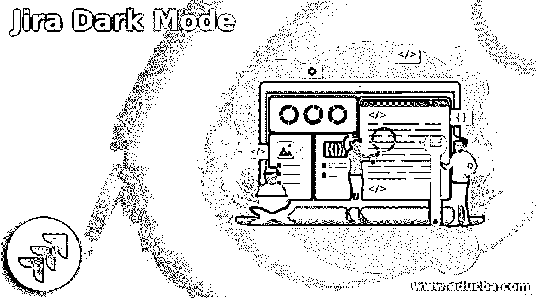
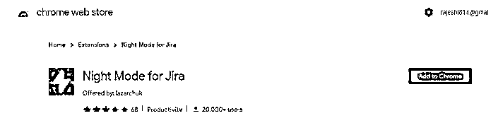
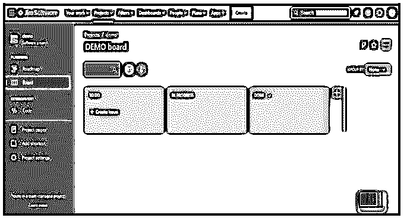
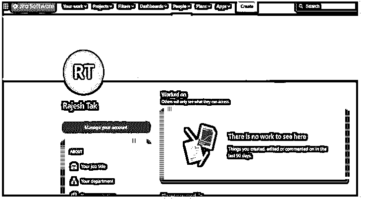
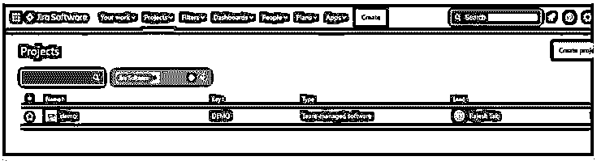

# 吉拉黑暗模式

> 原文：<https://www.educba.com/jira-dark-mode/>

## 吉拉黑暗模式介绍

吉拉为用户提供不同的功能；黑暗模式是吉拉提供的功能之一。黑暗模式是吉拉最受欢迎的功能之一。黑暗模式从 2020 年开始可用，给出了我们想要的确切模型。吉拉还向用户提供了一些额外的方式；黑暗模式，我们可以打开/关闭根据我们的要求。黑暗模式为云上所有可用的吉拉应用程序和站点提供了标准选项。不幸的是，吉拉没有内置功能；我们需要添加扩展。

### 什么是吉拉黑暗模式？

吉拉是一个非凡的编程进步和问题跟踪设备，有助于监督和跟上问题的安排。它是现在最流行的设计工具之一。它监控任何产品开发项目中暴露出来的编程错误。这种产品装置帮助各种各样的编程改进小组处理他们的工作。在随后的文章中，我们将考察一些关于吉拉的重要事实:它的经历、利益集团和动机。除此之外，这篇文章还描绘了一些关于吉拉及其沉闷模式的惊人而有趣的事实。

<small>网页开发、编程语言、软件测试&其他</small>

一整天都用白色的底色进行基于文本的交流是一件困难的差事。吉拉的黑暗主题使连接点更加直观，用适合眼睛的暗淡、暗淡和黑暗色调挽救了吉拉顾客的视觉感受。

每个客户端可以在正常和三个不同的沉闷话题(昏暗模式)之间完美切换。

*   **‘蓝色’:**一个浅色底纹计划，用一种暗淡的海军蓝使页面有些模糊。
*   **“无烟煤”:**一个暗淡的阴影计划，可以在许多不同的应用中找到(同样的)。
*   **【夜】:**一个极其昏暗的阴影计划，用它的许多黑暗和昏暗的阴影来说服。

不需要额外的应用程序或模块，这适用于每个正在进行的程序。

### 如何使用吉拉黑暗模式？

首先，让我们看看如何在吉拉打开黑暗模式。

吉拉是保持你的团队协调和目标的理想程序。它赋予你制造和更新问题的能力，让你能够跟踪错误、元素和任务，从那里开始，天空就是极限。此外，它具有足够的适应性，可以从一开始就帮助你工作——不管你的事业有多大，也不管你的团队有多合适。从安排项目到以下问题，你可以依靠吉拉来帮助你传达你的客户喜欢的节目。

这个项目的名字是 Gojira 的缩写，Gojira 是日语中哥斯拉的意思。这个名字是从一个 Atlassian 设计师用来暗指 Bugzilla 的绰号开始的，Bugzilla 最近在内部被用来跟踪 bug。吉拉是一种强大的编程，可以授权在内部运行或用作辅助应用程序。吉拉没有违约。

对于吉拉服务器，我们有 Maximilian Porzelt 黑暗模式。这是黑暗模式的付费版本，根据我们的要求，我们可以开关。此外，Maximilian Porzelt 支持看板和 Scrum 板以及一个仪表板，使界面看起来更容易。

在下面的截图中，我们可以看到看板板如下。

如果我们想先安装应用程序，我们需要以吉拉管理员的身份登录；然后，我们可以进入亚特兰蒂斯市场，在市场里面，我们找到了黑暗主题。

现在让我们看看基于浏览器的吉拉黑暗模式。

Chrome 提供了黑暗模式扩展，吉拉也支持它。我们可以在 Opera、Edge 或 chrome 中添加基于浏览器的扩展。在下面的截图中，我们可以看到 chrome 的扩展如下。

现在点击添加到 Chrome 按钮，之后，我们可以固定扩展。激活后，我们可以在吉拉看到一个效果，如下图所示。

现在让我们看看吉拉云的夜间模式如下。

这是 chrome 提供的另一个扩展；在这个扩展中，我们可以在不受服务器干扰的情况下更改 UI。它还提供了管理对比度和亮度的功能。

下面的截图显示了基于云的黑暗模式如下。

我们可以对 safari 浏览器使用黑暗模式；上面提到的扩展用于 chrome 浏览器。如果我们想在 safari 中实现黑暗模式，那么我们需要实现一个不同的系统，而且是支持所有类型苹果设备的付费版本。深色渲染提供了任何网站的深色模式，或者我们可以说它替代了浅色。

吉拉支持跨平台黑暗模式；如果我们想跨平台工作，我们需要进行吉拉黑暗主题。

### 如何激活吉拉黑暗模式？

假设你热衷于在使用网页版《吉拉》时使用单调模式，请继续阅读。你想要的只是我们的增强夜眼计划。夜眼是一个程序扩展，可以增强吉拉的迟钝模式。你可以在每一个重要的项目中引入它。它伴随着 90 天的免费预审。测试时间过后，你可以，在任何情况下，免费使用它，假设你换成夜眼建兴。此外，您还可以使用 master rendition，每年只需 9 美元。因此，通过利用夜眼计划增强吉拉上的昏暗模式，参与到网站中而不会使眼睛疲劳。

### 结论

从这篇文章中，我们看到了吉拉黑暗模式和它的集成的基本东西，以及我们如何在吉拉黑暗模式中使用它。

### 推荐文章

这是一个吉拉黑暗模式的指南。在这里，我们讨论了介绍以及如何使用和激活吉拉黑暗模式。您也可以看看以下文章，了解更多信息–

1.  [吉拉史诗](https://www.educba.com/jira-epic/)
2.  [吉拉版本](https://www.educba.com/jira-versions/)
3.  [JIRA Bug 生命周期](https://www.educba.com/jira-bug-life-cycle/)
4.  [冲刺吉拉](https://www.educba.com/sprint-in-jira/)

