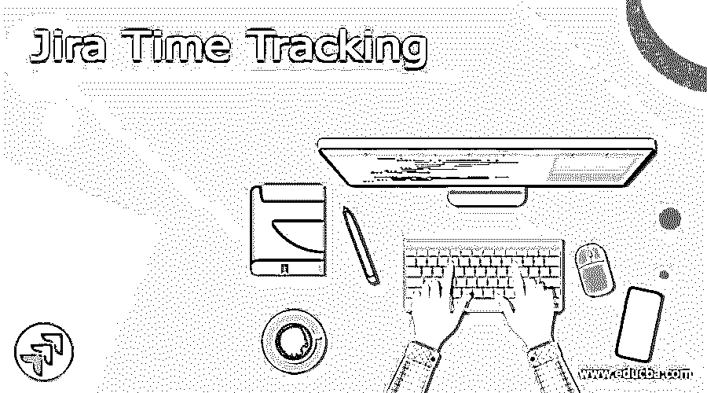
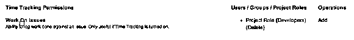
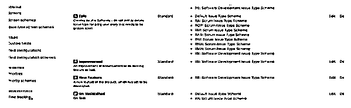
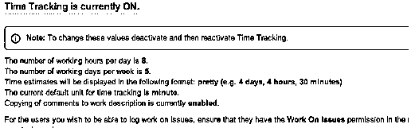
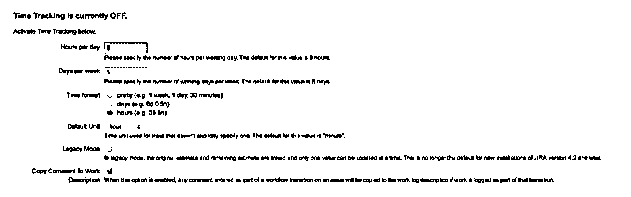
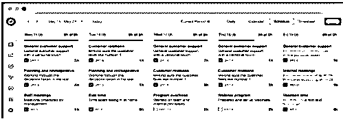
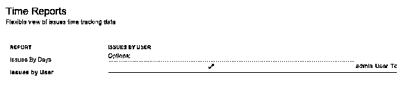

# 吉拉时间跟踪

> 原文：<https://www.educba.com/jira-time-tracking/>

## 吉拉时间跟踪的定义

吉拉向用户提供不同种类的功能，其中时间跟踪是吉拉提供的功能之一。吉拉时间跟踪功能跟踪用户时间，这意味着他们在不同的问题上花了多少时间。在实现时间跟踪之前，我们需要指定时间估计，他们工作多长时间，以及需要为指定的项目发布许可。然后，我们可以根据需要启用或禁用吉拉时间跟踪功能。

### 吉拉时间追踪概述

当我们使用敏捷软件开发时，时间跟踪是必不可少的。

<small>网页开发、编程语言、软件测试&其他</small>

请记住，并不是所有的吉拉客户都遵循协调，许多敏捷的开发小组喜欢吉拉。

时间跟踪在敏捷周期中如此重要的原因是时间跟踪考虑了三角测量。

很有可能，对于项目管理员来说，最麻烦的差事就是过多地考虑实际的评估。利用时间跟踪，你可以对比之前完成的差事和类似的职位，尽管有不同的见解(例如，故事的重点)。更重要的是，从而确定不可否认的更准确的截止时间。

此外，您可以使用基于计算机的时间跟踪(例如，通过利用应用程序)。这可以通过记录而不需要手动信息源来解决工程师的问题。这使他们能够不受干扰地继续工作。

### 使用吉拉时间管理

现在让我们看看如何管理时间跟踪，如下所示。

时间跟踪软件是一个电脑程序，它允许代表们跟踪他们在一个明确的、特定的项目或我们可以说是特定的工作上花了多长时间。许多企业，包括专家和小时工，经常使用这个程序。经常向买家收费的专家也同样使用它。法律顾问、专家和簿记员就是其中的几个。

时间跟踪软件可以免费使用，也可以与项目管理软件、客户服务和会计等应用程序相关联。时间跟踪软件用电子形式取代了标准的纸质时间表。时间跟踪软件同样包含时间记录软件，该软件利用用户活动监控来跟踪在 PC 上进行的锻炼以及每次出差花费的时间。

### 如何配置吉拉时间跟踪？

现在，让我们看看如何配置吉拉时间跟踪。

首先，我们需要检查所有的权限。如果我们没有许可证，我们需要授予指定项目的所有权限；对于权限验证，我们需要遵循以下步骤。

1.  首先，我们需要选择一个设置，并在该设置中单击“问题”。
2.  之后，点击权限。
3.  如果您想要配置权限模式，我们可以根据我们的需求进行配置。
4.  我们必须选择“处理问题”,然后单击“时间跟踪”权限内的“编辑”按钮。
5.  在这里，我们需要选择我们需要分配日志工作的特定用户、项目角色或组。
6.  最后，点击授予选项。

之后，我们需要按照不同的步骤来配置吉拉时间跟踪。

1.  首先，我们需要关闭时间跟踪；然后，我们可以编辑设置。
2.  第二步，我们需要选择时间的格式，比如每天的小时数、每周的天数，
3.  我们还需要检查默认的时间单位。
4.  接下来，我们需要使用以下步骤来配置“处理问题”权限。
    1.  首先，我们必须选择权限方案链接以登陆权限方案页面。
    2.  查找与指定项目相关的方案。
    3.  我们现在可以根据需要编辑权限方案，如下面的截图所示。

在上面的截图中，我们可以看到一个时间跟踪选项。

现在让我们看看如何根据我们的需求在指定的项目中启用或禁用时间跟踪。

1.  首先，我们需要选择一个设置，并在环境中选择问题。
2.  点击问题特征。
3.  选择时间跟踪
4.  最后，单击激活按钮来启用它。

下面的截图显示时间跟踪如下。

现在让我们看看如何禁用吉拉时间跟踪，如下所示。

1.  首先，我们需要选择一个设置，并在设置中选择问题。
2.  点击问题特征。
3.  选择时间跟踪
4.  最后，单击“停用”按钮来禁用时间跟踪。如下图所示

### 如何改变吉拉时间跟踪？

现在让我们看看如何改变吉拉时间跟踪如下。

通常吉拉提供不同的时间格式，所以根据我们的要求，我们可以改变时间格式，如每天小时，每周天，默认时间，传统模式等。我们可以更改五组权限，如下所示。

1.  **Issues work:** 通过使用这个属性，我们可以记录工作问题。
2.  **删除工作日志:**我们可以使用该命令删除所有日志。
3.  **删除自己的工作日志:**在这里，我们可以删除自己创建的工作日志。
4.  **编辑所有当前工作日志:**吉拉还提供了编辑所有工作日志的功能。
5.  **编辑自己的工作日志:**我们可以编辑自己创建的工作日志

### 吉拉时间跟踪工具

现在让我们看看不同的时间跟踪工具如下。

**a .速度时间表**

这是一个高级应用程序，用于跟踪吉拉的时间。使用这个应用程序，我们可以使一个快速而简单的过程，并提供多种选择来跟踪时间。例如，速度时间表显示在下面的截图中。

**b. Pivot 小工具**

这是一个先进的时间跟踪工具，我们可以有效地跟踪时间；它还包括一些帮助吉拉的商业能力。例如，Pivot Gadget 工具如下图所示。

**c .时间报告**

它提供了跟踪特定项目的时间和报告的灵活性，如下面的屏幕截图所示。

### 结论

借助上述文章，我们尝试了解 JIRA 时间跟踪。从这篇文章中，我们了解了它的基本情况，并看到了 JIRA 时间跟踪的集成以及我们如何在 JIRA 时间跟踪中使用它。

### 推荐文章

这是一个吉拉时间跟踪指南。在这里，我们讨论定义、概述、如何配置吉拉时间跟踪和吉拉时间跟踪工具。您也可以看看以下文章，了解更多信息–

1.  [吉拉积压](https://www.educba.com/backlog-in-jira/)
2.  [吉拉测试工具](https://www.educba.com/jira-testing-tool/)
3.  [吉拉史诗](https://www.educba.com/jira-epic/)
4.  [吉拉 vs ServiceNow](https://www.educba.com/jira-vs-servicenow/)

