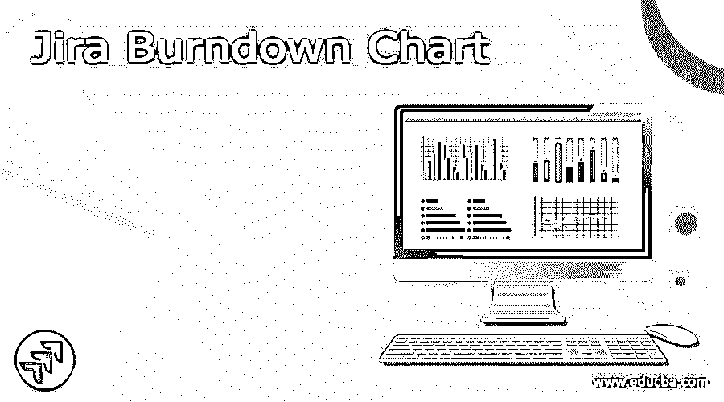
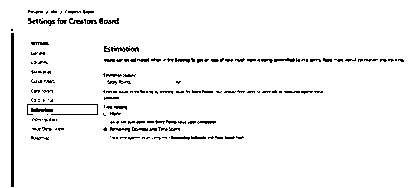
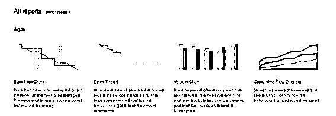
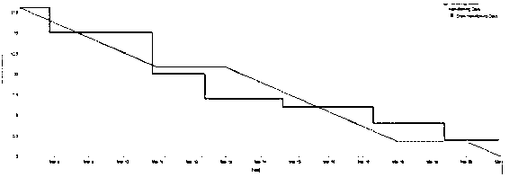

# 吉拉燃尽图

> 原文：<https://www.educba.com/jira-burndown-chart/>

## 吉拉燃尽图的定义

市场上有多种工具可用于跟踪项目；吉拉为用户提供了不同的功能，燃尽图是吉拉提供的功能之一。燃尽图显示了在一个特定的 sprint 或 epic 中完成的工作总量以及还有多少剩余工作。换句话说，我们可以说燃尽图用于显示特定团队的工作时间表，这意味着完成他们的工作需要多少时间。典型的吉拉燃尽图依赖于敏捷方法。

### 什么是吉拉燃尽图？

吉拉是由 Atlassian，Inc .设计的一个问题跟踪装置。项目管理程序强调协调工作办公室。出乎意料的是，吉拉是一个帮助团队合作和交流的错误跟踪和项目管理程序。这种强大的多功能编程对于敏捷、[项目管理、](https://www.educba.com/introduction-to-project-management/)、[软件开发和任务管理团队来说是必要的。](https://www.educba.com/what-is-software-development/)

<small>网页开发、编程语言、软件测试&其他</small>

吉拉编程是可行的，有大量的工具。您可以将它与其他有用的编程项目结合起来，以完成您的工作。幸运的是，这些仪器中的大多数安装起来并不困难，也不需要花费什么。吉拉拥有广泛的生产能力，但这一点的重点是如何将燃尽图与产品组装在一起。

因此，在这里我们将让你熟悉敏捷系统中的吉拉燃尽图，你将弄清楚如何编造一个吉拉燃尽图。同样，你会知道利用吉拉燃尽图的亮点和优势。

之前在 Scrum 技术中开始的 Burndown 概要。构建吉拉燃尽图背后的思想是解决与评估项目相关的所有问题。因此，吉拉燃尽图显示了长期剩余工作(通常称为正在进行的工作)的递减模式。此外，它还为处于危险中的项目提供了一个早期预警框架，同时允许团队在无法挽回之前做出根本性的改变。

此外，吉拉燃尽图提供了一个务实和可行的方法来监督项目。他们展示了你在一个简单的组织中的每一项任务的情况，帮助你跟踪你的团队的进步，并认识到可能需要更多考虑的重要领域。

### 如何创建吉拉燃尽图？

现在让我们看看如何在吉拉创建燃尽图。

为了创建燃尽图，我们需要考虑一些因素。

1.  **首先是** **，我们需要设置估算统计量:**此时，我们需要确定完成了多少工作。估算统计只不过是一个测量单位，可以用来估算一个故事点、小时或故事等方面的工作。，计量单位依团队而定。评估测量有助于计算出每次运行的组速度，这是完成故事的评估测量量。事实证明，速度有助于跑步安排。
2.  现在我们需要点击估算
3.  这里我们需要设置团队评估统计。

下面的截图显示了图表的一些基本设置如下。

2.  **第二步，我们需要输入估计值:**评估故事有助于推断在运行中完成特定工作需要多长时间。在开始运行之前，您需要输入仪表。这可能是在故事焦点或你选择的另一个标尺中。为了输入估计值，我们需要遵循以下步骤。
3.  先去各自项目的积压。
4.  第二步，我们需要选择问题；选择问题后，我们可以在右侧看到详细信息。
5.  所以在这里，我们可以按照我们的要求输入估计值，如下图所示。

### 吉拉燃尽图报告

现在让我们看看如何生成燃尽报告，如下所示。

1.首先，我们需要选择项目内部的项目，并从左侧菜单中单击一个报告。在这里，我们可以看到敏捷并点击 burndown。这是第一步，如下图截图所示。

2.现在，我们可以看到 Sprint 的 burndown 图，红线用来显示有多少工作在等待，灰线用来显示提交的任务。当与运行开始时的责任对比时，小组可以看到他们在运行的进展中所处的位置。客户端可以通过下拉列表更改 Sprint 和 Y-hub，如下面的屏幕截图所示。

报告的第二部分显示信息，如运行开始日期、添加的所有问题、逐步解决的问题数量、问题的故事点以及逐步剩余故事焦点的数量。

### 吉拉燃尽图类型

现在让我们来看看不同类型的燃尽图，如下所示。

1.  Sprint Burndown 图:Sprint burn down 图用于跟踪 Sprint 项目中的最终工作。它同样衡量完成特定任务目标的可能性。它显示了每天完成的工作与每次运行的扩展成果进度的对比。通过给定的运行跟踪这些数据，小组可以更现实地处理他们的进展。
2.  史诗级燃尽图:史诗级燃尽图让 Scrum 团队能够展示他们在冲刺阶段的进步。这张图表向你展示了这个团队在史诗中的表现。此外，团队可以感知剩余的史诗数量以及冲刺阶段的变化效果。

### 结论

借助上述文章，我们试图了解 JIRA 燃尽图。从这篇文章中，我们了解了 JIRA 燃尽图的基本情况，我们也看到了 JIRA 自动化的集成以及我们如何在 JIRA 燃尽图中使用它。

### 推荐文章

这是吉拉燃尽图指南。这里我们讨论定义，什么是吉拉燃尽图，如何创建吉拉燃尽图，以及代码实现的例子。您也可以看看以下文章，了解更多信息–

1.  [吉拉积压](https://www.educba.com/backlog-in-jira/)
2.  [吉拉测试工具](https://www.educba.com/jira-testing-tool/)
3.  [吉拉史诗](https://www.educba.com/jira-epic/)
4.  [冲刺吉拉](https://www.educba.com/sprint-in-jira/)

