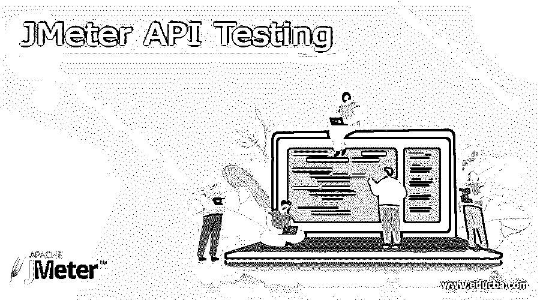
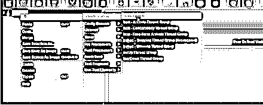

# JMeter API 测试

> 原文：<https://www.educba.com/jmeter-api-testing/>

## JMeter API 测试的定义

下面的文章提供了 JMeter API 测试的概要。API 是指应用程序编程接口，用于访问应用程序而无需实时应用程序的交互。因此，JMeter 工具用于测试 API 以满足用户对应用程序的期望，如应用程序的性能、安全性、应用程序的可靠性和功能性等。换句话说，我们可以说 API 允许我们与另一个应用程序通信，这意味着它向另一个应用程序发送请求，并从目标应用程序获得响应。所以 Apache JMeter 是用来检查应用程序性能的流行开源工具之一。

### 什么是 JMeter API 测试？

编程接口(Programming interface)或应用程序编程接口(Application Programming Interface)是一种中途编程，使两个应用程序之间的合作成为可能。为了更好地理解这一点，我们来看一个模型。

<small>网页开发、编程语言、软件测试&其他</small>

例如，如果你预定了交通工具，你通过在网上寻找与你的目标、起飞、返回日期和许多其他相关渠道相匹配的交通工具来开始这个循环。然后，为了在考虑大量决策的基础上做出选择，您与交通预订网站合作并访问他们的信息库。最后，您要检查在这些日期是否有座位，以及它们的费用。你经历的整个循环，从开始到结束，都是由一个 API 完成的。

Apache JMeter 应用程序是开源编程，是一个 100%纯粹的 Java 应用程序，旨在堆叠良好的测试行为和度量执行。Apache JMeter 应用程序是开源编程，是一个 100%纯粹的 Java 应用程序，旨在堆叠良好的测试行为和度量执行。JMeter 是为了测试基于 web 的应用程序的不同功能而构建的。根据我们的需求，我们可以将 JMeter 用于静态和动态的基于 web 的应用程序。

它可以模拟服务器、服务器集合、组织或对象上的沉重负担，以测试其团结性或分解各种负担类型下的一般执行。

JMeter 不是一个程序；它在约定层面起作用。然而，考虑到一切，JMeter 类似于一个程序(或者说，各种程序)；但是 JMeter 并没有完成程序支持的所有活动。它也不像程序那样呈现 HTML 页面(将反应看做 HTML 等是可行的，但是，计时被排除在任何示例之外，并且在每个字符串中的任何点上仅依次显示一个示例)。

### 为什么要使用 JMeter API 测试？

现在让我们看看为什么我们需要使用 JMeter API 测试。

Apache JMeter 被用于 API 测试的部分明显原因是:

**JMeter 是一款开源工具** : JMeter 是一款开源的免费工具，用于测试应用的性能和负载。

**支持跨平台测试** : JMeter 是基于 Java 的开源工具，支持 Windows、Linux、macOS 等不同操作系统。

**简单的 API 测试** : API 测试实现了简单、流畅和快速的 API 测试。

快速扩展测试(Speedy extension tests):JMeter 是一个执行测试的强大工具，让每个人的交互变得简单，不管是有经验的还是没有经验的。

**支持负载测试** : JMeter 是一个非常强大的工具，可以用来衡量 web 应用程序是否满足特定的负载先决条件。

**支持压力测试** : JMeter 可以重现客户端，以测量应用程序在巨大压力下的执行情况。

**模块堆** : JMeter 提供了很多模块，通过引入一个插件管理器可以有效的引入更多的模块。
我们来看看执行 JMeter API 测试的方法如何。

### JMeter API 逐步测试

现在让我们看看 JMeter API 的一步一步的执行，如下所示。

1.首先，我们需要启动 JMeter，并根据我们的需求选择测试计划选项。

2.第二步，我们需要选择测试计划下的线程组；在这里，我们可以根据需要选择任何线程组，如下面的截图所示。

3.第三步，我们需要添加 HTTP 请求，这里我们还需要为我们指定的 API 提供服务器的 IP 地址或名称。之后，我们必须选择参数和路径，如下图所示。

在截图下面，我们可以将 HTTP 请求设置为 GetAPI，如下所示。

4.在设置 HTTP 请求之后，我们可以执行测试并确定侦听器上的应用程序结果。在执行测试之后，我们需要通过以下步骤来检查结果。

4.1.首先，我们需要查看结果树。如果这里我们得到了绿色状态，这意味着测试执行完成。

4.2.我们还可以在表格中看到测试执行，因此我们需要在表格中查看结果，并检查它们的状态是否为绿色。

现在让我们看看如何发出 POST 请求，如下所示。

1.类似地，我们需要添加 HTTP 请求和线程组。

2.在第二步中，我们需要单击 POST API 选项。

3.打开指定的请求的 URL。

4.将指定的 URL 复制到一个窗口中，并返回到 JMeter 选项卡。

5.这里，我们需要像 POST API 一样重命名 HTTP 请求。

6.类似地，line GET 方法提供服务器名称或 IP 地址。

7.接下来，将主体添加到 JMeter 窗口中，如下图所示。

现在通过监听器检查输出。

### 结论

我们希望从这篇文章中，您能学到更多关于 JMeter API 测试的知识。从上面的文章中，我们已经领会了 JMeter API 测试的基本思想，我们也看到了 JMeter API 测试的表示和例子。此外，本文还告诉我们如何以及何时使用 JMeter API 测试。

### 推荐文章

这是 JMeter API 测试指南。这里我们讨论定义，什么是 JMeter API 测试；为什么要使用 JMeter API 测试？代码实现示例。您也可以看看以下文章，了解更多信息–

1.  [JMeter 版本](https://www.educba.com/jmeter-version/)
2.  [JMeter vs Selenium](https://www.educba.com/jmeter-vs-selenium/)
3.  [JMeter 中的定时器](https://www.educba.com/timers-in-jmeter/)
4.  [JMeter 备选方案](https://www.educba.com/jmeter-alternatives/)