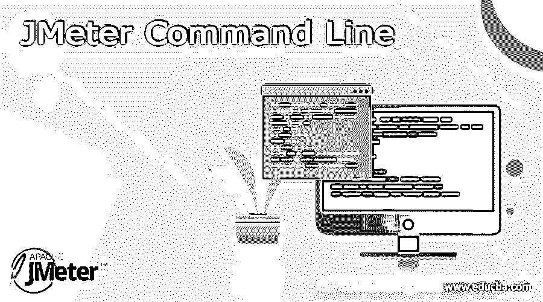
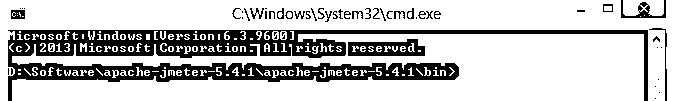
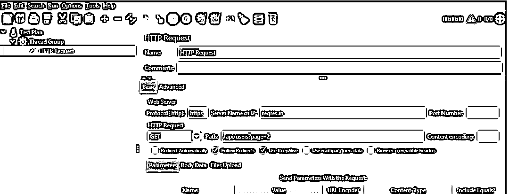
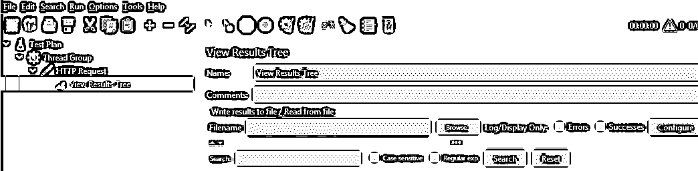
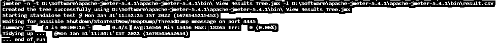
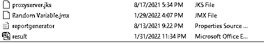
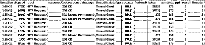

# JMeter 命令行

> 原文：<https://www.educba.com/jmeter-command-line/>




## JMeter 命令行介绍

JMeter 是一个开源工具，用于对应用程序执行负载和性能测试。有两种方法可以使用 JMeter:图形用户界面和命令行模式。当我们使用命令行模式时，JMeter 提供了不同的功能，比如我们可以生成 CSV 或者说 XML 文件由测试执行的输出组成。换句话说，我们可以说它存储了 HTML 报告的结果。默认情况下，JMeter 通常在执行之后提供负载测试的摘要，我们也可以根据我们的需求看到测试执行的实时输出。

### 什么是 JMeter 命令行？

Apache JMeter 是一个开源测试应用程序。JMeter 检查和评估各种不同管理的 web 应用程序表示的能力。此外，JMeter 的 GUI 方法非常适合添加和更改新的编配组件、弦乐合集和采样器，这允许您看到各种听众成员帮助进行故障诊断。

<small>网页开发、编程语言、软件测试&其他</small>

尽管如此，GUI 模式有一个限制，即在运行录制的内容时回拨 CPU。假设我们在内容中运行不同的受众成员，这会影响 JMeter 的执行。内容应该在非 GUI 模式下运行，以克服这种情况。在非 GUI 模式下，每秒从 JMeter 中驱动更多的需求是有优势的。

命令行界面(CLI)将订单作为文本行处理给 PC 程序。处理连接点的程序是订单行翻译器或订单行处理器。

工作框架在外壳中执行一个订单行接口，以便智能地进入工作框架能力或管理。

我们将在非 GUI 模式下执行 JMeter 测试。然而，在此之前，我们想要理解为什么我们想要在非 GUI 模式下执行测试。

通常，当我们在非 GUI 模式下执行请求时，它会向服务器发送一些请求并得到响应，同样，它需要一些投资来生成报告并向客户端查看结果。因此，它将与某种或另一种级别的 UI 进行交互。

所以当我们发送请求并通过 UI 帮助一个反应时，我们不能得到实际的结果。因此，我们运行 JMeter 测试，以便暂时避免这种情况。

现在让我们看看为什么我们需要使用命令行模式。

*   扩展字符串(在特定限制之后),这是 JMeter 在 GUI 模式下崩溃的原因。
*   对于严重的测试情况(例如:购物应用程序:登录-查看放在 truck view 选项卡上的项目消除项目注意账单)，JMeter 消耗内存和 CPU，这可能会影响您的实验结果。
*   例如，建立 JMeter 能力，以获得每秒更多的需求。

### 如何运行 JMeter 命令行？

现在让我们看看如何在命令行模式下运行 JMeter。

首先，我们需要打开命令行提示窗口，如下图所示。




第二步，我们需要进入 JMeter 的 bin 文件夹。之后，我们需要输入命令，

```
JMeter -n –t test.jmx -l testresults.jtl
```

我们需要如下设置上述命令中的不同参数。

*   **n** 用于指定 JMeter 运行测试进入非 GUI 模式，即命令行模式。
*   **t** 用于指定包含测试计划的 JMX 文件的名称，这取决于用户。
*   **l** 用于指定 JMeter 文本日志文件的名称，由日志结果组成。
*   **j** 它用于指定 JMeter 日志文件的名称。

执行上述命令后，我们在指定位置看到 CSV 格式的生成结果；在这里，我们可以根据需要添加任何监听器，但是我们需要将 JMeter 打开到 GUI 模式中。

### JMeter 命令行配置

现在让我们看看如何配置 JMeter 的命令行模式，如下所示。

在上面一点中，我们已经讨论了如何运行 JMeter 命令行模式，但是如果我们想运行 JMeter 进行分布式测试，我们需要在我们的本地机器上做一些设置。

1.  首先，我们需要确保我们安装了 JMeter 的更新版本。
2.  之后，我们需要对 IP 和 slaves 的 JMeter 属性文件进行一些修改；在此步骤中，我们还确保主服务器和从服务器位于相同的子网上。
3.  现在我们需要在每个从服务器上执行 JMeter 服务器，因此，我们需要从 bin 文件夹中执行 JMeter 的 bat 文件。
4.  报告生成和铰孔都是一样的。

### JMeter 命令行示例

现在，为了更好地理解，让我们看下面的例子。

首先，我们需要将测试计划添加到 JMeter 中，如下图所示。




我们需要添加监听器来查看输出，如下面的屏幕截图所示。




现在保存测试计划，最小化当前窗口并执行下面提到的命令。

```
JMeter -n -t D:\Software\apache-JMeter-5.4.1\apache-JMeter-5.4.1\bin\ View Results Tree.jmx -l D:\Software\apache-JMeter-5.4.1\apache-JMeter-5.4.1\bin\result.csv
```

**解释**

在上面的命令中，我们指定了所有的参数，比如测试计划的名称，测试计划的位置，我们需要在哪里存储测试计划的结果，等等。然后，我们可以根据我们的需求对上面的命令进行修改。我们通过下面的屏幕截图展示了上述命令的最终输出。




执行上述命令后，生成的 CSV 文件如下所示。




现在我们需要打开那个文件来查看测试计划的输出，如下面的屏幕截图所示。




### 结论

我们希望通过这篇文章，您能够了解更多关于 JMeter 命令行的知识。从上面的文章中，我们已经了解了 JMeter 命令行的基本思想，并看到了 JMeter 命令行的表示和示例。此外，本文还教我们如何以及何时使用 JMeter 命令行。

### 推荐文章

这是一个 JMeter 命令行指南。这里我们讨论 JMeter 命令行的定义，以及如何运行和配置 JMeter 命令行，并给出例子。您也可以阅读以下文章，了解更多信息——

1.  [Python 命令行参数](https://www.educba.com/python-command-line-arguments/)
2.  [JMeter 版本](https://www.educba.com/jmeter-version/)
3.  [Postgres 命令行](https://www.educba.com/postgres-command-line/)
4.  [JMeter 备选方案](https://www.educba.com/jmeter-alternatives/)