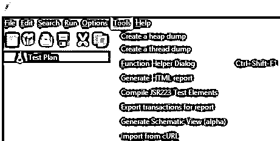
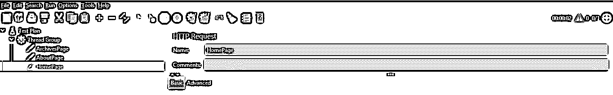
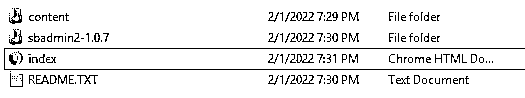
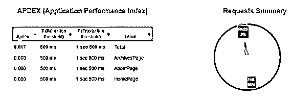
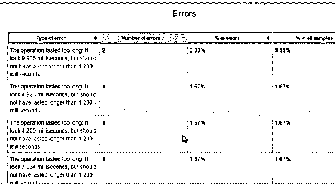
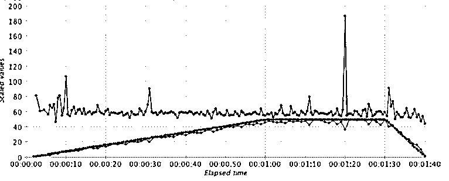

# JMeter 报告

> 原文：<https://www.educba.com/jmeter-report/>

## JMeter 报告介绍

JMeter 用于对应用程序执行负载和性能测试。在 JMeter 中，我们需要根据我们的需求添加不同的测试用例，但是在测试执行之后，我们需要看到测试用例的结果。所以 JMeter 在这里为用户提供了报告生成功能；我们可以根据需要生成报告。换句话说，我们可以说 JMeter 报告提供了响应时间和间隔时间方面的执行摘要。JMeter 报告的主要优点是，我们可以根据自己的需求从 CSV 文件生成 HTML 文件。

### JMeter 报告概述

JMeter 是一个开源的执行测试设备，然而在这个时代，它却要为拥有其优越元素的授权设备付费。旧 JMeter 再现的一个基本缺点是详细描述实验结果检查。可接触到的观众不多，这需要一些投资，以便在调查结束后完成适当的检查；执行分析器需要制作一份手动测试报告，这是一项单调乏味的任务。

<small>网页开发、编程语言、软件测试&其他</small>

从 JMeter 3.0 开始，您可以在 JMeter 中观察到另一个具有启发性的元素，称为仪表板报告。这个 HTML 报告有一个概要仪表板，包括所有重要的图表。JMeter 仪表板报告解决了 JMeter 中暴露的问题。

### JMeter 报告配置

现在让我们看看如何配置 JMeter 配置，如下所示。

首先，我们必须确保安装是 JMeter 的一部分，先决条件等。

当我们试图为 JMeter 中的一个测试制定测试计划时，最好按照我们的要求维护采样器组，在采样器组内部，我们有一个事务控制器。在 JMeter 中，默认情况下，我们有与事务控制器相关的名称策略，我们可以根据需要为每个事务控制器应用名称。名称策略在 JMeter 中非常重要，因为没有名称策略；我们将面临理解 HTML 报告和仪表板的挑战。

我们还需要考虑如下几点进行配置。

*   正如规定的那样，取消对众多事务控制器的底层选择的检查是强制性的。
*   生成父取样器
*   记住时钟的术语和创建的测试的前后处理器
*   理所当然，他们是不受检查的。
*   正如规定的那样，必须为单个事务控制器内的每次采样器收集服务系统执行“应用命名策略”活动。这应该可以通过“右键单击”每个事务控制器来实现。
*   不断地，确保重新启动 JMeter。属性，。蝙蝠或者。lib 文档或在 JMeter 信封中添加另一个模块。
*   在 GUI 或非 GUI 模式下运行测试之前，削弱不需要的内容组件，如调查采样器、观众成员等。
*   在给出文件方式或目录方式时，使用“斜标点线”(例如，“/”)。然后，JMeter 将前向片(例如，" \ ")视为转义字符。

### 如何使用 JMeter 报告？

现在让我们看看如何使用 JMeter 报告，如下所示。

1.  首先，我们需要进入工具菜单；在工具菜单中，我们生成了一个 HTML 报告选项，如下面的屏幕截图所示。

2.  接下来，我们需要提供结果和输出路径，并单击 generate report 按钮。
3.  现在，成功创建的 HTML 报告仪表板将出现。

### JMeter 报告示例

现在，为了更好地理解，让我们看下面的例子。

首先，我们需要创建测试计划；在测试计划中，添加线程组。之后，我们需要添加采样器和监听器来查看结果，如下图所示。

现在，我们需要使用如下命令创建 CSV。

JMeter-n-t " D:\ Software \ Apache-JMeter-5 . 4 . 1 \ Apache-JMeter-5 . 4 . 1 \ b

在\查看结果树 new . JMX "-l " D:\ output \ result . CSV "-e-o " D:\ output \ reports "

**解释**

在上面的命令中，我们使用了不同的参数，如 JMX 文件的路径、带位置的 CSV 文件名和目标位置，如上面的屏幕截图所示。执行上述命令后，将创建一个 reports 文件夹，在该文件夹中，我们有一个 index.html 名称的 HTML 报告，如下面的屏幕截图所示。

使用 Google Chrome 打开输出文件夹中的“index.html”记录(因为 Google Chrome 是最好的),浏览报告左半部分的各种图表。最后，您将获得正确排列的所有测试细节和图表，如下面的屏幕截图所示。

在这里，我们也可以有一个仪表板，如下图所示。

我们还可以看到测试计划中的错误，如下图所示。

### JMeter 报告图形配置

现在让我们看看如何在 JMeter 中配置图形。

它是一个复合图形插件，用于根据我们的需求扩展监听器的功能。因此，我们可以在单个图表中查看结果。通常，图形监听器包含三个不同的选项卡，如图表、图形和设置，如下面的屏幕截图所示。

图表选项卡包含三个区域。首先，当前资源显示了可以添加到图形中的所有行。合成图显示了已经选择的行。最后，箭头按钮用于选择和取消选择行。在这里，我们可以根据我们的需求添加不同的线程组和测试计划，同时我们也根据需求提供线程和断言。

### 结论

我们希望从这篇文章中你能更多地了解 JMeter 报告。从上面的文章中，我们已经理解了 JMeter 报告的基本思想，并看到了 JMeter 报告的表示和示例。此外，我们从本文中了解了如何以及何时使用 JMeter 报告。

### 推荐文章

这是一个 JMeter 报告指南。这里我们讨论 JMeter 报告的基本思想，我们也看到 JMeter 报告的表示和示例。您也可以阅读以下文章，了解更多信息——

1.  [JMeter 版本](https://www.educba.com/jmeter-version/)
2.  [JMeter 面试问题](https://www.educba.com/jmeter-interview-questions/)
3.  [什么是哑剧？](https://www.educba.com/what-is-mime/)
4.  [压力测试类型](https://www.educba.com/stress-testing-types/)