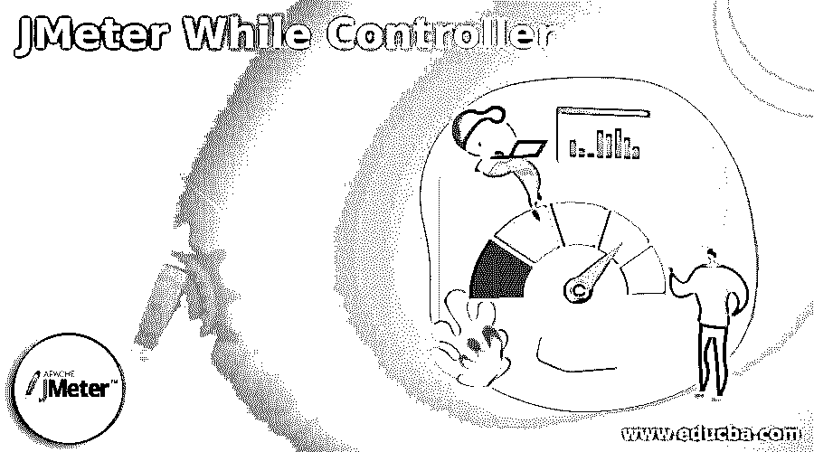
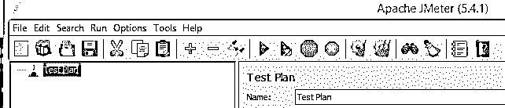
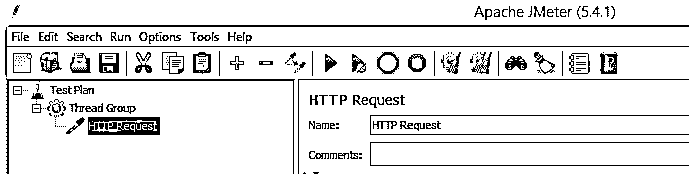
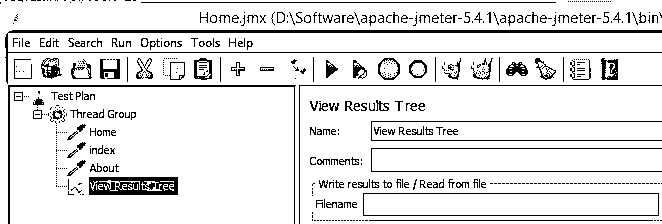
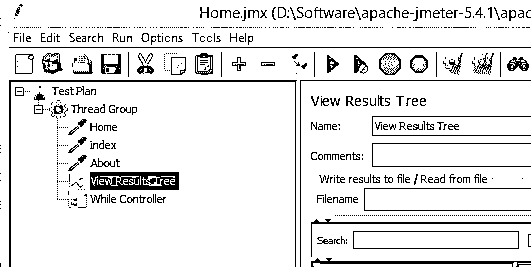
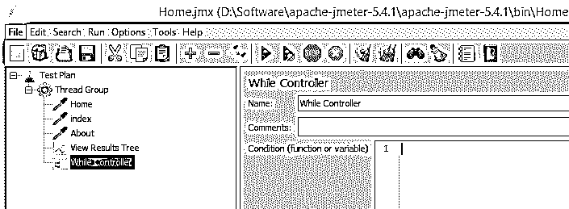
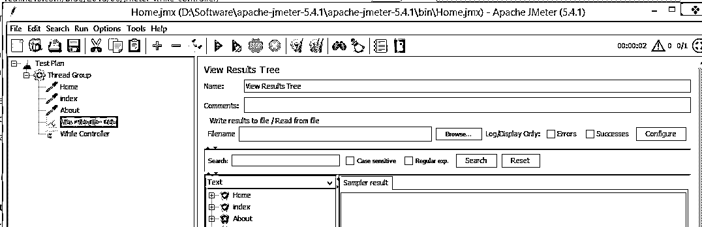
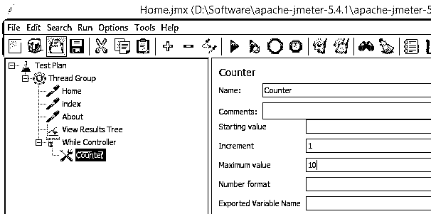
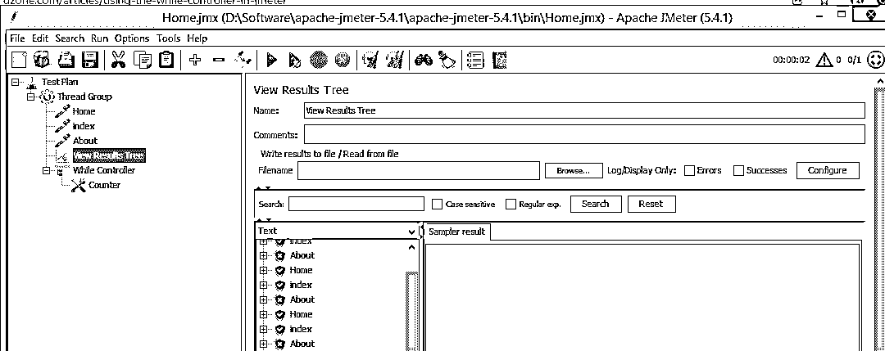

# JMeter While 控制器

> 原文：<https://www.educba.com/jmeter-while-controller/>

## JMeter While 控制器简介

JMeter 为用户提供了不同的控制器，以便根据我们的要求执行负载和性能测试。整体是 JMeter 提供的控制器之一。当控制器用于运行测试计划中的子采样器时，它会继续执行，直到条件字段中的条件为假。例如，假设控制器退出时，条件字段的值为空。通常情况下，while 控制器是一个条件语句，它允许我们实现一些高级场景，这意味着一些条件依赖于其他脚本。

### 什么是 JMeter while 控制器？

关于构建一个接受复杂基本原理的高级 JMeter 负载测试场景，视具体条件而定，有时会改变采样器的执行请求。通常情况下，JMeter 会颠倒运行每一个采样器，但也有一些默认行为不合理的情况。

<small>网页开发、编程语言、软件测试&其他</small>

JMeter 对 while 控制器的执行。对于那些对整个控制器概念没有经验的人来说，说白了，这只是一个重复的“如果->那么”的表达。

如果某些内容是有效的，那么，在这一点上，重新散列最后一个活动

在 JMeter 中，调节器基本上运行儿童采样器，除非某些预先规定的“条件”是“有效的”，其中“条件”可能是:

**清除:**在这种情况下，当最后一个采样器内部人员的悟性下降时，While 控制器将离开

**LAST:** 相当于清除，但在控制器结果之前对最后一个采样器进行额外检查。如果前一个采样器无效，则 While 控制器及其子控制器将不会被执行。

**函数或变量 JMeter:** 控制器的孩子将运行，直到变量或容量评估结果“有效”

**JMeter 的属性:**等价于函数或变量，但期望属性一切相等

函数/变量和属性方法都期望在控制器内部或外部的某个地方将“条件”设置为“假”。考虑到属性，这很可能是从另一个线程组甚至外部 JMeter 完成的。

带有“clear”和“LAST”的前两种情况很简单。假设您将“条件”置空或将其设置为 LAST，如果 While 控制器下的最后一个采样器没有收获，控制器将会中断。类似的情况也适用于变量和属性。While 控制器将控制它的孩子，直到“条件”中确定的变量或属性带来“有效性”。

### 如何使用 JMeter while 控制器？

现在让我们看看如何在 JMeter 中使用 while 控制器。

我们知道当控制器运行孩子直到条件为假。

首先，我们需要考虑如下一些可能的情况。

**空白:**空白表示当最后一个样本失败时退出循环。

**Last:** 表示当最后一个样本失败时退出循环。

**条件**

条件意味着变量或函数，而控制器要求真或假，这意味着，按照我们的要求，我们可以设置条件。

首先，根据我们的要求创建测试计划；在这里，我们创建了测试计划，如下图所示。

现在添加线程组和采样器；这里，我们添加了 HTTP 请求示例，如下图所示。

这里我们添加了一个带有视图结果树的虚拟 API，如下面的屏幕截图所示。

如下面的条件所示，我们必须添加条件来实现 while 控制器。

首先，虽然控制器，我们可以检查空白如下截图所示。

在执行测试计划之后，我们可以在查看结果树中查看输出，如下面的屏幕截图所示。

现在按照我们的要求设置相同的条件；这里，我们如下设置计数器值。

$ { _ _ javaScript(parse int(vars . get(" counter "))< = 50)}

执行后，我们可以在下面的截图中设置结果。

在这里，我们可以从 CSV 文件中访问伪 URL，该文件可以通过变量来访问。

### 控制器运行时的 JMeter

现在让我们来看看控制器是如何工作的。

我们知道 JMeter 提供了不同类型的内置功能供用户实现，而 controller 如下。

1.  **信息**

在信息类型下，JMeter 提供了如下不同的功能。

*   **thradNum:** 如果我们想得到线程号，那么我们可以使用这个号。
*   **samplerName:** 用于获取一个采样器的名称。
*   **Time:** 按照我们要求的格式返回系统的当前日期。

以及信息类型提供了 log、logn、machinelp 和 machineName 函数。

2.  **输入**

在输入类型下，JMeter 提供如下不同的功能。

*   **StringFromFile:** 用于从文件中读取文本。
*   **FileToString:** 如果我们需要读取整个文件，我们可以使用这个函数。
*   **XPath:** 用于从文件中读取 XPath 表达式。
*   **CSV read:**用于读取 CSV 文件。

3.  **计算**

在计算下，JMeter 提供了如下不同类型的函数。

*   **计数器:**如果我们想增加当时的数字，可以使用这个功能。
*   **intSum:** 用于将整数加到数字上。
*   **longSum:** 用于将长整数相加。
*   **Random:** 通过使用这个函数，我们可以生成一个随机数。
*   **RandomSring:** 通过使用这个函数，我们可以生成随机字符串。

4.  **脚本**

在脚本下，JMeter 提供了如下不同类型的函数。

*   **BeanShell:** 用于运行 BeanShell 脚本。
*   通过使用这个函数，我们可以处理 JavaScript。

这是一些样本类型，它们的函数和 JMeter 还提供了一些附加函数如属性、变量、字符串等。

### 控制器情况下的 JMeter

现在让我们看看 while 控制器的不同情况，如下所示。

*   **While with counter:** 我们可以使用 While 控制器与计数器结合使用。
*   **Beanshell 的采样器:**这里可以声明计数器值 1。
*   **While 控制器:**我们可以使用 While 控制器来检查计数器值。
*   **处理器:**用于递增计数器值。

### 结论

我们希望从这篇文章中你能学到更多关于 JMeter while 控制器的知识。从上面的文章中，我们已经了解了 JMeter while 控制器的基本思想，我们也看到了 JMeter while 控制器的表示和示例。此外，本文还教我们如何以及何时使用 JMeter while 控制器。

### 推荐文章

这是一个 JMeter While 控制器的指南。这里我们讨论 JMeter while 控制器的基本思想，我们也看到了它的表示。您也可以阅读以下文章，了解更多信息——

1.  [JMeter 中的定时器](https://www.educba.com/timers-in-jmeter/)
2.  [什么是 JMeter？](https://www.educba.com/what-is-jmeter/)
3.  [JMeter 面试问题](https://www.educba.com/jmeter-interview-questions/)
4.  [手动测试工具](https://www.educba.com/manual-testing-tools/)