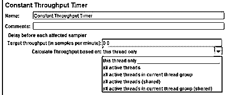
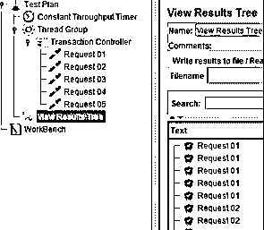
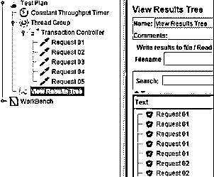
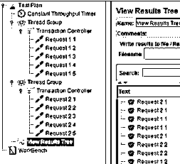
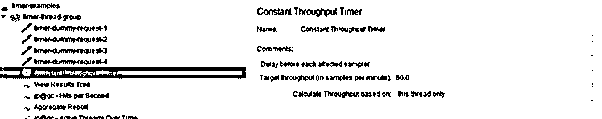

# 恒定吞吐量计时器

> 原文：<https://www.educba.com/jmeter-constant-throughput-timer/>

## JMeter 恒定吞吐量定时器简介

JMeter 中的一个恒定吞吐量计时器用于通过计算请求总数来获得实际输出。计时器试图产生一个恒定的吞吐量，直到测试结束，以达到目标。因此，如果服务器无法管理负载，就会导致最小吞吐量。如果其他计时器拒绝恒定吞吐量计时器，则它可能会减少。因此不建议将其他计时器与恒定吞吐量计时器一起使用。本文简要讨论了恒定吞吐量定时器的使用、配置和示例。

### 什么是 JMeter 恒定通量计时器？

如果用户想要执行一个目标类型的案例，其目标不是刺激许多并发用户，但是每秒的请求数在定义的时间内，那么使用恒定的吞吐量时间。它像分钟级别一样精确地工作，并确保测试持续时间不会太长，比如超过一分钟，并且用户暗示了一个合理的加速时间以避免峰值。

<small>网页开发、编程语言、软件测试&其他</small>

其他计时器会影响恒定吞吐量计时器的目标，不建议将其与其他计时器一起使用。为了在测试结束时获得正确的采样器计数，用户应该忽略累积报告中的事务计数，以确保恒定吞吐量计时器是否正常工作。实现的目标很高。线程无法顺利中止。在测试持续时间结束时，所有线程都会停止，有时，它们会处于迭代的中间。用户必须固定线程数量以准备实时场景。峰值测试场景和升压情况没有准备恒定吞吐量计时器。

### 如何使用 JMeter 恒定通量计时器？

选择用户希望包含计时器的合适元素。它可以是测试计划、线程组、控制器或采样器。右键单击配置元素并选择添加。从窗格中选择计时器，并选择恒定吞吐量计时器。

必须在恒定吞吐量计时器中配置强制输入字段，如名称、目标吞吐量、计算吞吐量、注释、活动线程和共享活动线程。

*   在名称字段中提供适当的计时器名称。
*   在评论部分提供相关的描述性注释。
*   目标通量以每分钟样本数计算。应该提到一分钟内需要产生的请求的数量。例如，如果用户希望在一个小时内完成 5000 个请求，那么目标吞吐量值应该在 5000/60 = 83 左右。这里的目标吞吐量值是 83。

根据需求计算吞吐量。“仅此线程”选项使每个线程都能管理其目标吞吐量，而不考虑任何组。总吞吐量与活动线程数成正比。例如，如果十个用户有十个采样器，目标吞吐量值设置为五秒，那么每个线程每分钟将分别发送五个请求。所以一分钟后触发的请求是 10 * 5 = 50，每分钟每个线程会发送 5 个请求。

当前线程组中的所有活动线程在该组中存在的所有活动线程之间被委托。因此，每个线程都可以基于上次执行进行配置。所以所有线程都以系统的方式工作。还有一个选择；所有活动线程在线程组中的所有线程之间隔离目标吞吐量。因此，每个线程都将按照要求被延迟，并基于所有最后的执行工作。在这种情况下，所有线程组都需要一个具有类似设置的恒定吞吐量计时器。

共享线程组具有当前线程组中的所有活动线程。因此，如果用户选择这个选项，目标吞吐量将在相关组中的所有活动线程之间进行隔离。尽管如此，每个线程的执行都基于组的最后一次执行而被延迟。例如，假设五个用户有五个采样器，目标吞吐量值设置为 7 秒。现在，一分钟内总共将发送七个请求。所以一分钟后，触发的请求将是 7。

共享活动线程是一个选项，它在所有线程组中的所有活动线程之间隔离目标吞吐量。每个线程的执行都基于上一次执行的延迟。例如，假设有两个线程组有五个用户，第一个线程组有两个用户，第二个线程组有三个用户，五个采样器。这里将八个设置为目标吞吐量值，现在每分钟发送八个请求。所以，一分钟后，触发的请求将是 8。

### 恒定吞吐量定时器示例

如上所述，JMeter 中的计时器对于维护性能测试非常重要。然而，其他的计时器也可以作为插件在测试计划中实现，并检查计划的性能。JMeter 中流行的定时器有常量定时器、均匀随机定时器、高斯随机定时器、精确吞吐量定时器、同步定时器、Beanshell 定时器和 JSR223 定时器。

高斯随机时间易于使用，有助于查看统计分析，也称为钟形曲线。随机毒药计时器与高斯随机计时器相同，但它工作速度快，没有延迟。Lambda 用于计算随机值，以防止性能测试中的延迟。JSR223 时间是灵活的，允许用户编写脚本并修复延迟。所以根据测试可能复杂也可能简单。

### 结论

虽然计时器是一个恒定吞吐量计时器，但是该值不需要恒定，并且可以在测试时改变。可以通过计数器变量、Beanshell 函数、JavaScript 和远程 BeanShell 将它设置为首选设置，以更改 JMeter 的属性。

### 推荐文章

这是一个 JMeter 恒定吞吐量定时器的指南。这里我们讨论使用，配置，并对恒定吞吐量定时器的例子进行简要讨论。您也可以阅读以下文章，了解更多信息——

1.  [JMeter 版本](https://www.educba.com/jmeter-version/)
2.  [JMeter 备选方案](https://www.educba.com/jmeter-alternatives/)
3.  [安装 JMeter](https://www.educba.com/install-jmeter/)
4.  [JMeter 面试问题](https://www.educba.com/jmeter-interview-questions/)