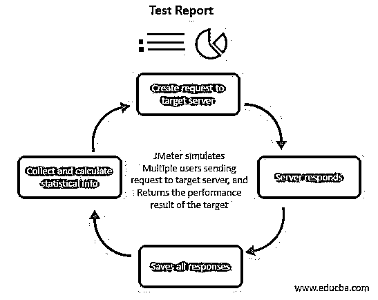

# JMeter 工具

> 原文：<https://www.educba.com/jmeter-tool/>

## JMeter 工具简介

性能测试在应用程序和软件开发生命周期中非常重要。例如，如果许多用户使用网站、API 或应用程序，他们应该计划如何管理长期的峰值流量。市场上有许多工具可以用来执行负载测试。流行的工具是 Apache JMeter，它对软件和 web 服务(如 REST 和 SOAP)执行负载测试。本文可以简要分析 JMeter、它的工作、配置和其他特性。

### JMeter 工具

*   JMeter 是一个流行的工具，它是开源的，基于 Java。它是一个性能测试工具，可以再次对不同的软件和 web 服务、API、web 应用程序、SOAP、REST 和其他 web 服务执行面向协议的负载测试。与其他负载测试和性能解决方案工具相比，JMeter 是在早期引入的，但由于其可靠的特性，它仍然是一个强大的工具。
*   简而言之，JMeter 通过将访问者模仿到服务或应用程序来运行，使用户能够创建 HTTP 请求并将其传输到服务器。然后，通过在表格、图表和报告中收集服务器响应数据来显示统计数据。从生成的报告中，用户可以分析应用程序的行为，执行瓶颈，并调整网站以增强其功效或性能；有时，应用程序的改进是通过提供一些富有成效的见解来实现的。
*   强制看起来 JMeter 不是 web 浏览器；它在协议层工作，不能支持用户执行的所有更改，比如渲染 JavaScript。除此之外，JMeter 通过提供 cookie 管理器、头管理器和缓存管理器等配置元素为这些问题提供了临时解决方案，这些配置元素支持 JMeter 作为实际浏览器的行为和功能。
*   JMeter 是一个基于 Java 的桌面应用程序，所以在开始之前，需要对它进行一些配置来启动性能测试。考虑用户是否安装了最新的 Java 版本，它应该支持使用 JMeter 的最低系统要求。与其他软件作为服务负载测试工具相比，它消耗额外的资源和时间。
*   JMeter 是开发人员在软件开发中最常用的工具，他们的团队可以轻松地执行负载性能测试。由于它在市场上的持久性，有大量的社区支持、大量的文档和使用 JMeter 的最佳实践。此外，它具有成本效益，可以在不需要或只需要极少资源的企业中实施。
*   与早期的浏览器相比，今天的浏览器提供了广泛的功能并支持所有的网络应用。因此，用户需要一种解决方案或工具来在真实的浏览器中执行负载测试，以便从客户端收集所有必要的性能数据。下面给出了 JMeter 的优点，在应用 JMeter 工具进行性能测试时，所有的强制性要求都得到了满足。
*   JMeter 可以免费使用，开发者可以将源代码用于开发、测试和培训目的。
*   JMeter 有一个友好的图形用户界面，初学者觉得很容易使用，不需要额外的时间来理解这个工具。它有一个简单而直接的界面。
*   JMeter 是基于 Java 的平台相关的，可以在多个平台上执行。
*   完整的多线程框架允许 JMeter 通过不同的线程组同时采样不同的函数。因此，即使在多个线程组中，它也增加了并发性。
*   有助于可视化输出结果。可以在表格、树、图表和日志文件中查看测试结果。
*   JMeter 安装容易；用户可以将*bat 文件复制并执行到主机中。
*   JMeter 是高度可扩展的，因为它允许用户编写自己的测试。此外，它支持插件，使有效的可视化，以扩展测试。
*   JMeter 支持多种测试策略，比如功能测试、负载测试和分布式测试。此外，模拟是 JMeter 中的一个重要因素，它允许并发线程，并为测试中的网站构建一个沉重的负载。
*   JMeter 支持多种协议，这些协议支持对 web 应用程序的测试和对数据库服务器的计算性能测试。JMeter 支持所有的基本协议，比如 JDBC、HTTP、JMS、SOAP、LDAP、FTP 和 REST。
*   记录和回放选项是 JMeter 的显著特性之一，用户可以记录浏览器上的活动，并使用 JMeter 在网站上制作它们。此外，JMeter 中的测试和脚本可以与 Selenium 和 Beanshell 集成，用于自动化测试。

### 使用 JMeter 工具

<small>网页开发、编程语言、软件测试&其他</small>

*   JMeter 的工作很简单，只需几个步骤就可以对应用程序执行负载测试。首先，JMeter 让多个用户向目标服务器发送请求，从目标服务器提取性能结果。
*   JMeter 向目标服务器创建多个请求，并等待反馈。
*   一旦服务器响应 JMeter，它就存储并处理所有的响应。
*   然后计算和收集响应，并生成统计信息或报告。
*   然后，生成的报告作为请求再次提供给目标服务器。
*   分析报告可以以图表、图形、表格或树的形式获得。

### 结论

随着软件作为一种基于服务的工具成为主流，技术的快速变化也在持续，JMeter 的使用从未消失。JMeter 为负载测试解决方案提供了最好的工具，它作为一个包与所有基于云的解决方案一起提供所有的支持、好处和特性，并作为每月计划使用。

### 推荐文章

这是 JMeter 工具的指南。在这里，我们讨论负载测试解决方案的最佳工具，并简要分析 JMeter、它的工作、配置和其他特性。您也可以阅读以下文章，了解更多信息——

1.  [JMeter 版本](https://www.educba.com/jmeter-version/)
2.  [JMeter 备选方案](https://www.educba.com/jmeter-alternatives/)
3.  [安装 JMeter](https://www.educba.com/install-jmeter/)
4.  [手动测试工具](https://www.educba.com/manual-testing-tools/)