# 燃烧计

> 原文：<https://www.educba.com/jmeter-blazemeter/>

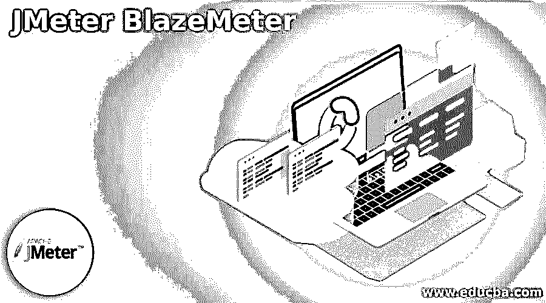

## JMeter 火焰测量仪简介

JMeter 是用于负载和性能测试的开源工具；如果我们想扩展 JMeter，我们有最好的选择:BlazeMeter。BlazeMeter 营销了一个业务、自我管理负载测试阶段作为助手，这对于开源的 Apache JMeter 是可行的，Apache JMeter 是 Apache Software Foundation 的演示测试结构。BlazeMeter 还用于执行负载测试。首先，我们需要在 BlazeMeter 中上传 JMeter 脚本，在这里我们可以调整用户数量，我们需要在哪里执行，还需要设置加速时间，用于计算运行 JMeter 测试需要多少时间。

### 什么是 JMeter BlazeMeter？

那些熟悉 JMeter 的人意识到，它是目前市场上最优秀的开源展示测试设备之一。然而，没有一种仪器是安全的，每个人都有优点和缺点。BlazeMeter 是“云中的 JMeter”。这意味着它 100%适用于 JMeter，并解决了它的通用性、强度和局限性。

<small>网页开发、编程语言、软件测试&其他</small>

BlazeMeter 提供了如下好处。

*   我们有一个需要添加到浏览器的 BlazeMeter Chrome 扩展。
*   从一个区域跟踪和执行 JMeter 脚本的简单方法
*   创造高达 1，000，000(或更多)的能力！)虚拟客户机–没有令人信服的理由强调基础成本和安排
*   不断观察和详述
*   简单地允许记录报告以供检查
*   从不同地理区域进行测试的能力–没有令人信服的理由强调测试和报告同步
*   使用顶级 APM 排列组合(如 AppDynamics、Dynatrace、CA APM、New Relic 和 CloudWatch)进一步扩展测试信息的选择
*   从开始到结束对您的服务器、应用程序(web 和多功能)和最终客户端体验的感知
*   通过使用 BlazeMeter 直接更改 JMeter 属性来调整内容的能力
*   网络复制，用于运行各种数据传输容量和空闲安排，对便携式测试很有价值
*   使用 BlazeMeter，您需要做的就是直接传输 JMeter 脚本，选择您希望运行的负载马达的数量，然后运行测试。BlazeMeter 处理所有其他的事情！您将拥有无限数量的预先安排的负载电机，可随时使用。在堆期间，还会生成逐点图形报告。

### 创建 JMeter 火焰测量仪

现在让我们看看如何用例子创建一个 JMeter BlazeMeter。

在 BlazeMeter 内部运行测试用例有两个选项，下面会提到。

第一种选择是我们可以先在 JMeter 中创建一个测试用例并上传到 BlazeMeter 内部，第二种选择是通过 extension 通过 BlazeMeter 录制屏幕并运行。

现在让我们看看第一个选项的例子如下。

首先，我们需要创建一个测试计划，如下图所示。

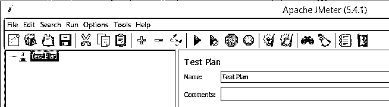

我们需要将线程组添加到测试用例中，如下图所示。

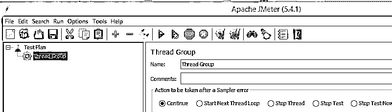

之后，我们将采样器添加到线程组中；这里，我们添加了 HTTP 请求采样器，如下图所示。

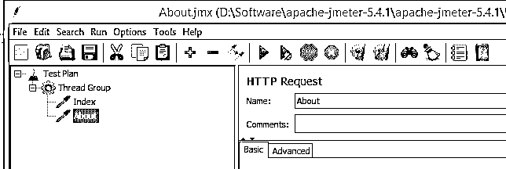

现在将监听器添加到线程组中，以查看测试用例结果，如下图所示。

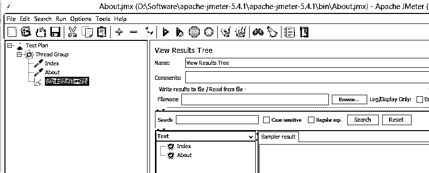

现在我们需要将测试用例上传到 BlazeMeter 中，如下所示。

首先我们需要打开 BlazeMeter 的主页 BlazeMeter，如下图截图所示。

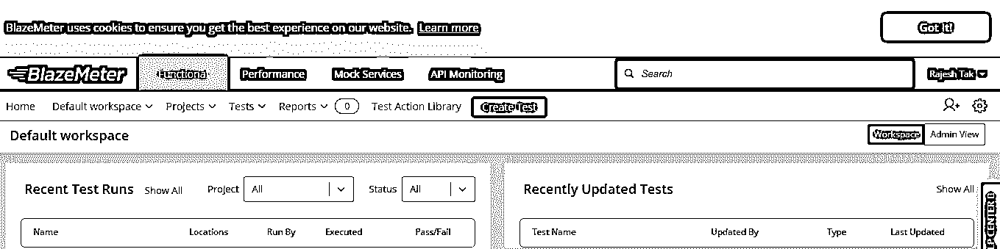

这里，我们需要上传创建的测试用例，因此点击 creates test 按钮；之后，我们得到一个新的屏幕，如下图所示。

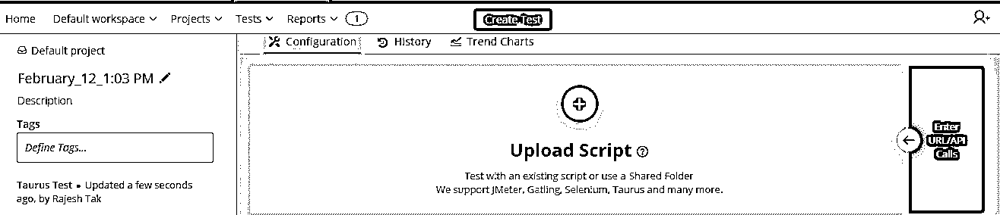

现在上传测试脚本；之后，我们需要运行测试。上面测试用例的最终输出可以在下面的截图中看到。

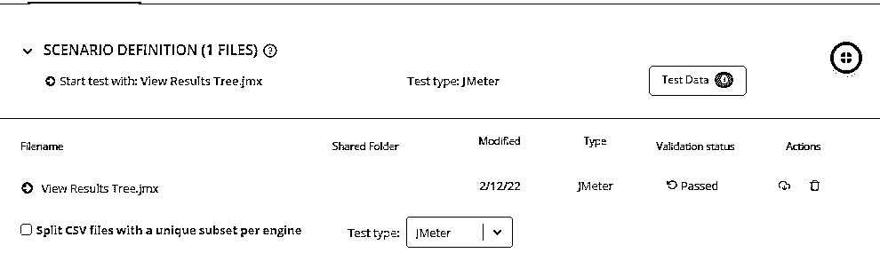

这是在 BlazeMeter 中运行测试用例的第一种方式。

现在我们来看第二个选项如下。

在第二个选项中，首先，我们需要在 chrome 中添加扩展，并记录屏幕，如下图所示。

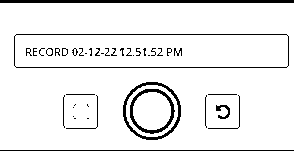

这里我们录下了画面；我们需要通过扩展运行测试用例，如下图所示。

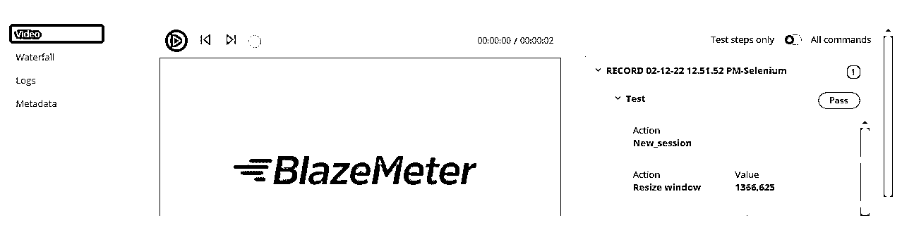

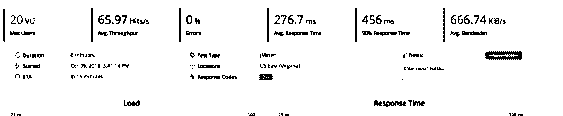

### JMeter 火焰测量仪配置

现在让我们看看如何配置 Blazemter，如下所示。

1.  首先，我们需要在 JMeter 中创建测试脚本。这里我们有两个选项:手动，我们可以在 JMeter 中创建一个脚本，第二个选项是在 chrome 中添加 BlazeMeter 扩展并录制屏幕。
2.  在第二步中，我们必须首先点击 performance 按钮来上传 JMX 并在 BlazeMeter 中测试。我们已经在 performance 按钮中创建了一个测试用例选项，如上面的屏幕截图所示。这里我们有 upload test script 选项来上传我们在 JMeter 中创建的测试用例。在每次测试开始时，记录中的每一个文档都被下载到远程服务器上。第一次测试安排的文档可能随时被刷新或删除。这样做不会影响正在运行的测试。
3.  第三步，我们需要校准测试用例。同样，在负载下运行测试之前，您应该按照《校准 JMeter 测试指南》的指示校准测试。然后，设计您的测试选择，并在满负荷运行 JMeter 性能测试时设置废除。
4.  现在一切都好了，所以运行测试用例。所以点击运行测试按钮；在这里，我们还可以调试测试用例进行验证。

### 结论

我们希望通过这篇文章，你能更多地了解 JMeter 火焰测量仪。从上面的文章中，我们已经了解了 JMeter BlazeMeter 的基本思想，我们还看到了 JMeter BlazeMeter 的表示和示例。此外，本文还告诉我们如何以及何时使用 JMeter BlazeMeter。

### 推荐文章

这是 JMeter BlazeMeter 的指南。在这里，我们讨论 JMeter BlazeMeter 的基本思想，我们也看到了代表和例子。您也可以阅读以下文章，了解更多信息——

1.  [JMeter 中的定时器](https://www.educba.com/timers-in-jmeter/)
2.  [安装 JMeter](https://www.educba.com/install-jmeter/)
3.  [JMeter 版本](https://www.educba.com/jmeter-version/)
4.  [什么是哑剧？](https://www.educba.com/what-is-mime/)