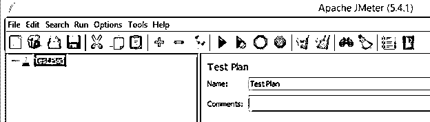
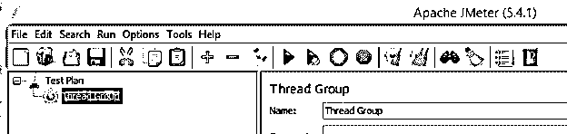
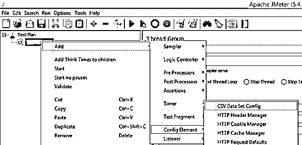
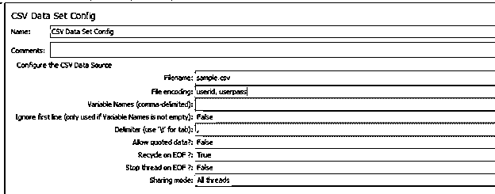
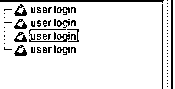

# JMeter 参数

> 原文：<https://www.educba.com/jmeter-parameters/>

## JMeter 参数介绍

JMeter 是一个用于执行负载和性能测试的开源工具，因此 JMeter 为用户提供了不同种类的功能。这些 JMeter 参数是功能之一。参数创建有用的变量来配置额外的负载测试。换句话说，JMeter 中的参数化是用客户机输入数据的不同排列来执行测试计划的循环。因此，在 JMeter 中，我们有一个实现参数的通用方法:一个 CSV 文件，并且我们可以根据我们的需求提高测试脚本的性能。

### JMeter 参数概述

在 Apache JMeter 中，参数化展示脚本的一种常见方法是利用 CSV 记录。CSV 输入记录利用率的最佳示例是登录周期。此外，您希望给出一个客户认证的概要，以便在各种客户中测试您的应用程序。

<small>网页开发、编程语言、软件测试&其他</small>

综上所述，这个策略是针对部分客户的活动。当一个测试计划需要为一个以上的客户同时运行/执行时，就要利用定义的思想。

例如，如果我们想用不同的用户名和密码测试登录页面，我们显然不能硬编码质量；随后，我们要定义价值。所以我们想从 CSV 数据集配置等外部信息库中获取用户名和密码值。

### 配置 CSV JMeter 参数

现在让我们看看如何在 JMeter 中配置 CSV 参数。

如果你是一个 QA 工程师，你很难在 Apache JMeter 上处理业务。利用开源编程进行负载和执行测试，剖析动态 web 应用程序的一般表示。

在这篇博客中，我可能想要检查 JMeter 的一个亮点，它允许您利用 CSV 文档进行定义，假设您需要同时为多个客户端执行一个测试计划；您可以利用 CSV 信息收集配置来实现这一点。

CSV 数据集配置用于细读 CSV 文件中的所有值，将它们存储在 factors 中，并在执行期间将它们用作测试数据。

**文件名:**如果您的文档(。csv)位于/canister，那么您可以使用文件名(.csv)，如果在其他地方，使用完整的记录方式。

**变量名**:这将包含与类似请求的 CSV 文档中的“部分名”相同的所有因素名(逗号分隔)。如果该字段保留为空，JMeter 将从 CSV 文档中获取第一列。

**分隔符:**用于隔离 CSV 文件中的每条记录。逗号是默认分隔符；但是，如果您的记录使用了选项卡，我们想在这里描述一下。

**引用数据:**值可以放在“(双重声明)下，这允许值在任何授权的时候包含一个分隔符。

**EOF 上重用？:**如果您打算至少重复一两次 CSV 文档，您应该将它设置为有效，因为它会指导 JMeter 返回到 CSV 记录的最高点。

**在 EOF 上停止线程？**在仔细阅读整个 CSV 文档后，将其设置为有效停止。

**分享模式:**

**所有字符串:**文件被分割在每一个字符串中。

**当前字符串组:**对于组件出现的每个字符串串，每个文档打开一次。

**当前字符串:**为每个字符串单独打开每个文档。

我们需要添加不同的元素、采样器和监听器来查看我们要求的结果。

线程组

采样器-HTTP 请求

CSV 数据集配置

大纲报告

### JMeter 参数示例

现在让我们看看下面的例子，以便更好地理解。

当我们打开 JMeter 时，home 如下面的截图所示。

现在在这里，首先，我们需要添加线程组，如下图所示。

在下一步中，右键单击线程组，选择添加，然后选择配置元素，并单击 CSV 数据集配置，如下图所示。

我们需要打开 JMeter 中的 bin 文件夹，创建文本文件，根据需求输入值，并将其保存为. csv 扩展名。

现在配置 CSV 数据集，如下图所示。

现在我们需要添加采样器；这里使用了一个 HTTP 请求，我们传递参数，如下图所示。

现在添加一个监听器，运行测试用例并执行；我们可以在下面的截图中看到结果。

为了验证，我们可以在“响应”选项卡中进行检查。

### JMeter 参数文件

现在我们来看看 JMeter 中的一个参数文件是什么如下。

JMeter 是一个开源负载测试工具，它有一个组件允许您在 CSV 设计中利用外部信息集合。这个组件被称为“CSV 数据集配置”CSV 数据集配置用于细读记录中的行，并将它们分成因子。例如，测试计划包含一个线程组。如果我们想要处理一些重复的场景，或者我们可以说，如果我们想要处理大量的数据，这种外部方式可以在 JMeter 中实现参数化。

### JMeter 参数数据库

现在我们来看看 JMeter 中有哪些数据库参数如下。

描述信息库关键特性的数据集边界。在创建另一个数据集时，您可以利用数据集边界值的框架默认值，从备用数据集复制信息库边界文档，或者更有可能的是，从总信息增强中导入数据集边界记录。

### 结论

我们希望通过这篇文章，您可以了解更多关于 JMeter 参数的知识。从上面的文章中，我们已经了解了 JMeter 参数的基本思想，并看到了 JMeter 参数的表示和示例。此外，本文还告诉我们如何以及何时使用 JMeter 参数。

### 推荐文章

这是 JMeter 参数指南。这里我们讨论 JMeter 参数的基本思想，我们也看到了表示和例子。您也可以阅读以下文章，了解更多信息——

1.  [JMeter 版本](https://www.educba.com/jmeter-version/)
2.  [什么是 JMeter？](https://www.educba.com/what-is-jmeter/)
3.  [JMeter 备选方案](https://www.educba.com/jmeter-alternatives/)
4.  [压力测试类型](https://www.educba.com/stress-testing-types/)