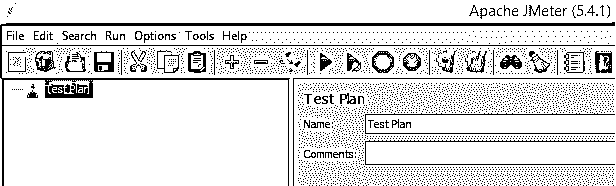
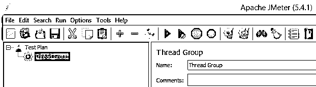
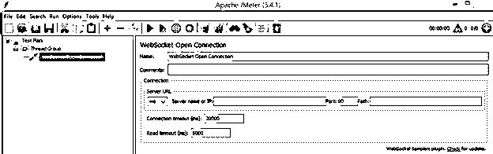
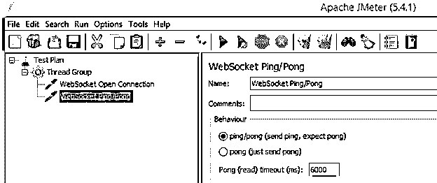
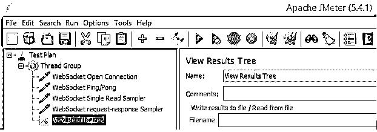
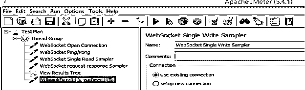
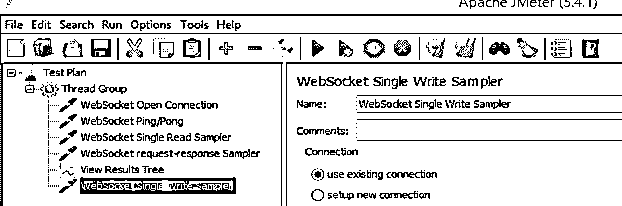
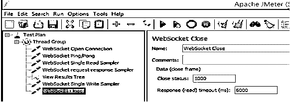
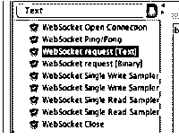

# JMeter WebSocket

> 原文：<https://www.educba.com/jmeter-websocket/>

## JMeter WebSocket 的定义

JMeter 是一个执行负载和性能测试的开源工具。基本上，JMeter 向用户提供不同的功能，其中 WebSocket 是 JMeter 提供的功能之一。通常，WebSocket 是用于在服务器和浏览器之间通过单一 TCP 连接提供双向通信通道的协议之一。这是最流行的协议之一，因为所有现代浏览器都支持它。但更重要的是，JMeter 不是由 WebSocket 支持，而是借助一些附加插件，如 JMeter WebSocket sampler，这样我们就可以进行通信。

### WebSocket 的定义？

WebSocket 是一种约定，它利用默认的 HTTP 和 HTTPS 端口，通过一个单独的 TCP 关联提供全双工双向通信。它被大多数当前的因特网浏览器所支持，并被用来进行谈话、连续游戏和应用程序；等等，约定的主要思想是使用一个关联进行双向通信，而不是 Ajax/iframes/XMLHttpRequests。

<small>网页开发、编程语言、软件测试&其他</small>

WebSocket 通信由“概要”组成——信息片段，可以从一方或另一方发送，可以有几种:“消息概要”——包含聚会相互发送的消息信息。“平行信息概要”——包含两方面的信息，这些信息是从一个集合传递给另一个集合的。

在当前 web 应用程序的激增中，一个更典型的用户涌入是利用 WebSocket 的响应性正在进行的应用程序。WebSocket 是一种约定，它利用默认的 HTTP 和 HTTPS 端口，通过一个单独的 TCP 关联提供全双工双向通信。与不同的约定不同，一个关联用于 WebSocket 约定的双向通信。这使得它成为创建程序对话应用程序、游戏应用程序、持续程序检查设备等的不错的竞争者。它在当前的大多数网站上都得到了支持。WebSocket 约定是一个免费的基于 TCP 的约定。与 HTTP 的关系是，它的握手被 HTTP 服务器解码为升级请求。当然，WebSocket 约定包括用于普通 WebSocket 关联的端口 80 和用于通过 TLS 挖掘的 WebSocket 关联的端口 443

### JMeter websocket 的安装

现在让我们看看如何在 JMeter 中安装 WebSocket，如下所示。

1.首先我们需要下载最新的插件 JAR。

2.复制下载的 jar 文件并粘贴到 JMeter 的 lib/ext 文件夹中。

3.现在重启 JMeter。

之后，我们需要如下操作 JMeter 中的一些元素。

*   Config 元素:这里我们需要设置二进制帧过滤器、文本帧过滤器和乒乓帧过滤器。
*   采样器:这里我们需要做开放连接，这意味着我们可以根据我们的要求添加不同的采样器。
*   断言:我们也能够向线程组提供断言，但是这里我们有二进制响应断言，并在视图树监听器中显示结果。

### 配置元素 JMeter WebSocket

现在让我们看看如何在 JMeter 中配置 WebSocket 的元素，如下所示。

首先，我们需要在 JMeter 中添加测试计划，如下图所示。

第二步，我们需要在测试计划中添加线程组，如下图所示。

现在将 WebSocket 开放连接采样器添加到线程组中，如下图截图所示。

在上面的截图中，我们可以看到 WebSocket 开放连接采样器，这里我们有不同的文件，根据我们的要求，我们可以填写。

我们还需要考虑如下一些额外的采样器。

*   WebSocket 开放连接:关联中断边界决定了 JMeter 在被中断破坏之前会为关联挂起多长时间。读取中断边界表示 JMeter 在中断前等待服务器响应的时间。用于打开 WebSocket 的连接，如上图截图所示。
*   WebSocket Ping/Pong: Pong break 意味着如果 JMeter 在 6 秒钟内没有收到 Pong 消息，采样器就会出现问题。该采样器将利用当前的关联。它用于发送 ping 并确认 pong，如下图所示。

**WebSocket 请求-响应采样器:**设置伴随字段:

关联:利用现有的关联

信息类型:二进制

需求信息:0x 62 0x6c 0x 61 0x7a 0x 65 0x6d 0x 65 0x 74 0x 65 0x 72

反应(读取)中断(毫秒):6000

需求信息确认十六进制配置中的双大小写，例如 0x6d 或 6d。我们目前的恳求的价值暗示了十六进制组织中的火焰测量器。我们同样可以将 JMeter 因子包含在这个领域中。
如下图截图所示。

**WebSocket 单写采样器:**填写附带品质:

关联:利用现有的关联

信息类型:文本

需求信息:火焰测量仪-文本

与 WebSocket 需求反应采样器相同；我们可以利用当前的关联或创建另一个关联。信息应该在文本设计中。它仅用于发送 WebSocket 的二进制或文本帧，如下图所示。

**WebSocket 单读采样器:**填写附带品质:

关联:利用现有的关联

信息类型:二进制

需求信息:0x62

请求信息包括十六进制组织，意思是 BlazeMeter-text。它仅用于接收 WebSocket 的二进制或文本帧，如下图所示。

**WebSocket Close:** 填写附带品质:

关闭状态:二进制

反应(读取)中断:6000

这个采样器将关闭当前的 WebSocket 关联，并给出解释“1000:采样器提到关闭”。

它用于关闭 WebSocket 连接，如下图所示

现在保存测试计划并运行它。在测试计划执行之后，我们可以在下面的屏幕截图中看到结果。

### 结论

我们希望通过这篇文章，您可以了解更多关于 JMeter WebSocket 的信息。从上面的文章中，我们已经理解了 JMeter WebSocket 的基本思想，我们还看到了 JMeter WebSocket 的表示和示例。从本文中，我们了解了如何以及何时使用 JMeter WebSocket。

### 推荐文章

这是一个 JMeter WebSocket 的指南。这里我们讨论定义，如何安装，如何配置和代码实现的例子。您也可以看看以下文章，了解更多信息–

1.  [JMeter 版本](https://www.educba.com/jmeter-version/)
2.  [JMeter 中的定时器](https://www.educba.com/timers-in-jmeter/)
3.  [JMeter 备选方案](https://www.educba.com/jmeter-alternatives/)
4.  [什么是 JMeter？](https://www.educba.com/what-is-jmeter/)