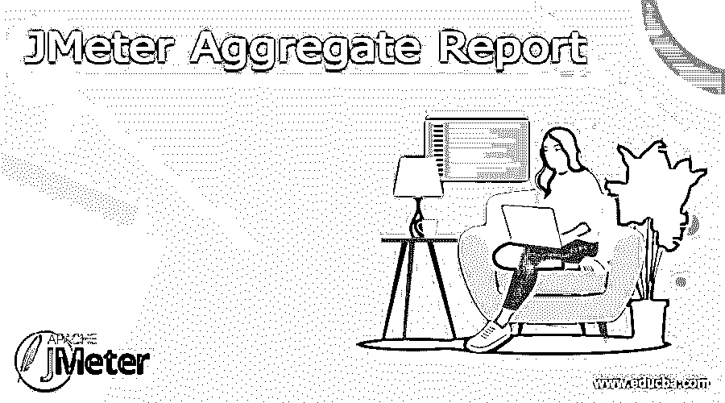
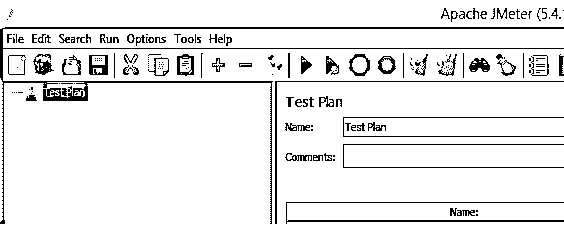
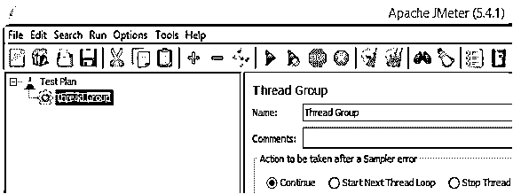
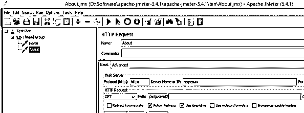
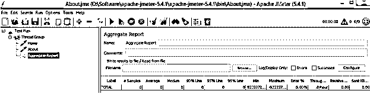
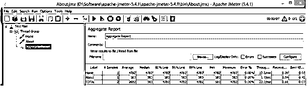

# JMeter 汇总报告

> 原文：<https://www.educba.com/jmeter-aggregate-report/>

## JMeter 汇总报告的定义

JMeter 是一个开源工具，用于执行负载和性能测试应用程序。在 JMeter 中，我们有不同的监听器来查看测试计划的结果，其中聚合报告是 JMeter 提供的监听器之一。聚合报告与汇总报告相同，只是聚合侦听器提供了一些额外的参数，如中位数。我们知道阅读和理解 JMeter 报告的重要性，这意味着我们如何通过报告的统计数据提供正确的结论。如果我们有报告的统计数据，那么我们就可以很容易地进行分析并得出测试计划的结果。

### JMeter 汇总报告概述

JMeter 的 Total Report 是卓越的基础受众之一。这与汇总报告相比大致相同，除了汇总报告没有给出更多的界限，如“中间”、“90%线”、“95%线”和“接近 100%线”。在更进一步之前，最好理解记录和运行 JMeter 脚本和总结报告的方法。

<small>网页开发、编程语言、软件测试&其他</small>

这里，我们将专注于对汇总报告中每个字段的理解和研究。本质上，它创建了一个表，用一行单独显示每个示例的结果，并显示关于吞吐量、KB/秒值、平均时间、中值、90%线、95%线、几乎 100%线、最小响应时间、最大响应时间、错误%的数据。在表格的下半部分，您同样可以追踪这些字段中每一个字段的总激励。

### 为什么要 JMeter 汇总报告？

现在让我们看看为什么我们需要使用 JMeter 中的聚合报告，如下所示。

JMeter 的 Total Report 是卓越的基础受众之一。这与汇总报告相比大致相同，除了汇总报告没有给出更多的界限，如“中间”、“90%线”、“95%线”和“几乎 100%线”。在继续之前，最好理解一下记录和运行 JMeter 脚本和总结报告的方法的组件。

根据 JMeter 听众的说法。吞吐量由招标/时间单位决定。时间是从主示例的开始到最后一个示例的最远限制确定的。这包含了测试之间的任何延伸，因为它应该处理服务器上的堆。

吞吐量是以每秒/分钟/小时的需求来估算的。选择时间单位，因此显示的比率大约为 1.0。每当吞吐量保存到 CSV 记录时，它都以需求/秒为单位进行通信，例如，30.0 请求/分钟保存为 0.5。

### 使用 JMeter 汇总报告

现在让我们看看如何在 JMeter 中使用聚合报告，示例如下。

首先，我们需要在 JMeter 中创建一个测试计划，如下图所示。

现在，在测试计划中添加线程组，如下图所示。

创建线程后，现在我们需要添加采样器，这里我们添加了一个 HTTP 请求采样器，如下图所示。

现在，在这一步中，我们需要添加侦听器，通常，我们添加视图结果树或任何其他，但这里我们需要添加聚合报告侦听器，如下图所示。

现在让我们保存测试计划并运行它，在测试计划执行之后，我们可以在下面的屏幕截图中看到结果。

### JMeter 汇总报告分析

现在，让我们试着理解如下详细信息的汇总报告。

*   标签:基本上是我们提供的 URL 的名称，在上面的例子中，我们提供了两个 HTTP 请求，它们只是报表的标签。
*   示例:它用于显示我们添加到线程组的每个请求的虚拟用户数量。
*   Average:它用于指定特定请求或标签花费的时间。在上面的例子中，总平均时间是 2682 毫秒，如上面的截图所示。
*   中位数:是一堆测试结果中的时间。它表明，一半的例子采取了类似的时间，即其余的至少一样长。
*   90%线:这是 90%的示例落在下面的值。其余的测试基本上花了他们所需要的时间。(第 90 个百分位数)算出 90%，列出所有交换值，并再次协调它们在放弃请求时的质量。现在清除掉你所有交易中前 10%的交易。最值得注意的是第 90 百分位。
*   95%线:这是 95%的示例都落在下面的值。其余的测试基本上花了他们所需要的时间。(第 95 百分位)计算 95%，列出所有交换值，并再次在直线下降的请求中编排它们的质量。目前杀死前 5%的交易所，你全力以赴的名单。保持最高价值的是第 95 百分位。
*   99%线:这是 99%的示例都位于的值。其余的测试基本上花了他们应该花的时间。(第 99 个百分位数)计算接近 100%，对所有交换值进行汇总，并在直线下降的请求中再次按其质量进行组织。目前杀死前 1%的交易所，你的绝对纲要。保持最高价值的是第 99 百分位。
*   Min:用于显示标签花费的最少时间，单位为毫秒。
*   Max:它用于显示标签花费的最大时间，或者我们可以说是 HTTP 请求。
*   错误%:它显示每个标签失败的 HTTP 请求。
*   吞吐量:它显示了每秒处理的请求数量。
*   KB/Sec:它用于显示在测试计划执行期间从服务器接收的平均数据量。

### JMeter 汇总报告命令

首先，我们需要下载 JMeter PluginsCMD，之后我们还需要安装一些额外的插件，如综合报告和命令行图形绘制工具。

现在运行如下命令。

`JMeterPluginsCMD.bat --generate-csv aggregatereport.csv --input-jtl output.jtl --plugin-type AggregateReport`

### 结论

我们希望您能从这篇文章中了解更多关于 JMeter 聚合报告的信息。从上面的文章中，我们已经理解了 JMeter 汇总报告的基本思想，我们也看到了 JMeter 汇总报告的表示和示例。从本文中，我们了解了如何以及何时使用 JMeter 聚合报告。

### 推荐文章

这是一个 JMeter 汇总报告指南。这里我们讨论一下定义，概述，为什么要 JMeter 聚合报告？，代码实现示例。您也可以看看以下文章，了解更多信息–

1.  [JMeter 版本](https://www.educba.com/jmeter-version/)
2.  [JMeter 中的定时器](https://www.educba.com/timers-in-jmeter/)
3.  [JMeter vs Selenium](https://www.educba.com/jmeter-vs-selenium/)
4.  [JMeter 备选方案](https://www.educba.com/jmeter-alternatives/)