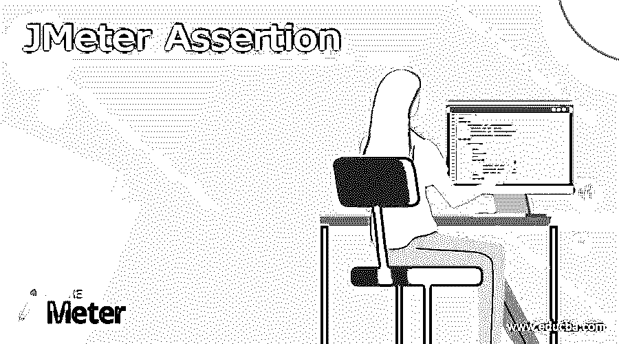
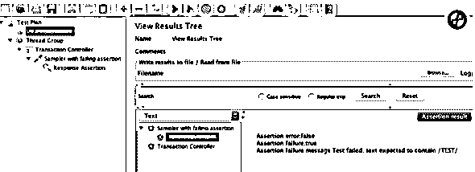
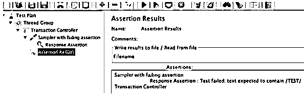
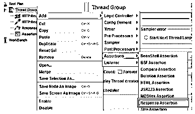
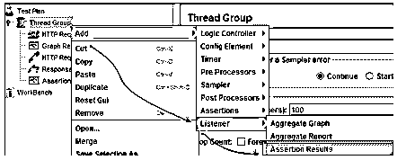

# JMeter 断言

> 原文：<https://www.educba.com/jmeter-assertion/>

## JMeter 断言的定义

JMeter 断言用于计算发送到服务器的请求的响应。它是一个用户可以确认预期结果并实现运行时执行的请求的结果的过程。因此，如果用户需要在一个相关的采样器上包含任何断言，那么他应该将它添加为采样器的子元素。本文讨论了不同类型的断言，每种断言都有自己的属性。本文简要讨论了 JMeter 断言的配置和使用。

### 什么是 JMeter 断言？

简单地说，JMeter 中的断言支持用户检查被测服务器，以产生预期的结果。这是一个有价值的过程，因为用户配置的标准决定了它是否通过，如果值给出了预期的结果，那么他可以使用与 JMeter 变量相同的值或标准。JMeter 中使用了不同类型的断言，它们是

<small>网页开发、编程语言、软件测试&其他</small>

响应断言
持续时间断言
大小断言
XML 断言
HTML 断言

### 如何使用 JMeter 断言？

断言既可以隐含在主样本中，也可以隐含在子样本中，有时也可以只插入到子样本中。很少有像 size 或 response 断言这样的断言可以用于 JMeter 变量。像 BeanShell、JSR223、BSF 这样的基于代码的断言没有标识作用域的 GUI 组件。因此，这意味着用户应该手动实现所有断言逻辑和范围。JMeter 中的断言可以应用于更大和更小范围内的所有级别样本

因此，假设用户有一个样本，并插入断言来测试响应。在 GUI 模式下，可以通过两种方式怀疑失败的断言。通过使用断言结果监听器和查看结果树监听器。

断言结果监听器返回获取断言的标签，而视图结果树监听器返回测试计划中所有应用的断言。但是不建议在负载测试中使用它们，因为它们会消耗大量内存。它应该用于调试文件或打开。jtl 文件。可以在负载报告界面的错误选项卡中查看失败的断言。

报告字段:下面给出了要配置的三个必填字段。

*   断言错误:它指示真或假选项，并告诉断言是否成功。当断言中存在问题(如不正确的 BeanShell 脚本)时，断言错误被定义为 true，有时如果没有定义字节大小，它会显示一个错误。断言错误会导致受影响的样本失败。
*   断言失败:它被表示为真或假，并告诉断言是失败还是成功。如果原始断言的结果与预期的结果相匹配，则执行 true，否则执行 false。如果断言失败为假，则受影响的采样器被认为是失败的。
*   断言失败消息字符串:它用于定制或构建对断言失败进行简要描述的消息。

### JMeter 持续时间断言

持续时间断言评估在计算的时间内收到的每个服务器响应。如果任何响应花费的最大时间超过给定的毫秒数，则该响应被定义为失败的响应。如果用户通过 JMeter 向 www.gmail.com 发送了一个请求，并在计算的 5ms 时间内收到了响应，那么执行的测试通过或者被认为失败。

当与服务器响应的不同字段进行比较时，响应断言有助于添加模式字符串。例如，如果用户向网站 http://www.gmail.com 发送请求，并从服务器获得响应。那么响应断言给出的模式字符串为 ok，它被认为是通过。

大小断言检查每个服务器响应是否包含预期的字节数。用户可以指定大小可以等于、不等于、小于或大于给定的字节数。JMeter 向 www.gmail.com 发送一个请求，如果测试通过，那么收到的响应包至少是 5000 字节，否则就认为测试失败。

XML 断言检查响应数据是否包含正式的 XML 文档。

HTML 断言使用户能够确保 HTML 的语法给出了对数据的响应。它表示来自数据的响应必须与 HTML 的语法相匹配。

要使用响应断言，请遵循以下步骤。

响应断言的控制面板可以添加与不同字段进行比较的模式字符串。从线程组添加响应断言。

右键单击线程组，选择添加，然后选择断言，并选择响应断言。

然后向测试中添加一个模式。当您将请求传输到 Google 服务器时，它可能会执行一些响应代码，如 200、404 和 302。404 表示服务器错误，200 中提到服务器 ok，302 使 webserver 重定向到其他页面。从美国外部访问 Gmail 时会发生这种情况。然后对于印度用户，它被重定向到 Gmail。英寸从“响应”字段中选择要测试的响应代码。从响应断言面板中选择添加，并在新的空白条目显示中输入 302。然后从线程组添加断言结果。从线程组的断言结果中执行测试。当用户准备好执行测试时，在菜单上选择 run。

测试结果可在结果窗格中查看。如果来自 Gmail 服务器的响应代码包含模式 302，则测试通过，否则，显示的消息是，用户可以从 302 变回 500，因为服务器代码不符合该模式，如果再次不符合该模式，则视为测试失败。

### 结论

因此，这些是 JMeter 断言选项中的配置，用户可以在测试服务器的请求中实现它们，并考虑它是否成功。

### 推荐文章

这是一个 JMeter 断言的指南。这里我们讨论定义，什么是 JMeter 断言？，如何使用 JMeter 断言，用代码实现的例子。您也可以看看以下文章，了解更多信息–

1.  [JMeter 面试问题](https://www.educba.com/jmeter-interview-questions/)
2.  [安装 JMeter](https://www.educba.com/install-jmeter/)
3.  [什么是 JMeter？](https://www.educba.com/what-is-jmeter/)
4.  [JMeter 版本](https://www.educba.com/jmeter-version/)