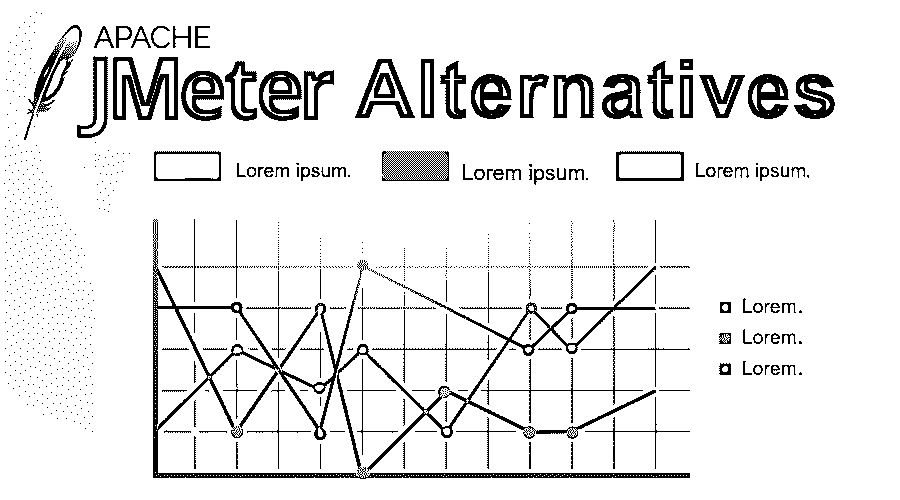

# JMeter 替代品

> 原文：<https://www.educba.com/jmeter-alternatives/>

## JMeter 简介

与 Java 中的许多应用程序不同，JMeter 主要用于 web 应用程序测试和其他测试领域。Stefano Mazzocchi 是 [JMeter](https://www.educba.com/what-is-jmeter/) 的创始人，主要目标是对 Apache Tomcat 进行性能测试。尽管 JMeter 是一个开源的性能测试工具，但是由于它的缺点，人们关注 JMeter 的替代品。如果您正在寻找 JMeter 中的替代产品，那么这是了解 JMeter 的一些替代产品的合适地方。

### JMeter 替代品列表

仔细看看 JMeter 的这些最佳替代方案:

<small>网页开发、编程语言、软件测试&其他</small>

#### 1.负载运行器

在负载下测试应用程序的过程中广泛使用的测试工具是 LoadRunner。LoadRunner 可能是 small Focus 的一个代码测试工具。它将着眼于应用、仪器行为和负载下的性能。LoadRunner 将模拟成千上万的用户同时开发应用程序代码，通过性能和分析来记录设备的关键点。

负载运行器的关键要素包括:

*   用于创建设备负载的脚本将由负载生成器生成:
    脚本将通过 VuGen(虚拟用户生成器)进行编辑，脚本使用规范负载生成器指出由控制器启动和控制的一系列实例，并通过彻底的观察最终显示结果。
*   代理方法管理控制器和货物生成器实例之间的关联。
*   观察知识结果的可视化将通过日志报告和各种负载生成器的分析进行组合。

#### 2.格林机关枪

Gatling 是 ASCII 文本文件加载，性能测试框架支持 Scala、Akka 和 Netty。主要稳定释放是在 2012 年 1 月 13 日透露。2015 年，加特林的创始人 Stéphane Landelle 创建了一家公司(名为“加特林公司”)，致力于 ASCII 文本文件项目的活动。

加特林公司开发了用于网络应用的 ASCII 文本文件性能测试工具加特林及其企业版理查德乔丹加特林前线。该项目的目标包括:

*   高性能。
*   准备呈现标记语言报告。
*   场景记录器和开发人员友好的电话线。

#### 3.Apache 基准测试

Apache Benchmark (ab)可能是一个单线程命令 bug，用于活动通信协议网络服务器的性能。最初是为了检查 Apache 通信协议服务器而设计的，它足够通用，可以检查任何网络服务器。

ab 意味着 Apache Benchmark 工具与高质量的 Apache supply 发行版捆绑在一起，就像 Apache net 服务器本身一样，它是免费的开放供应软件包，并根据 Apache 许可证的条款进行分发。

#### 4.宗

这个测试是在 GPL 的许可下进行的，它是一个分布式的负载测试，被称为 TSung。这在一种叫做 Erlang 的语言中是可用的。

**特性**

*   聪使一个人能够复制多达五万个同步表演者。
*   在 TSung 的支持下，开发人员可以编写复杂的脚本。
*   TSung 允许程序员观察指定的服务器。
*   XMPP、HTTP、SOAP 和 [PostgreSQL 服务器](https://www.educba.com/install-postgresql/)可以被 TSung 测试，因为它是一个协议。

#### 5.恐惧

用 Python 编码并为 web 项目执行功能测试的负载应该是 Funkloads。回归测试由 Funkload 完成。Funkload 的功能如下所示:

*   功能测试是纯粹的 [Python 脚本](https://www.educba.com/python-scripting-language/)，它像传统的单元测试一样利用 pyUnit 框架。Python 修改高级事件来处理宇宙应用。
*   多部分和表单数据的提交都已完成，它还支持文件传输。
*   它有几个不同的命令行选项

#### 6.Loadninja

Smart Bear 的 Load Ninja 允许您快速生成不太精确的负载测试脚本，真正的浏览器将取代负载模拟器，测试时间减少 50%，浏览器基础的度量标准，所有这些都以 Ninja 的速度进行。您只需实时捕捉客户端交互，并立即确定性能问题。

*   无脚本加载会查看 Insta Play 的记录器，以便进行创作和回放。
*   在规模上，真实浏览器测试执行的负载发生。
*   对服务器机器没有要求；托管将直接在云上完成。
*   基于浏览器的指标将与报告选项和分析一起使用。

#### 7.智能仪表

代替 JMeter 的一个有效选择是 SmartMeter.io，它引入了 JMeter 中没有的高级特性。它允许直截了当的无脚本查看为被指控的录制者的受害者创建的情况，尽管如此，它仍然使您能够创建高级编辑的查看。它在查看覆盖率和利用像自动查看标准分析这样的功能方面也很出色；这里也考验分析思维。 [Windows、Mac OS、Linux](https://www.educba.com/linux-vs-mac-vs-windows/) 等操作支持与 SmartMeter 的使用兼容。智能电表也支持 CI/CD 的集成。了解智能电表的特性:

*   看看事态的发展。
*   综合报告文学与自动分析和看一看运行比较。
*   GUI 将查看运行的实时结果。

### 结论

希望通过这篇博客，您能清楚 JMeter 的替代方案，它们具有相同的、事实上更多的特性，将在您的测试场景中为您提供支持。

### 推荐文章

这是 JMeter 替代品的指南。在这里，我们讨论了 JMeter 的基本概念和一些备选方案及其特性。您也可以浏览我们推荐的其他文章，了解更多信息——

1.  [tensorlow 替代品](https://www.educba.com/tensorflow-alternatives/)
2.  [还原备选方案](https://www.educba.com/redux-alternatives/)
3.  [安装 JMeter](https://www.educba.com/install-jmeter/)
4.  [JMeter 面试问题](https://www.educba.com/jmeter-interview-questions/)