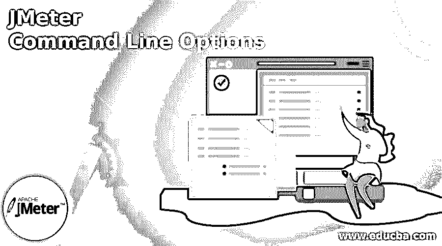
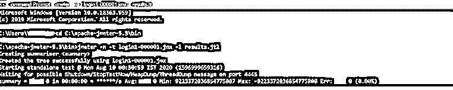
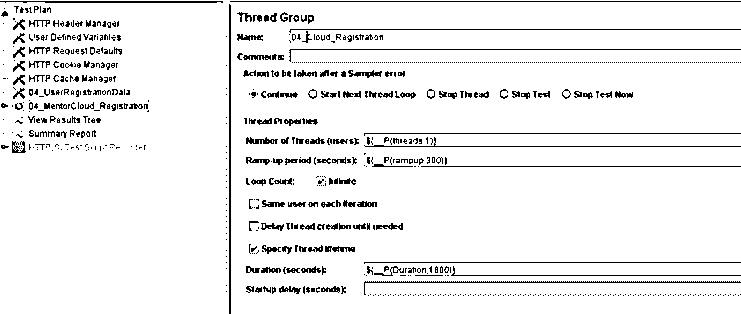
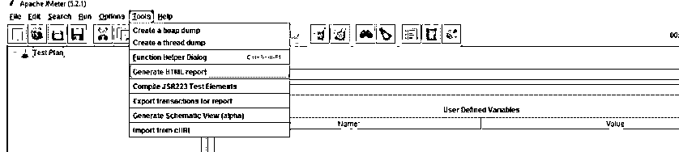

# JMeter 命令行选项

> 原文：<https://www.educba.com/jmeter-command-line-options/>

## JMeter 命令行选项介绍

JMeter 中的命令行选项可以用来生成 XML 或 CSV 文件，该文件包含负载测试结束时 HTML 格式的结果。默认情况下，JMeter 在运行时会提供一个负载测试摘要。执行时的实时结果可以使用后端监听器来完成。在 JMeter GUI 中开发性能脚本是一种常用的方法。为了执行测试，最好在 JMeter 中实现命令行模式。

### JMeter 命令行选项概述

JMeter 中的基本命令行参数是脚本的 JMeter–n–t 名称。JMX

<small>网页开发、编程语言、软件测试&其他</small>

这里，

*   n 让 JMeter 在非图形用户界面模式下执行。
*   t 表示到源的路径，并使。jmx 脚本执行。

如果用户想要使用命令行发送附加参数，他可以在下面添加参数，

*   jmeter–n–t 脚本的名称。JMX =[www.abc.com](http://www.abc.com)–jus ername = alpha
*   用户可以通过使用 JMeter 中的内置函数来修改 JMeter 文件并获取所有参数。它叫做$ {_P 变量名}

### 如何运行 JMeter 命令行选项？

JMeter 中的 GUI 将提供实时执行，并提供所有基本信息，如用户错误、每秒请求数和吞吐量值。然而，其他原因，如分布式测试、持续交付、持续集成和负载，使我们在 JMeter 中使用命令行模式。如果用户必须在命令行中执行测试，那么用户需要尽可能多地从加速、用户数量和主机名方面编辑脚本。JMeter 允许用户通过使用用户定义的变量在命令行模式下传递参数，这些变量可以包含在测试计划和配置元素中。

还有另外两种方法来运行非 GUI 模式。用户可以将结果文件或脚本文件添加到 JMeter 的 bin 位置，或者可以在命令中写入完整的路径。

例如，JMeter–n–t 脚本的名称. JMX–l results . jtl

和 JMeter–n–t C:\ Users \ desktop \ work up \脚本名称. JMX–l

c:\ users \ desktop \ work \ results . jtl

这里–我习惯于指示将结果复制到日志文件中。

在非 GUI 模式下传递附加参数的其他方法如下

r 用于列出远程服务器，可以在分布式测试中实现

h:代理服务器的主机名

p 是代理服务器的端口。在 Jmeter _P 函数的支持下，用户可以将属性隐含在用户定义的值中。

线程数量–可以用-$ {_P (threads，5)}来更改，它表示并发运行的用户数量，这里的默认值是 5。

斜坡上升值为 _$ {_P(斜坡上升，300)}，它给出了峰值负载和测试开始之间的持续时间。这里设置的默认值是 300 秒。

测试持续时间是-${_P (duration，600)}，它给出了测试的总持续时间，它被设置为 600 秒。它可以直接传递给非 GUI 模式的执行。因此，如果环境发生任何变化，用户可以从脚本和 CLI 进行更改，而不需要任何 GUI。

jmeter–jthreads–j duration–jrampup–n–t 脚本名称. JMX–I result file . jtl

如果用户为一个组织工作，需要一个完整的安全网络，他可以依靠互联网连接或代理服务器。但是，它不允许 JMeter 以标准方法关联和执行性能测试。相反，他必须向 JMeter 提供代理端口号、主机名和防火墙。他可以从命令行本身执行 JMeter.sh 文件。

jmeter–h 代理服务器的名称–p 端口号–u 用户名–密码–n 主机。

这里 h 是代理服务器的主机名或 IP

p 是代理服务器的端口

u 是分配给代理认证的用户名

代理的密码

n localhost 来记录输出。

### JMeter HTTP 测试示例

如果组织预计某一天会有巨大的流量，性能测试人员必须确保公司的所有网站都能处理最大数量的并发用户。然而，它意识到存在局限性。例如，如果测试是在本地机器的图形用户界面模式下执行的，那么计算机应该有足够的内存和 CPU。因此，在这种情况下，建议配置命令行界面模式。所以分布模式类似于主从架构，其中 Java RMI 支持 JMeter 与从机通信。

在实现分布式测试之前，应该做一些准备。首先，用户需要连接从设备和主设备，以便即时执行。

在命令提示符选项下，导航到 Jmeter 中的 bin 文件夹。

然后运行以下命令。

:JMeter–n–t D:\ staging _ rush tix _ consolidated _ 100 _ new . JMX–R 172.1

这里的表示不同，

n 用于命令 JMeter 在 CLI 模式下执行测试

t 给出了。jmx 文件

我过去常常指导和写日志文件

r 是远程服务器列表或测试从列表

如果需要的话，g 也用在最后来生成报告。

可以根据测试中涉及的从机和用户数量来编辑命令。用户可以在命令行中给出从机中 IP 的数量。

若要生成报告，请使用。jtl 文件并将其输入 JMeter。

### 结论

如果用户需要更改任何参数，如基本 URL、线程数或线程数，他可以在 GUI 中完成，但这不是一个好的做法，因此 CLI 用于在后端传递参数有助于进行有效的更改。因此，本文简要讨论了 CLI 在 JMeter 中的使用。

### 推荐文章

这是 JMeter 命令行选项的指南。这里我们也讨论如何运行 JMeter 命令行选项和例子。您也可以阅读以下文章，了解更多信息——

1.  [JMeter 备选方案](https://www.educba.com/jmeter-alternatives/)
2.  [JMeter 中的定时器](https://www.educba.com/timers-in-jmeter/)
3.  [安装 JMeter](https://www.educba.com/install-jmeter/)
4.  [JMeter 面试问题](https://www.educba.com/jmeter-interview-questions/)