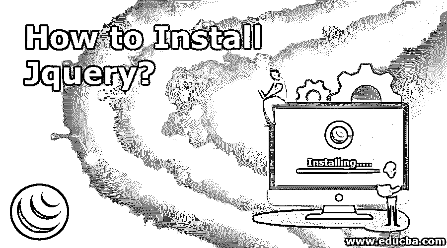
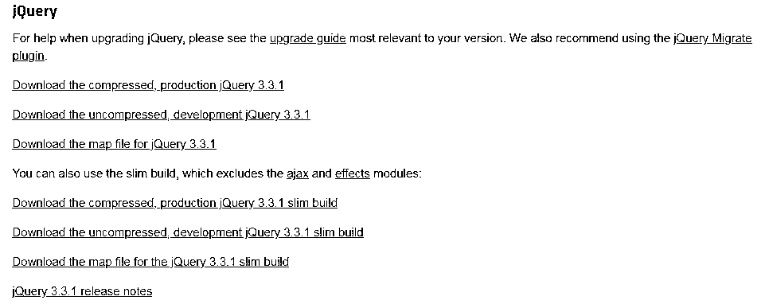
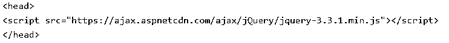
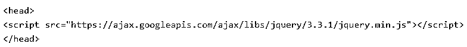
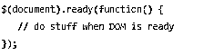
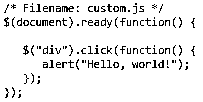
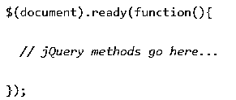

# 如何安装 Jquery？

> 原文：<https://www.educba.com/install-jquery/>




## 安装 Jquery 简介

Jquery 是一个小而快且功能丰富的 javascript 库，用于简化 DOM 树的遍历和操作。它还处理事件处理、Ajax 和 CSS 动画。它主要用于简化选择、查找和操作 DOM 元素及其属性的语法。例如，Jquery 可用于查找包含特定属性的文档中的元素，或者修改其属性或响应事件。

### 安装 Jquery 的过程

下面是安装 jquery 的详细步骤:

<small>网页开发、编程语言、软件测试&其他</small>

#### 下载 jquery

jquery 的压缩和未压缩版本都是可用的。未压缩文件的主要用途与调试目的或开发任务有关，而压缩文件用于节省带宽并用于提高生产性能。当您选择使用压缩文件进行调试时，也可以下载 sourcemap 文件。用户通常不需要运行映射文件来运行 jquery 脚本，相反，它们用于增强开发人员的调试体验。




#### 使用 yarn 或 npm 下载 jquery:

Npm 是在其中注册了 jquery 的包。这些 npm 软件包可以通过在 CLI 上使用 npm 命令来安装。

```
npm install jquery
```

如果您不想使用 npm 包安装程序，您也可以使用 yarn。

```
yarn add jquery
```

通过使用上面的命令，可以确保 jquery 安装在 node_modules 目录中。还将构建未压缩版本、一个映射文件和一个压缩版本，可以在 node_modules/jquery/dist 中找到。

还有一种安装 jquery 的方法。这是通过使用 bower 实现的，因为它可以作为一个包列在 Bower 中，并且可以通过使用 CLI 进行安装。

```
Bower install jquery
```

上面列出的命令会将 jquery 安装到 Bower 的安装目录中。这个目录的默认路径是 bower_components。要找到未压缩的映射文件和压缩文件，需要找到 bower_components/jquery/dist。除了默认分发包之外，这个包还包含其他文件。

您也可以通过编写以下命令直接安装压缩文件:

```
Bower install https://code.jquery.com/jquery-3.3.1-min.js
```

如果您不希望自己下载和托管 Jquery 文件，而希望使用 CDN，那么您也可以使用 Jquery CDN。微软和谷歌都有 jquery。

**微软 CDN:**




**谷歌 CDN:**




您可以在 HTML 脚本中包含 Jquery 库:

```
<html>
<head>
<title>Jquery first test example</title>
<script type = "text/javascript" src = "https://cdn.educba.com/jquery/jquery-2.1.3.min.js">
</script>
<script type = "text/javascript">
$(document).ready(function() {
document.write("HI there!");
});
</script>
</head>
<body>
<h1>Hello there</h1>
</body>
</html>
```

上面的步骤是本地安装的一部分，我们将 jquery 文件放在网站的目录中。

现在，我们将研究调用 jquery 的 CDN(内容交付网络)方式:

```
<html>
<head>
<title>My jquery test sample script</title>
<script type = "text/javascript"
src = "https://ajax.googleapis.com/ajax/libs/jquery/2.1.3/jquery.min.js">
</script>
<script type = "text/javascript">
$(document).ready(function() {
document.write("Hello there ");
});
</script>
</head>
<body>
<h1>Hi there</h1>
</body>
</html>
```

#### 您还可以调用 jquery 库函数:

几乎所有的事情都是在 jquery 读取或写入或操作文档对象模型(DOM)元素列表时完成的。我们需要确保事件和其他基本组件在 DOM 文件准备好的时候被添加。还有两种方法可以让你的事件发挥作用。一种是从页面内部调用这些事件，因此我们可以利用$(document)。ready()函数。所有写在里面的内容都会被加载，在 DOM 被加载的时候，在页面内容被加载之前很久。可以注册一个就绪事件来实现这一点。




当你希望进一步调用你的 jquery 函数时，它是一个预构建的或者是一个库函数，我们将使用如下的 HTML 脚本标签。

```
<html>
<head>
<title>My jquery testing first script</title>
<script type = "text/javascript"
src = "https://ajax.googleapis.com/ajax/libs/jquery/2.1.3/jquery.min.js">
</script>
<script type = "text/javascript" language = "javascript">
$(document).ready(function() {
$("div").click(function() {alert("Hello there");});
});
</script>
</head>
<body>
<div id = "mydiv">click me
</div>
</body>
</html>
```

为了进一步扩展 jquery 脚本的功能，我们还提供了自定义脚本，比如 custom.js




现在，我们可以通过在 HTML 标记中调用它来扩展功能。

```
<html>
<head>
<title>My first jquery testing script</title>
<script type = "text/javascript"
src = "https://ajax.googleapis.com/ajax/libs/jquery/2.1.3/jquery.min.js">
</script>
<script type = "text/javascript" src = "https://cdn.educba.com/jquery/custom.js">
</script>
</head>
<body>
<div id = "mydiv">
Click me
</div>
</body>
</html>
```

Jquery 还允许同时使用多个库，而不会互相干扰。还有另外一个库，名为 MooTool javascript libraries，它和 jquery 一起可以有效地使用。

还有其他与 [jquery 更相关的语法内容，比如使用 selector.action()字段的](https://www.educba.com/jquery-elements/),其中＄符号用于表示 access 中的查询并定义它。
选择器用于查询或查找 HTML 元素，而 action()用于对元素执行操作。文档就绪事件也很重要，因为它们确保在文档完成加载或处于就绪状态之前，脚本或代码段不会提前运行。




在完全处理文档之前，最好等待文档完全加载并准备好。因此，您也可以将 javascript 代码放在 body 部分之前的 head 部分。

安装 Jquery 非常容易，可以通过多种方式完成，不像许多其他软件或编程语言[,因为它是一种脚本语言](https://www.educba.com/python-scripting-language/),只是一个库。使用 Jquery 时需要学习的主要内容是关于实现、语法和其他相关的代码信息。

### 推荐文章

这是关于如何安装 Jquery 的指南。这里我们已经讨论了安装 Jquery 的过程。您也可以阅读以下文章了解更多信息:

1.  [安装 Java 8](https://www.educba.com/install-java-8/)
2.  [安装 SQL Server](https://www.educba.com/install-sql-server/)
3.  [安装引导程序](https://www.educba.com/install-bootstrap/)
4.  [安装詹金斯](https://www.educba.com/install-jenkins/)


