# Settimeout jQuery

> 原文：<https://www.educba.com/settimeout-jquery/>

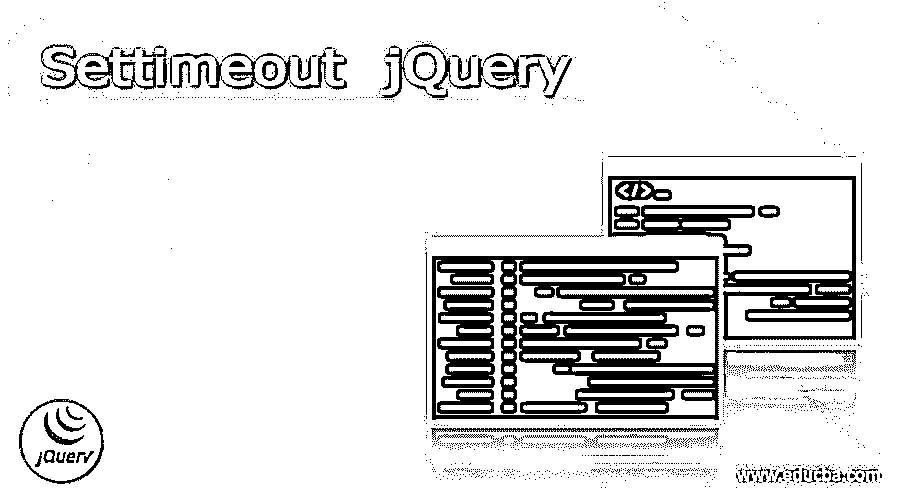


## Settimeout jQuery 简介

jQuery 是一个 JavaScript 库，旨在简化 HTML DOM 树遍历和 Css 动画、Ajax、事件处理和操作。jQuery 是一个开源的免费软件，使用麻省理工学院的许可证。jQuery 也是最常用的 JavaScript 库之一，领先其他 JavaScript 库三到四倍。设置超时用于延迟 jQuery 中的操作。它通常在指定的时间间隔后调用函数或表达式。如果代码需要 cade 的一部分在特定的时间间隔后只运行一次，就可以使用这种方法。本文用多个例子及其解释解释了 jQuery 的 set timeout 概念。

### Settimeout jQuery 的语法

Settimeout jQuery 语法如下所示:

<small>网页开发、编程语言、软件测试&其他</small>

*   **类型 1**

```
setTimeout(popUP, 2000);
```

*   **类型 2**

```
setTimeout(function(){ a.value="0 seconds" }, 10000);
```

*   **类型 3**

```
setTimeout(function(){ Popup.close() }, 5000);
```

*   **类型 4**

```
t = setTimeout(discountCount, 1000);
```

### Settimeout jQuery 的示例和工作方式

Set timeout 函数可以作为 settimeout()使用。通常，它用于在特定时间间隔后执行某个代码块、表达式或函数。此外，settimeout()函数只在指定时间后调用另一个函数一次。时间过去后，该函数将不会调用所需的函数。如果我们将代码写成 setTimeout(fn，0 ),那么一旦堆栈变空，代码就会被执行，而不是立即执行。如果代码 setTimeout(fn，0)被执行，那么在运行一个从 10 亿到 100 亿的循环后，回调在几秒钟后被执行。

#### 示例#1

**代码:**

```
<!DOCTYPE html>
<html>
<body>
<button onclick="Training()">Click Me Bro! And Wait</button>
<p>**Let's see some Pop-up Magic**</p>
<script>
var EDUCBA;
function Training() {
EDUCBA = setTimeout(popUP, 2000);
}
function popUP() {
alert(" Lets take a ride to our website. \n www.educba.com \n We have started with text series as well");
}
</script>
</body>
</html>
```

**输出:**

*   **执行代码时-**

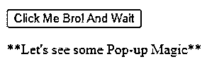


*   **点击“点击我老弟！并等待”按钮—**

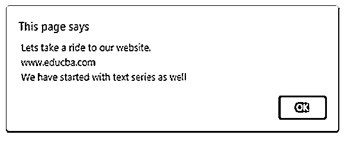


#### 实施例 2

**代码:**

```
<!DOCTYPE html>
<html>
<body>
<button onclick="Lefttime()"> Hurry!!... Tick - Tok - Tick - Tok </button>
<input type="text" id="content">
<p> Time left to avail the great deals and offers on EDUCBA courses and training programs </p>
<script>
function Lefttime() {
var a = document.getElementById("content");
setTimeout(function(){ a.value="0 seconds" }, 10000);
setTimeout(function(){ a.value="1 seconds" }, 9000);
setTimeout(function(){ a.value="2 seconds" }, 8000);
setTimeout(function(){ a.value="3 seconds" }, 7000);
setTimeout(function(){ a.value="4 seconds" }, 6000);
setTimeout(function(){ a.value="5 seconds" }, 5000);
setTimeout(function(){ a.value="6 seconds" }, 4000);
setTimeout(function(){ a.value="7 seconds" }, 3000);
setTimeout(function(){ a.value="8 seconds" }, 2000);
setTimeout(function(){ a.value="9 seconds" }, 1000);
setTimeout(function(){ a.value="10 seconds" }, 0000);
}
</script>
</body>
</html>
```

**输出:**

*   **关于代码执行—**

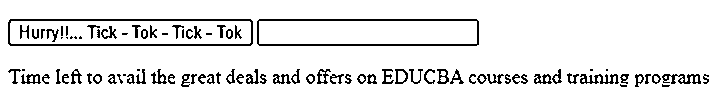


*   **嗒嗒“快点！!……Tick–Tok–Tick–Tok”按钮-**

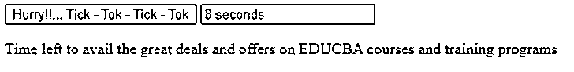


#### 实施例 3

**代码:**

```
<!DOCTYPE html>
<html>
<body>
<button onclick="Lefttime()"> Hurry!!... Tick - Tok - Tick - Tok </button>
<input type="text" id="content">
<p> Time left to avail the great deals and offers on EDUCBA courses and training programs </p>
<p> This window to your future career path will close in 10 seconds. So, hurrrryyyuppp!! </p>
<button onclick="Window()">Open "Pop-up"</button>
<script>
function Window() {
var Popup = window.open("", "Popup", "width=400, height=200");
Popup.document.write("<p>This window to your future career path will close in 10 seconds. So, hurrrryyyuppp!! </p>");
setTimeout(function(){ Popup.close() }, 5000);
var a = document.getElementById("content");
setTimeout(function(){ a.value="0 seconds" }, 10000);
setTimeout(function(){ a.value="1 seconds" }, 9000);
setTimeout(function(){ a.value="2 seconds" }, 8000);
setTimeout(function(){ a.value="3 seconds" }, 7000);
setTimeout(function(){ a.value="4 seconds" }, 6000);
setTimeout(function(){ a.value="5 seconds" }, 5000);
setTimeout(function(){ a.value="6 seconds" }, 4000);
setTimeout(function(){ a.value="7 seconds" }, 3000);
setTimeout(function(){ a.value="8 seconds" }, 2000);
setTimeout(function(){ a.value="9 seconds" }, 1000);
setTimeout(function(){ a.value="10 seconds" }, 0000);
}
</script>
</body>
</html>
```

**输出:**

*   **关于代码执行—**

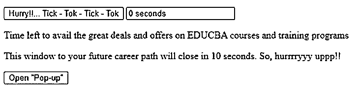


*   **点击“打开弹出窗口”按钮—**

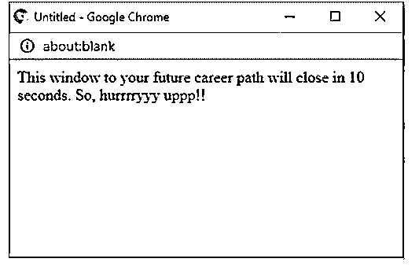


#### 实施例 4

**代码:**

```
<!DOCTYPE html>
<html>
<body>
<button onclick="Training()">Click Me Bro! And Wait</button>
<p>**Let's see some Pop-up Magic**</p>
<button onclick="noMagic()">Not interested in magic</button>
<p>You should stop magic to happen.... By Clicking the above button... before it happens in 2 seconds after clicking "Click Me Bro! And Wait button.....
</p>
<script>
var EDUCBA;
function noMagic() {
clearTimeout(EDUCBA);
}
function Training() {
EDUCBA = setTimeout(popUP, 2000);
}
function popUP() {
alert(" Lets take a ride to our website. \n www.educba.com \n We have started with text series as well");
}
</script>
</body>
</html>
```

**输出:**

*   **关于代码执行—**

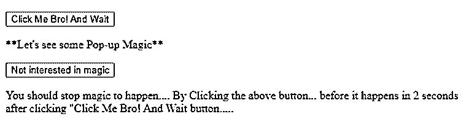


*   **点击“点击我老弟！并等待”按钮—**

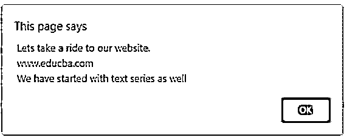


*   **在点击“对魔术不感兴趣”按钮后 2 秒内点击“点击我兄弟！并等待”按钮—**

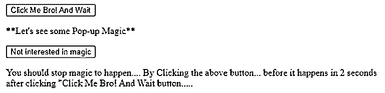


#### 实施例 5

**代码:**

```
<!DOCTYPE html>
<html>
<body>
<button onclick="Lefttime()"> Hurry!!... Tick - Tok - Tick - Tok </button>
<input type="text" id="content">
<p> Time left to avail the great deals and offers on EDUCBA courses and training programs </p>
<p> This window to your future career path will close in 10 seconds. So, hurrrryyyuppp!! </p>
<button onclick="Window()">Open "Pop-up"</button>
<button onclick="startTimer()">Time Spent!</button>
<input type="text" id="time">
<button onclick="stopTimer()">Time Stop!</button>
<p>
More Time you send on our website...
</p>
<p>
More discounts can be availed...
</p>
<p>
You just have to be patient...
</p>
<script>
var n = 0;
var x;
var discount = 0;
function discountCount() {
document.getElementById("time").value = n;
n = n + 10;
t = setTimeout(discountCount, 1000);
}
function startTimer() {
if (!discount) {
discount = 1;
discountCount();
}
}
function stopTimer() {
clearTimeout(x);
discount = 0;
}
function Window() {
var Popup = window.open("", "Popup", "width=400, height=200");
Popup.document.write("<p>This window to your future career path will close in 10 seconds. So, hurrrryyyuppp!! </p>");
setTimeout(function(){ Popup.close() }, 5000);
var a = document.getElementById("content");
setTimeout(function(){ a.value="0 seconds" }, 10000);
setTimeout(function(){ a.value="1 seconds" }, 9000);
setTimeout(function(){ a.value="2 seconds" }, 8000);
setTimeout(function(){ a.value="3 seconds" }, 7000);
setTimeout(function(){ a.value="4 seconds" }, 6000);
setTimeout(function(){ a.value="5 seconds" }, 5000);
setTimeout(function(){ a.value="6 seconds" }, 4000);
setTimeout(function(){ a.value="7 seconds" }, 3000);
setTimeout(function(){ a.value="8 seconds" }, 2000);
setTimeout(function(){ a.value="9 seconds" }, 1000);
setTimeout(function(){ a.value="10 seconds" }, 0000);
}
</script>
</body>
</html>
```

**输出:**

*   **关于代码执行—**

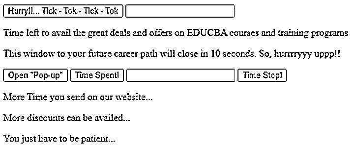


*   **点击“打开弹出窗口”按钮—**

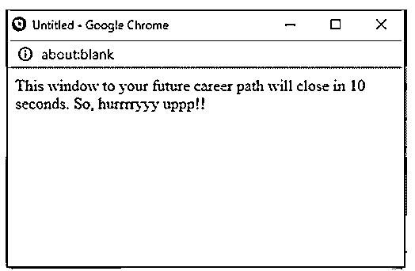


*   **点击“花费时间”按钮—**

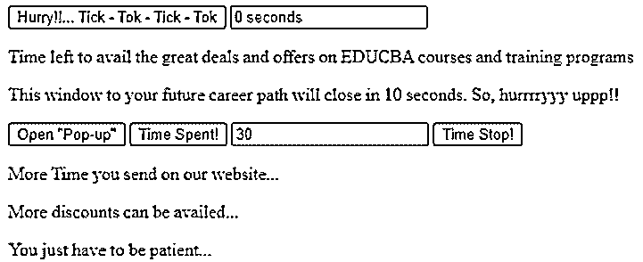


*   **点击“时间停止”按钮—**

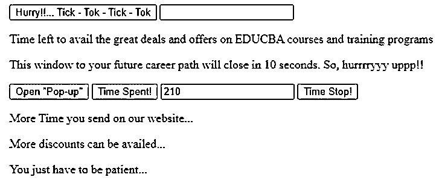


### 结论

根据上面的文章，我们理解了 jQuery 中设置超时的概念。通过解释 set timeout 的不同例子，我们理解了 set timeout 在 jQuery 中是如何工作的。这篇文章将帮助初学者理解 jQuery 中的 set timeout。

### 推荐文章

这是一个 Settimeout jQuery 的指南。在这里，我们还将讨论 Settimeout jQuery 的语法以及不同的示例和代码实现。您也可以看看以下文章，了解更多信息–

1.  [jQuery 停止](https://www.educba.com/jquery-stop/)
2.  [带有事件的 jQuery 日历](https://www.educba.com/jquery-calendar-with-events/)
3.  [jQuery children vs find](https://www.educba.com/jquery-children-vs-find/)
4.  [jQuery 替换 innerhtml](https://www.educba.com/jquery-replace-innerhtml/)


