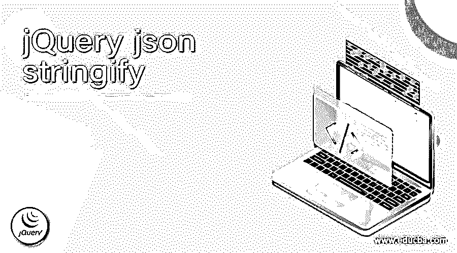
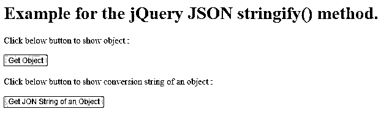
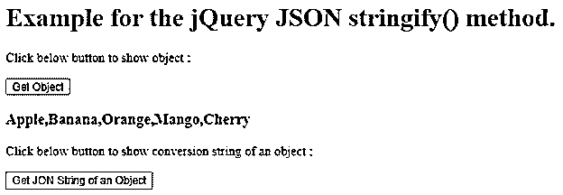
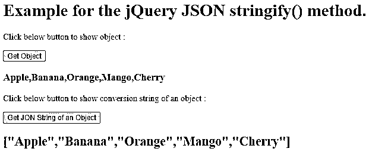
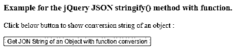
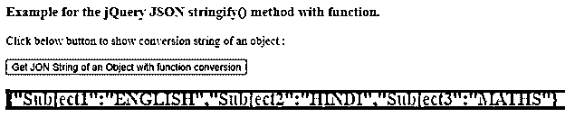
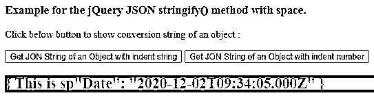
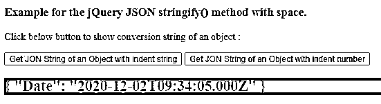

# jQuery json stringify

> 原文：<https://www.educba.com/jquery-json-stringify/>




## jQuery json stringify 简介

jQuery JSON stringify()方法用于将 jQuery 对象转换为字符串并返回。jQuery JSON stringify()方法是 jQuery 中的内置方法。有时，当我们开发一个应用程序时，需要将对象或数据序列化为一个字符串来存储数据，或者将数据传输到 web 服务器或任何 API。JSON 是用于人类可读数据交换的轻量级基于字符串的开放标准，因此使用 JSON stringify()方法将对象转换为字符串。

**语法**

<small>网页开发、编程语言、软件测试&其他</small>

JQuery JSON stringify()方法的语法–

```
JSON.stringify(value, replacer, space);
```

**参数**

*   **value**–这不是一个可选参数，它指定要转换为 JSON 字符串的值或对象。
*   **replacer**–这是一个可选参数，指定数组或 altering 函数用作 stringify 的选定过滤器。如果该值未被传递或为空或 null 值，则所有属性都将包含在转换后的字符串中。
*   **space**–这是一个可选参数，指定转换后的字符串中的空格控制。空格的可能值可以是 number 或 string，如果是 number，那么它表示打算用于转换后的字符串的空格数，string 表示用于缩进的字符串；该字符串最多可包含 10 个字符。
*   **返回值**–这个方法的返回值是一个字符串，是一个对象的转换。

### JQuery JSON stringify()方法的工作原理

JSON stringify()方法接受三个参数，第一个参数是要序列化或转换为字符串的对象，第二个参数是要运行的函数，第三个参数是要缩进的 replacer。假设我们将一个数组传递给 JSON.stringify()方法，然后 JSON.stringify()方法序列化该数组或将数组转换为字符串表示，这个数组的字符串表示我们可以很容易地通过 webserver 发送。

### jQuery JSON stringify()方法的示例

下面举几个例子

#### 示例# 1–阵列灭菌方法

接下来，我们编写 html 代码，通过下面的示例更清楚地理解 jQuery JSON.stringify()方法，其中 JSON.stringify()方法用于将数组转换为字符串表示形式，如下所示

**代码:**

```
<!doctype html>
<html lang = "en">
<head>
<meta charset="utf-8">
<title> This is an example for jQuery JSON stringify() method </title>
<script src = "https://ajax.googleapis.com/ajax/libs/jquery/3.3.1/jquery.min.js">
</script>
</head>
</head>
<script type="text/javascript">
$(document).ready(function () {
$("#id1").click(function() {
var fruits = [ "Apple", "Banana", "Orange", "Mango", "Cherry" ];
$("h3").text(fruits );
});
$("#id2").click(function() {
var fruits = [ "Apple", "Banana", "Orange", "Mango", "Cherry" ];
var jfruits = JSON.stringify(fruits);
$("h2").text(jfruits );
});
});
</script>
</head>
<body>
<h1> Example for the jQuery JSON stringify() method. </h1>
<p>Click below button to show object : </p>
<button id = "id1" > Get Object </button>
<h3> </h3>
<p>Click below button to show conversion string of an object : </p>
<button id = "id2" > Get JON String of an Object </button>
<h2> </h2>
</body>
</html>
```

上述代码的输出是




一旦我们点击“获取对象”按钮，输出是




一旦我们点击“获取对象的 JON 字符串”按钮，输出是




在上面的程序中，创建了水果数组，通过调用函数单击第一个按钮可以打印该数组。接下来，如果我们单击第二个按钮，它调用函数；在这个函数中，它将同一个数组转换为字符串，正如我们在输出中看到的。上面的数组只打印没有引号的元素，而下面的数组打印有大括号(因为大括号现在也是字符串的一部分)和双引号的元素。

#### 示例 2–对具有功能的物体进行消毒的方法

接下来，我们编写 html 代码来理解 jQuery JSON.stringify()方法，其中 JSON.stringify()方法用于通过应用函数将对象转换为字符串表示，如下所示

**代码:**

```
<!doctype html>
<html lang = "en">
<head>
<meta charset="utf-8">
<title> This is an example for jQuery JSON stringify() method </title>
<script src = "https://ajax.googleapis.com/ajax/libs/jquery/3.3.1/jquery.min.js">
</script>
</head>
</head>
<script type="text/javascript">
$(document).ready(function () {
$("#id2").click(function() {
var sub = { "Subject1" : "English", "Subject2" : "Hindi", "Subject3" : "Maths"};
var jsub = JSON.stringify(sub, function (key, value) {
if ( key ) {
return value.toUpperCase();
} else {
return value;
}
});
$("h2").text( jsub );
});
});
</script>
</head>
<body>
<h3> Example for the jQuery JSON stringify() method with function. </h3>
<p>Click below button to show conversion string of an object : </p>
<button id = "id2" > Get JON String of an Object with function conversion</button>
<h2 style = "background-color:red;"> </h2>
</body>
</html>
```

上述代码的输出是–




一旦我们点击“通过函数转换获得对象的 JON 字符串”按钮，输出是




如上面的程序，如果我们点击按钮，它调用函数；在这个函数中，它使用 JSON.stringify()方法将对象转换为字符串，并使用一个将所有值转换为大写并打印的函数，正如我们在输出中看到的。

#### 示例 3–用替代品对日期对象进行灭菌的方法

接下来，我们编写 html 代码来理解 jQuery JSON.stringify()方法，其中 JSON.stringify()方法用于通过一些字符串替换将日期对象转换为字符串表示，如下所示

**代码:**

```
<!doctype html>
<html lang = "en">
<head>
<meta charset="utf-8">
<title> This is an example for jQuery JSON stringify() method </title>
<script src = "https://ajax.googleapis.com/ajax/libs/jquery/3.3.1/jquery.min.js">
</script>
</head>
</head>
<script type="text/javascript">
$(document).ready(function () {
$("#id1").click(function() {
var jsub = JSON.stringify( { "Date" : new Date( 2020, 11, 2, 15, 4, 5)  }, null, "This is space");
$("h2").text( jsub );
});
$("#id2").click(function() {
var jsub = JSON.stringify( { "Date" : new Date( 2020, 11, 2, 15, 4, 5)  }, null, 10);
$("h2").text( jsub );
});
});
</script>
</head>
<body>
<h3> Example for the jQuery JSON stringify() method with space. </h3>
<p>Click below button to show conversion string of an object : </p>
<button id = "id1" > Get JON String of an Object with indent string</button>
<button id = "id2" > Get JON String of an Object with indent number</button>
<h2 style = "background-color:red;"> </h2>
</body>
</html>
```

上述代码的输出是–


一旦我们点击“获取带有缩进字符串的对象的 JON 字符串”按钮，输出是




如果我们点击“获取带有缩进编号的对象的 JON 字符串”按钮，输出是




如上面的程序，如果我们点击第一个按钮，它调用函数；在这个函数中，它将日期对象转换为一个字符串，并通过字符串“这是空间”进行缩进，因为我们知道最多只能缩进 10 个字符，所以只能通过“这是空间”进行缩进。第二步是将 date 对象转换为一个字符串，该字符串缩进 10 个空格。

### 结论

jQuery JSON stringify()方法是 jQuery 中的一个内置方法，用于将 jQuery 对象转换并返回到字符串。

### 推荐文章

这是一个 jQuery json stringify 的指南。这里我们讨论 JQuery JSON stringify()方法的工作原理和示例，以及代码和输出。您也可以看看以下文章，了解更多信息–

1.  [jQuery zindex](https://www.educba.com/jquery-zindex/)
2.  [jQuery 扩展](https://www.educba.com/jquery-extend/)
3.  [jQuery 承诺](https://www.educba.com/jquery-promise/)
4.  [jQuery off](https://www.educba.com/jquery-off/)


