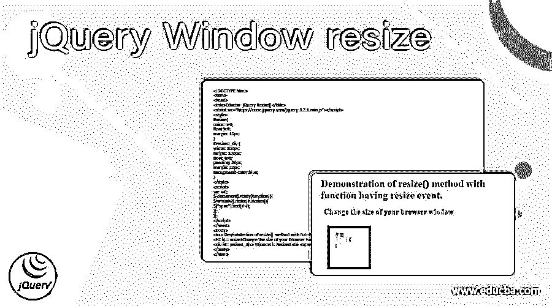
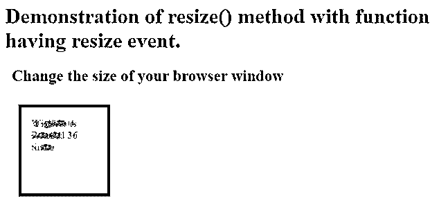
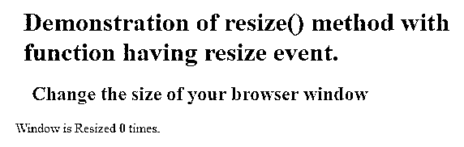
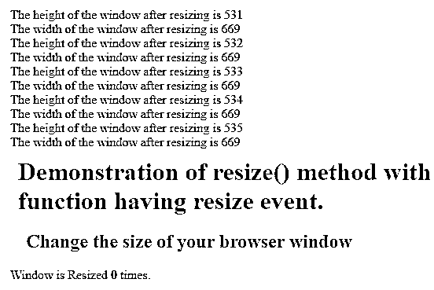

# jQuery 窗口大小调整

> 原文：<https://www.educba.com/jquery-window-resize/>




## jQuery 窗口大小调整简介

Jquery window resize 被定义为当 resize 或 reshape 事件发生时窗口的整形，该事件通常由一个称为 resize()的 Jquery 方法触发，该方法不带参数，我们可以传递一个函数，该函数可能包含运行 resize 事件的逻辑，但该函数的传递是 resize()方法的可选参数。一般来说，调整大小本身意味着根据网页来调整窗口的形状，这使得网站能够响应此调整大小事件可能发生的位置，因此调用 resize()方法来根据在笔记本电脑、移动电话、标签等中显示的网页来调整窗口大小。

### jQuery Window resize()方法的使用示例

在本文中，我们将讨论 resize()方法如何为 jquery 提供的窗口大小调整工作。resize()方法是一个使用的函数，或者我们可以更好地说它是由窗口大小调整事件触发的，每当浏览器窗口发生变化时，我们都会看到浏览器窗口的形状，这样最小化浏览器选项卡或最大化 etc 事件可能会导致在 jquery 中触发 resize()方法。该方法将函数作为参数，其中该函数具有 resize 事件的定义，或者该方法附加有事件处理程序，该事件处理程序具有调用该方法时发生的 resize 事件。

<small>网页开发、编程语言、软件测试&其他</small>

现在让我们通过示例来看看 resize()方法的语法:

**语法:**

```
$(selector_name).resize();
```

**参数:**

*   **Function_resize:** 该参数是可选的，用于指定对该函数的调用，该函数包含每当调用 resize()方法时运行 resize 事件的逻辑。

这个函数返回一个特定的数值，指定窗口被调整的次数。

### jQuery 窗口大小调整示例

让我们讨论一下 jQuery 窗口大小调整的例子。

#### 示例#1

**代码:**

```
<!DOCTYPE html>
<html>
<head>
<title>Educba- jQuery Resize()</title>
<script src="https://code.jquery.com/jquery-3.2.1.min.js"></script>
<style>
#wsize{
color: red;
float left;
margin: 10px;
}
#resized_div {
width: 100px;
height: 100px;
float: left;
padding: 20px;
margin: 20px;
background-color:blue;
}
</style>
<script>
var i=0;
$(document).ready(function(){
$(window).resize(function(){
$("span").text(i++);
});
});
</script>
</head>
<body>
<h1> Demonstration of resize() method with fucntion having resize event. </h1>
<h2 id = wsize>Change the size of your browser window </h2>
<div id= resized_div> Window is Resized <b>  0 </b> times.</div>
</body>
</html>
```

**输出:**





在上面的程序中，我们可以看到我们已经在 head 标签中的 script 标签内定义了一个 jquery 代码，该标签位于 HTML 结构内。我们首先声明变量“I ”,因为要存储窗口大小调整计数的数值。在上面的代码中，jquery 代码以“$”符号开始，然后我们定义文档。ready 函数告诉 jquery 文档已经准备好对页面进行修改，这个函数只运行一次。然后，我们定义一个 window.resize()方法，用于调整浏览器窗口的大小，并在每次窗口最小化、最大化等时触发 resize 事件。这可以通过定义一个函数来完成，在该函数中，每当您调整浏览器窗口的大小时，我们只增加窗口大小调整的计数，并将该函数传递给 resize()方法，以便它可以显示浏览窗口大小调整的次数。这个程序的输出可以在上面的截图中看到，当代码被执行时，它会给出计数 0，然后在我们不断调整浏览器窗口的大小时，它会增加计数并显示为“窗口被调整了 ____ 次”。

现在让我们来看另一个简单的例子，看看 resize()方法如何具有可以包括在调整浏览器窗口大小之后查看窗口宽度和高度的函数，这是通过在作为参数传递给 resize()方法的函数中使用 window.width()和 window.height()来完成的。

#### 实施例 2

**代码:**

```
<!DOCTYPE html>
<html>
<head>
<title>Educba- jQuery Resize()</title>
<script src="https://code.jquery.com/jquery-3.2.1.min.js"></script>
<style>
#hd {
color: red;
margin: 10px;
padding; 10px;
float left;
}
#hw {
color: blue;
margin: 10px;
padding: 10px;
float left;
}
</style>
</head>
<body>
<h1 id = hd> Demonstration of resize() method with fucntion having resize event. </h1>
<h2 id = hw>Change the size of your browser window </h2>
<div> Window is Resized <b>  0 </b> times.</div>
<script>
var i=0;
$(document).ready(function(){
$( window ).resize(function() {
$( "body" ).prepend( "<div>" + "The width of the window after resizing is " + $( window ).width() + "</div>" );
$( "body" ).prepend( "<div>" + "The height of the window after resizing is " + $( window ).height() + "</div>" );
});
});
</script>
</body>
</html>
```







在上面的程序中，我们可以看到我们已经用$ sign 定义了一个 jquery 代码，并准备好对页面进行修改。然后，我们定义 window resize()方法，将一个函数作为参数传递给该方法，该函数包括使用 window.width()函数显示窗口宽度，使用 window.height()函数显示窗口高度，并且每次调整窗口大小时，这些值都会发生变化。在上面的第一个屏幕截图中，我们看不到窗口高度和宽度的显示，因为我们刚刚执行了代码，并且我们已经触发了 resize 事件，所以当浏览器窗口被更改或重新整形时，我们可以在浏览器页面上看到窗口高度和宽度的显示，这可以在第二个屏幕截图中看到。

### 结论

在本文中，我们得出结论，jquery 提供了一种重塑浏览器窗口的方法，并且还使用 resize()方法计算了窗口被调整的次数。在本文中，我们看到了如何在一个函数中定义调整事件大小，并通过语法和示例将该函数作为 resize()函数的参数传递。在本文中，我们还看到了如何在调整窗口大小后获得窗口的宽度和高度，这也是在一个函数中定义的，并将该函数作为参数传递给 resize()方法。所以 resize()函数只是许多其他函数的简写，比如。on('resize '，handler)我们也可以通过使用。关闭(“调整大小”)。

### 推荐文章

这是一个调整 jQuery 窗口大小的指南。这里我们分别讨论 jQuery Window resize()方法的介绍、工作原理以及代码实现的例子。您也可以看看以下文章，了解更多信息–

1.  [jQuery 引用](https://www.educba.com/jquery-reference/)
2.  [jQuery 扩展](https://www.educba.com/jquery-extend/)
3.  [jQuery 修剪](https://www.educba.com/jquery-trim/)
4.  [jQuery 第一个孩子](https://www.educba.com/jquery-first-child/)


