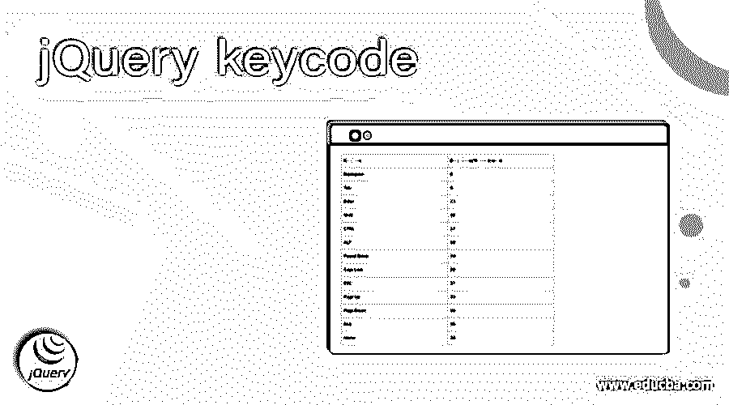
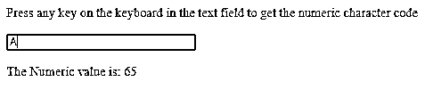
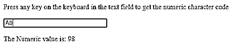
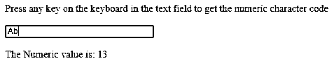
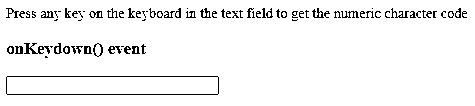
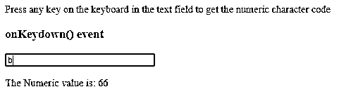
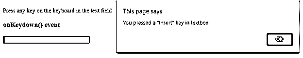
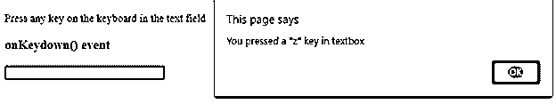
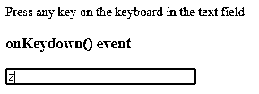

# jquery key code-jquery 金钥代码

> 原文：<https://www.educba.com/jquery-keycode/>




## jQuery 键码简介

jQuery 键码用于将键码映射到它们的数值。键码是键盘按键，其具有基于键码描述映射到按键的数字值。jQuery keycode 是 jQuery UI API 类别中主题的一部分，还有很多 API，比如 disableSelection()、enableSelection()、。uniqueId()，。zIndex()，。jQuery UI 中 jQuery.ui.core.js 函数提供的 focus()。这个 jQuery UI 是基于 jQuery JavaScript 的用户界面、效果、主题、小部件和用户交互库构建的。jQuery UI 的推荐版本是 v1.10，让我们来看看语法以及 jQuery keycodes 是如何工作的。

**语法:**

<small>网页开发、编程语言、软件测试&其他</small>

```
jQuery.ui.keyCode
```

不需要将参数发送给 keycode 语法

在进入 jQuery keycode 示例之前，我们需要了解 KeyCodes 表。

| **键码** | **描述/数值** |
| 退格 | Eight |
| 标签 | Nine |
| 进入 | Thirteen |
| 变化 | Sixteen |
| 计算机的 Ctrl 按键(控制键) | Seventeen |
| 中高音 | Eighteen |
| 暂停/中断 | Nineteen |
| 大写锁定 | Twenty |
| 经济社会委员会 | Twenty-seven |
| 页上移 | Thirty-three |
| 下一页 | Thirty-four |
| 结束 | Thirty-five |
| 家 | Thirty-six |
| 向左箭头 | Thirty-seven |
| 向上箭头 | Thirty-eight |
| 向右箭头 | Thirty-nine |
| 向下箭头 | Forty |
| 插入 | Forty-five |
| 删除 | Forty-six |
| Zero | Forty-eight |
| One | Forty-nine |
| Two | Fifty |
| Three | Fifty-one |
| Four | Fifty-two |
| Five | Fifty-three |
| Six | Fifty-four |
| Seven | Fifty-five |
| Eight | Fifty-six |
| Nine | Fifty-seven |
| ;: | Fifty-nine |
| =+ | Sixty-one |
| 一 | Sixty-five |
| 英语字母表中第二个字母 | Sixty-six |
| 英语字母表中第三个字母 | Sixty-seven |
| 英语字母表的第 4 个字母 | Sixty-eight |
| 英语字母表中第五个字母 | Sixty-nine |
| 英语字母表中第六个字母 | Seventy |
| 英语字母表中第七个字母 | Seventy-one |
| 英语字母表中第八个字母 | Seventy-two |
| 我 | Seventy-three |
| 英语字母表中第十个字母 | Seventy-four |
| 英语字母表中第十一个字母 | Seventy-five |
| 英语字母表中第十二个字母 | Seventy-six |
| 英语字母表中第十三个字母 | Seventy-seven |
| 英语字母表的第 14 个字母 | Seventy-eight |
| 英语字母表的第 15 个字母 | Seventy-nine |
| 英语字母表中第十六个字母 | Eighty |
| 英语字母表中第十七个字母 | Eighty-one |
| 英语字母表中第十八个字母 | Eighty-two |
| 英语字母表的第 19 个字母 | Eighty-three |
| 英语字母表的第 20 个字母 | Eighty-four |
| 英语字母表中第二十一个字母 | Eighty-five |
| 英语字母表中第二十二个字母 | Eighty-six |
| 英语字母中的第二十三个字母 | Eighty-seven |
| 英语字母表的第 24 个字母 | Eighty-eight |
| 英语字母表的第 25 个字母 | Eighty-nine |
| z | Ninety |
| Windows 操作系统 | Ninety-one |
| 右键单击 | Ninety-three |
| 0(数字锁定) | Ninety-six |
| 1(数字锁定) | Ninety-seven |
| 2(数字锁定) | Ninety-eight |
| 3(数字锁定) | Ninety-nine |
| 4(数字锁定) | One hundred |
| 5(数字锁定) | One hundred and one |
| 6(数字锁定) | One hundred and two |
| 7(数字锁定) | One hundred and three |
| 8(数字锁定) | One hundred and four |
| 9(数字锁定) | One hundred and five |
| *(数字锁) | One hundred and six |
| +(数字锁定) | One hundred and seven |
| -(数字锁定) | One hundred and nine |
| .(数字锁定) | One hundred and ten |
| /(数字锁) | One hundred and eleven |
| 子一代 | One hundred and twelve |
| 第二子代 | One hundred and thirteen |
| 第三子代 | One hundred and fourteen |
| 法乐四联症 | One hundred and fifteen |
| F5 | One hundred and sixteen |
| F6 | One hundred and seventeen |
| F7 | One hundred and eighteen |
| F8 | One hundred and nineteen |
| F9 | One hundred and twenty |
| F10 | One hundred and twenty-one |
| F11 | One hundred and twenty-two |
| F12 | One hundred and twenty-three |
| 数字锁定 | One hundred and forty-four |
| 滚动锁 | One hundred and forty-five |
| 我的电脑 | One hundred and eighty-two |
| 我的计算器 | One hundred and eighty-three |
| ,< | One hundred and eighty-eight |
| .> | One hundred and ninety |
| /? | One hundred and ninety-one |
| `~ | One hundred and ninety-two |
| [{ | Two hundred and nineteen |
| \&#124; | Two hundred and twenty |
| ]} | Two hundred and twenty-one |
| '" | Two hundred and twenty-two |

### jQuery 键码示例

下面举几个例子

#### 示例#1

**jQuery keycode with onkeypress()**

```
<!DOCTYPE html>
<html>
<body>
<p>Press any key on the keyboard in the text field to get the numeric character code</p>
<input type="text" size="30" onkeypress="sampleKeyCode(event)">
<p id="demoKey"></p>
<script type = "text/javascript" src = "https://ajax.googleapis.com/ajax/libs/jquery/2.1.3/jquery.min.js">
</script>
<script>
function sampleKeyCode(event) {
var keycode = (event.keyCode ? event.keyCode : event.which);
document.getElementById("demoKey").innerHTML = "The Numeric value is: " + keycode;
}
</script>
</body>
</html>
```

**输出:**


在输入任何键值时，例如输入“A”,“A”的数值为 65，如下所示。




输入“b”时,“b”的数值是 98。(onKeyPress)如下所示。如果 onKeyDown，则“b”的值将是 66。




输入“Enter”键时,“Enter”键的值是 13，如下所示




#### 实施例 2

**使用 onKeydown()的 jQuery 键码。**

```
<!DOCTYPE html>
<html>
<body>
<p>Press any key on the keyboard in the text field to get the numeric character code</p>
<h3>onKeydown() event</h3>
<input type="text" size="30" onkeydown="sampleKeyCode(event)">
<p id="demoKey"></p>
<script type = "text/javascript" src = "https://ajax.googleapis.com/ajax/libs/jquery/2.1.3/jquery.min.js">
</script>
<script>
function sampleKeyCode(event) {
var keycode = (event.keyCode ? event.keyCode : event.which);
document.getElementById("demoKey").innerHTML = "The Numeric value is: " + keycode;
}
</script>
</body>
</html>
```

**输出:**

//这里例 1 和例 2 的唯一区别是关键事件。在前面的例子中，我们使用了 onKeypress()，现在我们使用了 onKeydown()。//




输入值“b”时，数字键码是 66，如下所示




#### 实施例 3

**jQuery keyCode:基于数值的 key-value】**

```
<!DOCTYPE html>
<html>
<body>
<p>Press any key on the keyboard in the text field</p>
<h3>onKeydown() event</h3>
<input type="text" size="30" onkeydown="sampleKeyCode(event)">
<p id="demoKey"></p>
<script type = "text/javascript" src = "https://ajax.googleapis.com/ajax/libs/jquery/2.1.3/jquery.min.js">
</script>
<script>
function sampleKeyCode(event) {
var keycode = (event.keyCode ? event.keyCode : event.which);
if(keycode == '13'){
alert('You pressed a "enter" key in textbox');
}
else if(keycode == '45'){
alert('You pressed a "Insert" key in textbox');
}
else if(keycode == '9'){
alert('You pressed a "Tab" key in textbox');
}
else if(keycode == '48'){
alert('You pressed a "0" key in textbox');
}
else if(keycode == '90'){
alert('You pressed a "z" key in textbox');
}
else if(keycode == '112'){
alert('You pressed a "F1" key in textbox');
}
else if(keycode == '219'){
alert('You pressed a "[ or {" key in textbox');
}
else{
alert('You pressed some other key in textbox');
}
}
</script>
</body>
</html>
```

**输出:**

当按下“插入”键时，




按下“z”键时，




按下“回车”后，




按下任何其他键时，


由于 keycode 返回在 keypress 事件上触发的键的 Unicode 字符代码，因此我们有两种代码类型:

字符代码和按键代码:按键代码代表键盘的实际按键，而字符代码代表 ASCII 字符。

### 结论

至此，我们结束了“jQuery keycode”主题，我们已经了解了 jQuery keycode 及其语法，以及如何使用它来获取特定键盘值的 keycode。列出了键盘最大按键的键码。因此，您可以使用这张表格或参考，并尝试就此主题进行一些实践。解释几个例子也可以用来找出键码或 Unicode 字符码。这里有 3 个事件，onKeydown()、onKeyup()或 onKeypress()，上面的例子使用了 onKeypress()和 onKeydown()事件。

### 推荐文章

这是一个 jQuery keycode 的指南。在这里，我们将讨论 jQuery keycode 的例子、代码和输出，以及如何使用它来获取特定键盘值的 keycode。您也可以看看以下文章，了解更多信息–

1.  [jQuery 宽度](https://www.educba.com/jquery-width/)
2.  [jQuery 承诺](https://www.educba.com/jquery-promise/)
3.  [jQuery 第一个孩子](https://www.educba.com/jquery-first-child/)
4.  [JQuery attr()](https://www.educba.com/jquery-attr/)


