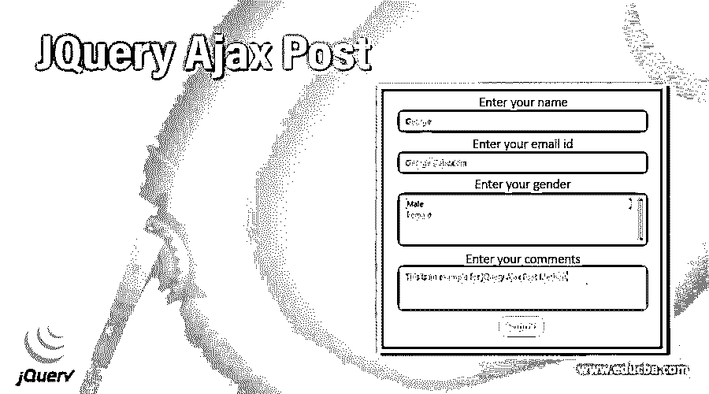
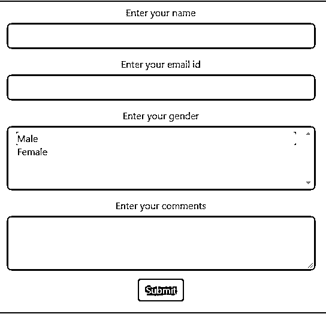
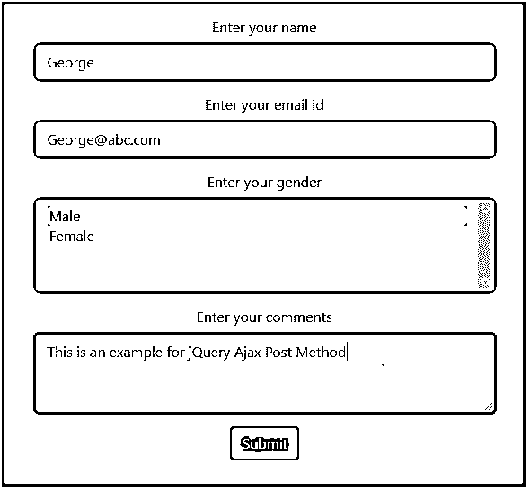
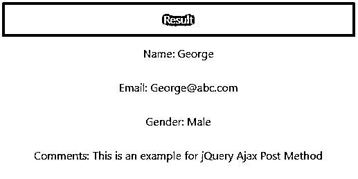
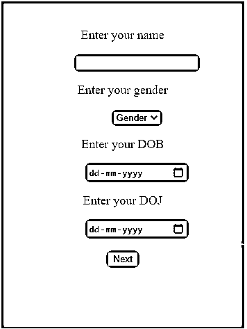
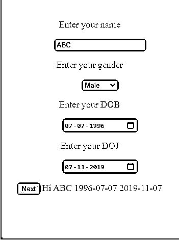

# JQuery Ajax 帖子

> 原文：<https://www.educba.com/jquery-ajax-post/>




## JQuery Ajax 简介

jQuery Ajax Post 方法向服务器发送异步 HTTP POST 请求，从服务器加载数据。Ajax(Asynchronous JavaScript And XML)是指与服务器交换数据，更新网页的一部分，而不需要重新加载整个页面。jQuery 提供了各种方法来实现 AJAX 功能。这个方法是其中的一种，通过发送 HTTP POST 请求，我们可以直接在 web 页面上加载来自服务器的数据。ajax() post 方法的快捷方式是$。发布()。

**语法**

<small>网页开发、编程语言、软件测试&其他</small>

```
$.post(url, [data], [callback(data, status, xhr)], [type])
```

在哪里，

url 是指请求被发送到的获取数据的 URL。

Data 是一个可选参数，表示随请求一起发送到服务器的 json 数据。

Callback (data，status，xhr)也是一个可选参数，它引用在发送请求并成功加载数据后要执行的函数。

*   数据是指服务器响应中包含的数据
*   状态是指请求的状态，如成功、错误、超时、未修改等。
*   xhr 引用 XMLHttpRequest 对象。

type 也是一个可选参数，它指定将作为响应从服务器返回的数据类型，例如 json、jsonp、xml、html、脚本和文本。

### jQuery Ajax Post 是如何工作的？

jQuery Ajax Post 方法，或简称为$。post()方法使用 HTTP POST 方法向 web 服务器发出异步请求，并以 HTML、XML、JSON 等格式从服务器加载数据作为响应。

下面给出了使用 ajax 向服务器发送 POST 请求的示例

```
$.ajax({
type: "POST",
url: url,
data: data,
dataType: ‘json’,
success: function(){
//success code here
},
error: function(){
//error code here
}
});
```

在上面的格式中，第一个参数是“type”，它表示对服务器的调用类型；这里，是 POST 向服务器发送 HTTP POST 请求。

第二个参数是 url，我们希望向其发送 HTTP POST 请求以提交我们的数据。

第三个参数是通过 POST 请求提交给服务器的数据。

第四个参数是成功回调函数，只有当请求成功并且服务器返回响应时，才会调用这个函数。反过来，回调函数有三个参数:data、status 和 jqXHR，其中 data 参数包含来自服务器的响应。

如果 AJAX POST 请求失败并抛出错误，就会调用错误回调。

最后一个参数是 dataType，这里指定为 JSON。这意味着，一旦 POST 请求成功，服务器将以 JSON 格式返回响应。

### jQuery Ajax Post 示例

现在让我们看看如何使用 post()方法发送数据并从服务器获得响应。

#### 示例#1

下面给出了一个实现 jQuery Ajax Post 方法的例子。

**代码:**

```
<html>
<head>
<title>jQuery Ajax POST Example</title>
<link
rel="stylesheet"
href="https://cdnjs.cloudflare.com/ajax/libs/twitter-bootstrap/4.1.2/css/bootstrap.min.css"
/>
<script src="https://cdnjs.cloudflare.com/ajax/libs/jquery/1.12.4/jquery.min.js"></script>
<script src="https://cdnjs.cloudflare.com/ajax/libs/twitter-bootstrap/4.1.2/js/bootstrap.min.js"></script>
<script type="text/javascript" language="javascript">
$(document).ready(function () {
$(".bin").click(function () {
var datastring = $("#Form").serialize();
$.ajax({
type: "POST",
url: "https://httpbin.org/post",
data: datastring,
dataType: "json",
success: function (data) {
var obj = JSON.stringify(data);
$(".result").append(
'</textarea></li><li class="list-group-item active">Result</li><li class="list-group-item">Name: ' +
data["form"]["name"] +
'</li><li class="list-group-item">Email: ' +
data["form"]["email"] +
'</li><li class="list-group-item">Gender: ' +
data["form"]["multiple"] +
'</li><li class="list-group-item">Comments: ' +
data["form"]["text"] +
"</li></ul></div>"
);
},
error: function () {
$(".result").append("Error occured");
},
});
});
});
</script>
<style>
#divstyle {
width: 600px;
height: 550px;
padding-top: 20px;
padding-left: 5px;
font-size: 16px;
text-align: center;
color: maroon;
background-color: cadetblue;
}
</style>
</head>
<body>
<div id="divstyle">
<div class="container text-center">
<form id="Form">
<div class="form-group">
<label for="FormControlInput">Enter your name</label>
<input
type="name"
name="name"
class="form-control"
id="FormControlInput"
/>
</div>
<div class="form-group">
<label for="FormControlInput">Enter your email id</label>
<input
type="email"
name="email"
class="form-control"
id="FormControlInput"
/>
</div>
<div class="form-group">
<label for="FormControlInput">Enter your gender</label>
<select
multiple
name="multiple"
class="form-control"
id="FormControlSelect"
>
<option selected>Male</option>
<option>Female</option>
</select>
</div>
<div class="form-group">
<label for="FormControlInput">Enter your comments</label>
<textarea
name="text"
class="form-control"
id="FormControlTextarea"
rows="3"
></textarea>
</div>
<button type="button" class="btn btn-primary bin">Submit</button>
</form>
<br />
<div class="result"></div>
</div>
</div>
</body>
</html>
```

**输出:**

*   当上面的代码被执行时，下面的屏幕显示。




*   在本例中，使用 AJAX POST 请求将表单数据发送到服务器，并将结果放入一个 div 中。




*   返回的响应采用 ajax 调用的数据类型中指定的 JSON 格式。




#### 实施例 2

下面是另一个实现 jQuery Ajax Post 方法的例子

**代码:**

```
<!DOCTYPE html>
<html>
<head>
<script
type="text/javascript"
src="https://ajax.googleapis.com/ajax/libs/jquery/1.11.2/jquery.min.js"
></script>
<script type="text/javascript">
jQuery("document").ready(function () {
jQuery(".FormBox1").submit(function () {
event.preventDefault();
var fields = jQuery("input", this).serializeArray();
jQuery("#response").empty();
jQuery.each(fields, function (i, field) {
jQuery("#response").append(field.value + " ");
});
jQuery
.ajax({
method: "POST",
url: "sampleData.php",
data: fields,
})
.done(function (message) {
console.log("Data Saved: " + message);
});
});
});
</script>
<style>
#response{
color: blue;
}
#divstyle {
width: 350px;
height: 450px;
padding-top: 20px;
font-size: 18px;
text-align: center;
color: maroon;
background-color: cadetblue;
}
</style>
</head>
<body>
<div id ="divstyle">
<div class="container">
<form class="FormBox1">
<dl>
<dd><input type="hidden" name="name" value="<?php echo ($_SESSION['myname']) ?>">
<input type="hidden" name="approve" value="Hi">
<input type="hidden"  name="id" value="<?php echo $_GET['id'];?>"/>
<dt><p>Enter your name</p>
<dd><input type="text" name="Fullname" id="text">
<dt><p>Enter your gender</p>
<dd><select name="gender" id="text">
<option value="0">Gender</option>
<option value="1">Male</option>
<option value="2">Female</option>
</select>
<dt><p>Enter your DOB</p>
<dd><input type="date" name="start" id="text">
<dt><p>Enter your DOJ</p>
<dd><input type="date" name="end" id="text"><hr>
<dt><button type="submit"  name="submit" class="btn" >Next</button></td>
</dl>
</div>
</div>
</body>
</html>
```

**输出**

*   当上面的代码被执行时，下面的屏幕显示。




*   单击按钮“Next”，使用 Ajax Post 方法提交表单数据，并显示下面的屏幕。




### 结论

*   在本文中，我们讨论了 Ajax Post 的 jQuery 实现
*   Ajax 指的是与 web 服务器交换数据，因此可以异步更新网页。
*   Ajax Post 是指向 web 服务器发送同步 HTTP POST 请求，从服务器加载数据。

### 推荐文章

这是一个关于 JQuery Ajax 的帖子。这里我们讨论 jQuery Ajax Post 是如何工作的，并给出了代码和输出的例子。您也可以看看以下文章，了解更多信息–

1.  [jQuery 重定向](https://www.educba.com/jquery-redirect/)
2.  [jQuery 滑块](https://www.educba.com/jquery-slider/)
3.  [jQuery UI 按钮](https://www.educba.com/jquery-ui-button/)
4.  [jQuery 包含](https://www.educba.com/jquery-contains/)


