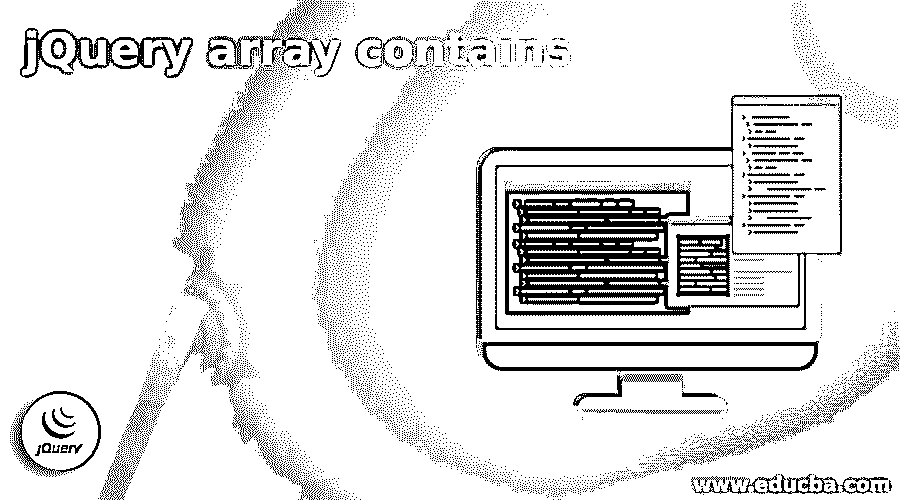
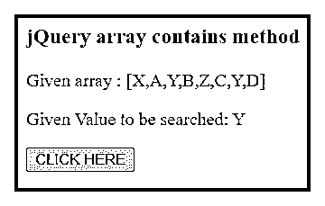
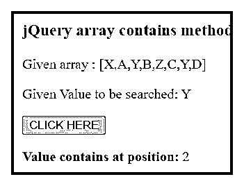
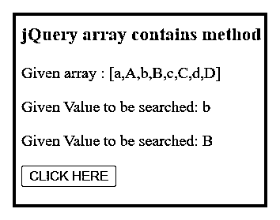
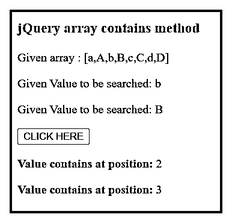
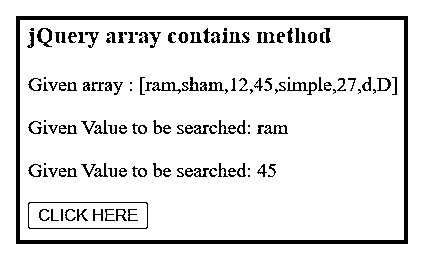
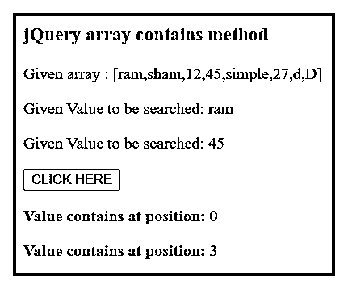
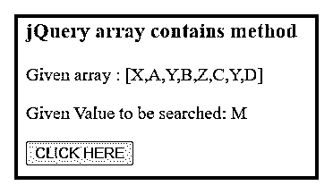
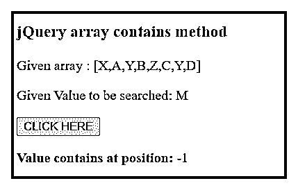

# jQuery 数组包含

> 原文：<https://www.educba.com/jquery-array-contains/>




## jquery 数组简介包含

jQuery 数组包含检查所需信息是否可用的方法。该方法使用 jQuery 技术验证数组中“包含数据所需的内容”。

contains 是一个选择器，用于选择或指定数组数据中所需的值。该数组不改变原始数组值。

<small>网页开发、编程语言、软件测试&其他</small>

contains 是从数组中查找特定值的方法。如果数组存储了多个相似的值，那么包含运算符将显示第一个值。此数组包含从数组列表中的 0 个索引开始的运算符。

### jQuery 数组包含概述

*   jQuery 数组包含使用索引位置显示数组中所需值的运算符。
*   如果该值在数组中可用，那么 jQuery 数组包含一个显示预期值的索引位置的方法。
*   如果该值在数组中不可用，则该方法显示“-1”值。
*   如果数组中有类似的值，则该方法返回第一个值的索引位置，并忽略其他值。
*   包含方法检查值是否为布尔形式。

### jQuery 数组包含方法

*   使用 jQuery 有两种方法可以检查包含值。
*   contains 运算符的第一个方法是将“jQuery.inArray()”与值一起使用。

jQuery.inArray(必选值，数组对象)；

*   在这里，您可以使用变量或对象创建数组。
*   用所需的值将该对象放入方法中。
*   检查该值是否可用。

*   contains 运算符的第二个方法是将“jQuery.inArray()”与值一起使用。

```
jQuery.inArray(required_value, array[value1, value2, …, valueN]);
```

*   在这里，您可以在 contains 方法中创建一个数组。
*   您可以将所需的值和数组同时放在方法中。
*   检查所需的值是否可用。

### 包含代码

*   下面的代码中使用了 contains 运算符的第一个方法。

```
var array_name = [value1, value2, value3, value4, value5];
var $variable_name = "value1";
jQuery.inArray(variable_name, array_name) );
```

*   第二个方法包含下面代码中的运算符用法。

```
var array_name = [value1, value2, value3, value4, value5];
jQuery.inArray("value" , array_name]) );
```

*   这段代码有助于从数组中找到所需值的位置。

### JQuery 数组包含示例

**示例:**包含简单字符示例和输出的方法如下所示。

```
<!DOCTYPE HTML>
<html>
<head>
<title> jQuery method </title>
<script src = "https://ajax.googleapis.com/ajax/libs/jQuery/3.5.1/jQuery.min.js"> </script>
</head>
<body>
<h3> jQuery array contains method </h3>
<p id = "jc1"> </p>
<p id = "jc2"> </p>
<button id = "bt"> CLICK HERE </button>
<p id = "jc3"> </p>
<script>
var array_value = ["X", "A", "Y", "B", "Z", "C", "Y", "D"];
var req_val = "Y";
document.getElementById("jc1").innerHTML = " Given array : [" + array_value + "]";
document.getElementById("jc2").innerHTML = " Given Value to be searched: " + req_val;
$("#bt").click(function(){
document.getElementById("jc3").innerHTML = " <b> Value contains at position: </b> " + $.inArray(req_val, array_value);
});
</script>
</body>
</html>
```

**点击按钮**前输出




**点击按钮**后输出




**示例**:包含了大写和小写字符示例的方法，输出如下所示。

```
<!DOCTYPE HTML>
<html>
<head>
<title> jQuery method </title>
<script src = "https://ajax.googleapis.com/ajax/libs/jQuery/3.5.1/jQuery.min.js"> </script>
</head>
<body>
<h3> jQuery array contains method </h3>
<p id = "jc1"> </p>
<p id = "jc2"> </p>
<p id = "jc5"> </p>
<button id = "bt"> CLICK HERE </button>
<p id = "jc3"> </p>
<p id = "jc4"> </p>
<script>
var array_value = ["a", "A", "b", "B", "c", "C", "d", "D"];
var req_val = "b";
var req_val1 = "B";
document.getElementById("jc1").innerHTML = " Given array : [" + array_value + "]";
document.getElementById("jc2").innerHTML = " Given Value to be searched: " + req_val;
document.getElementById("jc5").innerHTML = " Given Value to be searched: " + req_val1;
$("#bt").click(function(){
document.getElementById("jc3").innerHTML = " <b> Value contains at position: </b> " + $.inArray(req_val, array_value);
document.getElementById("jc4").innerHTML = " <b> Value contains at position: </b> " + $.inArray(req_val1, array_value);
});
</script>
</body>
</html>
```

**点击按钮**前输出




**点击按钮**后输出




**示例**:包含数字和字符串示例的方法，输出如下所示。

```
<!DOCTYPE HTML>
<html>
<head>
<title> jQuery method </title>
<script src = "https://ajax.googleapis.com/ajax/libs/jQuery/3.5.1/jQuery.min.js"> </script>
</head>
<body>
<h3> jQuery array contains method </h3>
<p id = "jc1"> </p>
<p id = "jc2"> </p>
<p id = "jc5"> </p>
<button id = "bt"> CLICK HERE </button>
<p id = "jc3"> </p>
<p id = "jc4"> </p>
<script>
var array_value = ["ram", "sham", 12, 45, "simple", 27, "d", "D"];
var req_val = "ram";
var req_val1 = 45;
document.getElementById("jc1").innerHTML = " Given array : [" + array_value + "]";
document.getElementById("jc2").innerHTML = " Given Value to be searched: " + req_val;
document.getElementById("jc5").innerHTML = " Given Value to be searched: " + req_val1;
$("#bt").click(function(){
document.getElementById("jc3").innerHTML = " <b> Value contains at position: </b> " + $.inArray(req_val, array_value);
document.getElementById("jc4").innerHTML = " <b> Value contains at position: </b> " + $.inArray(req_val1, array_value);
});
</script>
</body>
</html>
```

**点击按钮**前输出




**点击按钮**后输出




**示例:**没有包含值的 contains 方法示例和输出如下所示。

```
<!DOCTYPE HTML>
<html>
<head>
<title> jQuery method </title>
<script src = "https://ajax.googleapis.com/ajax/libs/jQuery/3.5.1/jQuery.min.js"> </script>
</head>
<body>
<h3> jQuery array contains method </h3>
<p id = "jc1"> </p>
<p id = "jc2"> </p>
<button id = "bt"> CLICK HERE </button>
<p id = "jc3"> </p>
<script>
var array_value = ["X", "A", "Y", "B", "Z", "C", "Y", "D"];
var req_val = "M";
document.getElementById("jc1").innerHTML = " Given array : [" + array_value + "]";
document.getElementById("jc2").innerHTML = " Given Value to be searched: " + req_val;
$("#bt").click(function(){
document.getElementById("jc3").innerHTML = " <b> Value contains at position: </b> " + $.inArray(req_val, array_value);
});
</script>
</body>
</html>
```

**点击按钮**前输出




**点击按钮**后输出




### 结论

contains 方法为用户和开发人员简化了数组值的位置。该方法只检查值在给定数组中是否可用。

大型数据处理，而不会干扰开发人员的数组及其值。此方法有助于维护数组及其索引位置。

contains 方法使用复杂的数据创建简单、用户友好、有吸引力的 web 应用程序。

### 推荐文章

这是一个包含 jQuery 数组的指南。这里我们讨论 jQuery 数组容器和方法的概述以及例子。您也可以看看以下文章，了解更多信息–

1.  [jQuery 插入](https://www.educba.com/jquery-insert/)
2.  [jquery ajax URL](https://www.educba.com/jquery-ajax-url/)
3.  [数据集 jQuery](https://www.educba.com/dataset-jquery/)
4.  [jQuery param()](https://www.educba.com/jquery-param/)


