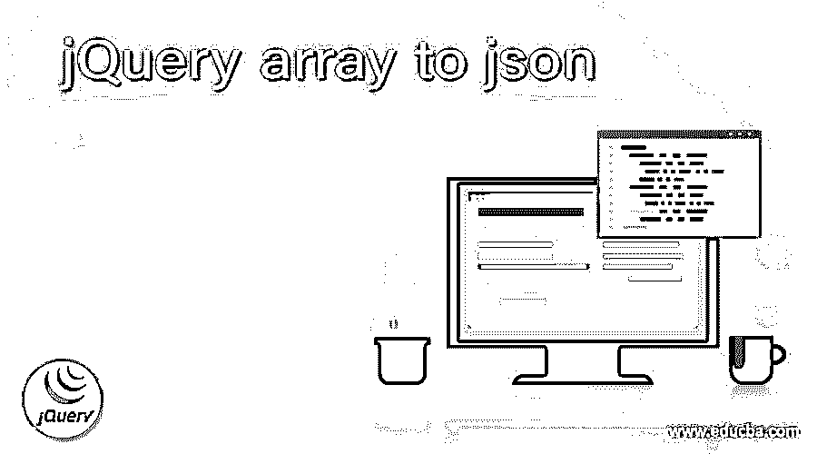
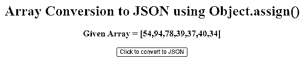
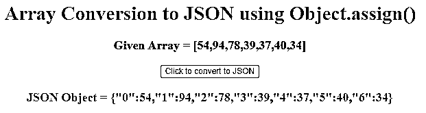
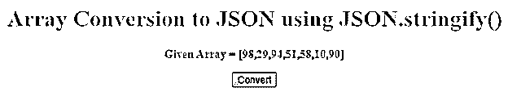
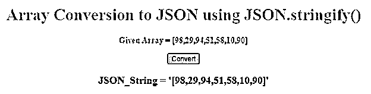

# json 的 jQuery 数组

> 原文：<https://www.educba.com/jquery-array-to-json/>




## json 的 jQuery 数组介绍

jquery 数组被定义为一个 JavaScript 库，该库被表示为一个变量，用于在声明的单个变量中存储多个值。此类变量在 jquery 数组中被称为数组变量，使用数组构造函数、文字符号、Javascript 中的隐式声明来声明。为了将 jQuery 中的此类数组转换为 JSON，Javascript 提供了各种技术，它们是 Object.assign()、JSON.stringify()以及在 jQuery 中创建数组，除了上述用于声明数组的方法之外，我们还可以使用 isArray()方法来完成。jquery 数组被转换为 JSON 格式，这导致将 jquery 中的给定数组或元素列表转换为 JSON 对象格式。

**语法:**

<small>网页开发、编程语言、软件测试&其他</small>

由于 JQuery 中 Javascript 提供了两种方法将数组转换成 JSON 对象格式。我们将在下一节看到这两种方法的语法。

**1。Object.assign()方法**

```
object.assign(target, sources);
```

**参数:**

**target:** 据说保存了需要从中复制对象值和属性的目的地目标对象。

**Source object:** 据说保存了值和属性必须复制到的对象的位置。

该方法接受这些参数，并将源对象放入目标对象中，然后该方法返回目标对象以及从该目标对象复制的属性和值。

**2。JSON.stringify()方法**

```
JSON.stringify(JQuery array)
```

**参数:**

Jquery array:这个参数保存 Javascript 对象，它是一个数组，这个数组在 Jquery array 中作为参数传递给 convert。

该方法返回作为参数传递给该函数的 Jquery 数组的字符串格式。

还有另外两个可选的参数可以使用，一个参数可以用于保存需要在数组中的任何项中指定替换的值，第二个参数可以用于用字符串或数字替换项之间的空格。

### 如何用例子把 Jquery 数组转换成 JSON 格式？

在本文中，要将 Jquery 中的数组转换为 JSON 格式，这可能是需要从任何 web 服务器发送或接收的数据。由于 Jquery 是一个 JavaScript 库，Jquery 中的数组类似于 JavaScript 中的数组，因此 JavaScript 提供了不同的技术来完成到 JSON 格式的转换。

有两种不同的方法可以将表示 Jquery 数组的 JavaScript 对象转换成 JSON 格式。它们是:

#### 1.分配(目标，源)

此方法主要用于将被视为源对象的项目复制到另一个称为目标对象的对象。因此，这些源对象充当数组的每一项，这些源对象被推送到存储这些源对象的目标对象，然后使用 JSON 方法将它们转换成 JSON。

**举例:**

在下面的例子中，让我们看看如何将项目分配为源对象，然后生成项目并存储在一个目标对象中，这又生成了数组格式，这意味着目标对象由一个数组组成。然后要将这个数组转换成 JSON，我们需要使用 JSON.stringify()方法，在这个例子中也是如此。

```
<!DOCTYPE html>
<html>
<head>
<title>
Convert array to JSON.
</title>
</head>
<body style = "text-align:center;" id = "body">
<h1 style = "color:Cyan;" >
Array Conversion to JSON using Object.assign()
</h1>
<p id = "ARR_ELE_UP" style = "font-size: 20px; color:red; font-weight: bold">
</p>
<button onclick = "Func_Run()">
Click to convert to JSON
</button>
<p id = "ARR_ELE_DOWN" style = "color:blue;
font-size: 20px; font-weight: bold;">
</p>
<script>
var arr_ele_up = document.getElementById("ARR_ELE_UP");
var arr_ele_down = document.getElementById("ARR_ELE_DOWN");
var arr1 = [54, 94, 78, 39, 37, 40, 34];
arr_ele_up.innerHTML = "Given Array = [" +arr1+"]";;
function Func_Run(){
arr_ele_down.innerHTML =
"JSON Object = "+JSON.stringify(Object.assign({}, arr1));
}
</script>
</body>
</html>
```

**输出:**




点击按钮后，输出为:




在上面的程序中，我们首先可以看到，当我们编写任何 JQuery 代码时，它都是在 HTML 代码的

#### 2.stringify()

在本文中，这个方法主要用于我们想要将数组或任何 JavaScript 对象转换为 JSON 格式的时候，我们在前面的例子中使用了这个方法，我们也看到了这个方法的用法。我们将传递一个被视为 JavaScript 对象的数组，作为将其转换为 JSON 格式数据的参数。因此，每当传递任何 JQuery 数组时，它首先被转换为字符串格式，显示为需要发送到任何服务器的 JSON 数据。

**举例:**

```
<!DOCTYPE html>
<html>
<head>
<title>
Convert array to JSON
</title>
</head>
<body style = "text-align:center;" id = "body">
<h1 style = "color:Cyan;" >
Array Conversion to JSON using JSON.stringify()
</h1>
<p id = "ARR_ELE_UP" style = "font-size: 16px; color:red; font-weight: bold" >
</p>
<button onclick = "Func_Run()">
Convert
</button>
<p id = "ARR_ELE_DOWN" style = "color:blue;
font-size: 20px; font-weight: bold;">
</p>
<script>
var arr_ele_up = document.getElementById("ARR_ELE_UP");
var arr_ele_down = document.getElementById("ARR_ELE_DOWN");
var arr1 = [98, 29, 94, 51, 58, 10, 90];
arr_ele_up.innerHTML = "Given Array = [" +arr1+"]";;
function Func_Run(){
arr_ele_down.innerHTML = "JSON_String = '"+JSON.stringify(arr1)+"'";
}
</script>
</body>
</html>
```

**输出:**




点击按钮后，输出为:




在上面的程序中，我们可以看到它与第一个示例类似，但是这个 JSON.stringify()方法用于将整个数组转换为单个字符串，因此我们可以与上面的方法区分开来，并且这个方法是第一个以 JSON 格式显示每个值和属性的数组值的示例，而在这个示例中，我们看到它只是将给定的数组转换为 JSON 格式的字符串或数据。

### 结论

在本文中，我们得出结论，Jquery 数组类似于 JavaScript 数组，因为 Jquery 是一个 JavaScript 库，因此每当开发人员想要转换 JQuery 或 JavaScript 中的数组格式时，我们可以使用这些方法中的任何一种，但这完全取决于开发人员需要将哪种 JSON 数据发送到服务器，是以值和属性格式还是仅字符串格式。

### 推荐文章

这是一个 jQuery 数组到 json 的指南。这里我们讨论如何将 Jquery 数组转换成 JSON 格式，并给出例子和输出。您也可以看看以下文章，了解更多信息–

1.  [jQuery 数组排序](https://www.educba.com/jquery-array-sort/)
2.  [jQuery 替换](https://www.educba.com/jquery-replace/)
3.  [jQuery map()](https://www.educba.com/jquery-map/)
4.  [jQuery preventDefault](https://www.educba.com/jquery-preventdefault/)


