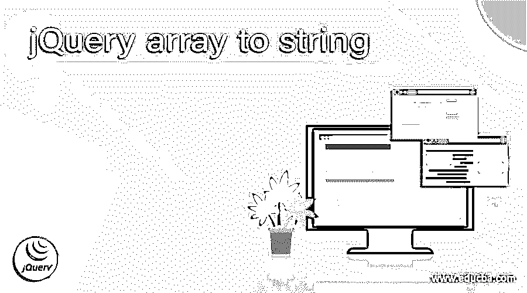
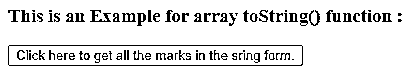
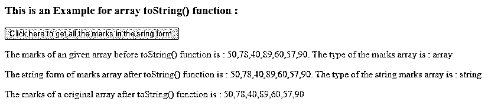
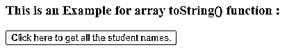
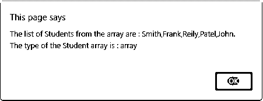
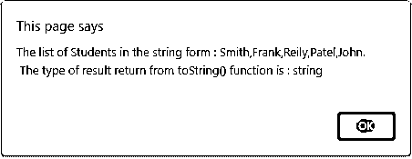
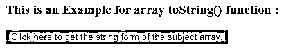
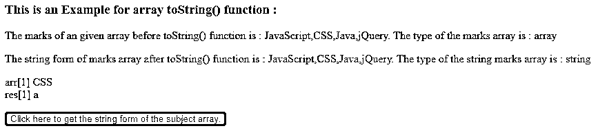

# jQuery 数组到字符串

> 原文：<https://www.educba.com/jquery-array-to-string/>




## jQuery 数组到字符串简介

jQuery array toString()函数用于将数组返回为字符串形式。jQuery array toString()函数是 jQuery 中用于 array 对象的内置函数。jQuery array toString()函数转换并返回一个包含所有数组值的字符串，其中用逗号分隔每个值，但是 array toString()函数不改变原始数组。

**jQuery 数组 toString()函数的语法—**

<small>网页开发、编程语言、软件测试&其他</small>

```
array.toString();
```

**参数:**

jQuery 数组 toString()函数不接受任何参数。

**返回值:**

此函数的返回值是包含所有指定数组元素的字符串，用逗号分隔。

### JQuery 数组 toString()函数的工作原理

JQuery array toString()函数用于返回字符串形式的数组；它不接受任何参数。假设我们有一个数字数组“no = [ 51，20，64，89，45，25]”；现在我们需要得到一个“no”数组的字符串形式。所以我们可以使用数组 toString()函数作为“var str = no . toString()；”，其中 str 是一个变量，存储 toString()函数的返回字符串结果“51，20，64，89，45，25”。

### jQuery 数组 toString()函数的示例

下面举几个例子

#### 示例#1

jQuery array toString()函数的示例，以字符串形式获取给定数组中所有学生的分数

**代码:**

```
<!doctype html>
<html lang="en">
<head>
<meta charset="utf-8">
<script src="https://code.jquery.com/jquery-3.5.0.js"></script>
<title> This is an example for jQuery array toString() function </title>
<style>
#p1 {
color: blue;
}
#p2 {
color: green;
}
#p3 {
color: red;
}
</style>
</head>
<body>
<h3> This is an Example for array toString() function : </h3>
<button onclick = "checkRes()" > Click here to get all the marks in the sring form. </button>
<p id = "p1"> </p>
<p id = "p2"> </p>
<p id = "p3"> </p>
<script>
var marks = [ 50, 78, 40, 89, 60, 57, 90 ];
function checkRes()
{
$( "#p1" ).text("The marks of an given array before toString() function is : " + marks);
$( "#p1" ).append(". The type of the marks array is : " +jQuery.type(marks));
var res = marks.toString();
$( "#p2" ).text("The string form of marks array after toString() function is : " + res);
$( "#p2" ).append(". The type of the string marks array is : " +jQuery.type(res));
$( "#p3" ).text("The marks of a original array after toString() function is : " + marks);
}
</script>
</body>
</html>
```

**输出:**




一旦我们点击按钮，输出是




在上面的代码中，创建了包含学生分数的数组。接下来，通过将 toString()函数用作“marks.toString()”来使用 toString()函数返回数组的字符串形式，我们可以在上面的输出中看到。

#### 实施例 2

jQuery array toString()函数的示例，用于获取给定数组中字符串形式的所有学生姓名。

**代码:**

```
<!doctype html>
<html lang="en">
<head>
<meta charset="utf-8">
<script src="https://code.jquery.com/jquery-3.5.0.js"></script>
<title> This is an example for jQuery array toString() function </title>
<style>
#p1 {
color : blue;
}
#p2 {
color : red;
}
</style>
</head>
<body>
<h3> This is an Example for array toString() function : </h3>
<button onclick = "checkRes()" > Click here to get all the student names. </button>
<p id = "p1"> </p>
<p id = "p2"> </p>
<script>
var Student = [ "Smith", "Frank", "Reily", "Patel", "John" ];
function checkRes()
{
alert( "The list of Students from the array are : " + Student+". \nThe type of the Student array is : " +jQuery.type(Student));
var res = Student.toString();
alert("The list of Students in the string form : " + res+ ".\n The type of result return from toString() function is : " +jQuery.type(res));
}
</script>
</body>
</html>
```

**输出:**




一旦我们点击按钮，输出是




单击“确定”后，输出是




在上面的代码中，创建了包含学生姓名的数组。接下来，使用 array toString()函数获得学生数组的字符串形式“student . toString()；”toString()函数返回学生数组的字符串形式，但它不改变原始的学生数组，正如我们在上面的输出中所看到的。

#### 实施例 3

jQuery array toString()函数的示例，用于获取给定数组中字符串形式的所有主题，并检查我们是否从字符串形式访问数组的元素

**代码:**

```
<!doctype html>
<html lang="en">
<head>
<meta charset="utf-8">
<script src="https://code.jquery.com/jquery-3.5.0.js"></script>
<title> This is an example for jQuery array toString() function </title>
<style>
#p1 {
color : blue;
}
#p2 {
color : red;
}
</style>
</head>
<body>
<h3> This is an Example for array toString() function : </h3>
<p id = "p1"> </p>
<p id = "p2"> </p>
<p id = "p3"> </p>
<button onclick = "checkRes()" style = "background-color : green" > Click here to get the string form of the subject array. </button>
<script>
var arr = new Array( "JavaScript", "CSS", "Java", "jQuery");
function checkRes()
{
$( "#p1" ).text("The marks of an given array before toString() function is : " + arr);
$( "#p1" ).append(". The type of the marks array is : " +jQuery.type(arr));
var res = arr.toString();
$( "#p2" ).text("The string form of marks array after toString() function is : " + res);
$( "#p2" ).append(". The type of the string marks array is : " +jQuery.type(res));
$( "#p3" ).append( "arr[1] " +arr[1] + "<br>" );
$( "#p3" ).append( "res[1] " +res[1] + "<br>" );
}
</script>
</script>
</body>
</html>
```

**输出:**




一旦我们点击按钮，输出是




在上面的代码中，创建了包含主题名称的数组。接下来，使用 array toString()函数获取主题数组的字符串形式，并尝试从字符串中获取数组元素，因为现在它是一个字符串，所以它在输出中只返回一个出现在该位置的字符，正如我们在上面的输出中看到的。

### 结论

jQuery array toString()函数是一个预定义的函数，用于将给定的数组返回为字符串形式。

### 推荐文章

这是一个 jQuery 数组到字符串的指南。在这里，我们讨论 JQuery 数组 toString()函数的工作方式，以及示例和输出。您也可以看看以下文章，了解更多信息–

1.  [jQuery 可见性](https://www.educba.com/jquery-visibility/)
2.  [jQuery 延期](https://www.educba.com/jquery-deferred/)
3.  [jQuery grep](https://www.educba.com/jquery-grep/)
4.  [jQuery 子选择器](https://www.educba.com/jquery-children-selector/)


