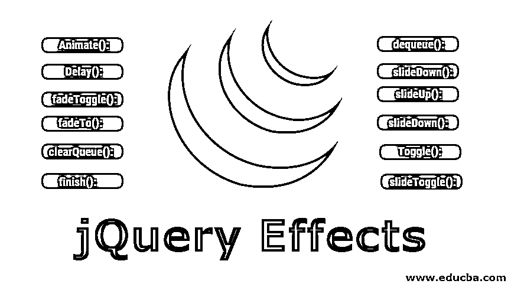

# jQuery 效果

> 原文：<https://www.educba.com/jquery-effects/>




## jQuery 效果介绍

jQuery 是最流行的 javascript 库之一，旨在简化 HTML DOM，即文档对象模型属性，如操作和树遍历。其他属性如事件处理、Ajax 和 CSS 动画也被简化。它是一个开源的免费库，在今天使用的 1000 万个网站中，有 73%使用它。jQuery 的核心特性包括基于 DOM 元素的选择器、操作和遍历，这使得处理 jQuery 更加容易和方便。在这个主题中，我们将学习 jQuery 效果。

它是用来提供一个非常简单的界面来做各种各样的惊人的效果。这些方法允许快速使用和应用最常用的功能-效果以及最少的配置。显示和隐藏元素的命令与任何希望看到它们的人所期望的几乎一样。Show()命令用于显示完整包装集合中的元素，而 [hide()命令用于](https://www.educba.com/jquery-hide/)隐藏它们。

<small>网页开发、编程语言、软件测试&其他</small>

### 不同的 jQuery 效果方法

这里我们讨论一些不同类型的 jQuery 效果方法

#### 1)动画()

animate 方法用于为一组 CSS 属性执行基于自定义的动画。此方法用于将元素的状态从一种状态改变为另一种状态以及 CSS 样式。属性值逐渐改变，从而可以实现动画效果。需要注意的是，只有数值可以被动画化，比如 margin: 40px。另一方面，字符串的值不能是动态的，如背景色:绿色。这又是一个例外，比如 show、hide 和 toggle 字符串。

**语法**

```
(selector).animate({styles}, duration, easing, callback)
```

**例子**

```
$("label").click(func(){
$("#box").animate({height: "100px"});
});
```

#### 2)延迟()

顾名思义，这个函数用于设置在所选元素上排队的所有函数的延迟。

**语法**

```
$(selector).delay(duration, NameOfQueue)
```

**例子**

```
$("label").click(func(){
$("#div1").delay("fast").fadeOut();
$("#div2").delay("slow").fadeIn();
});
```

#### 3) fadeToggle()

该功能用于在不同框上的淡入和淡出功能之间切换。如果任何元素淡出，那么这个函数 [fadeToggle()可以用来](https://www.educba.com/jquery-fadetoggle/)淡入它们。隐藏表单中的元素不会显示为该方法的一部分。

**语法**

```
$(selector).fadeToggle(duration, easing, callback)
```

**例子**

```
$("label").click(func(){
$("#box").fadeToggle();
});
```

#### 4) fadeTo()

该方法用于逐渐改变所有

即段落相关元素的不透明度。本文中指定的不透明度是指变化效果不透明度。

**语法**

```
$(selector).fadeTo(duration, opacity, easing, callback)
```

**例子**

```
$("label").click(func(){
$("p").fadeTo(100, 0.9);
});
```

#### 5) clearQueue()

这种方法与顾名思义是一样的。这用于清除队列，并从队列中删除尚未运行的所有项目。一旦函数开始运行，它将完成它的运行。这与两种方法有关，即队列()和出列()。

**语法**

```
$(selector).clearQueue(NameOfQueue)
```

**例子**

```
$("label").click(func(){
$("box").clearQueue();
});
```

#### 6)完成()

在 [jQuery 中的这个方法用于](https://www.educba.com/jquery-show/)结束或完成当前运行的 animator，因为它用于停止当前运行的所有动画，并用于移除所有排队的动画。它还用于完成各种选定元素的所有动画。此方法类似于。有两个真参数的停止。此方法和 finish 的主要区别在于，finish 方法用于停止和暂停所有排队动画的 CSS 元素属性类型。

**语法**

```
$(selector).finish(NameOfQueue)
```

**例子**

```
$("#complete").click(func(){
$("div1").finish();
});
```

#### 7)出列()

此方法用于从队列中移除下一个函数，然后用于执行该函数。队列是管道中等待运行的一个或多个函数。此出列方法与队列方法一起使用。一个元素可以有几个队列。fx 队列是最常见的队列，也是默认队列。

**语法**

```
$(selector).dequeue(NameOfQueue)
```

**例子**

```
$("label").queue(func(){
$("</a>").css("background-color", "black");
$("div").dequeue();
});
```

#### 8)下滑()

这是 jQuery 中另一个有用的方法，用来向下滑动或显示选中的元素列表。这里要注意的一点是，它也适用于隐藏格式的元素，在 CSS 的情况下，显示类型显示为 none，但是不需要隐藏可见性。

**语法**

```
$(selector). slideDown (duration, easing, callback)
```

**例子**

```
$("label").queue(func(){
$("p").slideDown();
});
```

#### 9) slideUp()

[slideUp()方法](https://www.educba.com/jquery-slideup/)用于隐藏所有< p >选中的元素。隐藏表单中的元素根本不会显示。因此，这不会影响页面的布局。

**语法**

```
$(selector).slideUp(duration, easing, callback)
```

**例子**

```
$("label").queue(func(){
$("p").slideUp();
});
```

#### 10)下滑()

与 slideUp()方法相反，该方法用于显示所有隐藏的

元素。这个 slidedown()方法作用于所有的元素，这些元素也与隐藏的方法相关，例如 [jQuery methods](https://www.educba.com/jquery-methods/) ，名称也显示在 CSS 中，但是不隐藏可见性。

**语法**

```
$(selector).slideDown(duration, easing, callback)
```

**例子**

```
$("label").queue(func(){
$("p").slideDown();
});
```

#### 11)切换()

该方法用于在各种基于

的元素的显示和隐藏之间切换。此方法用于检查元素的可见性。show()方法用于在元素隐藏时运行。即使元素可见，Hide()也会运行。show 和 hide 方法的组合产生了一种切换效果，因此方法 toggle()。

**语法**

```
$(selector).toggle(duration, easing, callback)
```

**例子**

```
$("label").queue(func(){
$("p").toggle();
});
```

#### 12)滑动开关()

该方法用于在基于段落的所有元素的 slideUp()和 slideDown()函数之间切换。此方法用于检查为可见性而选择的元素。当元素被隐藏时，可以看到 SlideDown()函数正在运行。相反，如果 slideUp()元素可见，则应该运行该元素。

**语法**

```
$(selector).slideToggle(duration, easing, callback)
```

**例子**

```
$("label").queue(func(){
$("p").slideToggle();
});
```

jQuery 通过提供大量可以放在不同选择器上的函数，使我们能够在网页上添加效果。这取决于你，你希望如何使你的网站看起来更有效果。希望你喜欢我们的文章。请继续关注我们的博客，获取更多类似的文章。

### 推荐文章

这是一个 jQuery 效果指南。在这里，我们已经讨论了不同类型的 jQuery Effects 方法的语法和示例。您也可以阅读以下文章，了解更多信息——

1.  [jQuery 备选方案](https://www.educba.com/jquery-alternatives/)
2.  [jQuery querySelector](https://www.educba.com/jquery-queryselector/)
3.  [jQuery delay()](https://www.educba.com/jquery-delay/)
4.  [jQuery val()](https://www.educba.com/jquery-val/)


