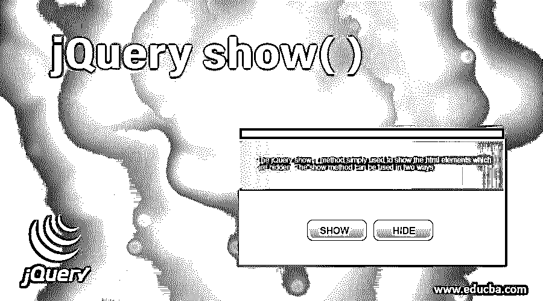
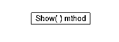
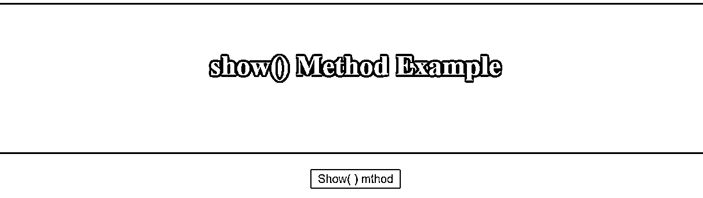
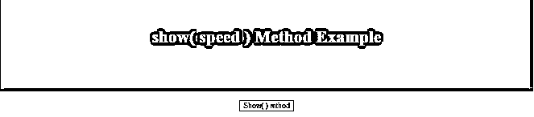
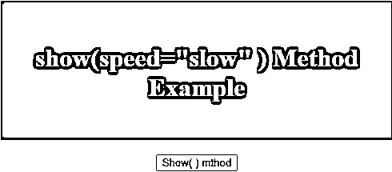
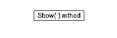
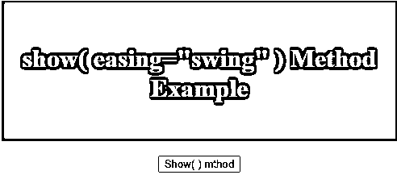
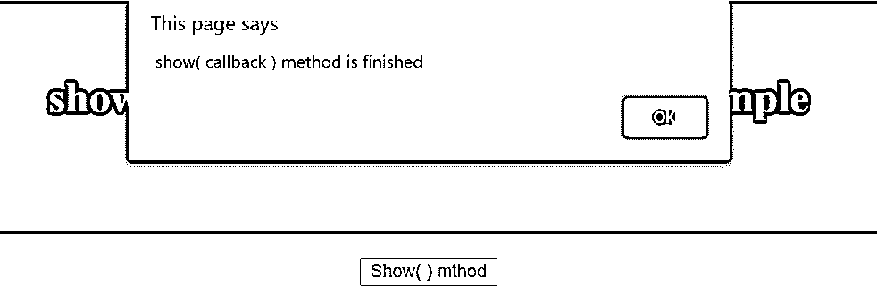

# jQuery show()

> 原文：<https://www.educba.com/jquery-show/>




## jQuery show()简介

jQuery show()方法只是用来显示隐藏的 html 元素。show 方法有两种用法。

1.一种方法是不带任何参数，如下所示:

<small>网页开发、编程语言、软件测试&其他</small>

```
show();
```

上面的方法不带任何参数，显示了[个选中的 html 元素](https://www.educba.com/html-form-elements/)。

2.第二种方法是使用控制动画速度的参数，如下所示:

```
show(speed, easing, callback);
```

上述方法以三种方式接受三个参数:

*   **显示(速度)；–**速度参数指定此效果的持续时间。
*   **显示(速度，回调)；–**速度参数指定此效果的持续时间，如“慢”、“快”以及以毫秒为单位的数值。callback 参数指定调用 show()方法后要执行的操作。
*   **显示(速度、缓和、回调)；–**speed 和 callback 参数同上，easing 是一个类似 linear 的字符串值，并摆动两个值，这两个值用于指定在显示所选 html 元素时要运行的 easing 函数。

### jQuery show()的例子

下面是更详细解释的 jQuery show()的例子。

#### 示例 1–对于 show()方法

下面是 show()方法的一个例子，用来理解这个不传递任何参数的方法的用法。

**语法:**

```
selector.show();
```

**代码:**

```
<!DOCTYPE html>
<html>
<head>
<title>  The jQuery example for show() Method </title>
<style>
#bdr {
border: 2px solid black;
padding-top: 30px;
height: 140px;
background: red;
display: none;
}
</style>
<script src= "https://ajax.googleapis.com/ajax/libs/jquery/3.3.1/jquery.min.js" >
</script>
</head>
<body style = "text-align:center;">
<div id= "bdr">
<h1 style = "color:white;" >
show() Method Example
</h1>
</div><br>
<button id = "bttn">
Show( ) mthod
</button>
<!-- Script to show display:none content -->
<script>
$(document).ready(function() {
$("#bttn").click(function() {
$("#bdr").show();
});
});
</script>
</body>
</html>
```

**输出:**




按钮按下后:




#### 示例# 2–展示(速度)方法

下面是 show( speed)方法的一个示例，用来理解该方法的用法，该方法将速度参数作为 2000 毫秒即 2 秒来传递。

**语法:**

```
selector.show(speed, [easing], [callback]);
```

**代码:**

```
<!DOCTYPE html>
<html>
<head>
<title>  The jQuery example for show() Method </title>
<style>
#bdr {
border: 2px solid black;
padding-top: 30px;
height: 140px;
background: red;
display: none;
}
</style>
<script src= "https://ajax.googleapis.com/ajax/libs/jquery/3.3.1/jquery.min.js" >
</script>
</head>
<body style = "text-align:center;">
<div id= "bdr">
<h1 style = "color:white;" >
show( speed ) Method Example
</h1>
</div><br>
<button id = "bttn">
Show( ) mthod
</button>
<script>
$(document).ready(function() {
$("#bttn").click(function() {
$("#bdr").show(2000);
});
});
</script>
</body>
</html>
```

**输出:**


按下按钮后，显示消息“显示(速度)方法示例”的红色框显示 2 秒钟，就像框显示后显示的输出一样:




#### 示例# 3–展示(速度)方法

下面是 show( speed)方法的一个示例，用于理解该方法的用法，该方法将速度参数作为“slow”传递，也可以尝试使用 speed="fast ":

**代码:**

```
<!DOCTYPE html>
<html>
<head>
<title>  The jQuery example for show() Method </title>
<style>
#bdr {
border: 2px solid black;
padding-top: 30px;
height: 140px;
background: red;
display: none;
}
</style>
<script src= "https://ajax.googleapis.com/ajax/libs/jquery/3.3.1/jquery.min.js" >
</script>
</head>
<body style = "text-align:center;">
<div id= "bdr">
<h1 style = "color:white;" >
show(speed="slow" ) Method Example
</h1>
</div><br>
<button id = "bttn">
Show( ) mthod
</button>
<script>
$(document).ready(function() {
$("#bttn").click(function() {
$("#bdr").show("slow");
});
});
</script>
</body>
</html>
```

**输出:**


按下按钮后，显示消息“show(speed =“slow”)的红色框方法示例“show slowly ”,就像显示框显示后的输出一样:




#### 示例 4–显示(放松)方法

下面是 show( speed)方法的一个示例，用于理解该方法的用法，该方法将速度参数作为“slow”传递，将放松作为“swing”传递:

**代码:**

```
<!DOCTYPE html>
<html>
<head>
<title>  The jQuery example for show( easing ) Method </title>
<style>
#bdr {
border: 2px solid black;
padding-top: 30px;
height: 140px;
background: red;
display: none;
}
</style>
<script src= "https://ajax.googleapis.com/ajax/libs/jquery/3.3.1/jquery.min.js" >
</script>
</head>
<body style = "text-align:center;">
<div id= "bdr">
<h1 style = "color:white;" >
show( easing="swing" ) Method Example
</h1>
</div><br>
<button id = "bttn">
Show( ) mthod
</button>
<script>
$(document).ready(function() {
$("#bttn").click(function() {
$("#bdr").show("slow","swing"); <!-- or just show("swing") -->
});
});
</script>
</body>
</html>
```

**输出:**




按下按钮后，显示消息“show(speed =“slow”)的红色框方法示例“show slowly ”,就像显示框显示后的输出一样:




#### 示例 5–显示(回调)方法

下面是 show( callback)方法的一个示例，用于理解该方法的用法，该方法将速度参数作为“slow”和 callback 传递:

**代码:**

```
<!DOCTYPE html>
<html>
<head>
<title>  The jQuery example for show( callback ) Method </title>
<style>
#bdr {
border: 2px solid black;
padding-top: 30px;
height: 140px;
background: red;
display: none;
}
</style>
<script src= "https://ajax.googleapis.com/ajax/libs/jquery/3.3.1/jquery.min.js" >
</script>
</head>
<body style = "text-align:center;">
<div id= "bdr">
<h1 style = "color:white;" >
show( callback ) Method Example
</h1>
</div><br>
<button id = "bttn">
Show( ) mthod
</button>
<script>
$(document).ready(function() {
$("#bttn").click(function() {
$("#bdr").show("slow","swing", function(){
alert(" show( callback ) method is finished ");
});
});
});
</script>
</body>
</html>
```

**输出:**


按下该按钮后，带有消息“show( callback ) method example”的红色框缓慢显示并提示消息，如下所示，显示框显示后的输出:




### 结论

jQuery show()方法只是用来显示隐藏的 html 元素。show 方法有两种用法。

*   一种方法是不带任何参数，因为 show()这个方法不带任何参数，显示选中的 html 元素。
*   第二种方法是用控制动画速度的参数来显示(速度、缓动、回调)。

速度参数指定这种效果的持续时间，如“慢”、“快”以及以毫秒为单位的数值。callback 参数指定调用 show()方法后要执行的操作。缓动是一个类似线性的字符串值，并摆动两个值，这两个值用于指定在显示所选 html 元素期间要运行的缓动函数。

### 推荐文章

这是 jQuery show()的指南。这里我们讨论 jQuery show()方法的介绍和各种例子，并附带代码实现。你也可以看看下面的文章来了解更多-

1.  [jQuery hover()](https://www.educba.com/jquery-hover/)
2.  [jQuery Clone()](https://www.educba.com/jquery-clone/)
3.  [jQuery prepend()](https://www.educba.com/jquery-prepend/)
4.  [jQuery 父节点](https://www.educba.com/jquery-parent/)


