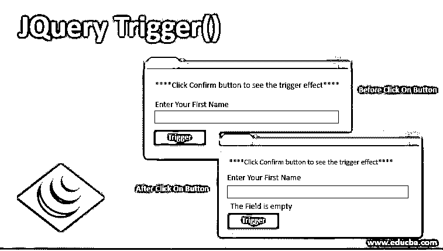
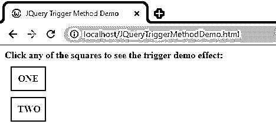
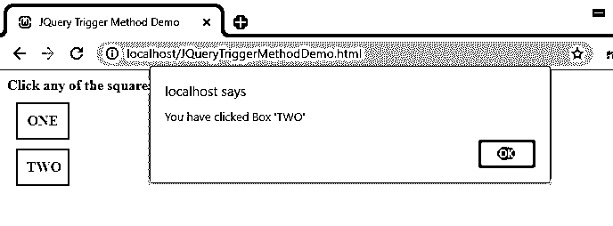
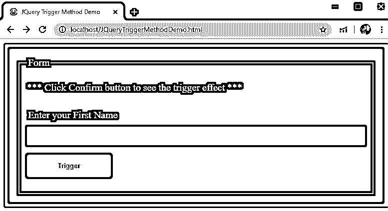
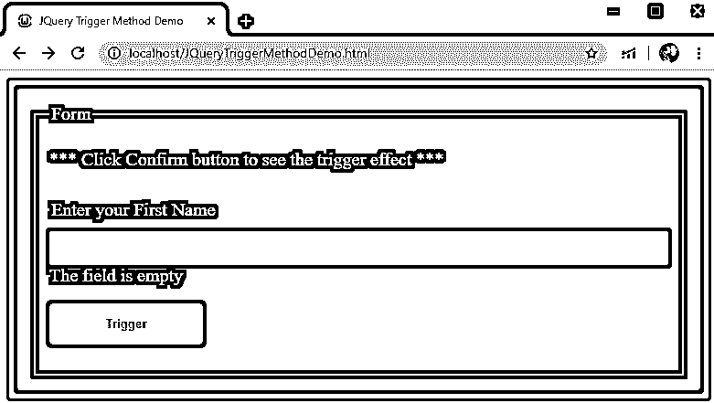

# JQuery 触发器()

> 原文：<https://www.educba.com/jquery-trigger/>




## JQuery 触发器介绍()

事件处理程序在与一起使用时被触发。on()方法或类似类型的方法以及其他快捷方法，例如。onclick()，。onmouseover()等等。将 even 处理程序与一起使用时，默认情况下会触发 even 处理程序。on()方法，当它们各自的事件发生时。但是，这些事件处理程序也可以手动触发。这可以在的帮助下完成。触发器()方法。当事件处理程序使用。trigger()方法，事件处理程序以非常相似的方式执行，如果这些事件处理程序是使用。on()方法。

的。trigger()方法是 jQuery 中提供的一个函数，它允许我们在选择一个元素时触发另一个特定的事件或事件处理程序。触发的事件不仅限于基于浏览器。我们的。trigger 方法触发一个特别提到的事件，默认情况下，还触发所选元素的事件行为(如提交表单)。的。触发方法几乎类似于。triggerHandler()方法，但是。triggerHandler()方法不触发元素的默认性质或行为。

<small>网页开发、编程语言、软件测试&其他</small>

**语法:**

```
$(selector).trigger( event, [data] )
```

或者

```
$(selectedElement).trigger(SpecifiedEvent, Parameter 1, Parameter 2…)
```

**参数:**

*   **Event[或 SpecifiedEvent]:** 这是该方法的必需参数。指定要触发的事件类型或对象。它可以是任何自定义事件，也可以不是标准事件。
*   **data[或参数 1 和 2]:** 这些是可选参数，作为参数传递给我们的事件处理程序。

### JQuery 触发器()的示例

以下是 jquery trigger()方法的示例:

#### 示例#1

让我们看一个例子。下面是一个简单的示例，显示了。触发方法。在下面的示例中，当我们单击块“一”时，将触发块“二”的“单击”事件

**代码:**

```
<!doctype html>
<html>
<head>
<meta charset="utf-8">
<title> JQuery Trigger Method Demo </title>
<script src = "https://ajax.googleapis.com/ajax/libs/jquery/3.4.1/jquery.min.js" > </script>
<style>
div {
padding: 10px;
margin: 10px;
width: 60px;
border: 1px solid #000;
border-width: 2px;
}
</style>
</head>
<body>
 Click any of the squares to see the trigger demo effect: 
<br>
<div id = "Div_One" style = "background-color:#0CC; text-align:center"> <b> ONE </b> </div>
<div id = "Div_Two" style = "background-color:#0CC; text-align:center"> <b> TWO </b> </div>
<!-- Below is the script used to trigger, trigger () method -->
<script type = "text/javascript" language = "javascript" >
$(document).ready(function() {
$("#Div_One").click( function () {
$("#Div_Two").trigger('click') ;
});
$("#Div_Two").click( function () {
alert ( "You have clicked Box 'TWO' " ) ;
});
});
</script>
</body>
</html>
```

**输出:**




当用户点击块“一”时，显示一个警告:




当用户点击块“二”时，显示一个警告:


请注意，这两个警报是相同的。发生这种情况的原因如下:

*   当用户单击 id 为“Div_One”的块“ONE”时，它会触发 id 为“Div_Two”的“Click”方法。当 Div_One 发生 click 事件时，会触发“Div_Two”的“Click”事件，进而显示上面显示的警报。
*   当用户点击块“TWO”时，用户点击 id“Div _ TWO”，如上所述，这在点击事件时显示警告。

#### 实施例 2

下面再看一个例子。

**代码:**

```
<!doctype html>
<html>
<head>
<meta charset="utf-8">
<title> JQuery Trigger Method Demo </title>
<script src="https://ajax.googleapis.com/ajax/libs/jquery/3.4.1/jquery.min.js"> </script>
<style>
/*  For styling  */
* {
box-sizing: border-box;
}
input[type=text] {
width: 100%;
border: 1px solid #ccc;
padding: 10px;
border-radius: 3px;
}
label {
display: inline-block;
padding: 12px 10px 12px 2px;
}
.container {
background-color: #99C;
border-radius: 3px;
padding: 8px;
}
body {
font-family: "Open Sans";
font-size: 20px;
}
form {
padding: 20px;
background:#300;
color: #ff9;
-moz-border-radius: 3px;
-webkit-border-radius: 5px;
border-radius: 4px;
}
/* Set the styling for the Trigger button */
.registerbtn {
background-color:#9C6;
color:#030;
border: none;
padding: 15px 0px;
margin: 19px 0px;
cursor: pointer;
border-radius: 5px;
float: left;
}
@media screen and (max-width: 600px) {
.row {
width: 100%;
margin-top: 0;
}
}
.registerbtn:hover {
opacity: 4;
}
form .error {
color: #ff0009;
}
</style>
</head>
<body>
<div class="container">
<form class="form" id="MyForm" name="MyForm">
<fieldset>
<legend> Form </legend>
<p> *** Click Confirm button to see the trigger effect *** </p>
<div class="row">
<label for="FName"> Enter your First Name </label>
<input id="name" name = "FName" type = "text" value = "">
</div>
<div class="row">
<input class="registerbtn" id="check" value="Trigger" style="text-align:center; font-weight:bold">
<br>
</div>
</fieldset>
</form>
</div>
<!-- Script for triggering function “Focus” when user clicks “Trigger” button -->
<script>
$(document).ready(function() {
$("#check").click(function() {
$("#name").trigger("click");
});
$("#name").click(function(){
$("#name").after("The field is empty");
});
});
</script>
</body>
</html>
```

**输出:**




当用户点击“触发”按钮时，我们得到以下文本:




**注意以下几点:**

当用户点击按钮时，jQuery 调用“.trigger()"函数下的" Click "方法。

```
$("#check").click(function() {
$("#name").trigger("click");
});
```

它通过触发 id“# name”的“Click”方法来显示我们的文本。

```
$("#name").click(function(){
$("#name").after("The field is empty");
});
```

如果用户在“input”字段中单击，也会显示该文本，因为我们有显示文本的 id“# name”的原始“Click”方法。

因此，事件“在输入文本字段内单击”和“在按钮上单击，这又触发了在文本字段内单击的方法”。

从 jQuery 1.3 开始，使用。trigger()方法在 DOM 树中冒泡，并产生触发事件的多个实例，这可以通过使用事件处理程序或调用来避免。stopPropagation()方法。

### 推荐文章

这是 JQuery Trigger()的指南。在这里，我们讨论介绍和语法，以及不同的例子和它的代码实现。您也可以阅读以下文章，了解更多信息——

1.  [jQuery mouseout()](https://www.educba.com/jquery-mouseout/)
2.  [JQuery 最近的](https://www.educba.com/jquery-closest/)
3.  [jQuery hide()](https://www.educba.com/jquery-hide/)
4.  [jQuery unwrap()](https://www.educba.com/jquery-unwrap/)


