# 在 jQuery 中制作动画

> 原文：<https://www.educba.com/animate-in-jquery/>

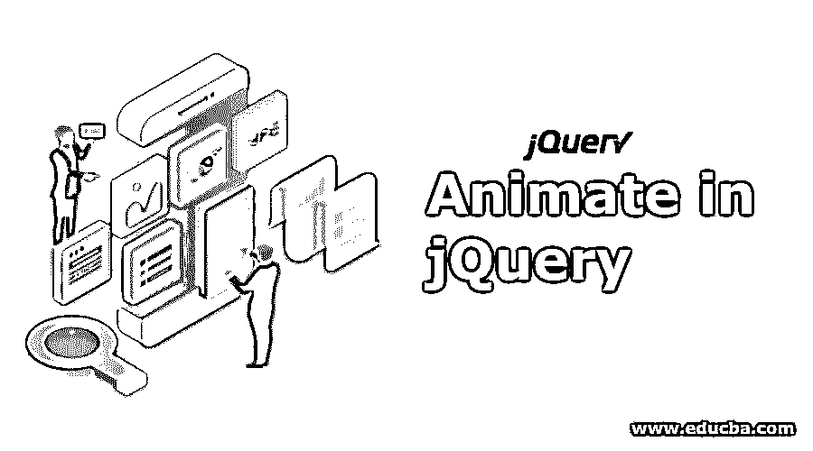


## jQuery 动画简介

jQuery 中的 Animate()是一个预定义的函数，它使用 CSS 属性在队列和切换功能的帮助下执行顺序或非顺序动画定制。这个函数的语法是' $(选择器)。animate(properties，options)'，其中包含许多 CSS 属性和参数。常用的参数是 duration、easing 和 function，类似于其他 jQuery 函数，还有其他参数，如 queue、complete、start、done、fail 和 step。

**语法:**

<small>网页开发、编程语言、软件测试&其他</small>

```
 $(selector).animate(properties, options);
```

**属性:**

1.  它指定要制作动画的 CSS 属性。
2.  它包含许多参数。

**参数:**

以下是参数的详细信息:

*   **时长:**时长可以是字符串，也可以是数字。它可以是以毫秒为单位的时间，也可以是预设的时间。持续时间的默认值是 400 毫秒。它可以将 slow、fast 或 normal 作为字符串参数。这有助于我们根据需求控制幻灯片动画。
*   **缓动:**缓动应为字符串类型。它用于过渡。默认值为 swing。
*   **函数:**动画完成后会执行一个可选的[回调函数。](https://www.educba.com/callback-function-in-jquery/)
*   **队列:**队列取布尔值。如果布尔值为真，则表明是否放置动画。如果布尔值为假，动画将立即开始。
*   **Complete:** 一旦一个元素的动画完成，这个函数就会被调用。
*   **Start:** 当一个元素上的动画开始时调用这个函数。
*   **Done:** 当一个元素上的动画完成时，这个函数被调用。
*   **失败:**该函数指定动画何时无法完成。
*   **步骤:**为动画中的每一步指定要执行的功能。

### jQuery 中的动画示例

下面给出了一些 jQuery 中的动画示例:

#### 示例#1

这是 animate()方法的一个例子。我们正在制作盒子高度和宽度的动画。

**代码:**

```
<!DOCTYPE html>
<html lang="en">
<head>
<meta charset="utf-8">
<title>Example of animate in jquery</title>
<script src="https://code.jquery.com/jquery-1.12.4.min.js"></script>
<script>
$(document).ready(function(){
$("#btn").click(function(){
$("#square").animate({height: "500px"}, "slow");
$("#square").animate({width: "500px"}, "slow");
});
});
</script>
</head>
<body>
<button id="btn">Animate height and width</button>
<div id="square" style="background:blue;height:100px;width:100px;margin:6px;"></div>
</body>
</html>
```

**输出:**

*   在点击动画高度和宽度按钮之前，框的高度和宽度是如下所示的默认值。

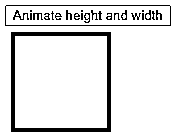


*   点击高度和宽度动画按钮后，框的高度和宽度增加到 500 像素。

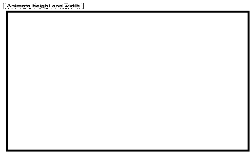


#### 实施例 2

使用 animate()方法制作顶部、底部、右侧和左侧的动画。在这方面，我们需要提供立场。该位置有 3 个值。它们是绝对的、固定的和相对的，我们可以根据自己的需要指定位置值。

**代码:**

```
<!DOCTYPE html>
<html lang="en">
<head>
<meta charset="utf-8">
<title>Example of animate in jquery</title>
<script src="https://code.jquery.com/jquery-1.12.4.min.js"></script>
<script>
$(document).ready(function(){
$("#btn").click(function(){
$("#box1").animate({bottom: '150px'});
$("#box2").animate({top: '150px'});
$("#box3").animate({right: '150px'});
$("#box4").animate({left: '150px'});
});
});
</script>
</head>
<body>
<button id="btn">Animate top, bottom, right and left</button>
<div id="box1" style="background:blue;height:100px;width:100px;margin:6px;position:relative;"></div>
<div id="box2" style="background:blue;height:100px;width:100px;margin:6px;position:relative;"></div>
<div id="box3" style="background:blue;height:100px;width:100px;margin:6px;position:relative;"></div>
<div id="box4" style="background:blue;height:100px;width:100px;margin:6px;position:relative;"></div>
</body>
</html>
```

**输出:**

*   在这个例子中，我们改变了盒子的位置。在点击按钮动画顶部、底部*、*右侧和左侧之前，它们处于静态位置。

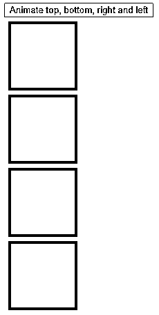


*   点击按钮动画顶部，底部，右侧和左侧的位置受到如下所示的影响。该框的位置相对于所提供的像素而改变。

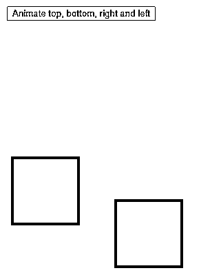


#### 实施例 3

使用 animate()方法的切换效果。

**代码:**

```
<!DOCTYPE html>
<html lang="en">
<head>
<meta charset="utf-8">
<title>Example of animate in jquery</title>
<script src="https://code.jquery.com/jquery-1.12.4.min.js"></script>
<script>
$(document).ready(function(){
$("#btn").click(function(){
$("#square").animate({width: 'toggle'});
});
});
</script>
</head>
<body>
<button id="btn">Animate width</button>
<div id="square" style="background:blue;height:100px;width:100px;margin:6px;"></div>
</body>
</html>
```

**输出:**

点击按钮前动画宽度**。**

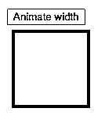


*   我们知道切换效应使得图像或内容显示或隐藏。因此，点击按钮动画宽度后，由于切换效果，该框是隐藏的，我们可以在下图中看到它。

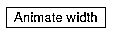


*   再次单击该按钮，我们可以看到框被显示出来。

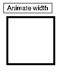


#### 实施例 4

使用 animate()方法更改字体大小。在这个例子中，最初，它将采用默认的字体大小。在 animate 方法中，我们甚至可以增加字体大小，因此我们将字体大小增加到 5em。

**代码:**

```
<!DOCTYPE html>
<html lang="en">
<head>
<meta charset="utf-8">
<title>Example of animate in jquery</title>
<script src="https://code.jquery.com/jquery-1.12.4.min.js"></script>
<script>
$(document).ready(function(){
$("#btn").click(function(){
$("#square").animate({fontSize: '3em'});
});
});
</script>
</head>
<body>
<button id="btn">Animate fontsize</button>
<div id="square" style="background:blue;height:300px;width:300px;margin:6px;">Change in fontsize by using animate method</div>
</body>
</html>
```

**输出:**

*   在点击动画字体大小按钮之前，我们可以看到字体大小是默认值。

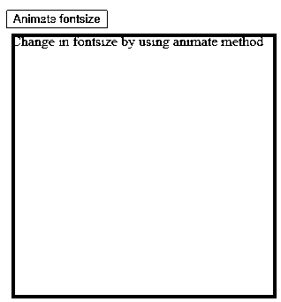


*   点击动画字体大小按钮后，我们可以看到字体大小增加到 5em，因为我们在 Animate()方法中提供了字体大小。

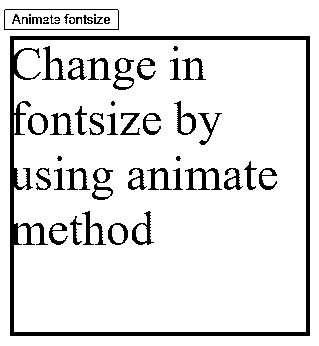


#### 实施例 5

animate 方法中使用了 How to queue 参数。

**代码:**

```
<html lang="en">
<body>
<script src="http://ajax.googleapis.com/ajax/libs/jquery/1.3.2/jquery.min.js"></script>
<script>
</script>
<style type="text/css">
div {
width: 150px;
height: 150px;
background-color: blue;
}
</style>
</head>
<body>
<div></div>
<br/>
<button id="animate">Click here</button>
<script type="text/javascript">
$("#animate").click(function() {
$("div").animate({
width: "250px",
height: "250px",
borderRadius: "50%",
marginLeft: "110px",
marginTop: "50px",
},
1000,
);
$("div").animate({width:'150px'},1000).animate({borderLeftWidth:'150px'},1000);
});
</script>
</body>
</html>
```

**输出:**

*   在单击按钮 click here 之前，我们可以观察如下所示的输出。

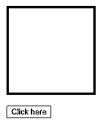


*   单击按钮 click here 后，我们可以观察到如下所示的输出。正方形将被转换成椭圆形。每个方法都被添加到队列中，并且一个接一个地按顺序出现。

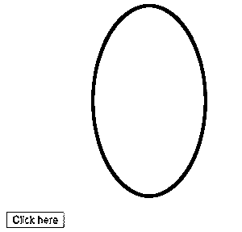


### 推荐文章

这是在 jQuery 中制作动画的指南。在这里，我们讨论动画方法的各种用途，这些方法将使我们的 web 应用程序更有吸引力，并帮助我们创建如此多的效果。您也可以看看以下文章，了解更多信息–

1.  [jQuery 中的幻灯片](https://www.educba.com/slide-in-jquery/)
2.  [JQuery 中选择器的类型](https://www.educba.com/types-of-selector-in-jquery/)
3.  [jQuery val()](https://www.educba.com/jquery-val/)
4.  [jQuery keydown()](https://www.educba.com/jquery-keydown/)


