# jQuery val()

> 原文：<https://www.educba.com/jquery-val/>

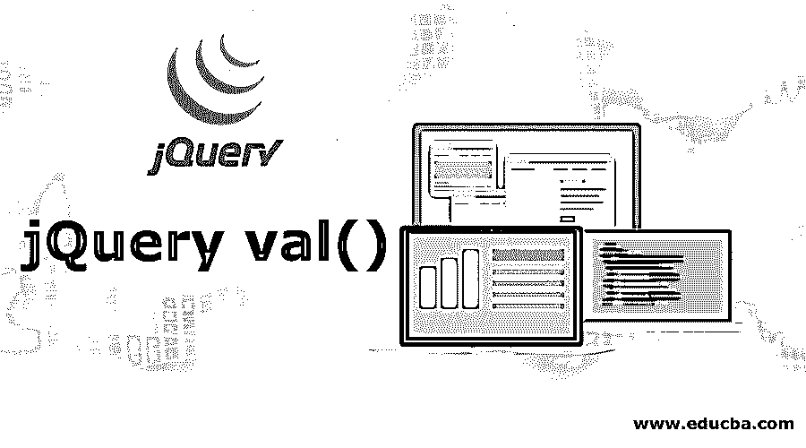


## **简介** jQuery **val()**

JQuery Val()是一种用于与基于 HTML 的网页中的元素值相关的操作的方法。可以使用此方法的两个操作是设置给定元素的值或获取给定元素的值。还可以使用已经定义和声明的函数来获取元素属性，可以使用 val()方法来设置或获取值。此方法的语法是' $(选择器)。val()'，其中 val 将值作为一个参数，有时在适当的地方提供函数细节。

**语法:**

<small>网页开发、编程语言、软件测试&其他</small>

```
$(selector).val()
```

此方法用于获取选定元素的值。

```
$(selector).val( value )
```

此方法用于设置选定元素的值。

```
$(selector).val( function ( index, currvalue ) )
```

此方法用于通过使用函数来设置选定元素的值。

**参数:**

*   **Value:**Value 参数不是可选参数，用来指定属性的设定值。
*   **function ( index，currvalue )** : Function ( index，currvalue)参数是可选参数，用于指定要执行并返回属性设定值的函数的名称。

### jQuery val()的示例

下面给出了 jQuery val()的例子:

#### 示例# 1–不带参数

接下来，我们编写 html 代码来更清楚地理解 jQuery val()方法，在下面的示例中，我们用第一个 input 元素的值内容设置第二个和第三个 input 元素的值属性

**代码:**

```
<!DOCTYPE html>
<html lang= "en" >
<html>
<head>
<script type = "text/javascript" src="https://ajax.googleapis.com/ajax/libs/jquery/1.11.3/jquery.min.js" >
</script>
<title> This is an example for jQuery val( ) method </title>
<!-- code to show the jQuery val( ) working method -->
<script>
$(document).ready(function() {
var cont = $("input").val();
$("input").val( cont );
});
</script>
</head>
<body>
<input type = "text" value = "First Input Box value "/> <br/>
<input type = "text" value = "Second Input Box value "/> <br/>
<input type = "submit">
</body>
</html>
```

**输出:**

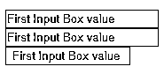


所以在上面的例子中，第二个和第三个<input> html 元素的内容被设置为第一个<input>元素的值内容。

#### 示例 2–单选框

下一个使用此方法获取表单元素值的示例代码。jQuery val()方法不接受任何参数，并返回一个包含列表中每个选定选项的值的数组，否则如果没有选择任何选项，则返回一个空值，如下面的代码所示

**代码:**

```
<!DOCTYPE html>
<html lang= "en" >
<html>
<head>
<script type = "text/javascript" src="https://ajax.googleapis.com/ajax/libs/jquery/1.11.3/jquery.min.js" >
</script>
<title> This is an example for jQuery val( ) method </title>
<!-- code to show the jQuery val( ) working method -->
<style>
b {
color: red;
}
p {
background-color: yellow;
margin: 10px;
}
</style>
</head>
<body>
<p></p>
<select id="fruit">
<option> Apple </option>
<option> Banana </option>
<option> Orange </option>
</select>
<script>
function fruitdisplayVals() {
var fruitValues = $( "#fruit" ).val();
$( "p" ).html( "<b> Fruits: </b> " + fruitValues );
}
$( "select" ).change( fruitdisplayVals );
fruitdisplayVals();
</script>
</body>
</html>
```

**输出:**

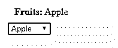


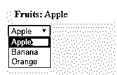


一旦我们单击任何选项，例如橙色，输出是

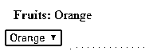


#### 示例 3–带有单个和多个选择框的 jQuery val()方法

在下一个示例代码中，我们用单个和多个选择框重写了 jQuery val()方法的上述代码

**代码:**

```
<!DOCTYPE html>
<html lang= "en" >
<html>
<head>
<script type = "text/javascript" src="https://ajax.googleapis.com/ajax/libs/jquery/1.11.3/jquery.min.js" >
</script>
<title> This is an example for jQuery val( ) method </title>
<!-- code to show the jQuery val( ) working method -->
<style>
b {
color: red;
}
p {
background-color: yellow;
margin: 4px;
}
</style>
</head>
<body>
<p></p>
<select id="fruit">
<option> Apple </option>
<option> Banana </option>
<option> Orange </option>
</select>
<select id="veg" multiple="Vegetables">
<option selected="selected"> Broccoli </option>
<option> Corn </option>
<option> Cucumber </option>
<option> Tomato </option>
</select>
<script>
function fruitdisplayVals() {
var fruitValues = $( "#fruit" ).val();
var vegValues = $( "#veg" ).val() || [];
$( "p" ).html( "<b> Fruits:</b> " + fruitValues +
" <b> Vegetables:</b> " + vegValues.join( ", " ) );
}
$( "select" ).change( fruitdisplayVals );
fruitdisplayVals();
</script>
</body>
</html>
```

**输出:**

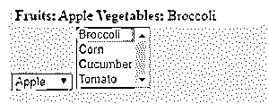


现在，我们可以选择任何单一水果选项和多种蔬菜选项，输出如下

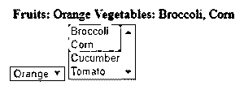


#### 示例 4–带参数的 jQuery val()方法

下一个示例代码中，jQuery wrap()方法接受一个字符串来设置每个匹配元素的值。如下例所示——

**代码:**

```
<!DOCTYPE html>
<html lang= "en" >
<html>
<head>
<script type = "text/javascript" src="https://ajax.googleapis.com/ajax/libs/jquery/1.11.3/jquery.min.js" >
</script>
<title> This is an example for jQuery val( ) method </title>
<!-- code to show the jQuery val( ) working method -->
<script>
$(document).ready(function(){
$("#b1").click(function(){
$("input:text").val("Set Value");
});
});
</script>
</head>
<body>
<p> Your Name: <input type="text" name="user"></p>
<button id="b1"> Click to set the value of the input field </button>
</body>
</html>
```

**输出:**

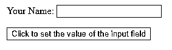


当我们单击该按钮时，输出是–

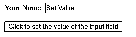


#### 示例 5–将函数作为参数的 jQuery val()方法

该方法接受一个函数作为参数，并设置每个匹配元素的值。

**代码:**

```
<!DOCTYPE html>
<html lang= "en" >
<html>
<head>
<script type = "text/javascript" src="https://ajax.googleapis.com/ajax/libs/jquery/1.11.3/jquery.min.js" >
</script>
<title> This is an example for jQuery val( ) method </title>
<!-- code to show the jQuery val( ) working method -->
<script>
$(document).ready(function(){
$("#b1").click(function(){
$("input:text").val( function(n,c){
return c+"Set Value";
});
});
});
</script>
</head>
<body>
<p> Your Name: <input type="text" name="user" value= "Welcom to "></p>
<button id="b1"> Click to set the value of the input field </button>
</body>
</html>
```

**输出:**

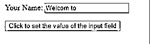


当我们单击该按钮时，输出是–

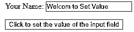


### 结论

此方法用于获取 html 元素的值或设置 html 元素的值。其语法是–

1.  $(选择器)。瓦尔( )
2.  $(选择器)。值
3.  $(选择器)。val( function ( index，currvalue))

用于指定属性的设置值的值。function ( index，currvalue)用于指定要执行的函数的名称，并返回属性的设定值。

### 推荐文章

这是 jQuery val()的指南。这里我们讨论 jQuery val()的语法、参数和各种例子。您也可以看看以下文章，了解更多信息–

1.  [JQuery 进度条](https://www.educba.com/jquery-progress-bar/)
2.  [jQuery querySelector](https://www.educba.com/jquery-queryselector/)
3.  [jQuery 备选方案](https://www.educba.com/jquery-alternatives/)
4.  [jQuery Ajax 方法](https://www.educba.com/jquery-ajax-methods/)


