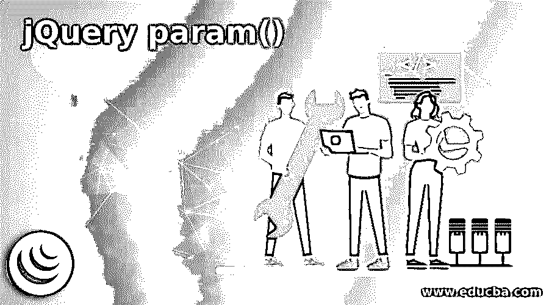
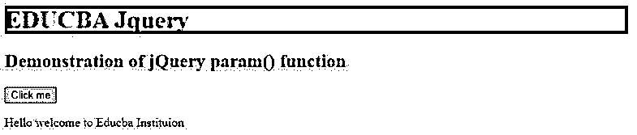
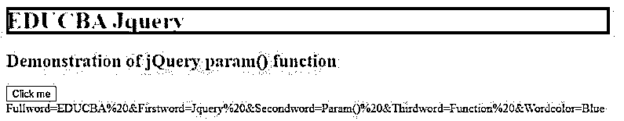
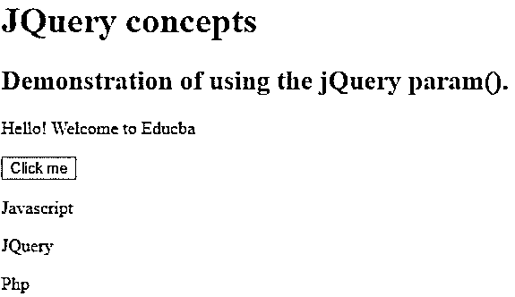
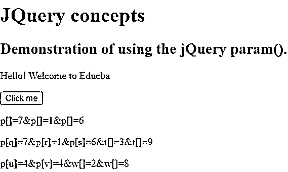

# jQuery param()

> 原文：<https://www.educba.com/jquery-param/>




## jQuery param()简介

在 jQuery 中，param()是一个被定义为 Ajax 方法的函数，用于表示对象或数组的连续字符串；发出 Ajax 请求时，URL 可以使用这些序列化或连续的字符串值来调用请求。一般来说，我们可以将-param()函数定义为一个函数，用于从内部提供的元素转换为连续字符串，如果传递任何普通对象，该对象将属性(如 name 或 value)包含输入元素以及这些属性，并且该函数具有通过将传统值设置为 true 来全局禁用的选项。

### jQuery param()的使用示例

在本文中，我们将看到 jQuery 的 param()函数，这是一个用于发出 Ajax 请求的 Ajax 方法；我们需要使用在内部将该函数应用于元素后获得的这些序列化字符串，这些元素包含作为数组或对象的连续字符串的返回值。在 jQuery 中，URL 使用 param()函数通过将元素转换为连续字符串作为 param()函数的输出来发出 Ajax 请求，或者我们可以说该函数返回数组或普通对象的序列化字符串表示。

<small>网页开发、编程语言、软件测试&其他</small>

一般来说，这个函数在任何按钮被创建和第一次被点击时使用，这将创建一个对象或数组的连续字符串表示，这反过来将导致一个字符串作为 Ajax 请求的一部分被发送到服务器。

让我们看看如何使用该函数的语法和示例:

**语法:**

```
$.param(object, traditional_style)
```

**参数:**

*   **Object:** 该参数用于指定需要序列化的字符串或对象。该参数需要强制指定。
*   **Traditional:** 该参数用于指定 param()函数需要使用的序列化样式或者不需要使用传统的 shallow 样式，是一个需要指定的布尔值，该参数可选。

此函数返回传递给此函数的数组或对象的转换后的序列化字符串表示形式。

让我们考虑一个如何声明 param()函数的例子。

#### 示例#1

**代码:**

```
<!DOCTYPE html>
<html>
<head>
<title>
Educba Training Institute
</title>
<script src=
"https://ajax.googleapis.com/ajax/libs/jquery/3.3.1/jquery.min.js">
</script>
</head>
<body style="text-align:left";>
<h1 style = "background-color:red" >
EDUCBA Jquery
</h1>
<h2 style = "color:blue">Demonstration of jQuery param() function</h2>
<button>Click me</button>
<div>
<p> Hello welcome to Educba Instituion </p>
</div>
<!-- Script using param() method -->
<script>
$(document).ready(function() {
jqpmobj = new Object();
jqpmobj.Fullword = "EDUCBA ";
jqpmobj.Firstword = "Jquery ";
jqpmobj.Secondword = "Param() ";
jqpmobj.Thirdword = "Function ";
jqpmobj.Wordcolor = "Blue";
$("button").click(function(){
$("div").text($.param(jqpmobj));
});
});
</script>
</body>
</html>
```

**输出:**




点击上面截图中的“click me”按钮后，我们得到下面的序列化字符串，如上面截图所示。




在上面的程序中，我们可以看到我们已经编写了 HTML 代码，脚本源代码指向了在标签中的 jquery 文件，并且要在标签中编写 jquery 代码，我们必须在

在输出中，我们可以看到每个单词由“%20&”分隔，因为我们指定了全词，并且在上面的输出中，单个单词的空格被替换为这个。所以在上面的代码中，我们传递了对象“jqpmobj”，所以必须指定任何名称或值属性，这里是“Fullword”或“Firstword”等。所以这个 param()函数在对象被传递时，这些名称或值参数被添加到 URL 字符串中，这个字符串是用历史 API 动态修改的。

现在我们将看到一个创建三个对象并显示解码对象的示例，这是使用下面代码中的 decodeURIComponent()完成的。

#### 实施例 2

**代码:**

```
<!DOCTYPE html>
<html>
<head>
<title> Educba Institution </title>
<script src="https://ajax.googleapis.com/ajax/libs/jquery/3.5.1/jquery.min.js"></script></head>
<body>
<h1> JQuery concepts</h1>
<h2> Demonstration of using the jQuery param(). </h2>
<p>Hello! Welcome to Educba </p>
<button> Click me</button>
<p id = "p1"> Javascript </p>
<p id = "p2"> JQuery </p>
<p id = "p3"> Php </p>
<script>
$(document).ready(function() {
var com_obj1= new Object ({
p: [ 7, 1, 6 ]
});
var com_obj2= new Object ({
p: { q: 7, r: 1, s: 6}, t: [ 3, 9]
});
var com_obj3 = new Object({
p: {u: 4, v: 4}, w:[2, 8]
});
$("button").click(function() {
var x = decodeURIComponent( $.param(com_obj1));
$("#p1").text(x);
var y = decodeURIComponent( $.param(com_obj2));
$("#p2").text(y);
var z = decodeURIComponent( $.param(com_obj3));
$("#p3").text(z);
});
});
</script>
</body>
</html>
```

**输出:**




点击上面截图中的“点击我”按钮后，显示 3 个对象”、Javascript”、“Jquery”和“Php”的解码代码，如下图所示。




在上面的代码中，我们可以看到我们使用了 decoseURIComponent()，它用于解码对象，所以有点复杂；在上面的代码中，我们还可以看到我们正在创建 3 个对象，解码后的代码如上面的输出截图所示。

### 结论

在本文中，我们得出结论，jQuery 提供了一个名为 param()的函数，用于以序列化的方式表示对象数组。在本文中，我们看到了如何通过语法和示例来声明和使用 param()函数。在本文中，我们还看到了一个简单创建对象的示例，然后在另一个示例中，我们还看到了复杂对象的创建以及使用 param()和 decodeURIComponent()函数对对象进行解码。

### 推荐文章

这是 jQuery param()的指南。这里我们分别用例子讨论 jQuery param()的介绍和工作。您也可以看看以下文章，了解更多信息–

1.  [jQuery 查找子节点](https://www.educba.com/jquery-find-child/)
2.  [jQuery UI 可删除](https://www.educba.com/jquery-ui-droppable/)
3.  [jQuery UI Selectmenu](https://www.educba.com/jquery-ui-selectmenu/)
4.  [jQuery 滑块](https://www.educba.com/jquery-slider/)


