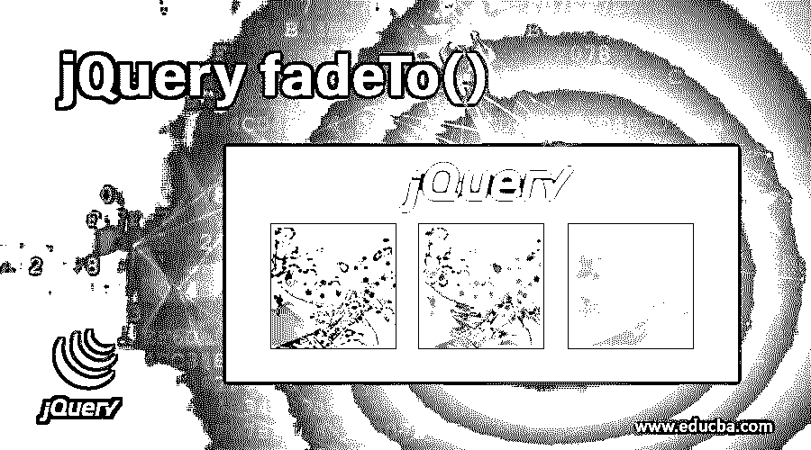
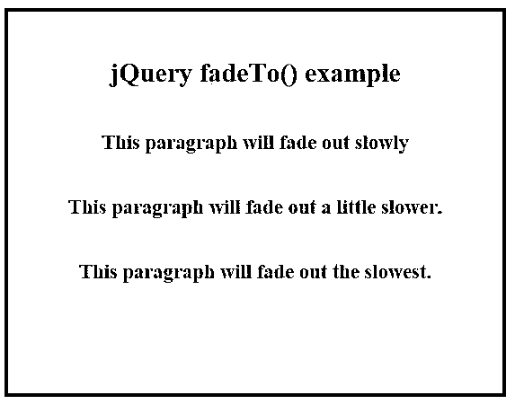
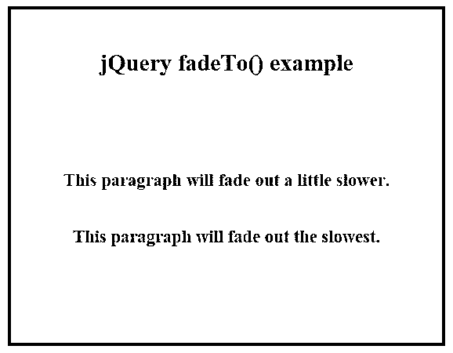
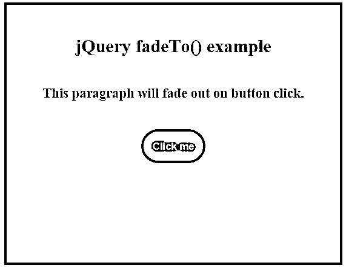
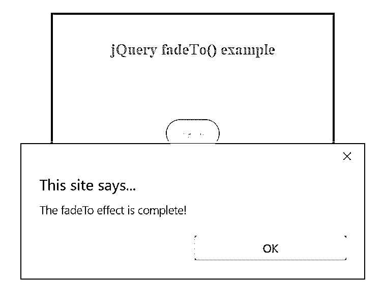
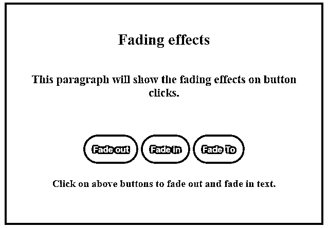
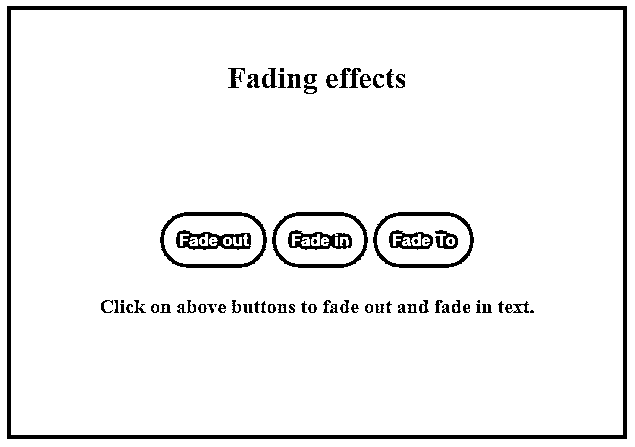
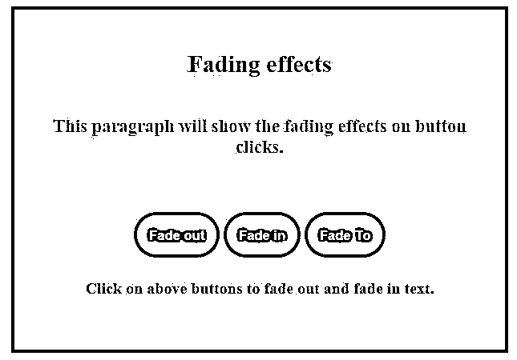

# jQuery fadeTo()

> 原文：<https://www.educba.com/jquery-fadeto/>




## jQuery fadeTo()简介

在本文中，我们将讨论 jQuery 效果方法之一，其目的是设置或调整 HTML 元素的不透明度。jQuery fadeTo()方法基本上是用来将选中元素的不透明度逐渐调整到指定的水平。这是 jQuery 提供的淡入淡出可见性的方法之一。jQuery 提供的一些渐变方法有:

*   **fadeIn()**
***   淡出()*   fadeToggle()*   fadeTo()**

 **jQuery fadeTo()方法显示匹配元素的不透明度，值在 0 和 1 之间。这种方法要求明确指定持续时间，但对于其他有效的方法，这不是强制性的。这种效果可以通过设置 fx.off = true 来全局关闭，就像其他 jQuery 效果一样。这会将持续时间设置为 0。

<small>网页开发、编程语言、软件测试&其他</small>

****语法:****

```
$(selector).fadeTo(speed, opacity, easing, callback)
```

在哪里，

*   ***选择器:**指选中的元素。*
**   **速度:**强制参数，指定渐变效果的速度。它可能取的值是毫秒或字符串值“慢”和“快”。*   **不透明度:**也是一个强制参数，指定不透明度，取值在 0 到 1 之间。*   **缓动:**可选参数，指定动画速度在不同动画点是线性还是摆动。*   **callback:** 可选参数，指定 fadeTo 效果完成后要执行的函数。*

 *### 实现 jQuery fadeTo()方法的示例

在简要概述了 fadeTo()方法之后，让我们来看几个说明 fadeTo 效果的例子。

#### 示例#1

下面是一个简单的例子，展示了 jQuery 中 fadeTo()方法的效果。

**代码:**

```
<!DOCTYPE html>
<html>
<head>
<title>Example for jQuery fadeTo()</title>
<script src="https://code.jquery.com/jquery-1.12.4.min.js"></script>
<script>
$(document).ready(function() {
$("#p1").click(function() {
$(this).fadeTo("slow", 0.1);
});
$("#p2").click(function() {
$(this).fadeTo("slow", 0.5);
});
$("#p3").click(function() {
$(this).fadeTo("slow", 0.8);
});
});
</script>
<style>
div {
width: 400px;
height: 300px;
padding: 20px;
font-size: medium;
text-align: center;
margin: auto
margin: auto;
font-weight: bold;
border: 3px solid teal;
margin-top: 50px;
margin-bottom: 10px;
}
p {
color: brown;
font-weight: bold;
font-size: larger;
border: none;
margin: auto;
cursor: pointer;
}
</style>
</head>
<body>
<div>
<h2>
<b>jQuery fadeTo() example</b>
</h2>
<br />
<p id="p1">
This paragraph will fade out slowly
</p>
<br /><br />
<p id="p2">
This paragraph will fade out a little slower.
</p>
<br /><br />
<p id="p3">
This paragraph will fade out the slowest.
</p>
</div>
</body>
</html>
```

****输出:****

*   下面是页面最初加载到浏览器时的截图。
*   到目前为止没有执行任何活动。




*   我们已经使用 fadeTo()用不同的值调整了这个例子中每个段落的不透明度。
*   当你点击段落时，它们中的每一个都将改变它们的不透明度到指定的水平。
*   具有较高不透明度值的段落比具有较低不透明度的段落更明显，如下图所示。




#### 实施例 2

现在让我们考虑一个带有速度和回调函数的 fadeTo()方法的例子。

**代码:**

```
<html>
<head>
<title>Example for jQuery fadeTo()</title>
<script src="https://code.jquery.com/jquery-1.12.4.min.js"></script>
<script>
$(document).ready(function() {
$("button").click(function() {
$("p").fadeTo(2000, 0.2, function() {
alert("The fadeTo effect is complete!");
});
});
});
</script>
<style>
div {
width: 400px;
height: 300px;
padding: 20px;
font-size: medium;
text-align: center;
margin: auto;
font-weight: bold;
border: 3px solid teal;
margin-top: 50px;
margin-bottom: 10px;
}
p {
color: brown;
font-weight: bold;
font-size: larger;
border: none;
margin: auto;
cursor: pointer;
}
button {
background: teal;
color: yellow;
border-radius: 30px;
padding: 15px;
font-weight: bold;
border: none;
margin: auto;
cursor: pointer;
}
</style>
</head>
<body>
<div>
<h2>
<b>jQuery fadeTo() example</b>
</h2>
<br />
<p>This paragraph will fade out on button click.</p>
<br /><br />
<button>Click me</button>
</div>
</body>
</html>
```

****输出:****

*   下面的屏幕截图显示了页面最初加载到浏览器时的屏幕。




*   这个例子类似于上面显示的例子。
*   唯一的区别是我们添加了一个回调函数作为 fadeTo()方法的参数。
*   一旦 fadeTo 效果完成，就会使用回调函数设置一个警告。
*   如截图所示，一旦点击按钮，所选段落的不透明度会发生变化，然后在效果完成后会弹出一个警告框。




#### 实施例 3

此示例说明了淡入淡出效果以及各种淡入淡出方法的工作方式。

**代码:**

```
<!DOCTYPE html>
<html>
<head>
<title>Example for jQuery fading effect</title>
<script src="https://code.jquery.com/jquery-1.12.4.min.js"></script>
<script>
$(document).ready(function() {
$(".btn_fadeout").click(function() {
$("p").fadeOut();
});
$(".btn_fadein").click(function() {
$("p").fadeIn();
});
$(".btn_fadeto").click(function() {
$("p").fadeTo("fast", 0.6);
});
});
</script>
<style>
p {
color: brown;
font-weight: bold;
font-size: larger;
border: none;
margin: auto;
cursor: pointer;
}
div {
width: 450px;
height: 300px;
padding: 20px;
font-size: medium;
text-align: center;
margin: auto;
font-weight: bold;
border: 3px solid teal;
margin-top: 50px;
margin-bottom: 10px;
}
button {
background: teal;
color: yellow;
border-radius: 30px;
padding: 15px;
font-weight: bold;
border: none;
margin: auto;
cursor: pointer;
}
</style>
</head>
<body>
<div>
<h2>Fading effects</h2>
<br />
<p>This paragraph will show the fading effects on button clicks.</p>
<br /><br /><br />
<button class="btn_fadeout">Fade out</button>
<button class="btn_fadein">Fade in</button>
<button class="btn_fadeto">Fade To</button>
<h4>Click on above buttons to fade out and fade in text.</h4>
</div>
</body>
</html>
```

****输出:****

*   下面是页面最初加载到浏览器时的截图。
*   到目前为止没有执行任何活动。




*   单击这三个按钮时，会实现 fadeOut()、fadeIn()和 fadeTo()方法。
*   单击淡出按钮，所选段落将完全淡出，如下所示。




*   点击淡入按钮，所选段落将完全淡入。
*   单击渐变到按钮，所选段落将渐变到指定值，如下所示。




### 结论

*   这篇 jQuery 文章演示了实现 jQuery fadeTo()方法的效果和方式。
*   jQuery fadeTo()方法是一个内置的 jQuery fade effect 方法，它将 HTML 元素动画化到指定的不透明度。
*   在 jQuery 中还有其他类似的实现渐变效果的方法。
*   这些淡入淡出效果为网页添加了动画和视觉效果，使其更具交互性。
*   通过将速度设置为 0，该方法还可以用于使 jQuery 将不透明度设置为 CSS 属性。

### 推荐文章

这是 jQuery fadeTo()的指南。这里我们讨论 jQuery fadeTo()的基本概念和不同的例子，以及代码实现。您也可以阅读以下文章，了解更多信息——

1.  [jQuery wrapAll()](https://www.educba.com/jquery-wrapall/)
2.  [jQuery outerHeight()](https://www.educba.com/jquery-outerheight/)
3.  [jQuery scrollTop()](https://www.educba.com/jquery-scrolltop/)
4.  [jQuery keyup()](https://www.educba.com/jquery-keyup/)


***