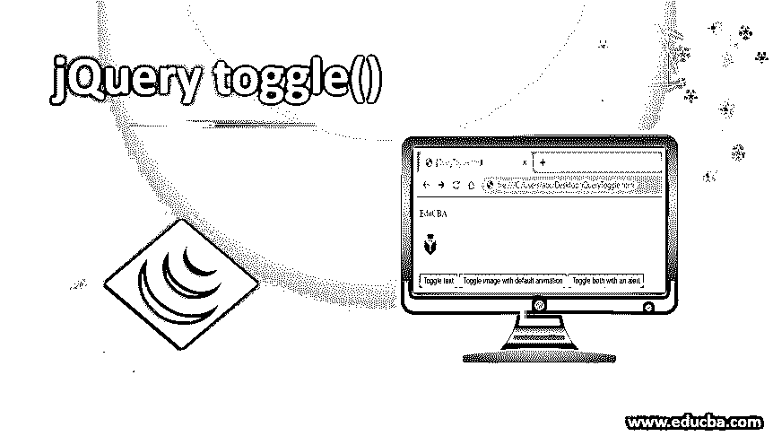
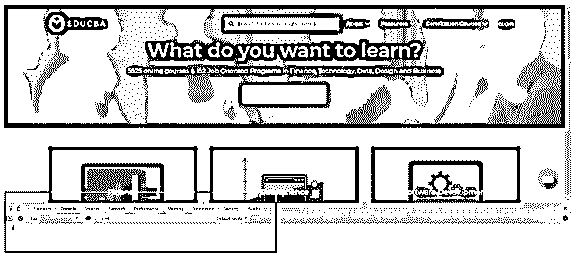
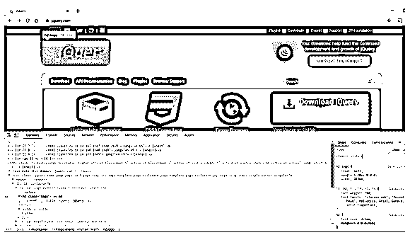
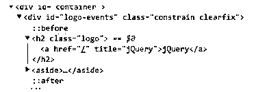
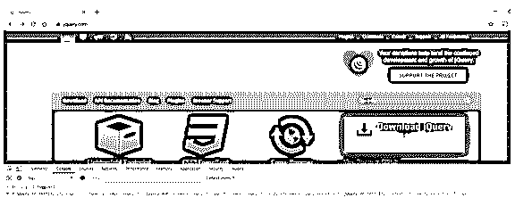
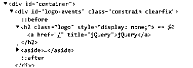
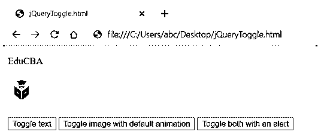

# jQuery 切换()

> 原文：<https://www.educba.com/jquery-toggle/>




## jQuery toggle 简介()

jQuery 的 toggle()方法用于切换元素在 DOM 中的可见性。这是一个非常简单的方法。如果元素是隐藏的，并且对该元素调用了 toggle 方法，则显示该元素。如果调用 toggle 方法时元素没有隐藏，则该元素会被隐藏。

**语法:**

<small>网页开发、编程语言、软件测试&其他</small>

根据传递给该方法的可选参数的数量，toggle 方法的语法有许多变体。

**最基本的语法如下:**

```
$(<element>).toggle();
```

**高级语法需要如下参数:**

```
$(<element>).toggle([duration], [complete]);
```

这里的持续时间是动画效果的时间，以毫秒为单位。如果未提供此参数，元素的可见性会立即切换。complete 是一个回调函数，一旦切换动画完成就调用它。这里需要注意的非常重要的一点是，回调函数对每个元素调用一次。这将在本课程的实施部分进一步阐述。

然后还有另一个语法需要一个布尔值。这是在 jQuery v1.3 中引入的。

```
$(<element>).toggle(display);
```

如果 display 参数为 true，则显示该元素。如果为 false，则隐藏该元素。

jQuery v1.4.3 引入了 toggle 方法的另一种变体。它需要另一个字符串类型的参数来定义动画期间的过渡类型。

```
$(<element>).toggle([duration], [easing], [complete]);
```

### 在幕后

*   那么，toggle 方法是如何实现其目标的呢？简单回答，它玩的是元素的 [CSS 显示属性](https://www.educba.com/what-is-css/)。如果显示了该元素，则其显示属性将更改为“无”。如果它是隐藏的，显示属性将恢复为原始属性。存储元素的初始显示属性。如果元素没有原始显示属性，则默认显示属性为 inline。
*   jQuery 的高级方法，也称为 jQuery 切换动画方法，需要持续时间、过渡样式或回调函数。在这种情况下，toggle 方法会在动画的整个持续时间内同时更改元素的高度、宽度和不透明度。当达到持续时间限制时，显示样式属性被设置为适当的值。

### 例子

让我们看一些切换方法的例子。

**Note:** Throughout the examples in this article, we would be using the browsers’ developer console. Simply open the browser developer tools (Ctrl/Cmd + Shift + C) and go to the *Console* tab in the developer tools window.

*   在 Chrome 中看起来是这样的:




*   这是大多数 jQuery 相关概念的游乐场。在整篇文章中，我们都会用到这个操场。
*   现在，打开你的浏览器，进入任何基于 jQuery 的网站。我会访问 jQuery 本身的网站(https://jquery.com/)。打开开发人员控制台。




*   接下来，我们确定想要切换的元素。让我们切换 jQuery 徽标。
*   在“开发人员”窗口的“元素”选项卡中，您会看到元素是这样的:

```
<h2 class="logo"><a href="/" title="jQuery">jQuery</a></h2>
```




*   这个元素通过一个类*标识*唯一定义。我们将使用这个类作为选择器。

**Note:** When using a class as a selector, all the elements to which the class is applied are selected. To select a single element, use the id attribute.

*   接下来，转到控制台选项卡，键入以下命令:

```
$('.logo').toggle()
```

*   当您按 enter 键时，请注意 jQuery 徽标从页面上消失了。




*   接下来，返回到元素选项卡，再次搜索徽标元素。
*   请注意，现在元素中添加了 CSS 显示属性。现在已经变成这样了:

```
<h2 class="logo" style="display: none;"><a href="/" title="jQuery">jQuery</a></h2>
```




*   接下来，让我们把标志带回来，但这次是通过一些动画。返回控制台选项卡，键入以下命令:

```
$('.logo').toggle(1000)
```

*   我们给动画一秒钟的持续时间。当您按 enter 键时，请注意 jQuery 徽标会以动画形式重新出现在页面上。

### 实现 jQuery toggle()的步骤

让我们从头开始尝试实现整个 jQuery toggle 示例:您需要一个编辑器(就像记事本一样简单)和一个浏览器。

**第一步:**打开记事本，粘贴以下代码。

```
<!DOCTYPE html>
<html>
<head>
<!-- This is the CDN for jQuery. It references the jQuery library on the go. Your computer must be connected to the internet. -->
<script src="https://ajax.googleapis.com/ajax/libs/jquery/3.4.1/jquery.min.js"></script>
<script>
$(document).ready(function () {
// Toggle text on click of button 1
$("#btn1").click(function () {
$("#para").toggle();
});
// Toggle image on click of button 2
$("#btn2").click(function () {
$("#pic").toggle(1000);
});
// Toggle both on click of button 3
$("#btn3").click(function () {
$(".ele").toggle(1000, function () {
window.alert("Yayy!!!");
});
});
});
</script>
</head>
<body>
<p id="para" class="ele">EduCBA</p>

<br />
<br />
<button id="btn1">Toggle text</button>
<button id="btn2">Toggle image with default animation</button>
<button id="btn3">Toggle both with an alert</button>
</body>
</html>
```

**第二步:**用 extension.HTML 保存文件。这将把文件保存为 HTML 文件。

**第三步:**打开浏览器，打开刚刚保存的文件。呈现的 HTML 页面如下所示。

**输出:**




**对上面代码的解释:**注意，在隐藏和显示元素时，警告出现了两次。这是因为警报放在回调函数中。当切换动画完成时，回调函数被调用。这个函数为每个元素调用一次。因为我们用一个切换函数切换两个元素，所以回调函数被调用了两次。

### 结论–jQuery 切换()

因此，我们已经在本文中介绍了 jQuery 的切换功能。我们已经了解了切换功能是如何在幕后工作的。此外，一旦熟悉了这个概念，你就可以玩得更多了。建议多了解市场上的各种插件，以获得更高级的切换体验。您可能会深入研究这些插件的代码，并理解它们是如何在 jQuery toggle API 上实现的。一旦理解了，你也可以开发你自己的插件！

### 推荐文章

这是 jQuery toggle()的指南。这里我们从头开始讨论实现 jQuery toggle 的语法、示例和步骤。您也可以浏览我们的其他相关文章，了解更多信息——

1.  [jQuery addClass()](https://www.educba.com/jquery-wrapall/)
2.  [jQuery focus()](https://www.educba.com/jquery-focus/)
3.  [jQuery detach()](https://www.educba.com/jquery-detach/)
4.  [JQuery fadeToggle](https://www.educba.com/jquery-fadetoggle/)


