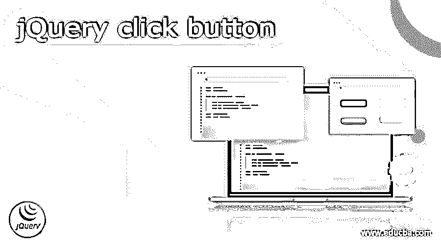
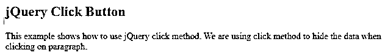
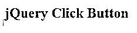
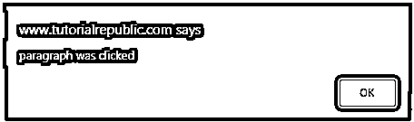
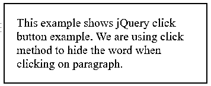
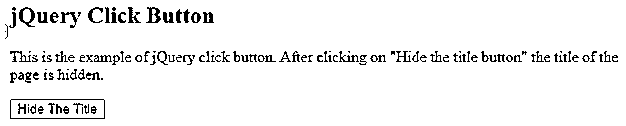
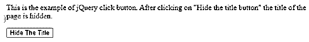

# jQuery 点击按钮

> 原文：<https://www.educba.com/jquery-click-button/>




## jQuery 点击按钮的定义

jQuery click button 要么触发一个 click 事件，要么添加一个在事件发生时调用的函数。在前两个变体中，这个方法是 on 的快捷方式(“click”，handler)，在第三个变体中，它是 trigger 的快捷方式(“click”)。当指针在元素上时，按钮被按下并释放。当我们点击一个 HTML 元素时，jQuery 点击事件触发器。

### 什么是 jQuery 点击按钮？

*   该元素接收一个单击事件。例如，每次单击 HTML 元素时，都会发生 jQuery click 事件。
*   jQuery 中的 click 方法用于激活 onclick 函数。此外，HTML 元素的方法是用来模仿一个按钮点击。
*   jQuery Click 函数启动一个 Click 事件。每当单击一个相关元素时，click 方法都会触发一个事件。click 事件由 jQuery click 方法触发。

### 如何使用 jQuery Click()？

*   我们可以将一个函数连接到 click 方法，并在每次 click 事件发生时运行它，从而允许我们在每次被触发时运行代码。
*   例如，考虑$(“p”)。当单击文档中的一个段落时，单击将触发 click 事件。
*   click 方法将事件处理程序连接到 JavaScript 事件“click ”,或者导致在元素上触发事件。
*   每当鼠标指针停留在元素上并且按钮被按下和释放时，click 事件被调度到元素。HTML 的任何元素都可以接收事件。
*   要调用 click 方法，有两个选项。借助于某个函数自变量，在没有特定自变量的情况下
*   jQuery 中的 onclick 函数可以用在 HTML 元素中，比如 div、段落、超链接等等，以实现期望的目标。当鼠标上的按钮被按下时，鼠标事件发生。
*   如果发生以下事件，将触发 Click 事件。

1)当指针在元素内部时，按下鼠标按钮。

<small>网页开发、编程语言、软件测试&其他</small>

2)当指针在元素内部时，释放鼠标按钮。

*   在采取行动之前，这通常是预期的顺序。如果没有必要，mousedown 或 mouseup 事件可能更合适。

下面是 jQuery click 方法的语法。

**语法:**

```
$(selector).click()
$(selector).click(function)
```

*   “功能”参数是当点击事件发生时用于执行的可选参数。
*   返回值:要执行的函数返回选定的元素。
*   下面的例子展示了如何使用 jQuery click 方法。当我们点击文本时，它变得不可见。
*   这是因为段落选择器与 click 方法相关联，并且当前元素是使用自定义函数中的 hide 方法隐藏的。单击段落时，将调用 click 事件中的自定义函数。

**代码:**

```
<!DOCTYPE html>
<html>
<head>
<script src = "https://ajax.googleapis.com/ajax/libs/jQuery/3.4.0/jQuery.min.js">
</script>
<script>
$(document).ready(function(){
$("p").click(function(){
$(this).hide();
});
});
</script>
</head>
<body>
<h2> jQuery Click Button </h2>
<p>This example shows how to use jQuery click method. We are using click method to hide the data when clicking on paragraph. </p>
</body>
</html>
```

点击段落前-




点击段落后-'




*   上面的输出显示，运行代码后会在输出中显示段落，但是点击段落后就看不到了。
*   我们使用了点击法；点击一个段落后，它将被隐藏或对我们不可见。
*   要执行特定的操作，jQuery click 方法可以应用于任何 HTML 元素，如 div、段落、跨度和超链接。
*   单击是在按下鼠标按钮时发生的鼠标事件。要实现这一点，鼠标指针必须在该元素内。
*   javascript 中的 onclick 方法触发 onclick 事件。这是因为该方法已经附加了一个元素。因此，一个元素可以独立地调用另一个元素的 onclick 事件。
*   必须首先用特定样式的可点击属性来指定对象。该对象必须声明 onclick 操作。
*   在代码体中，必须构建一个脚本块，其中 click()方法属于特定的格式样式。
*   在函数调用中，将调用先前已声明的 onclick 方法。

### jQuery 点击按钮示例

以下是 jQuery 点击按钮的示例:

我们没有将下面代码中的任何函数传递给该方法。

**代码:**

```
<html>
<head>
<script
src = "https://ajax.googleapis.com/ajax/libs/jQuery/3.3.1/jQuery.min.js">
</script>
<script>
$(document).ready(function() {
$("p").click();
});
</script>
<style>
p {
display: block;
width: 200px;
padding: 30px;
font-size: 20px;
border: 2px solid red;
}
</style>
</head>
<body>
<p onclick = "alert('paragraph was clicked')">jQuery Click Button</p>
</body>
</html>
```




在下面的例子中，我们将函数传递给了方法。

**代码:**

```
<html>
<head>
<script
src = "https://ajax.googleapis.com/ajax/libs/jQuery/3.3.1/jQuery.min.js">
</script>
<script>
$(document).ready(function() {
$("p").click(function() {
$(this).fadeOut();
});
});
</script>
<style>
p {
display: block;
width: 300px;
padding: 20px;
font-size: 20px;
border: 2px solid red;
}
</style>
</head>
<body>
<p>This example shows jQuery click button example. We are using click method to hide the word when clicking on paragraph.</p>
</body>
</html>
```

**点击段落前-**




点击段落后，文字会被隐藏-

下面的例子显示了点击按钮后会发生 click 事件。它将隐藏页面的标题。

**代码:**

```
<!DOCTYPE html>
<html>
<head>
<script src = "https://ajax.googleapis.com/ajax/libs/jQuery/3.4.0/jQuery.min.js">
</script>
<script>
$(document).ready(function()
{
$("#myid").click(function()
{
$("h2").hide();
});
});
</script>
</head>
<body>
<h2>jQuery Click Button</h2>
<p>This is the example of jQuery click button. After clicking on "Hide the title button" the title of the page is hidden.</p>
<button id="myid">Hide The Title</button>
</body>
</html>
```







*   上面的例子将在运行代码后在输出中显示标题，但是在点击按钮后它将被隐藏。这是因为点击按钮标题后，我们看不到页面。

### 结论

该元素接收一个单击事件。当我们点击一个 HTML 元素时，jQuery 点击事件触发器。click 事件由 jQuery click 方法触发。jQuery click button 要么触发一个 click 事件，要么添加一个在事件发生时调用的函数。

### 推荐文章

这是一个 jQuery 点击按钮的指南。这里我们讨论什么是 jQuery click 按钮，如何使用 jQuery Click()，以及代码实现的例子。您也可以看看以下文章，了解更多信息–

1.  [jQuery mouseup()](https://www.educba.com/jquery-mouseup/)
2.  [jQuery 数组推送](https://www.educba.com/jquery-array-push/)
3.  [JQuery JSON 解析](https://www.educba.com/jquery-json-parse/)
4.  [Settimeout jQuery](https://www.educba.com/settimeout-jquery/)


