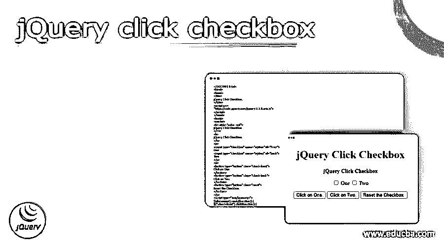
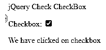
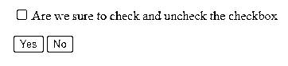
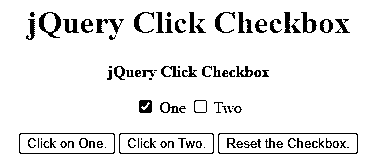
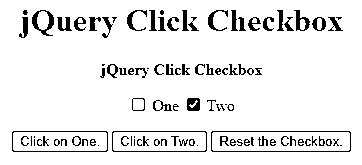
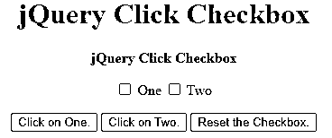
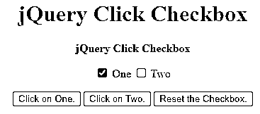
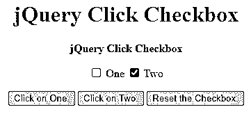
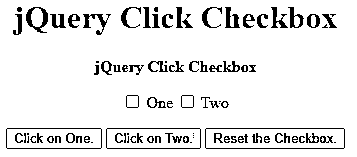

# jQuery 点击复选框

> 原文：<https://www.educba.com/jquery-click-checkbox/>




## jQuery 上的定义单击复选框

jQuery 中的 jQuery click checkbox 方法将 jQuery 对象的内容与选择器的内容进行比较。我们可以使用 JavaScript 和 jQuery 以各种方式绑定到 HTML 复选框的 change 或 click 事件。我们还可以使用 jQuery 的 prop 方法，如果输入复选框被勾选，则返回 true，如果输入复选框被勾选，则返回 false。我们可以直接访问 DOM 元素的 checked 属性。

### 什么是 jQuery 点击复选框？

*   jQuery prop 方法可以动态地选中或取消选中复选框，比如在单击按钮或超链接时。
*   jQuery prop 方法是确定复选框当前状态的一种简单、有效且可靠的方法。因为每个复选框都包含一个 checked 属性，该属性描述了它是选中还是未选中，所以它在所有情况下都能正常工作。

### 如何 jQuery 点击复选框？

*   复选框是我们用来允许用户与网页交互的许多输入字段之一，通常通过选中与案例对应的任何框来将数据发布到后端。
*   单组中的复选框不是互斥的；因此，当检查是否选择了任何选项时，用户可以选择许多适用的框，这与单选按钮(属于单选组)不同。
*   我们可以将逻辑外包给它的功能，而不是使用内置的 checked 属性。Is 方法是一种广泛的方法，可用于各种原因，它根据比较标准产生真值或假值。
*   在早期版本的 jQuery 中，Attr 用于访问和操作元素的字段。在后续版本中，prop 已经取代了方法。
*   另一方面，Is 方法总是产生一个布尔值，而 prop 只返回底层的属性类型。
*   我们不能确定没有其他东西通过，如果我们没有正确使用 prop，我们的函数可能会在运行时失败。
*   创建 checked 选择器主要是为了确定单选按钮或复选框元素是否被选中。
*   Is 方法的处理和解析开销比 prop 多一点。然而，当处理许多输入时，例如在一个循环中，prop 的性能更高，即使它不仅仅是访问属性和做一些验证。
*   它还在语义上指示布尔值的返回值，使其更具可读性。

下面的例子显示了如何用 click checkbox 进行 jQuery。

<small>网页开发、编程语言、软件测试&其他</small>

**代码:**

```
<!DOCTYPE html>
<html>
<body>
<p> jQuery Check CheckBox </p>
<label for = "myCheck">Checkbox:</label>
<input type="checkbox" id = "myCheck" onclick="myFunction ()">
<p id = "text" style = "display:none">We have clicked on checkbox</p>
<script>
function myFunction() {
var checkBox = document.getElementById("myCheck");
var text = document.getElementById("text");
if (checkBox.checked == true){
text.style.display = "block";
} else {
text.style.display = "none";
} }
</script>
</body>
</html>
```




### jQuery 点击复选框元素

*   在 jQuery 中，我们可以选择元素，检索其底层对象而不是 jQuery 对象([0])，并使用内置的 checked 属性来检查复选框是否已被选中。
*   使用 jQuery-checked 选择器检查复选框的状态。选中单选按钮和复选框的选择器。
*   可以通过两种方式更改输入类型的 checked 属性，以动态选中当前选中的复选框。
*   prop 方法可以访问输入并更改其属性。例如，此方法操作“checked”属性，根据它是应选中还是应取消选中将其设置为 true 或 false。
*   Attr 方法类似于上面的方法，但是它更适合于旧版本的 jQuery。我们可以使用 attr 方法访问输入并修改其属性。
*   无论我们想要选中还是取消选中某个内容，我们都必须更改“已选中”属性，并将其设置为 true 或 false。
*   当将属性设置为“true”时，需要提供一个 click 方法来确保选项组中的选项被修改。

以下示例显示了 jQuery click checkbox 元素，如下所示。以下示例显示了在单击“是”按钮后，“是”按钮复选框将被选中。单击“否”按钮后，复选框将被取消选中。

**代码:**

```
<!DOCTYPE html>
<html lang="en">
<head>
<meta charset = "utf-8">
<title> jQuery click Checkbox </title>
<script src = "https://code.jQuery.com/jQuery-3.5.1.min.js"></script>
<script>
$(document).ready(function(){
$(".check").click(function(){
$("#myCheck").prop("checked", true);
});
$(".uncheck").click(function(){
$("#myCheck").prop("checked", false);
});
});
</script>
</head>
<body>
<p><input type="checkbox" id="myCheck"> Are we sure to check and uncheck the checkbox</p>
<button type="button" class="check">Yes</button>
<button type="button" class="uncheck">No</button>
</body>
</html>
```

点击是后


点击否后




### jQuery 点击复选框示例

下面是使用 prop 方法的 jQuery click checkbox 的示例。

**代码:**

```
<!DOCTYPE html>
<html>
<head>
<title>
jQuery Click Checkbox.
</title>
<script src=
"https://code.jquery.com/jquery-2.2.4.min.js">
</script>
</head>
<body>
<center>
<h1 style="color: red">
jQuery Click Checkbox
</h1>
<b>
jQuery Click Checkbox
</b>
<p>
<input type="checkbox" name="option" id="front">
One
<input type="checkbox" name="option" id="back">
Two
</p>
<p>
<button type="button" class="check-front">
Click on One.
</button>
<button type="button" class="check-back">
Click on Two.
</button>
<button type="button" class="reset">
Reset the Checkbox.
</button>
</p>
<script type="text/javascript">
$(document).ready(function() {
$(".check-front").click(function() {
$("#front").prop("checked", true);
});
$(".check-back").click(function() {
$("#back").prop("checked", true);
});
$(".reset").click(function() {
$("#front").prop("checked", false);
$("#back").prop("checked", false);
});
});
</script>
</center>
</body>
</html>
```










下面是使用 attr 方法的 jQuery click checkbox 的示例。

**代码:**

```
<!DOCTYPE html>
<html>
<head>
<title>
jQuery Click Checkbox.
</title>
<script src=
"https://code.jquery.com/jquery-2.2.4.min.js">
</script>
</head>
<body>
<center>
<h1 style="color: red">
jQuery Click Checkbox
</h1>
<b>
jQuery Click Checkbox
</b>
<p>
<input type="checkbox" name="option" id="front">
One
<input type="checkbox" name="option" id="back">
Two
</p>
<p>
<button type="button" class="check-front">
Click on One.
</button>
<button type="button" class="check-back">
Click on Two.
</button>
<button type="button" class="reset">
Reset the Checkbox.
</button>
</p>
<script type="text/javascript">
$(document).ready(function() {
$(".check-front").click(function() {
$("#front").attr("checked", true);
});
$(".check-back").click(function() {
$("#back").attr("checked", true);
});
$(".reset").click(function() {
$("#front").attr("checked", false);
$("#back").attr("checked", false);
});
});
</script>
</center>
</body>
</html>
```










### 结论

创建 checked 选择器主要是为了确定单选按钮或复选框元素是否被选中。jQuery 中的这个方法将 jQuery 对象的内容与选择器的内容进行比较。prop 方法需要 jQuery 版本 1.6 或更高版本。

### 推荐文章

这是 jQuery 点击复选框的指南。这里我们讨论定义，什么是 jQuery 点击复选框，以及如何用例子和代码实现 jQuery 点击复选框。您也可以看看以下文章，了解更多信息–

1.  [jQuery mouseup()](https://www.educba.com/jquery-mouseup/)
2.  [JQuery JSON 解析](https://www.educba.com/jquery-json-parse/)
3.  [jQuery 数组推送](https://www.educba.com/jquery-array-push/)
4.  [jQuery 插入元素](https://www.educba.com/jquery-insert-element/)


