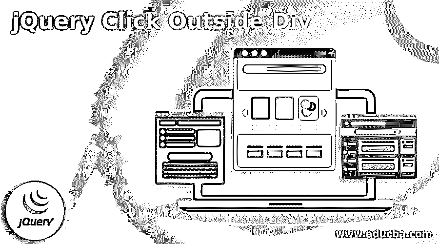
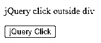
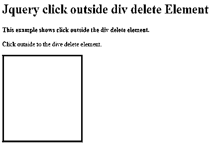
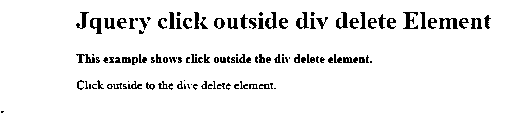
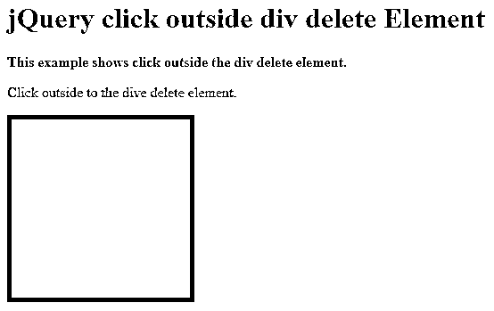
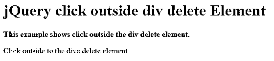

# jQuery 单击 Div 外部

> 原文：<https://www.educba.com/jquery-click-outside-div/>




## jQuery 简介点击 Div 外部

jQuery click out div clicked 元素不是容器本身，也不是 div 元素的派生元素。我们可以绑定到文档的 click 事件，并用 jQuery 隐藏 div 容器。下拉菜单的一个必备功能是在点击外部时隐藏元素的能力。当用户在 div 外部单击时，如果我们需要隐藏 div，这也很有用。

### jQuery 单击 div 概视图外部

*   jQuery 使得当用户在 div 或元素之外单击时隐藏 div 或元素变得很简单。我们可以利用事件目标属性来检测元素外部的点击，比如下拉菜单。该属性返回导致事件的 DOM 元素。
*   在这种情况下，应该避免使用停止传播方法，因为它会中断正常的 DOM 树事件流。

### 如何使用 jQuery 点击 div 外部？

*   下拉菜单的一个必备功能是在点击外部时隐藏元素的能力。当用户在 div 外部单击时，如果我们需要隐藏 div，这也很有用。
*   停止传播功能禁止事件传播到父组件。因此，当我们单击子元素时，不应该单击父元素。
*   将 click 事件处理程序附加到元素(如文档)外部的区域，以检测元素外部的单击。使用事件处理程序中的 jQuery nearest 方法，我们可以确定元素或元素后代的目标。
*   我们可以使用 jQuery 来监听 html 元素上的 click 事件，以便在元素外部单击时触发一个事件。然后我们可以检查在事件处理程序中哪个元素被点击了。
*   点击事件监听器然后被用来调用点击它。$('html ')用于选择 html 元素。目标属性返回被点击的元素。
*   因此，当我们在创建的 div 外部单击时，控制台会记录“在外部单击”。为了检查用户对文档的点击，我们可以使用 jQuery mouseup 方法。
*   mouseup jQuery 事件与此方法绑定在一起。一个特定的元素触发了那个事件。
*   此方法组合了 on ('mouseup，' handler ')和 trigger ('mouseup ')的方法。当鼠标指针位于某个元素上并释放鼠标按钮时，mouseup 事件将被调度到该元素。
*   下面的例子展示了 jQuery click out div 使用 mouseup 方法来检查用户对文档的点击。

**代码—**

<small>网页开发、编程语言、软件测试&其他</small>

```
<!DOCTYPE html>
<html>
<head>
<script src = "https://ajax.googleapis.com/ajax/libs/jQuery/3.3.1/jQuery.min.js"></script>
<script>
$(document).mouseup(function(e)
{
var container = $("#target");
if (!container.is(e.target) && container.has(e.target).length === 0)
{
container.hide ();
}
});
</script>
</head>
<body>
<p id = "pid"> jQuery click outside div </p>
<button id = "btn1"> jQuery Click </button>
</body>
</html>
```




*   通配符选择选择页面上的每个元素；我们可以在选择所有内容后恢复特定元素的设置。
*   否则，我们可以将元素放入 div 中，更新 div 的 click 事件处理程序，并将相同的逻辑应用于该 div 中的特定元素。
*   当使用 jQuery 时，我们必须使用 stop Propagation 方法来确定点击何时发生在元素之外。
*   停止传播方法防止事件传播到父项。如果我们点击一个子元素，父元素不应该被点击。

```
container.has (e.target).length == 0
```

*   正在确定点击目标是否是容器元素的子元素。然而，如果我们验证长度为零，当我们想看看它是否为真时，这将评估为太假，例如当我们单击它的一个父容器时，我们想隐藏该容器。

### jQuery 单击 div 外部删除元素

*   有两种方法可以隐藏或显示一个元素，这取决于鼠标是否在元素外单击。
*   当触发 mouseup 事件时，应该首先检查文档。单击目标时，调用最近的方法。在 DOM 树中，这个函数返回元素的第一个祖先。
*   将 length 属性应用于结果，以计算祖先的数量。如果没有任何祖先，则单击发生在元素之外。然后，使用 hide 方法隐藏元素。
*   以下示例显示 jQuery 单击 div 外部删除元素如下。

**代码—**

```
<!DOCTYPE html>
<html>
<head>
<title>
Click outside div delete Element
</title>
<style>
.container {
height:200px;
width: 200px;
background-color: Red;
border: 4px solid black;
}
</style>
<script src =
"https://code.jQuery.com/jQuery-3.4.0.min.js">
</script>
</head>
<body>
<h1 style = "color: Red">
JQuery click outside div delete Element
</h1>
<b>
This example shows a click outside the div delete element.
</b>
<p> Click outside to the dive delete element. </p>
<div class = "container" style = "color:Red"> </div>
<script type="text">
$(document).mouseup(function (e) {
if ($(e.target).closest(".container").length
=== 0) {
$(".container").hide();
}
});
</script>
</body>
</html>
```







*   下面的例子显示了检查内容是否包含点击目标。绕过单击目标的 is 和 has 方法，对元素进行两项测试:单击不会停留在元素上。
*   该方法是否将当前元素与指定元素进行比较？单击目标作为参数提供，整个结果被求反，以查看单击是否发生在元素之外。

**代码—**

```
<!DOCTYPE html>
<html>
<head>
<title>
Click outside div delete Element
</title>
<style>
.container {
height: 200px;
width: 200px;
background-color: red;
border: 5px solid black;
}
</style>
<script src=
"https://code.jQuery.com/jQuery-3.4.0.min.js">
</script>
</head>
<body>
<h1 style="color: red">
jQuery click outside div delete Element
</h1>
<b>
This example shows a click outside the div delete element.
</b>
<p>Click outside to the dive delete element.</p>
<div class="container" style="color:red"></div>
<script type="text/javascript">
$(document).mouseup(function (e) {
var container = $(".container");
if(!container.is(e.target) &&
container.has(e.target).length === 0) {
container.hide();  }
});
</script>
</body>
</html>
```







### 结论

jQuery 使得当用户在 div 或元素之外单击时隐藏 div 或元素变得很简单。当用户离开该元素时，div 将被隐藏。要检测 click 事件并在单击特定元素外部时隐藏 div，请使用带有 target 属性的 jQuery mouseup 事件。

### 推荐文章

这是一个 jQuery 点击 Div 外部的指南。在这里，我们将讨论如何在 div 外部使用 jQuery click 以及概述和代码。您也可以阅读以下文章，了解更多信息——

1.  [jQuery mouseup()](https://www.educba.com/jquery-mouseup/)
2.  [Settimeout jQuery](https://www.educba.com/settimeout-jquery/)
3.  [jQuery Ajax 同步](https://www.educba.com/jquery-ajax-synchronous/)
4.  [JQuery JSON 解析](https://www.educba.com/jquery-json-parse/)


