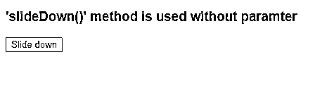
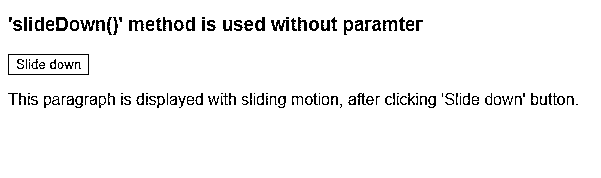
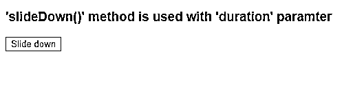
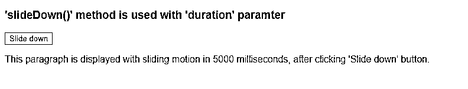
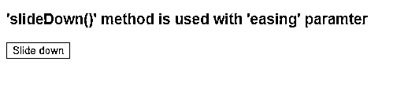
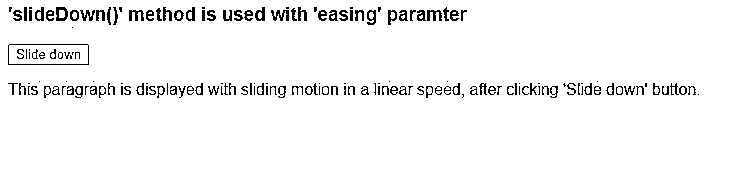
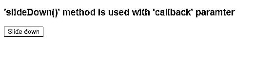
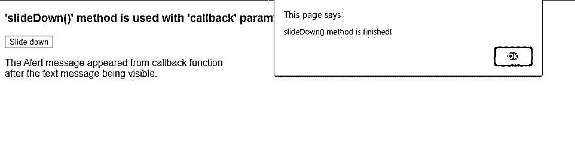
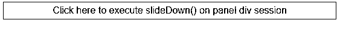
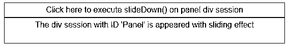

# jQuery 下滑()

> 原文：<https://www.educba.com/jquery-slidedown/>


## jQuery slideDown 介绍()

在 jQuery 可用的各种效果创建技术中，滑动效果是一种有效的动画设计。slideDown()是一种通过滑动运动使匹配的元素可见来创建滑动效果的方法。

**语法:**

<small>网页开发、编程语言、软件测试&其他</small>

```
$(selector).slideDown([Input parameter values])
```

**Note:** Input parameters are optional.

### jQuery slideDown()的参数

slideDown()从 1.0 版开始就包含在 jQuery 中，并逐渐发展为包含各种功能。下面描述了 slideDown()的主要变化以及 jQuery 不同版本中功能的简要细节:

| **参数** | **描述** | **默认值** | **类型** | **版本增加** |
| **持续时间** | 命令滑动效果运行多长时间。 | 400 毫秒 | 数字/字符串 | One |
| **回拨/完成** | 设置函数完成后要执行的 slideDown()方法。 | 钠 | 函数() | One |
| **缓和** | 指定不同时间间隔点的效果速度。 | 摇摆 | 线 | One |
| **队列** | 决定是否将动画效果排列成队列。 | 真实的 | Boolean/String | One |
| **特殊租赁** | 它包含多个 CSS 属性及其相应的缓动值。 | 钠 | 目标 | One point four |
| **步骤** | 用于在设置补间对象的任何属性值之前对其进行修改。 | 钠 | 函数() | One |
| **进度** | 它可以设置为在每个匹配元素的滑动效果完成时调用。 | 钠 | 函数() | One point eight |
| **开始** | 这可以设置在滑动效果开始之前执行的功能。 | 钠 | 函数() | One point eight |
| **完成** | 设置当滑动动画在一个元素上完成并且承诺的对象被解析后要调用的函数。 | 钠 | 函数() | One point eight |
| **失败** | 设置在任何动画失败时执行的功能。 | 钠 | 函数() | One point eight |
| **总是** | 设置一个函数在完成时(承诺对象被解析)或取消滑动效果应用时(承诺对象被拒绝)执行。 | 钠 | 函数() | One point eight |

### 如何用不同的参数使用 jQuery slideDown()？

这里我们讨论使用 jQuery slideDown()和不同参数值的例子。

#### 1.不使用任何参数(使用默认值)

当在没有任何输入值的情况下使用 slideDown()方法时，它采用滑动效果的默认值。

**举例:**

```
<!DOCTYPE html>
<html>
<head>
<script src="https://ajax.googleapis.com/ajax/libs/jquery/3.4.1/jquery.min.js"></script>
<script>
$(document).ready(function(){
$(".btn").click(function(){
$("p").slideDown();
});
});
</script>
</head>
<body style="background-color:blanchedalmond;">
<h3 style="font-family: Arial, Helvetica, sans-serif;">'slideDown()' method is used without paramter</h3>
<button class="btn">Slide down</button>
<p style="display: none;font-family: Arial, Helvetica, sans-serif;">This paragraph is displayed with sliding motion, after clicking
'Slide down' button.</p>
</body>
</html>
```

**输出:**

在 slideDown()方法被调用之前:




调用 slideDown()方法后:




#### 2.使用“持续时间”参数

slideDown()方法接受第一个输入参数作为持续时间参数值，即效果将运行多长时间。任何数字都可以作为持续时间给出，或者只使用关键字“慢”或“快”，分别代表 200 毫秒和 600 毫秒。

**举例:**

```
<!DOCTYPE html>
<html>
<head>
<script src="https://ajax.googleapis.com/ajax/libs/jquery/3.4.1/jquery.min.js"></script>
<script>
$(document).ready(function(){
$(".btn").click(function(){
$("p").slideDown(5000);
});
});
</script>
</head>
<body style="background-color:blanchedalmond;">
<h3 style="font-family: Arial, Helvetica, sans-serif;">'slideDown()' method is used with 'duration' paramter</h3>
<button class="btn">Slide down</button>
<p style="display: none;font-family: Arial, Helvetica, sans-serif;">This paragraph is displayed with sliding motion in 5000 milliseconds, after clicking 'Slide down' button.</p>
</body>
</html>
```

**输出:**

在 slideDown()方法被调用之前:




调用 slideDown()方法后:




#### 3.带有“缓动”参数的 slideDown()

缓动参数让用户决定不同时间点的效果速度。它只有两个可能的值:

*   **【摇摆】:**滑动效果的速度在开始和结束时较慢，中间较快。
*   **“线性”:**滑动效果的速度在整个功能执行过程中保持不变。

**举例:**

```
<!DOCTYPE html>
<html>
<head>
<script src="https://ajax.googleapis.com/ajax/libs/jquery/3.4.1/jquery.min.js"></script>
<script>
$(document).ready(function(){
$(".btn").click(function(){
$("p").slideDown(3000,"linear");
});
});
</script>
</head>
<body style="background-color:blanchedalmond;">
<h3 style="font-family: Arial, Helvetica, sans-serif;">'slideDown()' method is used with 'easing' paramter</h3>
<button class="btn">Slide down</button>
<p style="display: none;font-family: Arial, Helvetica, sans-serif;">This paragraph is displayed with sliding motion in a linear speed,
after clicking 'Slide down' button.</p>
</body>
</html>
```

**输出:**

在 slideDown()方法被调用之前:




调用 slideDown()方法后:




#### 4.带有“回调”参数的 slideDown()

回调参数设置滑动效果完成后触发的函数名。

**举例:**

```
<!DOCTYPE html>
<html>
<head>
<script src="https://ajax.googleapis.com/ajax/libs/jquery/3.4.1/jquery.min.js"></script>
<script>
$(document).ready(function(){
$(".btn").click(function(){
$("p").slideDown(function(){
alert("slideDown() method is finished!");
});
});
</script>
</head>
<body style="background-color:blanchedalmond;">
<h3 style="font-family: Arial, Helvetica, sans-serif;">'slideDown()' method is used with 'callback' paramter</h3>
<button class="btn">Slide down</button>
<p style="display: none;font-family: Arial, Helvetica, sans-serif;">The Alert message appeared from callback function<br>
after the text message being visible.</p>
</body>
</html>
```

**输出:**

在 slideDown()方法被调用之前:




调用 slideDown()方法后:




**Note:** Callback function does not work on the complete animation process as a whole in case multiple elements are configured for animation. Function execution occurs with each matched element, one at time.

#### 5.在类属性上应用 slideDown()

在 HTML 中，可以通过使用类属性或 ID 来区别使用元素。这里，我们将使用类属性将 slideDown()方法应用于一个 div 会话。

**举例:**

```
<!DOCTYPE html>
<html>
<head>
<script src="https://ajax.googleapis.com/ajax/libs/jquery/3.4.1/jquery.min.js"></script>
<script>
$(document).ready(function(){
$("#flip").click(function(){
$("#panel").slideDown("slow");
});
});
</script>
<style>
#panel, #flip {
padding: 5px;
text-align: center;
font-family: Arial, Helvetica, sans-serif;
background-color:blanchedalmond;
border: solid 1px #c3c3c3;
width: 40%;
}
#panel {
padding: 5px;
display: none;
width: 40%;
height: 40px;
}
</style>
</head>
<body>
<div id="flip">Click here to execute slideDown() on panel div session</div>
<div id="panel">The div session with ID 'Panel' is appeared with sliding effect</div>
</body>
</html>
```

**输出:**

在 slideDown()方法被调用之前:




调用 slideDown()方法后:




因此 slideDown()方法支持各种类型的滑动效果创建<u>。</u>这个好用。通过创造吸引人的动画效果，它以一种显著的方式提高了任何网站的有效性。这种技术支持各种元素，如文本、图像、链接等。

### 结论

该方法在被 jquery 方法隐藏的元素上或者在 CSS 中将 display 属性设置为“None”的元素上成功执行。但是，如果元素通过 CSS 属性“visibility”的方式被[隐藏，并且设置为“hidden ”,则它不起作用。](https://www.educba.com/what-is-css/)

如果 slideDown()方法应用于

*   ), due to

### 推荐文章

这是 jQuery slideDown()的指南。这里我们讨论使用 slideDown()方法的语法、参数和各种例子。您也可以阅读以下文章，了解更多信息——

1.  [jQuery keydown()](https://www.educba.com/jquery-keydown/)
2.  [JQuery 进度条](https://www.educba.com/jquery-progress-bar/)
3.  [jQuery val()](https://www.educba.com/jquery-val/)
4.  [jQuery append()](https://www.educba.com/jquery-append/)


