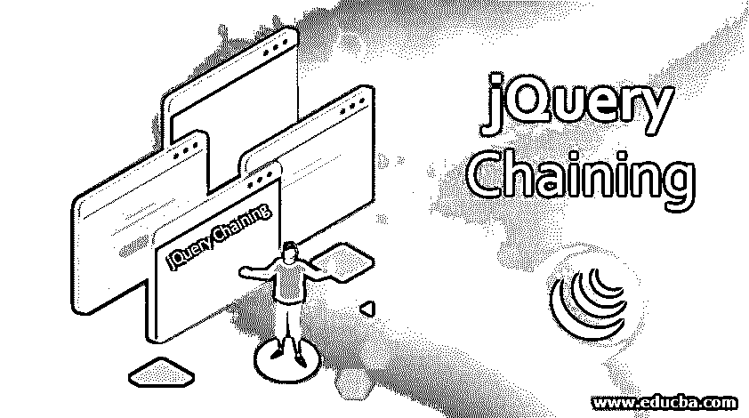
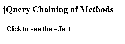
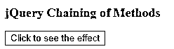
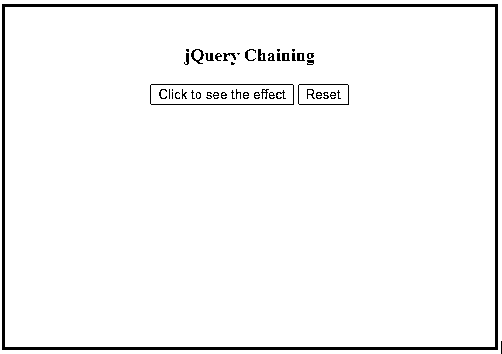
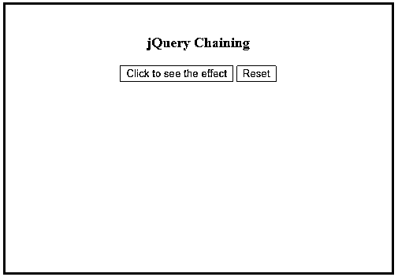
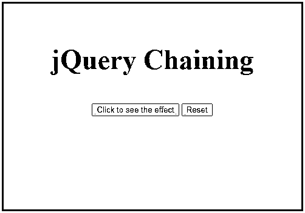
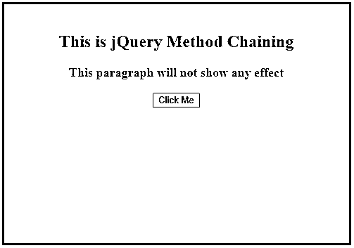
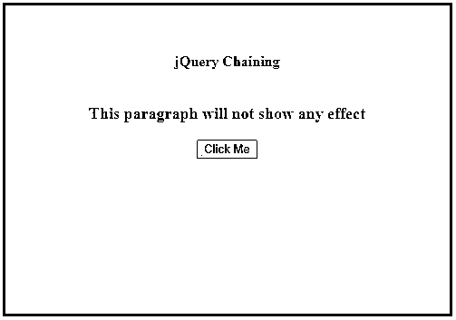
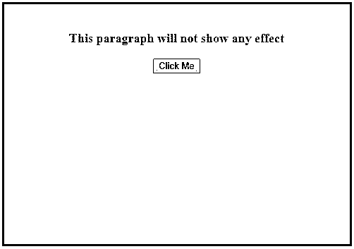

# jQuery 链接

> 原文：<https://www.educba.com/jquery-chaining/>




## jQuery 链接简介

链接是 jQuery 提供的一种健壮的技术，它允许我们将动作或方法链接在一起。通过 jQuery 链接，我们可以在一行语句中的同一组元素上运行多个 jQuery 动作或方法。这种技术非常简洁，可以让开发人员摆脱冗长的代码结构。它还通过避免浏览器多次查找相同的元素来帮助浏览器提高性能。

### 实现 jQuery 链接()的示例

方法链接在 jQuery 中是可能的，因为大多数 jQuery 方法返回一个 jQuery 对象，该对象可以进一步调用另一个方法。让我们通过一些实现 jQuery 方法链的例子来理解这个概念。

<small>网页开发、编程语言、软件测试&其他</small>

#### 示例#1

示例通过绑定四个方法来说明 jQuery 链接的实现:css()、slideUp()、slideDown()和 fade()。

**代码:**

```
<!DOCTYPE html>
<html>
<head>
<title>Example for jQuery chaining</title>
<script src="https://code.jquery.com/jquery-1.12.4.min.js"></script>
<script>
$(document).ready(function() {
$("button").click(function() {
$("p")
.css("color", "green")
.slideUp(1000)
.slideDown(1000)
.fadeOut(1000);
});
});
</script>
<style>
p {
color: maroon;
font-weight: bolder;
font-size: large;
}
</style>
</head>
<body>
<p>jQuery Chaining of Methods</p>
<button>Click to see the effect</button>
</body>
</html>
```

**输出:**

*   一旦页面加载到浏览器中，就会显示下面的屏幕。
*   我们看到有一段“p”是“栗色”和一个按钮。
*   要链接一个方法，我们只需将该方法附加到前一个方法上。




*   点击按钮后，链中的第一个方法被执行，即 **css()。**
*   **css()** 方法将**【p】**元素颜色改为**【绿色】。**




*   然后执行向上滑动段落的 slideUp()，然后执行向下滑动段落的 slideDown()，最后执行 fade()。


**注意**:如果需要，我们可以添加更多的方法。

#### 实施例 2

该示例说明了 css()和 animate()方法的链接。

**代码:**

```
<!DOCTYPE html>
<html lang="en">
<head>
<meta charset="utf-8" />
<title>Example of jQuery Method Chaining</title>
<script src="https://code.jquery.com/jquery-1.12.4.min.js"></script>
<script>
$(document).ready(function() {
$(".btn1").click(function() {
$("p")
.css("color", "green")
.animate({ width: "100%" })
.animate({ fontSize: "46px" });
});
$(".btn2").click(function() {
$("p").removeAttr("style");
});
});
</script>
<style>
p {
color: maroon;
font-weight: bolder;
font-size: large;
}
div {
width: 450px;
height: 300px;
padding: 20px;
font-size: medium;
text-align: center;
margin: auto;
background-color: lightblue;
font-weight: bold;
border: 3px solid teal;
margin-top: 50px;
margin-bottom: 10px;
}
</style>
</head>
<body>
<div>
<p>jQuery Chaining</p>
<button type="button" class="btn1">Click to see the effect</button>
<button type="button" class="btn2">Reset</button>
</div>
</body>
</html>
```

**输出:**

*   下面的屏幕截图是页面第一次加载到浏览器中时捕获的。
*   我们在链中有三个要执行的方法，css()将段落的颜色更改为绿色，两个 animate()方法按照代码中的指定修改段落的宽度和字体大小。




*   单击按钮时，首先执行 css()方法，将段落的颜色改为绿色，如下面的屏幕截图所示。




*   css()方法执行后，会出现 animate({ width: "100%" })来改变段落的宽度，然后是 animate({ fontSize: "46px" })来改变段落的字体大小，如下面的屏幕截图所示。




*   点击“重置”按钮，更改将被重置。

#### 实施例 3

一个 jQuery 方法不返回 jQuery 对象的例子。

**代码:**

```
<!DOCTYPE html>
<html lang="en">
<head>
<meta charset="utf-8" />
<title>jQuery Chaining of Methods</title>
<script src="https://code.jquery.com/jquery-1.12.4.min.js"></script>
<script>
$(document).ready(function() {
$("button").click(function() {
//This will show jQuery effect due to method chaining
$("h2")
.html("jQuery Chaining")
.addClass("chain")
.fadeOut(2000);
//This will not show any effect since no jQuery object has been returned.
$("p")
.html()
.addClass("chain");
});
});
</script>
<style>
p {
color: maroon;
font-weight: bolder;
font-size: large;
}
div {
width: 450px;
height: 300px;
padding: 20px;
font-size: medium;
text-align: center;
margin: auto;
background-color: lightblue;
font-weight: bold;
border: 3px solid teal;
margin-top: 50px;
margin-bottom: 10px;
}
.chain {
padding: 20px;
font-size: medium;
background-color: lightblue;
}
</style>
</head>
<body>
<div>
<h2>This is jQuery Method Chaining</h2>
<p>This paragraph will not show any effect</p>
<button type="button">Click Me</button>
</div>
</body>
</html>
```

**输出:**

*   下面的屏幕截图是页面第一次加载到浏览器中时捕获的。
*   在这个例子中，我们在两种情况下使用了 html()方法。

1.  当参数传递给 html()方法时。
2.  当没有参数传递给 html()时。

*   当没有参数传递给 html()方法时，只返回所选元素的 html 内容，而不是 jQuery 对象，在本例中，返回元素 p 的 HTML 内容。
*   当一些参数被传递给 html()对象时，会返回一个 jQuery 对象，在这个 jQuery 对象上调用链中的后续方法。




*   单击按钮时，对 header 元素调用 html()方法，并返回一个 jQuery 对象。
*   在这个 jQuery 对象上，调用 addClass()方法，这导致对返回的对象应用一些格式样式。




*   在 addClass()方法执行之后，fade()方法被调用，它淡出返回的 jQuery 对象，如下所示。




*   当不带任何参数调用 html()方法时，只返回段落 p 的 HTML 内容，而不是 jQuery 对象。

### 使用 jQuery 链接的优势

*   通过绑定多个方法，jQuery 方法链使得 jQuery 代码更短，可读性更好。
*   通过减少浏览器查找相同元素的次数来确保更好的性能。
*   没有必要多次使用同一个选择器。

### 结论

*   本文向您展示了 jQuery 的一个非常容易实现但又非常强大的特性，即 jQuery 方法的链接。
*   这种技术非常有用，它通过缩短代码使开发人员的工作变得更加容易。
*   这个特性提供了更好的性能和可维护性。

### 推荐文章

这是一个 jQuery 链接指南。在这里，我们讨论 jQuery Chaining()的介绍及其示例和代码实现。您也可以浏览我们推荐的其他文章，了解更多信息——

1.  [jQuery Slidetoggle()](https://www.educba.com/jquery-slidetoggle/)
2.  [jQuery unload()](https://www.educba.com/jquery-unload/)
3.  [jQuery mouseout()](https://www.educba.com/jquery-mouseout/)
4.  [jQuery 数据表](https://www.educba.com/jquery-data-table/)


