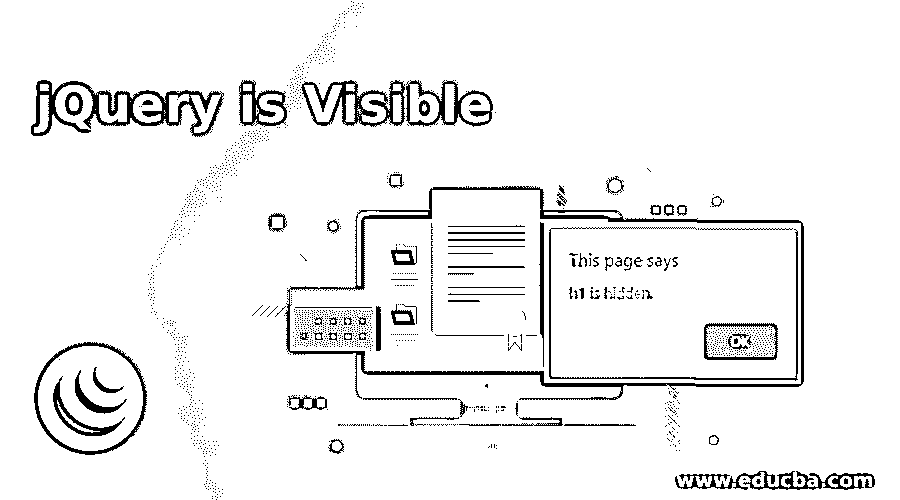
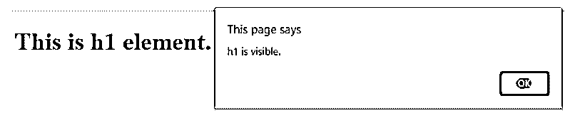
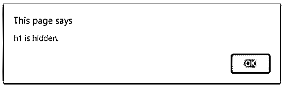
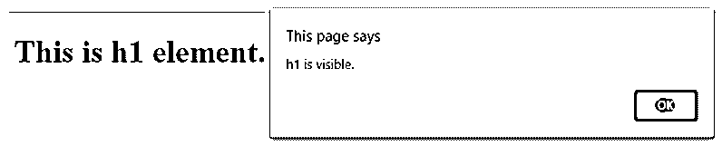

# jQuery 是可见的

> 原文：<https://www.educba.com/jquery-is-visible/>




## jQuery 简介可见

jQuery is visible 方法用于检测页面中的特定元素是否可见。jQuery 是一个可见的方法，是一个内置的方法。有时在应用程序中，我们需要检查页面中的元素是可见的还是隐藏的，因为即使它们在页面中对我们不可见，它们也会保留页面中的空间，所以我们可以使用 jQuery is()方法和:visible 选择器来检测页面中的元素是否可见。

的”。is”方法将根据传递给它的 CSS 选择器检查选择器的特定元素集。的”。is "方法不创建新的 jQuery 对象，而是在不做任何修改的情况下检查同一对象。“:visible”是一个 CSS 选择器，它匹配页面中对用户可见的元素。通过检查元素是否占据页面上的任何可见空间(宽度或高度大于零)来识别可见性。的”。is”方法也可以使用不同的 CSS 选择器来选择具有不透明度的元素:0；或者能见度:隐藏；.

<small>网页开发、编程语言、软件测试&其他</small>

**语法:**

```
$(element).is(":visible");
```

**参数:**

*   **:visible:** 这是一个 CSS 选择器，指定选择页面上用户可见的元素。
*   **返回值:**这个方法的返回值是一个元素是否可见。

### jQuery 是可视方法的例子

接下来，我们编写 html 代码来理解 jQuery。is (":visible ")方法用下面的例子更清楚，其中 is visible 方法用于检查 h1 元素在页面中是否可见。

#### 示例#1

**代码:**

```
<!doctype html>
<html lang="en">
<head>
<meta charset="utf-8">
<title>This is an example for jQuery is visible method </title>
<script
src="https://ajax.googleapis.com/ajax/libs/jquery/3.3.1/jquery.min.js">
</script>
<style>
#s1  {
display: block;
}
</style>
<script>
$(document).ready(function() {
// Check whether h1 is visible or not
if($("h1").is(":visible")) {
alert("h1 is visible.");
} else {
alert("h1 is hidden.");
}
});
</script>
</head>
<body>
<h1 id = "s1">This is h1 element. </h1>
</body>
</html>
```

**输出:**




如上面程序中的代码$(“h1”)。is(":visible "))是检查 h1 元素是否可见。在代码的后面，如果 h1 是可见的，那么显示一些警告消息“h1 是可见的”否则显示“h1 是隐藏的”信息。由于 h1 标签样式是 s1，即“显示:阻止；”，因此警报消息显示“h1 可见”.

下一个例子我们重写了上面的代码。is (":visible ")方法，并检查该元素是否可见，如下面的代码所示

#### 实施例 2

**代码:**

```
<!doctype html>
<html lang="en">
<head>
<meta charset="utf-8">
<title>This is an example for jQuery is visible method </title>
<script
src="https://ajax.googleapis.com/ajax/libs/jquery/3.3.1/jquery.min.js">
</script>
<style>
#s1  {
display: none;
// or display: hidden;
}
</style>
<script>
$(document).ready(function() {
// Check whether h1 is visible or not
if($("h1").is(":visible")) {
alert("h1 is visible.");
} else {
alert("h1 is hidden.");
}
});
</script>
</head>
<body>
<h1 id = "s1">This is h1 element. </h1>
</body>
</html>
```

**输出:**




同样，在上面的程序中，代码$(“h1”)。is(":visible "))的作用是检查 h1 元素在代码中是否可见，如果 h1 可见，则显示一些警告消息" h1 可见"。否则显示“h1 被隐藏”消息。因为 h1 标签样式是 s1，现在 s1 样式是“显示:无”，因此警报消息显示“h1 是隐藏的”.

下一个例子中我们重写了上面的 jQuery 代码。is(":visible ")方法在对隐藏元素调用 toggle()方法后应用于该元素。我们知道 toggle()方法用于切换元素的可见性，如下面的代码所示

#### 实施例 3

**代码:**

```
<!doctype html>
<html lang="en">
<head>
<meta charset="utf-8">
<title>This is an example for jQuery is visible method </title>
<script
src="https://ajax.googleapis.com/ajax/libs/jquery/3.3.1/jquery.min.js">
</script>
<style>
#s1  {
display: none;
// or display : hidden;
}
</style>
<script>
$(document).ready(function() {
$("h1").toggle("slow", function() {
// Check paragraph when toggle
// effect is completed
// Check whether h1 is visible or not
if($("h1").is(":visible")) {
alert("h1 is visible.");
} else {
alert("h1 is hidden.");
}
});
});
</script>
</head>
<body>
<h1 id = "s1">This is h1 element. </h1>
</body>
</html>
```

**输出:**




与上面的程序一样，h1 元素是不可见或隐藏的，因此应该显示一条警告消息“h1 是隐藏的”(h1 标签样式为 s1，即显示:无；”)但是它显示“h1 是可见的”，因为在 h1 元素上调用了 toggle()方法，该方法切换 h1 元素的可见性，因此当我们调用代码$( h1 ”)时。is(":visible "))警报消息显示“h1 是可见的。".

### 结论

jQuery。is( ":visible ")方法用于检测页面中的特定元素是否可见。这是 jQuery 中的一个内置方法，“:visible”是选择特定可见元素的 CSS 选择器。其他 CSS 选择器也可以通过。is "方法可以是不透明度:0；或者能见度:隐藏；

### 推荐文章

这是一个 jQuery 可见指南。在这里我们还讨论了 jquery 的介绍以及不同的例子和它的代码实现。您也可以看看以下文章，了解更多信息–

1.  [jQuery UI 标签页](https://www.educba.com/jquery-ui-tabs/)
2.  [jQuery Tooltip](https://www.educba.com/jquery-tooltip/)
3.  [jQuery 包含](https://www.educba.com/jquery-contains/)
4.  [Jquery 确认](https://www.educba.com/jquery-confirm/)


