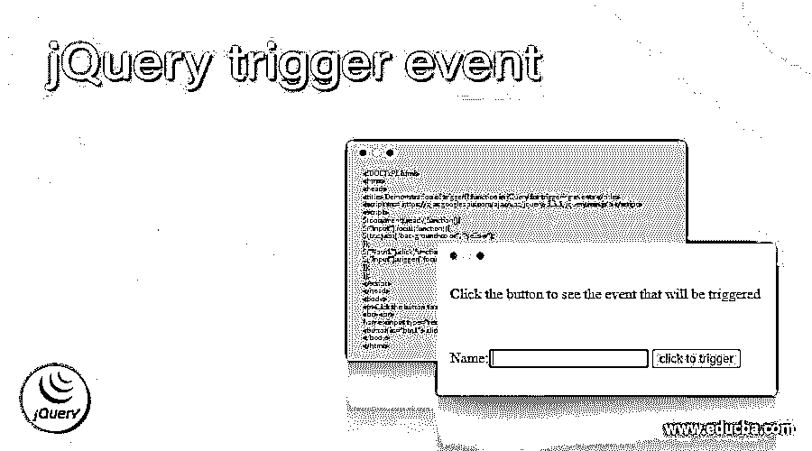
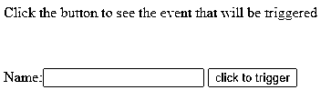
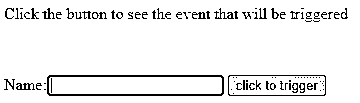
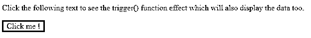
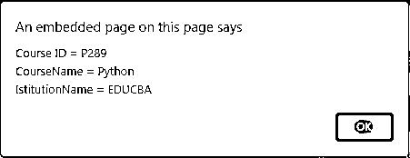

# jQuery 触发事件

> 原文：<https://www.educba.com/jquery-trigger-event/>




## jQuery 触发事件简介

在 jQuery 中，事件触发器被定义为使用内置函数为任何选定或匹配的元素指定特定的事件处理程序来触发这些事件，其中有各种内置事件方法，我们可以在 jQuery 中指定这些事件方法的触发。一般来说，jQuery 中的事件触发被定义为使用一个名为 trigger()的内置方法来触发一个在每个匹配的元素上指定的事件，以及被指定为该函数的参数的事件，以触发事件，有时向事件处理程序提供数据来触发事件。

**语法:**

<small>网页开发、编程语言、软件测试&其他</small>

```
$( selector_tag ).trigger(event, data_for_event_handler);
```

在本文中，上面给出的语法用于内置函数 trigger()，该函数用于触发匹配元素的事件。该语法使用选择器标记，该函数应用于该标记，以触发给定元素的指定事件。该语法使用两个参数，它们是:

*   **事件:**该参数需要在本功能内指定。这被认为是用于触发任何所选元素的事件的事件类型或事件对象。
*   **data_for_event_handler:** 这是一个可选参数，我们在这里向事件处理程序传递一些额外的数据或参数，它也可以用于定制事件。

该函数返回触发的事件，该事件在参数中被指定为给定的事件类型，并且与事件处理程序相关的数据也在该函数中指定。

在 jQuery 中，jQuery 为处理的几种事件提供了许多不同的事件方法，这些 jQuery 方法中的一个是 trigger()方法，它也用于处理匹配的或选定元素的事件。

### jQuery 中 trigger()方法如何处理事件？

在 jquery 中，trigger()方法是一个 jQuery 方法，用于处理使用该函数触发的事件，该函数类似于 triggerhandler()，但不同之处在于它不像 trigger()函数那样触发任何默认事件。这个函数的工作很简单，它应用于任何特定的选择器标签或元素，然后我们指定一些事件名称，有时甚至事件处理的细节也作为这个函数的参数。然后，该函数检查指定的事件，并在应用了 trigger()函数的指定元素上触发该事件。

### jQuery 触发事件的示例

下面举几个例子

#### 示例#1

在这个例子中，让我们看看如何在这个函数中只指定事件参数:

**代码:**

```
<!DOCTYPE html>
<html>
<head>
<title> Demonstration of trigger() function in jQuery for triggering events </title>
<script src="https://ajax.googleapis.com/ajax/libs/jquery/3.5.1/jquery.min.js"></script>
<script>
$(document).ready(function(){
$("input").focus(function(){
$(this).css("background-color", "yellow");
});
$("#btn1").click(function(){
$("input").trigger("focus");
});
});
</script>
</head>
<body>
<p>Click the button to see the event that will be triggered </p>
<br> <br>
Name:<input type="text" name="fullname">
<button id="btn1"> click to trigger </button>
</body>
</html>
```

**输出:**




单击按钮后，输出将是-




在上面的例子中，我们可以看到；首先，我们使用 ready()方法使文档准备好包含要在页面上显示的元素，然后我们编写一个函数来执行一些逻辑函数，这里我们使用一个用于“input”标记的 focus()方法，然后我们为“button”元素包含 click 函数。在本例中，我们创建了一个按钮，其 id 为“btn1 ”,名称为“click to trigger ”,对于这个按钮元素，我们应用 click()函数，甚至通过单击按钮来进行单击，并且这个按钮连接到 trigger()方法，因为在主 ready()函数中，我们包含了 trigger()方法，在该方法中指定的事件是“focus”。因此，每当按钮被单击时，trigger()方法就会触发事件焦点,“input”标记将通过该焦点获得焦点。输出如上图截图所示。

#### 实施例 2

在这里，我们将看到在哪里可以为这个 trigger()函数使用两个参数，它的工作方式类似于上面的例子。

**代码:**

```
<!DOCTYPE html>
<html>
<head>
<title> Demonstration of jQuery trigger() function </title>
<script src = "https://ajax.googleapis.com/ajax/libs/jquery/3.5.1/jquery.min.js"></script>
<style>
#p1 {
border: 3px solid black;
width: 80px;
text-align: center;
}
</style>
<script>
$(document).ready(function(){
$("#p1").click(function () {
$("#p1").bind("custom", function(event, id, name, itname){
alert("Course ID = " + id + "\nCourseName = " + name + "\nIstitutionName = " + itname);
});
$("#p1").trigger("custom", ["P289", "Python", "EDUCBA"]);
});
});
</script>
</head>
<body>
<p> Click the following text to see the trigger() function effect which will also display the data too. </p>
<p id = "p1"> Click me ! </p>
</body>
</html>
```

**输出:**




单击按钮后，输出将是-




在上面的例子中，我们可以看到哪个与前面的例子相似。在上面的代码中，我们使用 ready()函数将文档准备好。在这段代码中，我们没有使用按钮元素，而是创建了段落元素，我们的 id 为“p1”， 我们正在为该段落文本创建一个框，该框具有用于将其创建为一个框的属性，通过该框，当单击 trigger()函数应用于该段落时，它将触发一个名为 custom 的事件，该事件将绑定保存该事件的函数以及一些数据，例如在此代码中我们给出的“课程 id、课程名称和机构名称”。 因此，当文本“点击我！”

然后我们得到一个显示所有数据的对话框，这些数据作为第二个参数传递给 trigger()函数。上面的输出可以在第一个截图中看到，我们可以看到一个带有黑色边框的框，文本为“click me！”.然后在第二张截图中，我们可以看到对话框，里面显示了所有的数据。

### 结论

在本文中，我们可以得出结论，在 jQuery 中，我们有一个称为 trigger()函数的内置函数，用于触发为特定匹配或选择的元素指定的事件。在 jQuery 中，还有另一个称为 triggerhandler()的内置函数，它类似于 trigger()函数，但该函数不会像 trigger()函数那样触发默认事件。

### 推荐文章

这是一个 jQuery 触发事件的指南。这里我们讨论如何触发()方法来处理 jQuery 中的事件，并给出例子和输出。您也可以看看以下文章，了解更多信息–

1.  [jQuery ajax headers](https://www.educba.com/jquery-ajax-headers/)
2.  [jQuery 可见性](https://www.educba.com/jquery-visibility/)
3.  [jQuery removeClass()](https://www.educba.com/jquery-removeclass/)
4.  [jquery internhtml](https://www.educba.com/jquery-innerhtml/)


