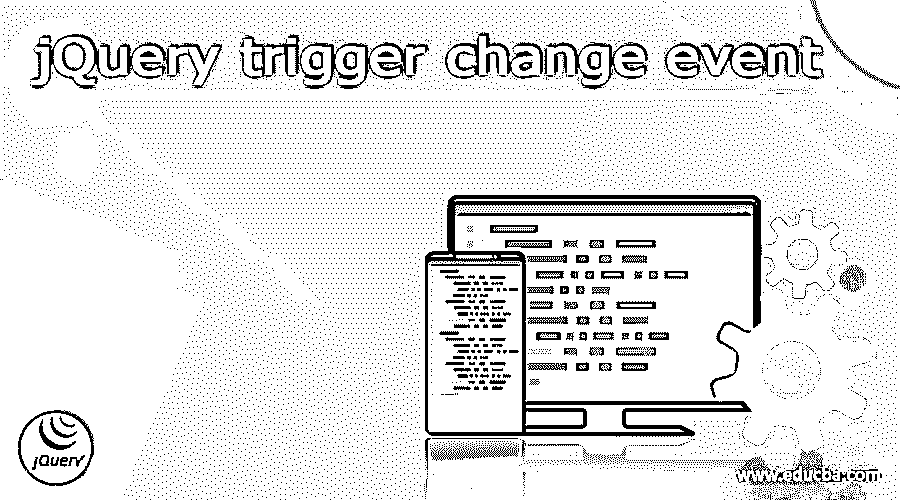
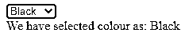
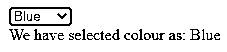
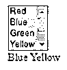
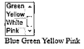

# jQuery 触发更改事件

> 原文：<https://www.educba.com/jquery-trigger-change-event/>




## jQuery 触发更改事件的定义

当元素的值被修改时，发生 jQuery 触发器更改事件；然后，它将触发更改事件。change 方法要么启动一个更改事件，要么附加一个要执行的函数。当选择“选择”菜单中的一个选项时，change 事件发生。当内容被修改后字段失去焦点时，文本字段或文本区域将发生 change 事件。

### jQuery 触发器更改事件概述

*   当我们使用 jQuery val 动态设置文本字段中的值时，如果我们想要添加额外的代码来触发字段值的更改，我们必须手动触发 change 事件。
*   当 HTML 元素的值被修改时，jQuery 的 change 方法会触发一个 change 事件。此方法适用于 input、textarea 和 select 元素。如果这些元素的值发生变化，change 方法将触发一个 change 事件。
*   这些 HTML 组件(input >、textarea >和 select >)通过 jQuery change 方法附加到事件处理函数，当 change 事件被触发时，事件处理函数被调用。
*   当适当的事件发生时，任何附加在内的事件处理程序或它的一个快捷方法都会被激发。但是，可以使用触发方法来手动触发它们。
*   当我们调用 trigger 时，处理程序的执行顺序与用户有机触发事件的顺序相同。
*   从事件处理程序返回 false 或对提供给事件的事件对象执行 stop propagation 方法可以停止冒泡。
*   使用 trigger handler 方法而不是 bind handler 方法来触发通过 jQuery 绑定的处理程序，而不触发本机事件。
*   当我们用一种方法构造一个自定义事件类型时，第二个触发选项会很方便。
*   触发器调用还可以接受事件发生后传递给处理程序的一组参数。
*   这里提供的额外参数和方法上的事件数据参数之间的区别都是向事件处理程序传递信息的技术；但是，trigger 的额外参数允许在触发事件时确定信息，但是 on 的事件数据参数需要在绑定处理程序之前计算信息。
*   当一个元素的值改变时，一个改变事件被触发。当用户用鼠标对选择框、复选框和单选按钮进行选择时，会立即触发该事件，但直到该元素失去对其他元素类型的焦点时才会触发。

### 如何手动更改 jQuery 触发事件？

*   我们可以使用 jQuery 触发器方法手动激活选择控件上的事件。但是，如果我们想向任何事件处理程序提供数据，我们必须创建一个新的 jQuery 事件对象并触发它。

下面是更改查询触发事件的语法，如下所示。

<small>网页开发、编程语言、软件测试&其他</small>

**语法:**

```
$(selector).change()
$(selector).chane(function)
```

*   该函数是变更触发事件的可选参数。当指定元素发生 change 事件时，此参数指定要执行的功能。

下面的选项定义了指定元素发生更改事件时要执行的功能。

```
<input id="event" type="text"/>
```

**事件的处理程序—**

```
document.querySelector ('# event).
addEventListener ('change', () => console.log("Event changed"))
```

*   在 jQuery 中，我们通过如下方式手动触发事件。

```
const ele = new Event("change");
const eve = document.querySelector('# event)
element.dispatchEvent (ele);
```

*   当一个元素的值改变时，一个改变事件被触发。当用户用鼠标对选择框、复选框和单选按钮进行选择时，会立即触发该事件，但直到该元素失去对其他元素类型的焦点时才会触发。
*   当元素的值被更新时，jQuery change 事件被触发。它只适用于表单域。change 方法将函数连接到 change 事件，以便在事件发生时运行。
*   当用户选择鼠标时，该事件立即被触发。当字段失去对其他元素类型的关注时，会发生事件。
*   自定义事件接口的存在是为了向事件对象添加更多数据，确切的属性用于传递自定义数据。

### jQuery 触发器更改事件代码示例

下面的示例显示了 jQuery 触发器更改事件，如下所示。在下面的例子中，我们展示了颜色的演示。

**代码:**

```
<!DOCTYPE html>
<html lang = "en">
<head>
<meta charset = "utf-8">
<title> JQuery change event demo </title>
<style>
div {
color: Red;
}
</style>
<script src = "https://code.jQuery.com/jQuery-1.10.2.js"> </script>
</head>
<body>
<select id="se" name="actors" >
<option> Black </option>
<option selected="selected"> Red </option>
<option> Yellow </option>
<option> Blue </option>
<option> White</option>
<option> Pink </option>
</select>
<div id = "loc"> </div>
<script>
$( "select" ) .change(function () {
document.getElementById ("loc").innerHTML = "We have selected colour as: "+document.getElementById ("se").value;
});
</script>
</body>
</html>
```







下面的示例显示了 jQuery 触发器更改事件，该事件允许使用 ctrl 键选择多个数据。

**代码:**

```
<!DOCTYPE html>
<html lang = "en">
<head>
<meta charset = "utf-8">
<title> JQuery change event demo </title>
<style>
div {
color: red;
}
</style>
<script src="https://code.jQuery.com/jQuery-1.10.2.js"> </script>
</head>
<body>
<select name = "Colour" multiple = "multiple">
<option> Red </option>
<option selected = "selected"> Blue </option>
<option> Green </option>
<option selected = "selected"> Yellow </option>
<option> White </option>
<option> Pink </option>
</select>
<div> </div>
<script>
$( "select" )
.change(function () {
var str = "";
$( "select option: selected" ).each(function() {
str += $( this ).text() + " ";
});
$( "div" ).text( str );
})
.change();
</script>
</body>
</html>
```







上面的例子表明，在使用 ctrl 键选择颜色后，它将被添加到列表中。

### 结论

当我们调用 trigger 时，处理程序的执行顺序与用户有机触发事件的顺序相同。例如，当一个元素的值被修改时，jQuery 触发一个 change 事件；然后，它将触发更改事件。选择选择菜单后，将发生更改事件。

### 推荐文章

这是一个 jQuery 触发变化事件的指南。这里我们讨论定义和概述；如何手动更改 jQuery 触发事件？代码实现示例。您也可以看看以下文章，了解更多信息–

1.  [JQuery JSON 解析](https://www.educba.com/jquery-json-parse/)
2.  [jQuery 数组推送](https://www.educba.com/jquery-array-push/)
3.  [jQuery 绑定 vs. on](https://www.educba.com/jquery-bind-vs-on/)
4.  [jQuery 插入元素](https://www.educba.com/jquery-insert-element/)


