# jQuery 委托()

> 原文：<https://www.educba.com/jquery-delegate/>

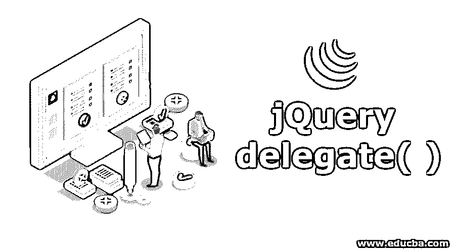


## jQuery delegate()简介

JQuery delegate()方法是 javascript 库中许多可用的内置函数之一，可以用作事件处理程序选项。它可以用于多个事件处理、多个元素及其相应的子元素，并且它不仅可以用于当前事件，还可以用于未来事件。此方法的语法是' $(选择器)。delegate(childSelector，event，data，function)'，其中 childSelector 用于表示需要事件处理的元素，event 用于表示实际事件，data 用于表示与事件相关的数据，function 用于表示作为事件处理过程的一部分，预期对事件执行的特定功能。

**语法**

<small>网页开发、编程语言、软件测试&其他</small>

```
$(selector).delegate(childSelector, event, data, function)
```

**参数**

*   **child selector:**child selector 不是可选参数。ChildSelector 用于指定处理事件处理程序的元素。
*   **Event:** Event 也不是可选参数。事件指定附加到元素的事件种类。它可以有一个或多个事件，每个事件分隔符用作空格。
*   **数据:**数据可选。用于指定函数数据传递的数据。
*   **功能:**功能可选。用于指定事件发生时要执行的函数名的函数。

### jQuery delegate()的示例

下面给出了 jQuery 委托的示例:

#### 示例#1

**带有子选择器、事件和函数参数的方法**

接下来，我们通过下面的示例编写 HTML 代码，以便更清楚地理解 jQuery delegate()方法:

**代码:**

```
<!DOCTYPE html>
<html lang="en">
<head>
<meta charset="utf-8">
<title> This is an example for jQuery delegate() Method
</title>
<style>
p {
background: red;
font-weight: bold;
cursor: pointer;
padding: 6px;
}
span {
color: red;
}
p.over {
background: #fff;
}
</style>
<script src="https://code.jquery.com/jquery-1.10.2.js" > </script>
</head>
<body>
<p> This is a main paragraph. Click here for next.</p>
<script>
$( "body" ).delegate( "p", "click", function() {
$(this ).after( "<p> Click here for another paragraph. </p>" );
});
</script>
</body>
</html>
```

**输出:**

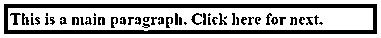


一旦点击文本，输出是:

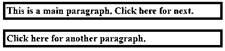


function parameters


如果我们再次单击任何文本，文本“单击此处查看另一个段落”将会显示，如下面的输出所示:

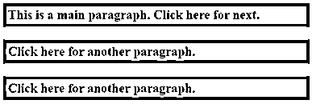


在上面的代码中，delegate( )方法将 childSelector 作为 p Html 元素传递，将 event 作为 click 事件传递，而 function 在单击 p 元素时要执行的()函数之后，因此当我们单击文本时，将显示第二个文本。

在上面的代码中，after()方法也使用了。after()方法的用途是在匹配元素集合中的每个元素后插入指定的内容。

#### 实施例 2

**改变背景色的方法**

在下一个示例代码中，当我们单击文本时，[使用 jQuery](https://www.educba.com/jquery-show/) delegate()方法将文本颜色更改为蓝色。

**代码:**

```
<!DOCTYPE html>
<html lang="en">
<head>
<meta charset="utf-8">
<title> This is an example for jQuery delegate() Method
</title>
<style>
p {
background: red;
font-weight: bold;
cursor: pointer;
padding: 6px;
}
span {
color: red;
}
p.over {
background: #fff;
}
</style>
<script src="https://code.jquery.com/jquery-1.10.2.js" > </script>
</head>
<body>
<p> This is a main paragraph. Click here to change the background colour. </p>
<script>
$( "body" ).delegate( "p", "click", function() {
$("p").css("background-color", "blue");
});
</script>
</body>
</html>
```

上述代码的输出是:

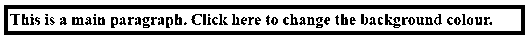


一旦我们在文本中单击 6n，输出是:

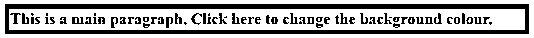


#### 实施例 3

**为所选元素的子元素附加事件处理程序的方法**

下一个示例代码显示了

标签的子标签，即

### 标签通过使用 jQuery delegate()方法附加了事件更改背景颜色。

**代码:**

```
<!DOCTYPE html>
<html>
<head>
<title>
This is an example for jQuery delegate() Method
</title>
<script src=
"https://ajax.googleapis.com/ajax/libs/jquery/3.3.1/jquery.min.js">
</script>
<style>
h3 {
background: red;
font-weight: bold;
cursor: pointer;
padding: 6px;
}
</style>
<!-- jQuery code to add an events -->
<script>
$(document).ready(function() {
$("div").delegate("h3", "click", function() {
$("h3").css("background-color", "blue");
});
});
</script>
</head>
<body>
<p>
This is a main paragraph. Click below to change the background colour.
</p>
<div style="background-color: red;">
<h3> Click Here </h3>
</div>
<h3> Change to Blue colour </h3>
</center>
</body>
</html>
```

**输出:**

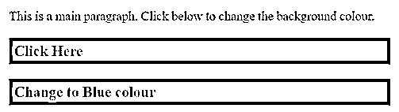


一旦点击“点击这里”文本，输出是:

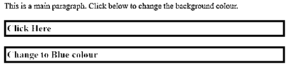


#### 实施例 4

**方法与 slideToggle()方法**

下一个示例代码中，当我们单击 click 按钮时，jQuery delegate()方法插入指定的文本，当我们单击

## 标记的 ant 文本时，slideToggle()方法执行。

**代码:**

```
<!DOCTYPE html>
<html>
<head>
<title>
This is an example for jQuery delegate( ) Method
</title>
<script src= "https://ajax.googleapis.com/ajax/libs/jquery/3.3.1/jquery.min.js">
</script>
<!-- jQuery code for jQuery delegate() method -->
<script>
$(document).ready(function(){
$("button").click(function(){
$("<h2> This is an example for delegate Method </h2>").insertAfter("button");
});
$("div").delegate("h2", "click", function(){
$(this).slideToggle();
});
});
</script>
</head>
<body>
<h1>Welcome to delegate( ) method.</h1>
<div style="background-color: red">
<h2> Text to slide.</h2>
<h2> The delegate Method. </h2>
<button>Click</button>
</div>
</body>
</html>
```

**输出:**

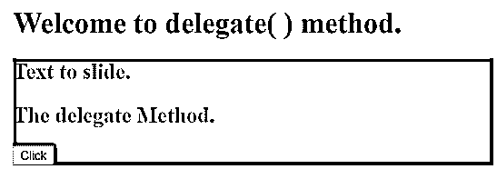


一旦点击"点击"按钮，输出是:

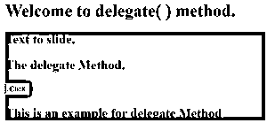


此外，当您单击任何文本时，文本会被删除或滑动切换，如下面输出所示

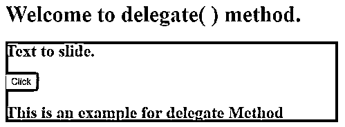


### 结论

*   jQuery delegate()方法用于事件处理程序。它使用为事件处理程序注册指定的元素及其子元素。jQuery delegate()方法运行一个事件处理函数来处理发生的事件。delegate()方法附加的事件处理程序不仅适用于当前元素，也适用于将来的元素。
*   参数包括:
    *   **child selector**:child selector 用于指定事件处理程序要处理的元素。
    *   **Event:** Event 指定附加到元素的事件种类。它可以有一个或多个事件，每个事件分隔符用作空格。
    *   **数据:**数据可选。用于指定函数数据参数的数据。
    *   **功能:**功能可选。用于指定事件发生时要执行的函数名的函数。

### 推荐文章

这是 jQuery delegate()的指南。在这里，我们还将讨论它们的简介、语法和参数。您也可以看看以下文章，了解更多信息–

1.  [jQuery 事件](https://www.educba.com/jquery-events/)
2.  [jQuery 方法](https://www.educba.com/jquery-methods/)
3.  [jQuery 元素](https://www.educba.com/jquery-elements/)
4.  [jQuery val()](https://www.educba.com/jquery-val/)


